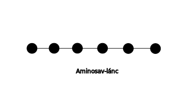

---

[Vissza](../biologia.md)

---

# Sejteket felépítő szerves molekulák
## Szénhidrátok (cukrok)
Szerves anyagok nagy része $C$, $H$, $O$ atomok építik fel
- 5 $C$ atomnál több gyűrűvé záródnak

### Mono szaharid (szőlőcukor)
Egy gyűrűből áll
- 6 $C$ atomos: glükóz molekula (növények állítják elő fotoszintézissel) :memo: ez keletkezik legelőször
- 
### Fruktóz (gyümölcscukor)
- 5 $C$ atomos
    - ribóz
    - dezoxiribóz (1 $O$ atommal kevesebb)
        - ez a kettő nukleotid

### Diszaharidok
- 2 gyűrű
    - szaharóz (répacukor)
    - tejcukor (laktóz)
    - cellobióz (equador)
    
    - malbóz (axiális)
    
### Poliszaharidok (sok gyűrű több 100 vagy 1000)
- celulóz
    - vízben nem oldódik a sejtfal anyaga (fa, papír)
    - keményítő
        - spirális molekula, több száz glükóz
        - a keményítő, tartalék tápanyag

## Fehérjék
Minden sejt alap építőelemei, összetett nagy molekulák, melyek aminosavakból épülnek fel.
>

>

>

>
>

>
### Fehérjék szerkezete
### Elsődleges:
ez határozza meg a többi sorrendet az aminosav láncban.
### Másodlagos:
| $\alpha$ hélix | $\beta$ redő |
| :-- | :-- |
|  |  |
### Harmadlagos:
| szál alakú (fibrilláris) | gombolyag (globuláris) |
| :-- | :-- |
| ha a másodlagos szerkezete csak egyféle |  |
| - pókselyem, hernyóselyem, haj, köröm | - enzimek |
|  |  |
### Negyedleges:
több fehérje szál kapcsolódik össze.
| Hemoglobin |
| :-- |
| négy fehérje szálból áll |
|  |
#### Tulajdonságai:
vízben jól oldódnak, hidrátburkuk van, ha ezt elveszítik, kicsapódnak (denaturáció)
- Kétféle kicsapódás létezik:
    - visszafordítható: reverzibilis (pl.: hús megsózása)
    - vissza nem fordítható: irreverzibilis (pl.: melegítés, nehézfémsók)
#### Biológiai szerepe:
sejtépítő, szállítás, kémiai folyamatokat katalizálnak, véralvadás

## Zsír, olaj
## Nukleinsavak

---

[Vissza](../biologia.md)

---