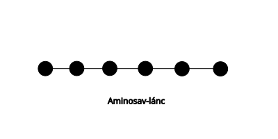
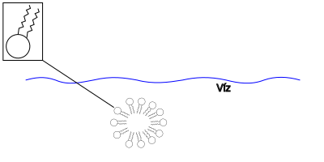
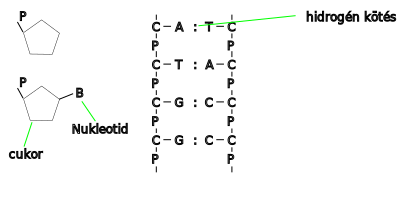

---

[Vissza](../biologia.md)

---

# Sejteket felépítő szerves molekulák
## Szénhidrátok (cukrok)
Szerves anyagok nagy része $C$, $H$, $O$ atomok építik fel
- 5 $C$ atomnál több gyűrűvé záródnak

### Mono szaharid (szőlőcukor)
Egy gyűrűből áll
- 6 $C$ atomos: glükóz molekula (növények állítják elő fotoszintézissel) :memo: ez keletkezik legelőször
- 
### Fruktóz (gyümölcscukor)
- 5 $C$ atomos
    - ribóz
    - dezoxiribóz (1 $O$ atommal kevesebb)
        - ez a kettő nukleotid

### Diszaharidok
- 2 gyűrű
    - szaharóz (répacukor)
    - tejcukor (laktóz)
    - cellobióz (equador)
    
    - malbóz (axiális)
    
### Poliszaharidok (sok gyűrű több 100 vagy 1000)
- celulóz
    - vízben nem oldódik a sejtfal anyaga (fa, papír)
    - keményítő
        - spirális molekula, több száz glükóz
        - a keményítő, tartalék tápanyag

## Fehérjék
Minden sejt alap építő elemei. Összetett nagy molekulák, amelyek aminosvakból épülnek fel.
>

>

>

>

>
### Fehérjék szerkezete:
- Elsődleges:
    - ez határozza meg a többi sorrendet - aminosav sorrend
- Másodlagos:
    - $\alpha$ hélix:
        - 
    - $\beta$ redő:
        - 
- Harmadlagos:
    - szál alakú - fibrilláris
        - ha másodlagos szerkezete egyféle - alfa hélix vagy beta redő
            - pl.: pókselyem, hernyóselyem, haj, köröm
    - gombolyag - globuláris
        - mindkét szerkezet megtalálható benne
            - pl.: enzimek
- Negyedleges:
    - több fehérjeszál kapcsolódik össze
        - hemoglobin
            - 
    - tulajdonságai:
        - vízben jól oldódnak, hidrátburkuk van, ha ezt elveszítik, kicsapódnak (denaturáció)
            - visszafordítható: reverzibilis pl.: hús sózásánál
            - vissza nem fordítható: irrreverzibilis pl.: tojás melegítése, nehézfémsók
    - biológiai szerepe:
        - sejtépítő, szállítás, kémiai folyamatokat katalizálnak, véralvadás

## Zsír, olaj
Zsírok általában állatokban vannak és szilárdok (kivétel: halolaj), olajok pedig növényekben találhatóak (Kivétel: kókuszzsír). Az olajok és zsírok energia tárolók.
### Szerkezetük:
Glicerin:
- $CH_{2}$ csoportok: 15-17-24
>

- Zsírok: olajsav, szterinsav, linolinsav, palmintisav
>
Olajsav:
>

>
Kettős oldékonyság:
>

>
Határhártyákat alakítanak ki (sejtfal)
>

>
Foszforitid kettős réteg:
>

>
Szteránvázuk van, melynek sokféle oldallánc kapcsolódhat hozzájuk:
>

>
pl.: epesavak, hormonok (pl.: nemi), koleszterin, D-vitamin
>
Színanyagok
>

>
Konjugált (kettős kötés), minden 2. kötés kettős kötés, energia gerjesztődik, ezért színes lesz.
- karotin - sárga (sárgarépa)
- likopin - piros (paradicsom)
- xantofil - sárga
- A-vitamin - látóbíbor kialakításáért felelős
## Nukleinsavak
- Nukleotid származékok
    - $5C$ atomos cukor - ribóz, dezoxiribóz
- Foszforsav
    - $H_{3}PO4$
    - jelölés: $P$
- Szerves bázis
    - egygyűrűs: citozin, timin, uracil
    - kétgyűrűs: ademin, guanin
- DNS (kettős spirál)
    - 4 féle szerves bázis: C, T, A, G
>

>
A két szál egymást kölcsönösen meghatározza, tehát a DNS képes megkettőződni:
>

- RNS (ribóz foszforsav bázis)
    - 1 szál
    - mRNS
        - hírvivő -> genetikai kód
    - tRNS
        - szállító -> aminosavak szállítása
    - rRNS
        - riboszóma -> fehérjeszintézis helye
- Nukleotid származék
    - ATP - ADP - AMP
    - NAD - NADH
>
energia szállító molekula, hidrogén szállító molekula
>

---

[Vissza](../biologia.md)

---
