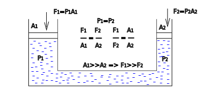
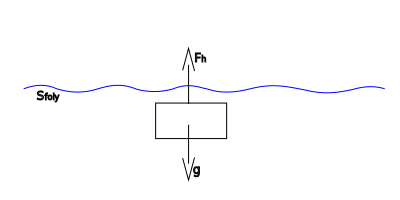

---

[Vissza](../fizika.md)

---

# Első negyedéves vizsga
## Folyadékok
A folyadékok olyan anyagok, amelyeknek nincs állandó alakjuk, de megtartják a térfogatukat.
Felveszik az edényük alakját, részecskéik egymáson könnyen elmozdulhatnak, ezért folynak.
## Nyomás
A nyomás a felületre merőlegesen ható nyomóerő és a felület nagyságának hányadosa.
- jele: $p$ ($p=\frac{F}{A}$)
- mértékegysége: $[p]=\frac{[F]}{A}=\frac{N}{m^{2}}=Pa$
:memo: $1 Pascal (Pa) = 1 N/m^{2}$
## Légnyomás
A légnyomás a levegő (a légkör) által a föld felszínére és a benne lévő testekre kifejtett nyomás.
Ezt a levegő súlya okozza.
- Tengerszinten kb.: $101 325 Pa = 1013 hPa = 1 atm$.

## Hidrosztatikai nyomás
A hidrosztatikai nyomás a nyugalomban lévő folyadék által a benne lévő vagy az alatta lévő pontokra gyakorolt nyomás.
Függ a folyadék sűrűségétől, a mélységtől és a nehézségi gyorsulástól:
$P_{h}=\frac{F}{A}=\frac{m_{foly} \cdot g}{A}=\frac{S_{foly} \cdot V_{foly} \cdot g}{A}=\rho_{foly} \cdot h \cdot g$
- $ρ$: sűrűség ($kg/m^{3}$)
- $g$: nehézségi gyorsulás ($9,81 m/s^{2}$)
- $h$: mélység ($m$)
>

>

## Pascal törvénye
Pascal törvénye kimondja, hogy a folyadékban vagy gázban keltett nyomás minden irányban egyformán terjed tovább, és ugyanakkora mértékben hat minden irányban.

>
:memo: Ez a hidraulikus emelő működésének alapja.
>

>
$P_{1}=P_{2}$
## Archimedes törvénye
Archimedes törvénye szerint:
>
Egy folyadékba vagy gázba merülő testre felhajtóerő hat, amely egyenlő a test által kiszorított folyadék súlyával.
>

>
$F_{g}=m_{t} \cdot g=m_{foly} \cdot g=V_{test} \cdot \rho _{foly} \cdot g$
## Úszás, lebegés, merülés
A test és a folyadék sűrűségének viszonyától függ:
- Úszás: a test sűrűsége kisebb, mint a folyadéké → a test részben a felszínen marad.
- Lebegés: a test sűrűsége megegyezik a folyadékéval → a test egyensúlyban van a folyadékban.
- Merülés: a test sűrűsége nagyobb, mint a folyadéké → a test lesüllyed.

---

[Vissza](../fizika.md)

---