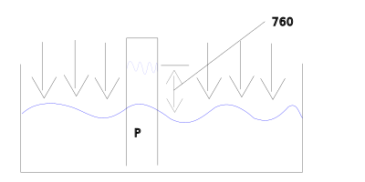
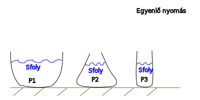

---

[Vissza](../fizika.md)

---

# Folyadékok
Felveszik a tárolóedény alakját, részecskék egymáson könnyen elgördülnek egymáson.
>
Érintőirányú feszültségek nem lépnek fel bennük, a folyadékrétegek egymáson könnyen el tudnak mozdulni.
>
A sűrűssége lényegében állandó, ezért lényegében nem összenyomható, vagyis térfogata állandó.
>
Diffundál, diffúzióra képes (pl. a festék részecskéi behatolnak a részecskék közé)
>
## Térfogat
- jele: V
- mértékegysége: $m^{3}$, $cm^{3}$
## Sűrűség
$[\rho]=\frac{m}{V}=\frac{Kg}{m^{3}}$
# Nyomás
A felületre egyenesen ható nyomóerő és a felület nagyságának hányadosa.
>
Jele: $p$
Mértékegysége: $p = \frac{F}{A} = [p] = \frac{[F]}{[A]} = \frac{N}{m^{2}} = Pa$
# Légnyomás
A levegő súlyából származó nyomás értéke: $1.01 * 10 Pa = 10^{5}Pa$
>
A nyomás mértékegysége az SI-rendszerben a pascal ($Pa$). Mivel a légköri nyomás értéke viszonylag nagy, a hétköznapi életben és a meteorológiában gyakran használatosak más mértékegységek is. Ezek a következők:
- Bar ($1 bar = 100 000 Pa$)
- Atmoszféra (atm) ($1 atm ≈ 101 325 Pa$, ami a tengerszinten mért átlagos légköri nyomás)
- Higanymilliméter (Hgmm) vagy torr ($1 atm = 760 Hgmm$)
## Torricelli-féle kísérlet

# Hidrosztatikai nyomás
A folyadék súlyából származó nyomás.
>

>
$Ph = \frac{F}{A} = \frac{m_{foly} * g}{A} = \frac{S_{foly} * V_{foly} * g}{A} = \frac{\rho * A * h * g}{A} = \rho_{foly} * g * h$
>
A hidrosztatikai nyomás, csak a folyadék oszlop magasságától függ.
>

# Pascal törvénye
Zárt edényben a külső erők által gerjeszett nyomás gyengítetlenül terjed tovább. $P_{1} = P_{2} = ...$
>

>
## Hidraulikus emelő működési elve

>
$$
\begin{aligned}
P_{1} = P_{2} \\
\frac{F_{1}}{A_{1}} = \frac{F_{2}}{A_{2}} \\
\frac{F_{1}}{F_{2}} = \frac{A_{1}}{A_{2}} \\ \\
A_{1} >> A_{2} => F_{1} >> F_{2}
\end{aligned}
$$
# Archimedes törvénye
Minden folyadékba és gázba mártott testre, felhajterő hat, amelynek nagysága egyenlő a test által kiszorított folyadék súlyával.
>

>
$F_{h} = V_{test} * \rho_{foly} * g$
>
$F_{g} = m_{t} * g = m_{foly} * g = V_{test} * \rho_{foly} * g$
# Úszás, lebegés, merülés
## Úszás
- $V_{test} > V^{'}$
- $F_{h} = F_{g}$
- Képlet: $V^{'}\rho_{foly} * g = V_{test} * \rho{test} * g$
- $V^{'} * \rho_{foly} = V_{test} * \rho_{test}$
- $\rho_{foly} > \rho_{test}$
- $[\rho_{foly} > \rho_{test}]$
## Lebegés
$V_{test} = V^{'}$
$\rho_{foly} = \rho_{test}$ a test és a folyadék sűrűsége megegyezik
## merülés
$V_{test} < V^{'}$
$\rho_{foly} < \rho_{test}$

---

[Vissza](../fizika.md)

---