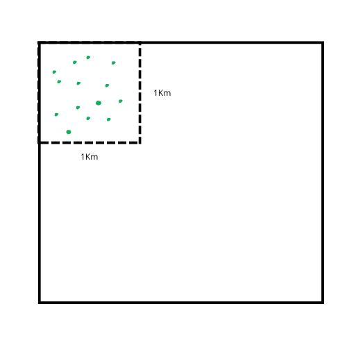
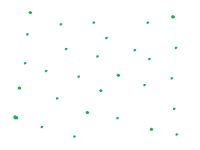
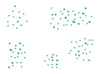
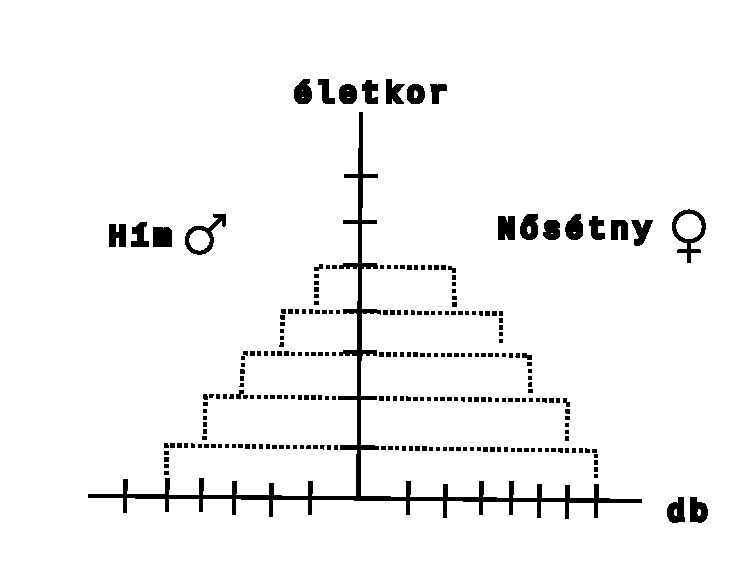
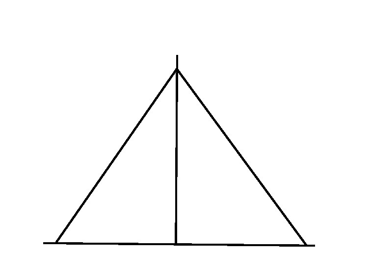
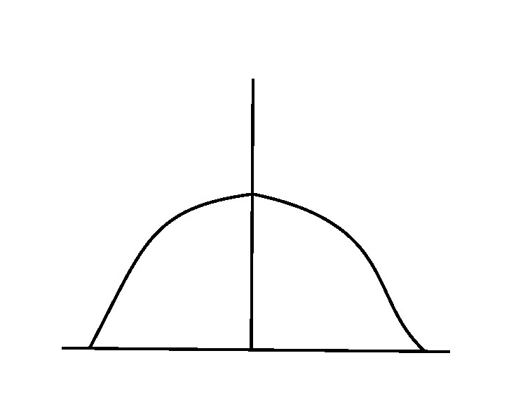
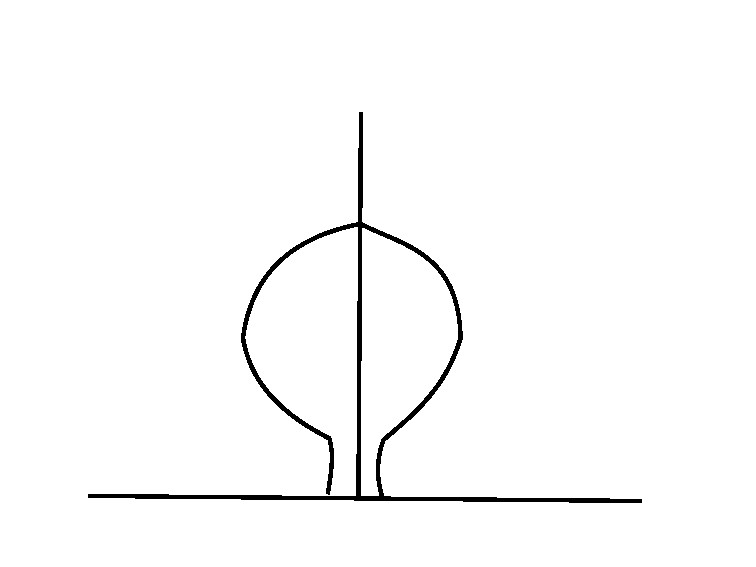
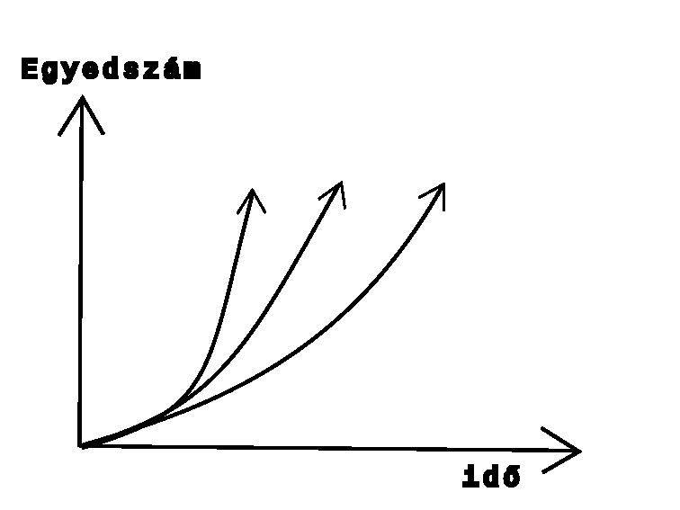
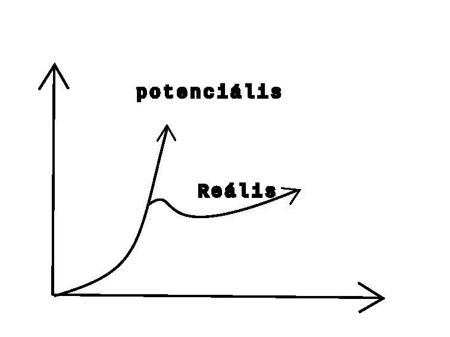

---

# Biológia

---

Élőlények

---

(BIO = élő)

### Élőlények:
mutatják az életjelenséget és az életkritériumokat.

Nyílt rendszer: a környezetével állandó kapcsolatban áll.
anyagot felvesz -lead

Élőlények csoprotjai:

1. Autotróf (önellátó):
   - képesek saját magukat ellátni
   - $CO^2$ + $H₂O$ =szerves molekulák =növény fejlődése
   - szükséges energia: fény
1. Heterotróf:
   - csak kész szerves anyagokat képes felhasználni, majd átalakítani
   - sejtjeit megújítja, vagy energiát nyer

Életjelenség: mozgás, táplálkozás, ingerlékenység, növekedés, fejlődés (önfejlesztés)

### Biokutatás

- módszerei:
   - megfigyelés
   - kísérlet: tudatos feltétel váltás okozása egy tényező megváltoztatása, kontroll
   - statisztika
   - modellezés
- eszközei:
   - mikroszkóp - több nagyító összessége
   - képalkotó eljárások: röntgen, ultrahang
   - komatográfiás eljárás (Az élet megjelenése a Földön)
- szerves anyag, csak szervesből vagy szerves általtud létrejönni
- reakciók:
   - fizikai
   - kémiai
   - biológiai
   - prebiológiai
- Miller kísérletek: ősóceán, gázok, villámlások kezdetleges szerves anyagok

---

Ökológia

---

Ökológia a biológia azon része, mely élőlény és környezeténke a kapcsolata.

| Szerveződési szintek |  |
| :-- | :-- |
|  |  |
| **Egyed alatti** | **Egyed feletti** |
| sejt->szövet->szerv->szervrendszer->szervezet | populáció->társulás->biom->bioszféra |

- **Faj**: külső és belső tulajdonságaik hasonlóak egymáshoz, egymással képesek szaporodni és utódaik is szaporító képesek.
- **Populáció**: tényleges szaporodási közösség egy helyen, térben és időben.
- **Társulás**: együtt élő populáció pl.: erdő
- **Biom**: társulások összessége, melyek az éghajlati övezetesség (zonalitás) miatt jön létre
- **Bioszféra**: összes élőlény

| Környezeti tényezők |  |
| :-- | :-- |
|  |  |
| Abiotikus - élettelen | Biotikus - élő |
| pl.: hőmérséklet, csapadék, fény | pl.: más élőlények |

Fény: növények -fotoszintézis

### Populációk

Tényleges szaporodási közösség.

| Tulajdonságok |  |
| :-- | :-- |
| Egyedszám |  |
| Ha kritikus, akkor kihalhat |  |

| Térbeli eloszlás |  |
| :-- | :-- |
| egyenletes (ritka) |  |
| véletlen |  |
| felhalmozódó |  |
| szigetszerű |  |

| Életkor, koreloszlás |  |
| :-- | :-- |
|  |  |
|  |  |
| **Alakzatainak neve** |  |
| piramis alakú |  |
| méhkas alakú |  |
| urna alakú |  |

| Populáció egyedszáma |  |
| :-- | :-- |
|  |  Környezet eltartóképessége gátat szab |

---

Populációk kölcsönhatása

---

Hatások jelölése: +, -, 0
Összes jelölés: ++, +-, +0, --, 0-, 00

- ++ : együttélés, szimbiózis (pl.: pillangós virágú - bab; Nitrogén gyűjtő baktérium)

zuzmó kép

- +0 : Asztalközösség, kommenzalizmus
- +- : zsákmányszervezés, predáció
   - élősködés, parazitizmus
- -- : versengés
- 0- : anitbiózis
- 00 : neutralizmus

---

---

[Vissza](../../../README.md)

---
