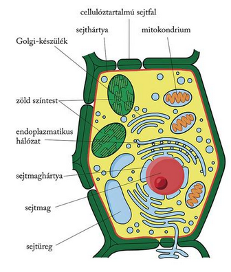
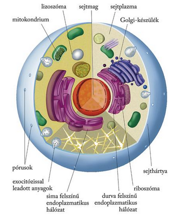
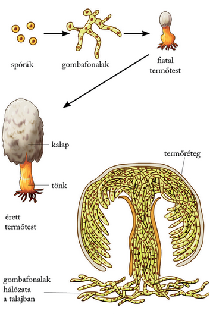
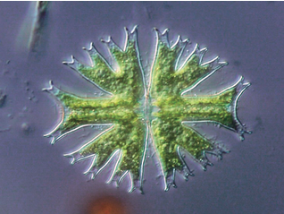
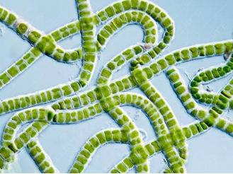
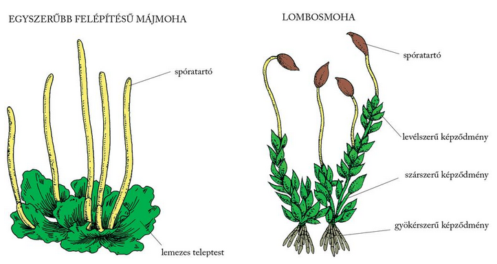
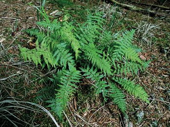
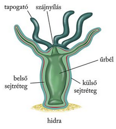

---

> # A soksejtű szerveződés formái: a növények, az állatok és a gombák
>
> A többsejtű eukarióta szerveződés három fejlődési irányban bontakozott ki az evolúció folyamán. Így alakultak ki a mai növények, a gombák és az állatok. A növények kevés kivételtől eltekintve fotoautotróf anyagcserét folytatnak, az állatok és a gombák kemoheterotróf szervezetek.

> ## A növényi és állati sejt felépítése
>
> A növények és az állatok eukarióta sejtekből épülnek fel. Sejtjeikben maghártyával határolt valódi sejtmag van. A sejtmag tárolja a sejtműködésre és -felépítésre vonatkozó információt. A növények sejtjeit
>
> 
>
> sejtfal határolja, amelyet az alatta lévő sejthártya termel. Az állati sejtekről a sejtfal hiányzik, csupasz sejthártya burkolja felszínüket.
>
> 
>
> Mindkét sejttípus belsejét sejtplazma tölti ki, benne találhatók a sejtszervecskék. Közülük a mitokondriumok, az endoplazmatikus hálózat és a Golgi-készülék mindkét szerveződési típusban megtalálható. Az endoplazmatikus hálózatban és a Golgi-készülékben a sejt számára fontos anyagok szintetizálódnak. A mitokondriumok biztosítják a sejt energiaellátását. Csak a növényi sejtek alkotói a színtestek. Különböző színűek lehetnek, a zöld színtest, a kloroplasztisz előfordulása a legjellemzőbb. A növényi sejtek plazmájában kisebb-nagyobb sejtnedvvel töltött sejtüregek és kristályos zárványok is lehetnek. Ezek az állati sejtekből szintén hiányoznak.

> ## A gombák általános felépítése
>
> A többsejtű eukarióták közül a gombák feltételezhetően már az evolúció korai szakaszában elkülönültek, és párhuzamosan fejlődtek a növényekkel és az állatokkal. Testüket gombafonalak, hifák építik fel. A gombafonalaknak sejtfala van, amelynek építőanyaga kitin. A gombafonalak laza szövedéke a micélium. A micélium a gombák tenyészteste, amely az avar alatt vagy a talajban található. Ha a körülmények megfelelőek, tömött hifafonalakból álló termőtesteket fejlesztenek. A köznyelv a termőtesteket nevezi gombának.
>
> 
>
> A gombák táplálkozásukhoz kész szerves anyagokat használnak fel, heterotróf típusú élőlények. A különböző felvett szerves anyagok elhalt élőlényekből vagy élő szervezetekből származnak. Életmódjuk változatosságát még az is fokozza, hogy moszatokkal, fejlettebb növényekkel, sőt állatokkal és az emberrel is képesek együtt élni. Legnagyobb jelentőségük a lebontó tevékenységükben rejlik. A baktériumokkal együtt a gombák akadályozzák meg az elpusztult szerves anyag nagyobb mennyiségű felhalmozódását a természetben. Az elpusztult élőlények lebontásával lehetővé teszik az anyagok visszaáramlását és újrafelhasználását az életközösségekben. Többségük a szárazföldön él, de ismerünk vízben élő gombákat is. Vannak közöttük emberi fogyasztásra alkalmasak is, ezek élelmiszerként vagy fűszerként jelentősek. Ugyanakkor vannak halálosan mérgező hatásúak is, mint a gyilkos galóca.

> ## A növények soksejtű szerveződésének állomásai
>
> A növények fejlődésének irányvonalában az első állomás a sejttársulások kialakulása volt. Egy sejttársulásban a sejtek között még nincs működésmegosztás, valamennyi sejt életműködéseit önállóan látja el. Előnyt jelent azonban az együttélés, például a gömbmoszatok esetében azért, mert csillóikkal csapkodva sokkal erőteljesebb vízáramlást keltenek maguk körül, és könnyebben jutnak oldott szén-dioxidban gazdag vízhez, amely fotoszintézisükhöz nélkülözhetetlen. Ma is élnek sejttársulásokban moszatok.
>
> 
>
> A valódi többsejtes szerveződés már új minőséget jelent. Ebben a formában a sejtek nemcsak együtt maradnak, hanem működésmegosztás is kialakul közöttük. Valamennyi sejt csak együtt képez egy élő egyedet, önmagában életképtelen.
>
> A legegyszerűbb többsejtű növények telepes szerveződésűek. A telepes szerveződés egyik formája a sejtfonál.
>
> 
>
> Sejtfonalas például a békanyál. A fonál első sejtje a vezérsejt, ez folyamatosan osztódik. A legalsó sejtje viszont az aljzathoz rögzíti a növényt. A többi sejt a tápanyagfelvétel feladatát látja el. Ha a vezérsejt két irányban osztódik, lapszerű növények alakulnak ki. A tengeri moszatok között ilyen például a tengeri saláta. A vezérsejt térben háromirányú osztódása teleptestes testszerveződést eredményez. Teleptestesek a fejlettebb moszatok és a szárazföldi növények közül a mohák.
>
> 
>
> Sejtjeik közötti működésmegosztás már jóval fejlettebb. A teleptest belsejében lévő sejtek nem érintkeznek a külső környezettel, táplálékot nem tudnak felvenni közvetlenül, gázcserét sem tudnak közvetlenül folytatni. Mindez sejtről sejtre való diffúzióval valósul meg. A növényi szerveződés ilyen formái a vízben mint élettérben még ki tudták elégíteni a legnagyobb növények igényeit is.
>
> A szárazföld igazi meghódítása csak a szövetek és a szervek kialakulását követően valósult meg. A valódi szövetekkel rendelkező növények a virágtalan harasztok
>
> 
>
> és a virágos nyitvatermők, illetve a zárvatermők.

> ## Az állatok soksejtű szerveződésének állomásai
>
> Az állatok országának két alapvető csoportja az álszövetesek és a valódi szövetesek. Az álszövetesek közé csak a szivacsok tartoznak. A valódi szövetesek evolúciójában – ezért rendszerezésében is – nagyon fontos szerepe volt az egyedfejlődés kezdeti szakaszát jelentő embrionális fejlődés változásának. Az ivarosan szaporodó állatok teste egyetlen sejtből, a zigótából differenciálódik. A valódi szövetesek zigótája sorozatosan osztódik, kialakul a szedercsíra, majd a hólyagcsíra (8.8. ábra). A hólyagcsíra betűrődésével jön létre a bélcsíra. A bélcsíra sejtjei csíralemezeket alkotnak. A legegyszerűbb szövetes állatok, a csalánozók embriójában külső és belső csíralemez alakul ki, amelyekből a kifejlett állat külső és belső sejtrétegének szöveti sejtjei differenciálódnak.
>
> 
>
> A bélcsíra ősszájának helyén a szájnyílás, az ősbélüreg helyén az űrbél fejlődik. A következő nagy fejlődési lépés a középső csíralemez megjelenése. A három csíralemezzel rendelkező állatokban ugyanis kialakulhat az állati szövetek négy alapvető típusa: az ideg-, a hám-, az izom-, valamint a kötő- és támasztószövetek. A három csíralemez megjelenésével megváltoztak a test szimmetriaviszonyai is, a csalánozókra jellemző sugaras szimmetriát felváltotta a kétoldali részarányosság, elkülönült a feji és a farki vég.
>
> A laposférgekben a bélcsírán nem alakul ki második nyílás, emiatt bélcsatornájuk egyetlen nyílása a szájnyílás, ami a bélcsíra ősszájának helyén alakul ki. Az újabb fejlődési lépés a bélcsíra második nyílásának megjelenése volt. Az állatok egy csoportjában ebből alakul ki a végbélnyílás, az ősszájból pedig a szájnyílás. Az „ősszájúak” közé tartoznak a fonal- és gyűrűsférgek, az ízeltlábúak és a puhatestűek. Más csoportokban az új nyílás szájnyílássá alakul. Az „újszájúak” képviselői a tüskésbőrűek, az elő- és fejgerinchúrosok, valamint a gerincesek.

---