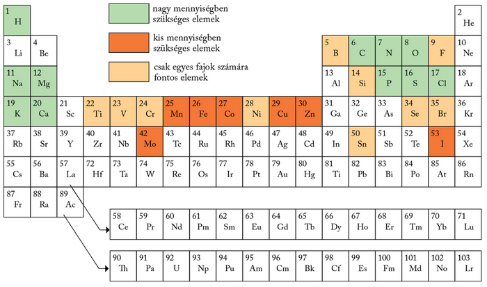
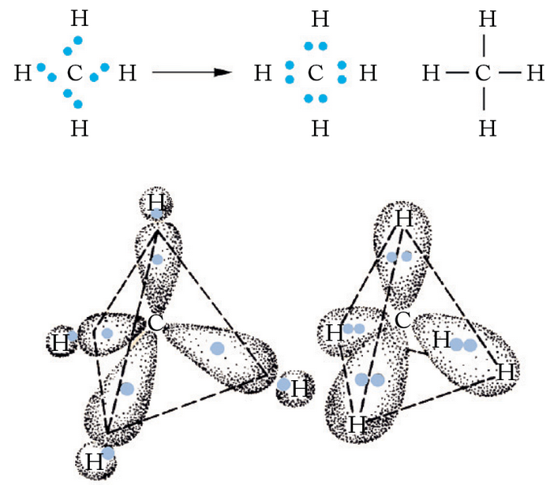
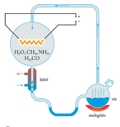
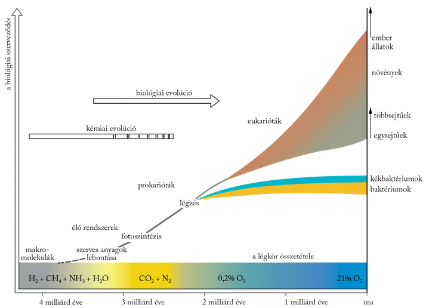

---

> # Az élet kialakulásához vezető első lépések
>
> Az élővilág sokféleségének kibontakozása szüntelen fejlődési folyamat eredménye. Ezt a fejlődést a latin eredetű evolúció szóval fejezhetjük ki a legtömörebben. A természettudományokban is ezt a kifejezést használjuk az anyagi világ szüntelen fejlődésére.
>
> A mai ismereteink szerint mintegy 15 milliárd évvel ezelőtt az összesűrűsödött anyaghalmazból álló világegyetem egy ősrobbanással szétszóródott. Az így keletkezett anyaghalmazok, a galaxisok azóta is távolodnak egymástól. Ilyen galaxis a Tejútrendszer is, benne a Naprendszerrel és a Földünkkel.
>
> Izotópos vizsgálatok alapján a legrégibb földi kőzetek 4,6 milliárd évesek. Hasonló korúak az űrkutatások során a Földre hozott holdkőzetek is. Tehát valószínűleg erre az időpontra tehető a Föld kőzetburkának kialakulása. A kezdetben még izzó, majd lassan lehűlő és megszilárduló, kb. 100 km vastagságú burok kőzetlemezekre tagolódott, amelyek a mai napig mozgásban vannak. Ezért a földtörténet korábbi időszakaiban kialakult kontinensek nem maradtak állandóak, hanem vándoroltak, egymással ütközve megújultak, a közöttük lévő óceánok megszűntek, és másutt újak nyíltak. Mindezek a földtörténeti változások döntő környezeti hatásként befolyásolták az élővilág evolúcióját. Korai szakaszát elsősorban a földfelszín és a légkör kialakulása irányította.
>
> Az egyik legáltalánosabban elfogadott elmélet szerint a Föld őslégköre oxigént nem tartalmazott, főleg vízgőzből, ammóniából, szén-dioxidból és metánból álló redukáló gázelegy lehetett. Amikor a földfelszín lehűlt, a légkörből a vízgőz lecsapódott, és létrejöttek az ősóceánok. Vizük a légkörből szén-dioxidot, a kőzetekből ásványi sókat oldhatott ki. Az őslégkör és az ősóceánok feltehetőleg elegendő anyagot tartalmaztak az egyszerűbb szerves molekulák, majd a továbbiakban ezekből felépülő makromolekulák keletkezéséhez.
>
> Azok a kémiai elemek, amelyek részt vesznek az élő anyag felépítésében, a biogén elemek.
>
> 
>
> Az elemek atomszerkezetétől függött, hogy szerephez jutottak-e az élő szervezetek kialakulásához szükséges vegyületek létrehozásában. Közülük a minden szerves molekulában megtalálható szén
>
> 
>
> azért juthatott kitüntetett szerephez az élet kialakulása során, mert négy erős kötés kialakítására képes. A kötések egy tetraéder csúcsai felé mutatnak, így háromdimenziós szerkezetük van. A szénatomok erős kötésekkel egymáshoz is kapcsolódhatnak, hosszú láncokat képesek alkotni, amelyek el is ágazhatnak, sőt gyűrűkké is záródhatnak. A szénatomok között kettős és hármas kötés is kialakulhat. Mindezek a sajátosságok rendkívül sokféle szénvegyület kialakulását eredményezték.
>
> A fémek közül elsősorban azok váltak biogén elemmé, amelyek gyakoriak voltak, mint a nátrium, a kálium vagy a kalcium. Másrészt azok jutottak közülük biológiai szerephez, amelyek ritkábbak voltak ugyan, de mint központok, maguk körül elrendezték az egyszerűbb molekulákat, és elősegítették azok összekapcsolódását. Ilyen például a vas, a mangán és a réz.
>
> ## Szerves vegyületek keletkezése
>
> A reakciók lejátszódásához szükséges energiát valószínűleg a Nap ibolyántúli sugárzása, a rendkívül gyakori zivatarokkal járó rendszeres villámlás és a vulkáni tevékenység hőenergiája szolgáltatta. A feltételezett ősi folyamatok lehetőségének kísérleti modellezésére is sor került 1953-ban.
>
> 
>
> Stanley Miller amerikai biokémikus (1930–2007) az ősi Föld körülményeit modellezte laboratóriumi körülmények között. Hidrogént, vízgőzt, ammóniát és metánt tartalmazó gázelegyen keresztül rendszeres elektromos kisüléseket hozott létre. Ennek hatására a molekulák kölcsönhatásba léptek egymással, és egyetlen hét eltelte után már különböző szerves vegyületeket lehetett kimutatni. A kísérletet később megismételték, közben változtatták a gázelegy összetételét, a reakció körülményeit, valamint elektromos kisülés helyett ultraibolya sugárzást alkalmaztak energiaforrásként. Az eredmény hasonló volt. E kísérletekkel igazolták, hogy a szerves molekulák az ősi körülmények között szervetlen vegyületekből keletkezhettek.
>
> A bioszféra korai evolúciójának tisztázatlan szakasza még, hogy a kialakult szerves molekulákból hogyan jöhettek létre az első élő rendszerek.
>
> 
>
> Erre is csak feltevések és néhány közvetett bizonyíték alapján állítottak fel elméleteket. A keletkezett molekulák közül a fehérjék és a nukleinsavak evolúciós megjelenése volt a döntő. Ezek ma együtt komplex rendszereket képezve a sejtek felépítésében és működtetésében nélkülözhetetlen szerepet játszanak. Később a nukleinsavak közül azok terjedhettek el, amelyek hatékonyabban segítették a fehérjék felépítését. Feltehetően a fehérjeszintézist folytató nukleinsavak alkothatták az első, nagyon egyszerű, az élőhöz igen közel álló biológiai rendszereket.
>
> Az első ősi élő rendszerek a működésükhöz szükséges energiát és a nyersanyagul szolgáló vegyületeket az ősóceánból vették fel. A különböző anyagok felépítéséhez és az energiatermeléshez szükséges anyagcsereutak csak később, lépésről lépésre alakultak ki.

---