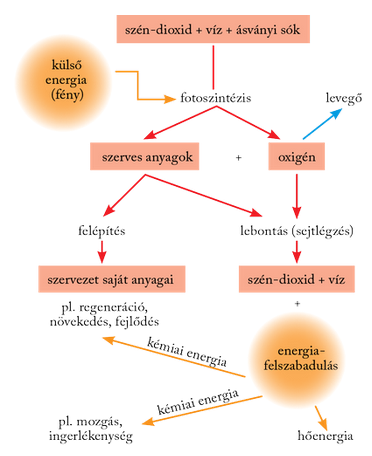
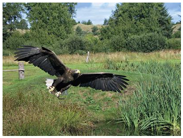
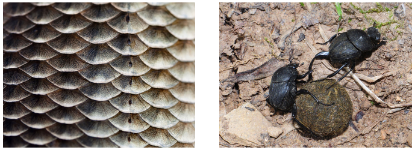

---

## A biológia tárgya, az élő anyag
>
> A biológia az anyagi világ megismerésével foglalkozó természettudomány. Az élő anyag megjelenési formáival, e formák változásaival és fejlődésével foglalkozik. Elnevezése a görög eredetű bio = élet és a logosz = tudomány szó összevonásával jött létre.
>
> Hogy mi az élő és mi az élettelen, sokszor nem is lehet egyszerűen elkülöníteni egymástól. Mert vajon élő-e egy mag? Nem táplálkozik, nem mozog, nem növekedik, nem szaporodik. Azonban ha kicsírázik, egy élő növény fejlődik belőle.
>
> Az élőlények az élettelenekhez hasonlóan anyagi rendszerek. Az élő anyagnak számos olyan sajátossága van, amely az élettelen rendszerekre nem jellemző. Ezeket összefoglaló néven életjelenségeknek nevezzük. Hosszú időn keresztül az életjelenségek meglétét tekintették az élő anyag legfőbb jellemzőjének. Az életjelenségeket két csoportba sorolták. Egyrészt önfenntartók, ha működésük az egyén életének fennmaradását biztosítja. Másrészt fajfenntartók, abban az esetben, ha a szaporítást, az egyed genetikai állományának továbbadását, így a faj fennmaradását szolgálják.
>
> Az önfenntartó életjelenségek egyike a biológiai anyagcsere. Az élőlények a környezetükből számukra fontos anyagokat vesznek fel, és oda feleslegessé vált anyagokat adnak le, miközben a testüket felépítő vegyületek folyamatosan lebomlanak és újraképződnek. Az anyagcsere részeként tehát táplálkoznak, lélegeznek, valamint a feleslegessé váló anyagcseretermékeiket kiválasztják és leadják.
>
> 
>
> Egy másik önfenntartó életjelenség a mozgás.
>
> 
>
> Ennek révén a sejtekben rendelkezésre álló energia felhasználásával képesek a helyüket vagy egyes testrészeik helyzetét megváltoztatni. Hasonlóan fontos életjelenség az ingerlékenység. Az élőlények a környezetük megváltozására reagálnak, azaz ingerlékenyek. Például a környezet felmelegedésére az ember fokozza a hőleadását, verejtékezik, az arca kipirul, mert a hajszálerek kitágulnak, hogy növekedhessen a környezet felé a hőleadás felülete. Ennek eredménye a külső változásoktól függetlenül egy dinamikusan állandó belső állapot, a homeosztázis fenntartása. Az önfenntartó működések eredménye az egyén növekedése és fejlődése. A növekedés mennyiségi változás, hiszen annak során a sejtek száma rendszerint nő, és nő a testtömeg is. A fejlődés ezzel szemben minőségi változás, amelynek során az élőlények új működésekre lesznek képesek. A csírázó borsószem gyökere és csírázó hajtása naponta egy-két milliméterrel is hosszabb lesz, a növekedésük gyors. Ha a kifejlett borsónövény bimbózik, majd kinyílik a virágja, a növény szaporodóképes lesz, egy új fejlettségi állapotba jut. Hasonlóan fejlődés eredménye az is, ha a növekedő kiscsibe tyúkká válik, és elkezd tojásokat tojni.
>
> A fajfenntartó életműködés a szaporodás. Ennek következtében képesek az élőlények az örökítőanyagaikról készített másolatok átadására, önmagukhoz hasonló utódok létrehozására, ezzel az élet fennmaradásának biztosítására.
>
> A sokak által hosszú időn keresztül általánosan elfogadott meghatározás hibája, hogy ugyanakkor a felsorolt életjelenségek nem mindegyike szükséges ahhoz, hogy egy rendszert élőnek tekintsünk, és egyesek közülük az élettelen rendszerekre is jellemző. Például a kristályok is növekednek, az autó is képes mozogni.
>
> A XX. század közepétől nem kevesen tettek kísérletet az élet más, újszerű meghatározására, és ennek az eredménye az életkritérium-rendszerek kidolgozása lett. Az élő és élettelen ugyanis minőségi jellegű fogalom. Az élő anyag más minőséget képvisel az anyag szerveződése szempontjából, mint az élettelen, s ez egyebek közt abban nyilvánul meg, hogy működni képes. Ugyanakkor a hagyományos életjelenségek alapvetően mennyiségi természetűek, akár az anyagcserét, a növekedést vagy bármelyik másikat vizsgáljuk közülük. Mindezek hatására több kutató pontosította az életről adott definícióját, és kidolgozta az életkritérium-rendszert. Szerintük az életkritériumok egységes megléte pontosan meghatározza az élő anyag fogalmát. Eszerint minden élő rendszernek rendelkeznie kell egy olyan információs anyaggal, amely a felépítésére és a működésére vonatkozó utasításokat tárolja. A bioszférában ez egy összetett vegyület, a dezoxiribonukleinsav. Rendelkeznie kell egy olyan rendszerrel is, amely az ebben rejlő adatokat értelmezi és megvalósítja, és gondoskodik annak megőrzéséről, sokszorosításáról és átadásáról. Ennek a fő vegyületei a fehérjék. Az élet kritériuma az anyagcsere egy olyan formája − a biológiai anyagcsere −, amely során a megvalósított anyag- és energiaforgalom eredményeképpen a rendszer fedezni tudja saját működésének anyag- és energiaszükségletét. Az anyagcsere-folyamatok egybekapcsolódó hálózata stabilitást biztosít az élő anyagnak. Ami nemcsak egy nagy fokú belső állandóságot jelent, hanem azt is, hogy a külső tényezők változásaira képes úgy reagálni, hogy belső állandóságát megőrzi, azaz ingerlékeny. Az élet folyamatos fenntartásának további kritériuma az ingerlékenységre épülő szabályozottság. Mindezek eredményeképpen az élet mint jelenség az élőlényben minden esetben kerek egészként jelentkezik.
>
> Az egyedi élet kritériumainak megvalósulása azonban nem lett volna elegendő a sokszínű élővilág kibontakozásához. Még az is szükséges és nélkülözhetetlen hozzá, hogy az örökítőanyag változásai biztosítsanak egy olyan genetikai sokféleséget, amely lehetővé teszi, hogy az újabb változatok közül mindig azok szaporodjanak el, amelyek az adott környezeti feltételekhez legjobban alkalmazkodnak, azaz az élő anyag evolúcióképes is.
>
> ## A biológia területei
>
> A biológia az első lépéseit még mint természetrajz, az élővilág három nagy csoportjának, a növényeknek, az állatoknak és az embernek a vizsgálatával kezdte. Így született meg a növénytan (botanika), az állattan (zoológia) és az embertan (antropológia).
>
> A kutatók igyekeztek először is megkülönböztetni egymástól az eltérő állatokat és növényeket, és elnevezték azokat, így született meg a rendszertan. A „miből épül fel?” kérdésre válaszolva alakult ki a szervezettan, végül a „hogyan működik?” problémájára megoldást keresve az élettan. Ezek a biológia klasszikus tudományterületei.
>
> A XIX. század derekára nyilvánvalóvá vált, hogy minden élő szervezet sejt vagy sejtekből áll. Ezt követően született meg a modern biológia, amely a sejtek felépítését kutatva létrehozta a sejtbiológiát, a bennük lezajló kémiai folyamatokat tanulmányozva a biokémiát, majd a molekuláris biológiát. Egyidejűleg született meg a tulajdonságok továbbadásának törvényszerűségeit leíró örökléstan, az élővilág fejlődését kutató evolúcióbiológia és a magatartásokat elemző viselkedésbiológia. Az élőlények a környezetükkel kialakított kapcsolataikkal együtt tanulmányozhatók csak eredményesen, amelyet az ökológia vizsgál.
>
> A biológia kezdettől fogva felhasználta a műszaki tudományok fejlődése által kínált újabb és újabb lehetőségeket. A mikroszkóp, majd az elektronmikroszkóp megalkotása sarkig tárta a mikrovilág kapuit. A nagy érzékenységű műszerek lehetővé tették az apró változások precíz érzékelését és rögzítését. Az informatika fejlődése pedig olyan új biológiai tudományterületek megszületését segített például, mint a biotechnológia és a bioinformatika. A biotechnológia új tulajdonságok bevitelét jelenti egy élőlénybe molekuláris biológiai módszerekkel. Például lehetővé vált, hogy baktériumokkal termeltessünk gyógyászati célra ipari módon költségesen vagy nehezen előállítható biológiai anyagokat. A bioinformatika informatikai eszközöket és módszereket használ biológiai folyamatok megismerésére, elemzésére vagy modellezésére.
>
> A biológia – elsősorban a molekuláris biológia – fejlődése és eredményei (pl. a mesterséges megtermékenyítés, a klónozás) napjainkban egyre többször vetnek fel bioetikai kérdéseket. Vajon milyen mértékben avatkozhat be az ember a természetes biológiai folyamatokba anélkül, hogy megsértené az ENSZ emberi jogi kartáját, miszerint „Minden ember egyenlőnek születik, méltóságuk és jogaik egyenlőek”?
>
> A biológiai kutatások eredményeit elsősorban a hétköznapok alkalmazott tudományterületei, az orvostudomány és a mezőgazdaság hasznosítja, de visszahatnak a műszaki tudományok fejlődésére is.
>
> 
>
> A bionika olyan tudományág, amely a természetben megfigyelt, bevált eljárásokat vagy módszereket ülteti át a mindennapos gyakorlatba.
>
> 
>
> Ennek legegyszerűbb példája a tépőzár, amelynek ötletét a bojtorján fészkes virágzatát övező fészekpikkelyek horgas csúcsai szolgáltatták.
>
> A cápa bőrének fogaspikkelyei gyorsabb mozgást  tesznek lehetővé. Ez adta az ötletet az élsportolók – azóta már betiltott – úszódresszének a tervezéséhez.
>
> Az egyéb tudományterületekkel való szoros együttműködést, az eredmények kölcsönös alkalmazását és továbbfejlesztését a rendszerbiológia foglalja magába, amely nagymértékben támaszkodik matematikai modellekre és ezek informatikai alkalmazására.

---