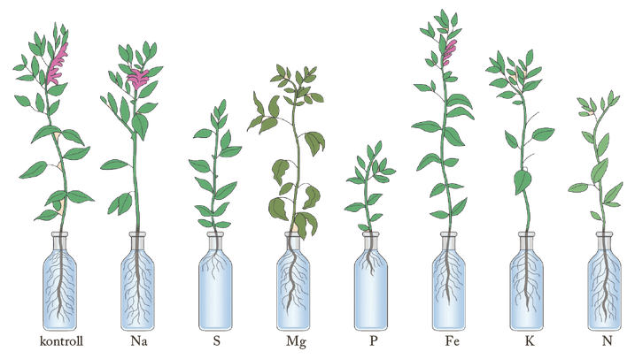
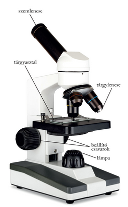
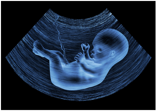

---

> # A biológiai kutatás módszerei
>
> A biológiai kutatás problémafelvetéssel kezdődik. A kutató észlel egy jelenséget vagy megfogalmaz egy problémát, és annak magyarázatára hipotézist állít fel. Hipotézisének igazolására vagy elvetésére pedig kísérleteket vagy megfigyeléseket hajt végre.
>
> Például Julius von Sachs (1832–1897) német természettudós az 1860-as években az egyes táplálékul szolgáló kémiai elemek növényekre gyakorolt élettani hatásait vizsgálta, mert azt feltételezte, hogy azok nem egyformán hatnak. A különböző kémiai elemek hiánya más és más következményekkel jár. Egyik kísérletében nyolc lombikot állított be, a kísérleti változó a lombikok tápanyagtartalma volt. Az elsőben komplett tápsóoldat volt, a másodikból hiányzott a kálium, a harmadikból a kalcium, a negyedikből a nitrogén, az ötödikből a foszfor, a hatodikból a magnézium, a hetedikből pedig a vas. A kísérlet eredménye igazolta feltételezését, a növények fejlődésének eltérő üteméből az egyes kémiai elemek növényekre gyakorolt hatását közvetlenül tapasztalta, és leírta a vizsgált elemek hiánybetegségeinek tüneteit.
>
> 
>
> A kísérletek eredményeit a kutatók értékelik. Az értékelés gyakran történik grafikusan vagy matematikai statisztikai módszerekkel. Egy kísérletben Louis Charles Birch (1918–2009) ausztrál kutató különböző magkártevő bogárfajok tűrőképességét vizsgálta a hőmérséklet és a nedvességtartalom függvényében. Azt tapasztalta, hogy a tényezőknek a bogarakra gyakorolt hatása egy görbével szemléltethető. A függvény x tengelyén a hőmérséklet, illetve a levegő relatív páratartalma szerepelt, a bogarak egyedszáma volt az y változó. A kapott grafikonról le lehetett olvasni, hogy melyek azok a hőmérsékleti, illetve páratartalom-értékek, amelyeket a vizsgált rovarok már nem tudnak elviselni, s ezt figyelembe kell venni a magok raktározásakor.
>
> ## A fénymikroszkóp
>
> Az egyik legrégebbi biológiai kutatásokra használt eszköz a fénymikroszkóp,
>
> 
>
> amely egy összetett nagyítólencse-rendszer. A talp tartja a berendezést, amelyhez egy állvány csatlakozik. Az állvány hordozza a tubust, amely a mikroszkóp optikai rendszert foglalja magába. A tubus felső végébe építve találjuk a cserélhető szemlencsét (okulárt). A tubus alján találjuk a revolverfoglalatba csavart tárgylencséket (objektíveket). A foglalat elcsavarásával a tárgylencséket egyetlen mozdulattal cserélhetjük. Az állványhoz kapcsolódik a tárgyasztal is, amely hordozza a vizsgálandó preparátumot. A készítmény és a lencsék egymástól való távolságát beállító csavarokkal szabályozhatjuk, így állítjuk be a képélességet. Alul az elektromos fényforrás vagy egy tükör biztosítja, hogy a fény keresztülhaladjon a preparátumon. Fénymikroszkóppal mikronos tartományba eső sejtrészletek még tanulmányozhatók.
>
> A sejtek kutatásában óriási előrelépést jelentett az első elektronmikroszkóp megalkotása. Az elektronmikroszkópban fény helyett elektronsugarakkal történik a tárgy megvilágítása és leképezése. Az elektronokat elektromos vagy mágneses terekkel irányítják. Az elektronsugárzást a szemünk nem észleli, ezért a kép fluoreszkáló ernyőn figyelhető meg. Az elektronmikroszkópok felbontóképességének határa mintegy 0,3 nm.
>
> ## Egyéb vizsgálati módszerek
>
> Napjainkban előtérbe kerülnek a biológia számos területén a molekuláris biológiai technikák, amelyek vizsgálati objektuma az örökítőanyag. Az orvostudományban az ún. képalkotó eljárások az új, sikeres vizsgálati módszerek. Közülük legrégebbi a röntgensugárzás alkalmazása.
>
> 
>
> A röntgensugarak 10 nm és 100 pikométer közötti hullámhosszúságú elektromágneses sugarak, amelyek a lágy szerveinken is különböző mértékben áthatolnak és fényérzékeny lemezen képet alkotnak.
>
> Egy továbbfejlesztett formája a komputertomográfia. A tomográfiás felvételeken a vizsgálat tárgya mintegy szeletekre bontva látható. Mivel a röntgensugárzás ionizáló hatású, orvosi alkalmazása csak mértékletesen történik.
>
> Ezzel szemben az ultrahangtechnika alkalmazásának semmilyen káros hatása nincs. Az eljárás elve az a tény, hogy a különböző anyagok különböző mértékben nyelik el és verik vissza az ultrahangot. A visszavert ultrahangot egy képalkotó vevőkészülék regisztrálja.
>
> 
>
> A kutatási gyakorlatban gyakran alkalmazott módszer az elegyekben lévő anyagok kromatográfiával történő szétválasztása. (A kromatográfia görög eredetű szó és chromo =színes, grafosz = írás kifejezés alapján szó szerint színnel írást jelent.) Az általánosan használt adszorpciós kromatográfia azon alapul, hogy ha az elegyet egy szűrőpapírral, cseppentjük, az szétfolyik rajta. Az összetevők adszorpciója azonban eltérő mértékű a felületen, ezért azok különböző távolságra vándorolnak a lecseppentés helyéről. Ha az anyag színes (pl. egy lomblevélből kivont oldat), a különböző komponensek színes gyűrűk formájában válnak szét. A szűrőpapír a foltok mentén szétvágható, és az egyes anyagok a különböző papírszeletekről szelektíven leoldhatók.

---