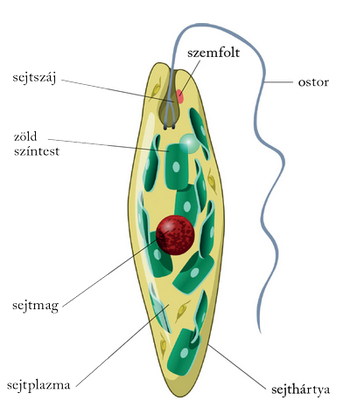
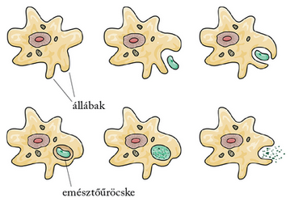
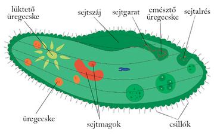

---

> # Egysejtű szerveződés, az eukarióta sejt

> Az eukarióta sejt kialakulása
>
> Az eukarióta sejtekben jól elkülöníthető, körülhatárolt sejtmag található. A sejtmagon kívül egyéb sejtszervecskék is megfigyelhetők bennük. A baktériumokhoz hasonlóan vannak autotróf és heterotróf anyagcseréjű csoportjaik.
>
> Az autotróf táplálkozásúak sejtplazmájában színanyagokat tartalmazó színtestek vannak. Közreműködésükkel a napfényenergia felhasználásával, fotoszintézis révén szén-dioxidból és vízből állítják elő a sejt szerves anyagait. További fontos sejtalkotók a mitokondriumok, az energiaszolgáltatás sejtszervecskéi. Mai ismereteink szerint a színtestek és a mitokondriumok úgy jöhettek létre, hogy a nagyobb méretű heterotróf sejtek kékbaktériumokat, illetve sejtlégzésre, oxigén felhasználására képes, aerob baktériumokat kebeleztek be. Ezeket azonban nem emésztették meg, hanem együtt kezdtek velük élni. Az ősi kékbaktérium idővel zöld színtestté, az oxigént hasznosító, aerob baktérium idővel mitokondriummá alakult. Az elmélet bizonyítéka a sejtalkotókat határoló membrán szerkezete, és az, hogy prokariótaszerű, önálló, gyűrűs örökítőanyaguk van.

> ## Autotróf eukarióta egysejtűek
>
> A fotoautotróf anyagcseréjű eukarióta egysejtűek jellemző képviselői az egysejtű zöldmoszatok. Sejtjeiket sejtfal határolja, sejtplazmájukban zöld színtestek vannak. Ostorral mozognak.
>
> 
>
> Sejtjük orsó formájú. Mikroszkópban vizsgálva zöld színűek a bennük található zöld színtestektől. Édesvizekben, tengerekben, nedves talajokban élnek, egyenként vagy kisebb csoportokba tömörülve. A sejthez kapcsolódó ostoruk segítségével élénken mozognak. A helyváltoztatásuk irányát befolyásolja a sejtben elhelyezkedő élénkpiros színű szemfolt. Ez a sejtalkotó érzékeli a fényt, és a fényforrás felé irányítja az egysejtű mozgását. Az ostorosmoszatok zöld színtestükkel fotoszintetizálnak, azonban ha huzamosabb időre sötét élőhelyre kerülnek, színanyagaikat elveszítik, és heterotróf életmódra térnek át. Ilyenkor a táplálkozásukhoz szükséges szerves anyagokat a környezetükből a sejtszájukon keresztül juttatják a sejt belsejébe. Ezért vegyes (mixotróf) táplálkozásúak. Nagy szerepük van a vizek öntisztulásában, és a vízben élő heterotróf egysejtűeknek táplálékul szolgálnak.
>
> Egysejtű fotoautotróf eukarióták a kovavázas egysejtűek (kovamoszatok) is. Színtestjeik sárgásbarnák. A sejtet két egymásba illő, szilíciumtartalmú kemény kovahéj zárja körül. A héj apró pórusain keresztül nyálkát bocsátanak ki, és ennek segítségével változtatják a helyüket. Többnyire egyenként élnek a vízben lebegve vagy az aljzathoz tapadva. A tengerek vizében óriási mennyiségben fordulnak elő. Az elpusztult és a tengerfenékre süllyedt kovahéjak egyes helyeken több méter vastag kovaföldréteggé alakultak az elmúlt évmilliók folyamán.

> ## Heterotróf eukarióta egysejtűek
>
> Az eukarióta egysejtűek számos csoportját olyan fajok alkotják, amelyek sejtjében egyáltalán nincsenek színtestek, csak mitokondriumok, így a fennmaradásukhoz szükséges szerves anyagokat a környezetükből veszik fel, heterotróf táplálkozásúak.
>
> Egyik jellemző csoportjuk a gyökérlábúak, amelyek ismert képviselői az amőbák.
>
> 
>
> Közös tulajdonságuk, hogy sejtplazmájukból változó formájú kitüremkedéseket, ún. állábakat bocsátanak ki mozgásuk során abba az irányba, amely felől a táplálék ingerét érzékelik. Az állábakat a sejtplazma áramlása hozza létre. Az amőbák alakja folyamatosan változik. A vizek aljzatán vagy a nedves talajon keresik táplálékukat, amelyet állábaikkal körbefognak és bekebeleznek. Mozgásuk rendkívül lassú, óránként mindössze néhány milliméternyi utat tesznek meg. Számos tengeri képviselőjük meszes vázat választ ki maga köré.
>
> Egy másik csoportjuk, a csillósok közös jellemzője, hogy sejtjükben kétféle sejtmag, egy kisebb és egy nagyobb található. A kisebbik sejtmagnak a szaporodásban van fontos szerepe, míg a nagyobbik sejtmag a többi életműködést irányítja. Közismert képviselőik a papucsállatkák.
>
> 
>
> Sejtjüket csillók fedik, ezek csapkodásával a vízben gyors mozgásra képesek. A sejt oldalán található tölcsér alakú bemélyedés a sejtszáj. A csillók csapkodása ide sodorja a papucsállatka táplálékát, a vízben lebegő baktériumokat. Ha már elegendő baktérium gyűlt össze, a sejtszáj alján kis hólyag képződik, és a baktériumok ebbe az emésztő üregecskébe zárva kerülnek a sejt belsejébe. A csillós egysejtűek között nemcsak baktériumokkal, hanem más egysejtű fajokkal táplálkozók is vannak.
>
> A legkisebb méretű egysejtű eukarióták a baktériumokhoz hasonlóan néhány mikrométer nagyságúak. Egyesek azonban ennél jóval nagyobbak lehetnek, elérhetik a szabad szemmel már látható méretet is. Kedvező életfeltételek esetén gyorsan szaporodnak, és egyedszámuk egy milliliterben (cm³) a százezres vagy akár a milliós nagyságrendet is elérheti.
>
> Az egysejtű eukarióták között is akadnak betegséget okozók. A gyökérlabúak közé tartozó vérhasamőba okozza a vérhas egyik formáját. Ostoros a nők hüvelyváladékában megtelepedő trihomonasz vagy a trópusokon súlyos idegrendszeri károsodásokat eredményező álomkórostoros.

---