---

- [Vissza az előző oldalra](../biologia.md)
- [Vissza a főoldalra](../../../../README.md)

---

# Etológia

---

## Viselkedés az élővilágban

> ### A növények "viselkedése"
>
> A szabályozó működések eredményeképpen az élőlények reagálnak a külső vagy belső ingerekre. A reakció az esetek túlnyomó többségében valamilyen mozgás. Mivel a növények aktív helyváltoztató mozgásra nem képesek, válaszreakcióik helyzetváltoztató mozgások. E mozgások hátterében minden esetben vagy a növekedés, vagy a sejtek víztelítettségi állapotának a megváltozása áll. Ha a mozgás a kiváltó inger irányába történik, a válasz pozitív, ha ellentétes irányban, abban az esetben a válasz negatív.
>
> A növekedési mozgások vagy tropizmusok, a növények egyenlőtlen növekedése miatt alakulnak ki, amely mögött az auxin egyenlőtlen eloszlása rejlik. Például a fény mint inger hatására a növények hajtásai az inger irányába elhajolnak. Az inger tehát nemcsak kiváltja a választ, hanem a mozgás irányát is megszabja. A jelenség pozitív fototropizmus. A reakció magyarázata az, hogy auxin a fény hatására a szár árnyékos oldalán halmozódik fel, és ott intenzívebb növekedést eredményez. A Föld gravitációjának hatására növekedik a gyökér lefelé, az ingerválasz pozitív geotropizmus. Negatív geotropizmus viszont a hajtás ellentétes irányú növekedése.
>
> A sejtek víztelítettségi állapotának – a turgornyomásnak – inger hatására történő megváltozása áll a nasztiák mögött. Például a kerti tulipán lepellevelei délelőtt a magasabb léghőmérséklet hatására kinyílnak, míg délután, ahogy hűl le a levegő, a szirmok becsukódnak. Az ingerválasz termonasztia, mert hő váltotta ki, de a mozgás az inger irányától független.

> ### Öröklött magatartásformák
>
> Az állatok aktív helyváltoztatásra képesek, ezért az ingerekre adott mozgásválaszaik – szemben a növényekével – bonyolult magatartásformákban vagy viselkedésben nyilvánulnak meg.
>
> Számos olyan viselkedési forma alakult ki az állatvilágban, amely egy faj minden egyedénél egyformán és minden elemében azonos sorrendben játszódik le. Ilyen például a pókok hálókészítése. A tevékenységet nem szüleiktől vagy fajtársaiktól tanulják meg, a végrehajtás képessége velük születik. A fiatal állatok egyéni tapasztalat nélkül, már az első alkalommal képesek a fajra jellemző háló felépítésére. Ha ez megsérül, megjavítani nem tudják, ilyenkor új hálót építenek. Ezeket a nem tapasztalatokon alapuló viselkedéseket öröklött magatartásformáknak nevezzük. Az öröklött magatartásformáknak több típusát ismerjük.
>
> A rovarok többsége egy hirtelen ható kellemetlen ingerre teljes mozdulatlansággal válaszol. A zsákmányállat érintése azonnal befogó mozdulatot vált ki a csalánozók tapogatóiban. Ezek a válaszok törvényszerű egyformasággal jönnek létre mindig, egy meghatározott külső inger hatására. Az adott ingerre azonnal bekövetkező öröklött választ feltétlen reflexnek nevezzük.
>
> Ugyancsak öröklött magatartásforma a taxis. Jellemző vonása, hogy az inger nemcsak kiváltja az állat mozgását, hanem annak irányát is meghatározza, ráadásul folyamatosan vezérli is a tevékenységet. Ha a külső inger már nem hat tovább, a mozgás is megszűnik. A légy lárvája a bábozódás előtt kerüli a fényt. Mászás közben testének feji végét váltakozva hol balra, hol jobbra fordítja. Haladási irányát a feji végét érő fényingerek határozzák meg. Az állat mindig a fényszegényebb hely felé fordulva mászik tovább. Ha például egy laposférget két oldalról egyforma erősségű fénnyel világítunk meg, akkor az állat pontosan a két fényforrás közötti felezővonalon halad előre a vízben.
>
> 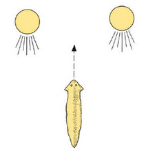
>
> Egy további veleszületett magatartásforma az öröklött mozgáskombináció. Ilyen viselkedés például a mókusok diórejtő tevékenysége. Ha a mókus több táplálékhoz jut, mint amennyit elfogyaszt, akkor a fölösleget elássa a földbe, és avarral betakarja. Egy kísérletben vizsgálták ezt a viselkedést. Születésük után elválasztották a mókusokat az anyaállattól, egymástól is elkülönítették, és mesterségesen nevelték fel őket. Az így nevelt mókusok ősszel életükben először kaptak diót. Valamennyi kísérleti állat miután jóllakott, nyomban keresni kezdett egy alkalmas helyet a ketrecben, és a fémpadlón is elvégezte a fölös élelem elásásának a mozdulatsorát. Ebben a magatartásformában tehát a dió mint kiváltó inger beindította a szigorú sorrendben lejátszódó öröklött mozgássorozatot.
>
> ### Kulcsinger és motiváció
>
> Az öröklött magatartásformákra sokszor használják tévesen az ösztönös jelzőt. Az állatok ösztönös viselkedése vagy röviden ösztöne azonban nem azonos az öröklött magatartásformákkal. Ösztön alatt egy olyan összetett magatartáscsoportot értünk, amelyben öröklött és tanult elemek egyaránt felfedezhetőek. Így például a pulykák ivadékgondozó ösztönét vizsgálva azt tapasztalták, hogy a fiatal, első alkalommal költő pulykatojó is teljes mértékben képes csibéinek felnevelésére. Ha azonban a tojót az első költés előtt hallásképtelenné tették, akkor a kikelő csibéit megölte, mivel első alkalommal kizárólag hangjáról ismeri fel ivadékait. Az idősebb, már többször költött pulykatojó hallása elvesztése után is gondozta utódait. A megelőző tapasztalatai révén ugyanis már látás alapján felismerte csibéit. Az ivadékgondozó ösztönben tehát öröklött és tanult magatartásformák épülnek egymásra.
>
> Az öröklött magatartásformákat mindig két alapvető tényező váltja ki. Az egyik a külső környezet, a másik az állat belső állapota. A külső környezet hatásaiból az állat érzékszerveivel nagyon sokat felfog, de közülük csak néhány váltja ki belőle az öröklött viselkedési formákat. Ezeket közös néven kulcsingernek nevezzük. Az vállat belső állapota a motiváció.
>
> Ha a béka látóterében nagy mozgó tárgy jelenik meg, az állat elmenekül. Ha azonban egy kis méretű mozgó tárgyat észlel, például egy rovar kerül elé, az állat a szemével, sőt egész testével követi a rovar mozgását. Amikor már elég közel kerül hozzá, a béka gyors mozdulattal kiölti a nyelvét és bekapja az állatot. A békát zsákmányszerzése közben egyszerre többféle inger is éri. Ilyen a zsákmányállat színe, szaga, formája, mozgása, nagysága. Ezekből a béka cselekvését csak két inger, a zsákmányállat nagysága és mozgása indítja el. Ezek jelentik a béka viselkedése szempontjából a kulcsingert, a motiváció pedig az éhségérzete.
>
> 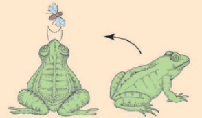
>
> Ismert, hogy a kakukk más énekesmadarak fészkébe helyezi tojását, és azok költik ki, majd nevelik fel a kakukkfiókát, és saját utódaikat kevésbé. A madárszülőknek erre a furcsa viselkedésére egy másik madár, a csigaforgató költési magatartásának vizsgálata adta meg a magyarázatot. Megfigyelték, hogy a csigaforgató a három tojásból álló saját fészekalja helyett mindig a mellé helyezett öt tojásból álló fészket választotta. Még meglepőbb viselkedést tanúsított akkor, amikor a saját tojásai, a nagyobb méretű ezüstsirálytojások és a még nagyobb heringsirálytojások közül választhatott. Mindig a legnagyobb méretű tojásokat választotta, noha ezeken tudott legkényelmetlenebbül megülni. Az ilyen, a normálisnál hatékonyabb választ kiváltó ingereket szupernormális ingernek nevezzük. Ezzel magyarázható a kakukkfióka felnevelése is.
>
> 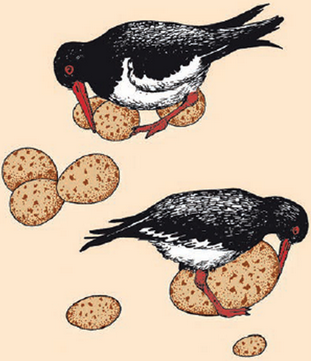
> 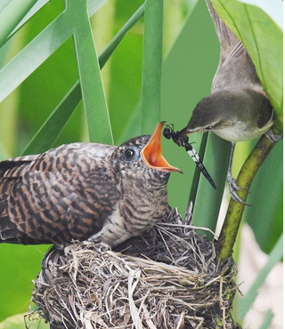

> ## Az állatok tanult magatartásformái
>
> Az állatoknak közvetlenül a születésük utáni viselkedését a fajra jellemző öröklött magatartásformák határozzák meg. Környezetük azonban állandóan változik, és az így kialakuló új helyzetekhez való alkalmazkodást az állat a személyes tapasztalatszerzésén keresztül sajátítja el. A tapasztaltak hatására az öröklött magatartásformák mellett tanult magatartásformák alakulnak ki az állat egyedi élete során. Ezeket – ellentétben az öröklött viselkedéssel – nem örökölhetik az utódok. Az öröklött és a tanult magatartási elemek egymással összekapcsolódva hozzák létre a kifejlett egyedre jellemző viselkedést.
>
> ### A bevésődés
>
> A különböző állatfajoknál igen eltérő a magatartás kialakításában részt vevő öröklött és tanult elemek aránya. A törzsfejlődés magasabb fokán álló állatcsoportoknál a tanulás egyre nagyobb szerepet játszik az alkalmazkodásban.
>
> Vannak olyan viselkedési formák, amelyek tanulása bizonyos életszakaszhoz kötött. Alapvető közülük a bevésődés folyamata. A libák a tojásból való kikelés után azonnal követik szüleiket. Ha a tojásokat mesterségesen keltetik, a kislibák az első mozgó lényt követik, amellyel találkoznak. A szüleikhez való kötődés csak a néhány órás fiatal állatnál alakul ki. A követendő képének megtanulása, bevésődése az emlékezetbe csak pár percet vesz igénybe, és egész életre szólóan megmarad. Ha a mesterségesen keltetett kislibákat a kikeléstől számított két-három napig sötétben tartjuk, az érzékeny periódus elmúlása után a tanulási folyamat már nem alakítható ki.
>
> 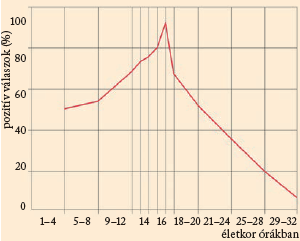
>
> ### Ragadozók zsákmányszerzési viselkedése
>
> Fiatalkorban kell megtanulni egyes ragadozóknak a zsákmányszerzési viselkedést is. Például ha a felnőtt görény hörcsöggel kerül szembe, egyetlen mozdulattal átharapja a zsákmányállat nyakszirtjét. Ez a fajra jellemző viselkedés a születéstől elkülönítve nevelt és nyers húson tartott görényeknél nem figyelhető meg. Ha az így nevelt fiatal állatot hörcsöggel eresztik össze, a görény minden támadó szándék nélkül játszani kezd vele. A görény közeledtére a hörcsög védekező magatartással, felemelkedéssel, harapással válaszol. A hörcsög viselkedése kiváltja a görényből a fajra jellemző zsákmányolási mozdulatsort. Rövid harc után a görény a hörcsög gerincére mért harapással megöli a zsákmányállatot. Néhány hasonló alkalom már elég arra, hogy a harapás pontos legyen, és a mozdulatsor végleges magatartásformává alakuljon. A görény tehát megtanulja a vadászharapást, de nem a szüleinek vagy a társainak a példáján, hanem a zsákmányállat reakciója váltja ki a tanulási folyamatot. Az állatban ugyan öröklött formában jelen vannak a zsákmányszerzés magatartási elemei, de ezeket a zsákmányállat viselkedése rendezi megfelelő sorrendbe.
>
> ### Megszokás és érzékenyítés
>
> A tanult magatartásformák kialakulásának többsége nem kötődik egy bizonyos életkorhoz, hanem az állat bármelyik életszakaszában létrejöhet. A tapasztalatszerzés egyik legegyszerűbb formája a megszokás (habituáció). Ezen keresztül az állat tulajdonképpen azt tanulja meg, hogy milyen ingerekre ne válaszoljon. Minden hirtelen mozgó tárgy, látható vagy hallható új inger az állatban védekező viselkedést vált ki. Ha az állat ezekhez nem szokna hozzá, és nem tudna különbséget tenni a veszedelmes és az ártalmatlan ingerek között, akkor az egész életét állandó meneküléssel tölthetné. Az állat a környezetéből ismételten fellépő, sem jó, sem rossz következményekkel nem járó ingereket megszokja, azokra egy idő után már egyáltalán nem válaszol.
>
> Ha például éticsigákat egy deszkalapra helyeznek, és megvárják, amíg azok kibújnak a csigaházból és mászkálni kezdenek, majd a deszkára ütnek egy bottal, akkor a csigák mind a házaikba húzódnak. Ezt többször egymás után megismételve, egy idő után már nem reagálnak a csigák a zörejre, és zavartalanul mászkálnak tovább. Az ismételt ingerek hatására tehát csökkent a válaszreakció erőssége. A megszokás nem elfáradás, mert az állat csak arra az ingerre nem válaszol, amelyik nagyon sokszor ismétlődik és közömbös. A megszokás nagyon fontos az állatok viselkedésében, mert megkíméli őket a környezetből rájuk zúduló közömbös ingerek tömegétől.
>
> Ennek éppen ellenkezője az érzékenyítés (szenzitizáció). Az örvényférgek például, ha gyenge áramütést kapnak, erre válaszként összerándulnak. Ha az áramütéseket sorozatosan ismételjük, majd egy másik ingert, például fényfelvillanást alkalmazunk, az állat arra is összerándulással reagál, holott csupán a fényfelvillanás önmagában az összerándulást nem váltja ki.
>
> ### A feltételes reflex
>
> A kutya szájában a táplálék ízére nyálelválasztás indul meg. Ez a reakció öröklött magatartásforma, feltétlen reflex. Egy kísérlet során a táplálék ingeréhez egyidejűleg közömbös ingert is társítottak. A táplálkozások alkalmával mindig megszólalt egy csengő. A két inger társítását rendszeresen ismételve bizonyos idő után a kutya nyálelválasztása már csak a csengőszóra is megindult.
>
> 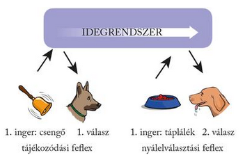
>
> Ez a reflex nem öröklött, hanem az állat a kísérlet folyamán tanulta meg. A reflex kialakulásának alapvető feltétele, hogy a két inger egy időben gyakoroljon hatást az állatra. A feltételes reflexeken keresztül tanulják meg az állatok természetes környezetük ingereit – szag, ágropogás – összekötni a zsákmány vagy az ellenség közeledésével.
>
> ### Az operáns és a belátásos tanulás
>
> Bonyolultabb tanulást jelent az aktív cselekvés útján történő tapasztalatszerzés. Ennek lényege, hogy az állat a szükségletei kielégítése érdekében új mozgásformákat sajátít el. Egy éhes macskát ketrecbe zártak, a ketrecen kívül pedig húst helyeztek el. Ha a macska orrával vagy lábával megnyomta a padozaton levő fogantyút, az ajtó azonnal kinyílt. A ketrecbe zárt állat első alkalommal mindent kipróbált, hogy ki tudjon jönni, és a ketrec mellé helyezett táplálékhoz jusson. A fogantyú véletlen megnyomásával végre kinyílt a ketrec. Az első kiszabadulás hosszú időbe telt, de sokszor megismételve a próbálkozást az állat végül megtanulta a feladatot pontosan és gyorsan megoldani ezzel a próba-szerencse módszerrel. Hasonló kísérletet patkánnyal is végeztek.
>
> 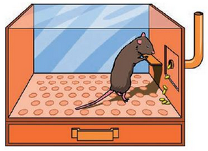
>
> A kísérletek során az állatok a tájékozódó mozgásaik közül felismerték a hatásosakat, amelyet a táplálék elérése megerősített. Mivel ebben az esetben az állat önmagát idomította, vezérelte, a folyamatot vezérlő vagy más néven operáns tanulásnak nevezzük. Ha a rendszeres megerősítés elmarad, akkor a válaszreakciók lassan kioltódnak, és az így tanult viselkedési forma megszűnik.
>
> Az állatok tanult magatartásformái közül a legösszetettebb a belátásos tanuláson alapuló viselkedés. Ez elsősorban az eszközt használó állatoknál figyelhető meg. A  csimpánz például meglévő tapasztalatait előrelátó viselkedéssé képes formálni, és az eszközt a maga javára felhasználni.
>
> 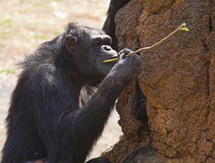
>
> Így például faág segítségével fel tudja törni a termeszek várát, majd a beledugott faágra kapaszkodó termeszeket gyorsan kiemeli és lenyalja. Ha egy fogva tartott csimpánz ketrecébe egymásba illeszthető rövid botokat helyeznek, és a botok egyenkénti hosszát meghaladó távolságba gyümölcsöt tesznek a ketrecen kívülre, az állat megpróbálja bekotorni a táplálékot valamelyik bottal. Mivel ez nem sikerül rögtön, megtoldja azt egy másikkal, és így szerzi meg a gyümölcsöt. A tanulás itt abban nyilvánult meg, hogy az állat a probléma megoldására előzetesen kialakított viselkedési elemeket használt fel, és azokat megfelelő sorrendbe illesztve egymás mellé, újonnan tanult magatartásformát alakított ki belőlük.

> ## Az állatok kommunikációja és önfenntartó viselkedése
>
> Az élővilág evolúciója során mindegyik állatcsoport – azon belül minden egyed – küzdelmet folytatott a fennmaradásáért. A folytonos szelekciós nyomás sajátos viselkedésformák megjelenéséhez vezetett elsősorban a tájékozódóképesség kifejlődésében, a táplálékszerző magatartásukban, valamint a rájuk leselkedő veszedelmek elhárításában. A természetben ezek a magatartásformák komplex módon jelentkeznek. Sok olyan viselkedési formát ismerünk, amelyek a fenti csoportok bármelyikébe besorolhatók, hiszen valamennyi viselkedésforma vizsgálata során egyaránt megfigyelhetők. Ilyen megnyilvánulás például az állatok kommunikációja, amely valamennyi állati magatartásformában nélkülözhetetlen.
Kommunikáció az állatok között
>
> A kommunikáció nem más, mint információközlés. A kommunikáció közben leadott információ a közlő fél agyi modelljének működési eredménye, biológiai működése pedig az, hogy a fogadó fél (vagy akár mindkettőjük) agyi modelljében alkalmazkodási reakciót váltson ki, vagyis megváltoztassa a viselkedésüket. A kommunikáció lehetősége alapvető feltétele a társas kapcsolatok kialakulásának és fenntartásának. A csoportba tartozó egyedek a kommunikációs jeleken keresztül ismerik fel egymást, közlik fajtársaikkal a rangjukat a hatalmi sorban, és segítségükkel fejezik ki közölnivalójukat. A jelek befolyásolják a fajra jellemző magatartást. Viselkedéseket indítanak be, megváltoztatják vagy éppen megszüntetik azokat.
>
> Az állatvilág számos képviselője olyan szaganyagokat termel, amelyekkel kémiai kommunikációra képes. Ezeket az anyagokat közös néven feromonoknak nevezzük. A mirigyekben termelődnek, majd levegőbe vagy vízbe kerülnek. Sok esetben a fajra, a csoportra vagy az egyedre jellemző szagok elősegítik az állatok egyedfelismerési képességét.
>
> 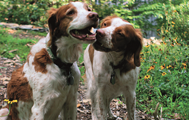
>
> A kémiai jelzések sajátossága, hogy hosszabb ideig is hatásosak maradnak. Lehetnek veszélyre figyelmeztető riasztójelzések, amelyek kiváltják például a hangyák védekező vagy menekülő magatartását.
>
> 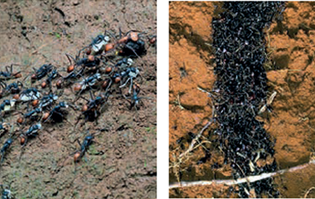
>
> A párválasztásban az ivari feromonoknak van igen jelentős szerepük. Példa lehet a lepkék érzékeny reagálása ezekre az anyagokra.
>
> Gyakori jelenség az egyedek térbeli eloszlásának kémiai szabályozása, sok állat feromonok segítségével jelöli ki saját területének határait.
>
> A vizuális kommunikáció az állatok látására épül. A mozgással történő vizuális kommunikáció legjobban felderített példája a méhek tánca. A táplálékforrásra és az odavezető útra vonatkozó szinte minden információ közlésére képesek. A felderítő méh a kaptárba visszatérve közli társaival a lelőhely irányát és távolságát. Ezt egy nyolcas alakban végzett gyors mozgással jelzi.
>
> 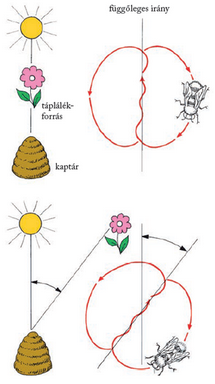
>
> A nyolcas középső vonala mindig a táplálékforrás irányába mutat, a méh előrehaladásának megfelelően. A kaptárba érkező méh a lép függőleges síkján úgy járja a táncát, hogy a nyolcas középső szakasza és a függőleges irány pontosan akkora szöget zárjon be, hogy az megegyezzen a táplálékforrás Naphoz viszonyított helyzetével.
>
> A szentjánosbogarak hímje a párzás idején az esti repülés közben, szabályos időközönként felvillan. A nőstény felmászik egy fűszálra és ott marad, miközben ő is villog válaszul a hím jelzéseire.
>
> Megtalálható az állatok közötti vizuális kommunikáció a társas viselkedésben is. A rangsorrend kialakításában vagy a területvédő magatartási formákban az állatok kifejező mozdulataikkal, testtartásaikkal közlik hangulatukat a társaikkal. A kutya például farkcsóválással üdvözlést, örömet, míg a magasra tartott farokkal fenyegetést, haragot fejez ki. Félelmét a hátsó lábai közé behúzott farkával jelzi.
>
> Az állatok hangadási jelrendszerén és hallásán alapul az akusztikus kommunikáció. A hangjelzések főleg olyan esetekben segítik elő a társas érintkezést, amikor a látási vagy szaglási ingerek nem érvényesülhetnek.
>
> 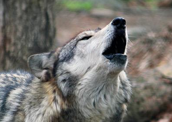
>
> A rovarok hangjelei részben az ivari pár hívására szolgálnak, és jelezhetik a vetélkedő hímek rivalizálását. A kétéltűek hangjelzései is a szaporodással kapcsolatosak. A békák hívó jelzésére, amit ha távolról hallat a hím, kórusban mind a hímek, mind a nőstények közösen válaszolnak. Ha közelről hangzik a hívójel, akkor vonzólag hat a nőstényre. A madarak akusztikus jelrendszere a legváltozatosabb az állatvilágban. Ennek része a fajra jellemző öröklött hangjelzés, másik részét az egyedi a saját élete során tanulja meg.
>
> ### Önfenntartási viselkedésformák
>
> Az állatok alapvető létfenntartási viselkedése a tájékozódás. Ennek legegyszerűbb formái a taxisok. Összetettebb formája a tárgyak megjegyzéséhez kötött. A terep tárgyainak megjegyzésével történő tájékozódásra jó példa egy darázsfaj, a méhfarkas viselkedése.
>
> 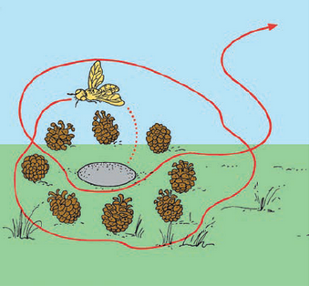
> 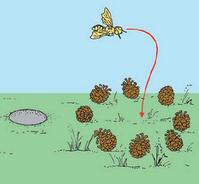
>
> Tájékozódásának vizsgálatához a földbe ásott fészke körül fenyőtobozokat helyeztek el. A fészekből távozó darázs előbb mindig helyszínvizsgálatot tartott, majd elrepült. Ha a fészek körüli fenyőtobozokat más helyre tették, az állat nem az eredeti fészekbe repült vissza, hanem a tobozokkal megjelölt új helyre.
>
> A denevérek repülésük közben szájukon keresztül ultrahangot sugároznak a levegőbe, és ezek visszaverődése alapján tájékozódnak és kutatják fel a zsákmányukat.
>
> 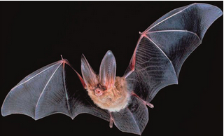
>
Az állatok közül a madarak hazatalálási módját, vonulási tájékozódását vizsgálták legtöbbször.
>
> 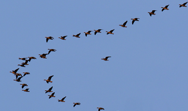
>
> Megállapították, hogy a térbeli tájékozódásuk egy része öröklött viselkedés, a másik, nagyobb részét viszont hosszú tanulás útján szerzik meg. A nappali vonuláshoz a Nap állását, az éjszakai vonuláshoz a csillagok helyzetét képesek felismerni, és ezeket saját mozgásuk iránytartásához felhasználni.
>
> Az állatok között a létfenntartásért folyó versengés elsősorban a megfelelő mennyiségű és minőségű táplálék megszerzésére irányul. A táplálkozási viselkedés egyedenként is igen változó magatartási elemekből áll. Az egyszerűbb táplálékkeresés azokra az állatokra jellemző, amelyek közvetlen környezete egyben a táplálékot is tartalmazza. Például a talajban élő földigiliszták a földdel együtt lenyelt szerves anyagokat hasznosítják, vagy a bálnák a szájukba tóduló vízből egyszerűen kiszűrik a táplálékul szolgáló apró élőlényeket. Más esetekben az állat felkutatja, megkeresi táplálékát. Ebben a látás, a szaglás, a hallás útján felismerhető jelzések segítik az állatot. A növényevő állatoknál ez nem okoz különösebb nehézséget. A táplálékuk megszerzését és elfogyasztását időzíthetik, rendszeressé tehetik. A  ragadozó állatok zsákmányszerzése azonban támadó magatartással párosul. A zsákmányszerzés öröklött magatartásformái tehát igen változatos közvetlen és közvetett, tanult viselkedési elemekkel bővülnek az állatok élete során. A ragadozók támadó, zsákmányszerző viselkedésformáival párhuzamosan alakultak ki az evolúció során a zsákmányállatok védekező, menekülő magatartásai.

> ## Az állatok szaporodási viselkedése
>
> Az állatok alapvető magatartás-megnyilvánulása a szaporodási viselkedés. Ez az ivarérettséget elért egyedekre jellemző. Fellépését belső és külső tényezők összhatása határozza meg. A belső tényező hormonális hatás, a külső tényezők – a kulcsingerek – viszont sokfélék lehetnek. Például a napszakok hosszabbodása vagy rövidülése, a táplálékbőség vagy az időjárás változása.
>
> ### A párválasztás
>
> A szaporodás kezdeti időszakának magatartási jellemzője a párválasztás. A kiváltó ingerek közül jelentős szerepe van a szagnak, a hangnak, a színnek és a mozgásnak. A rovarok közül a tücskök hímjei ciripelésükkel hívják fel magukra a nőstények figyelmét. A szentjánosbogarak fénykibocsátása is a párok egymásra találását szolgálja. A szúnyogok vagy a hangyák rajzó mozgása is ezt segíti elő. Sok fajnál az ivari kétalakúság csak a szaporodás időszakában jelentkezik, amikor a hímek színes nászruhát öltenek, és így mutatkoznak a nőstény előtt. Hazai vizeinkben a szivárványos ökle ilyenkor a szivárvány összes színében pompázik. A tüskés pikó tűzpiros hasával kelti fel a nőstény figyelmét. A kétéltűek közül a békák hímjei harsány hangjukkal igyekeznek partnert találni. A madarak párválasztása bonyolult viselkedésmintákon alapul. Fontos szerepe van ebben a hangnak, a díszes tollruhának és a táncmozdulatoknak is. Az emlősök egymásra találásában a szagjelzések játsszák a főszerepet.
>
> 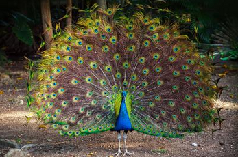
>
> A párválasztáshoz hozzátartozik a hím egyedek közötti küzdelem is, a szaporodási terület vagy éppen a nőstény megszerzéséért. A küzdelem rendszerint csak rituális, fenyegetésben, riasztó színek mutogatásában vagy elijesztő mozgásokban fejeződik ki. Tényleges összecsapásra csak ritkán kerül sor.
>
> ### Az udvarlás és a párzás
>
> A győztes hímek udvarlási viselkedései azt a célt szolgálják, hogy fokozzák és időben összehangolják az ivari partnerek izgalmi állapotát, legyőzve az egyedek közötti távolságtartást, és lehetővé váljon a testi érintkezés, ami a párzás előfeltétele.
>
> Egyszerűbb formái már az alacsonyabb rendű állatoknál is előfordulnak. A puhatestűek közül a nyolckarú polip hímje a párzás szolgálatában álló karjával a nőstény testét simogatja, miközben mindketten színüket változtatják. Számos hazai lepkefajnál megfigyelhető, hogy a párzásukat a hím és a nőstény együtt repülése előzi meg.
>
> 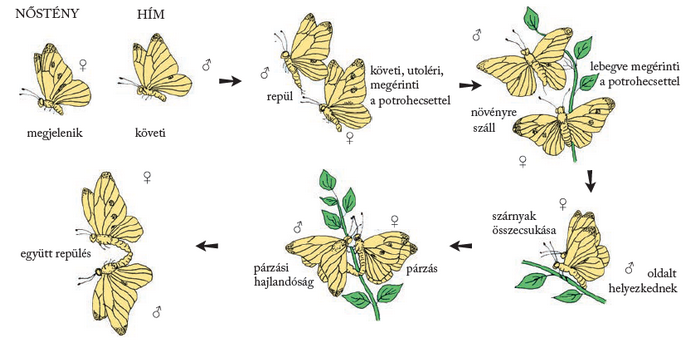
>
> A madarak udvarló viselkedése a legváltozatosabb. Nászjátékukban fontos szerepet kap hangadásuk, színes tollruhájuk, illetve bonyolult násztáncuk. Érdekes az Új-Guineában és Ausztráliában élő lugasépítő madarak viselkedése.
>
> 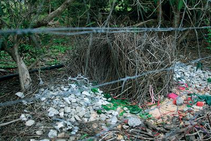
>
> A madár hímje a nászjátékhoz növények szárából lugast épít. A lugas előtti teret színes tárgyakkal – papagájtollakkal, csigaházakkal, virágokkal, bogyókkal és magvakkal – díszíti. A lugasnál megjelenő nőstényt a hím kecses táncmozdulatokkal fogadja. Ha a lugas megnyeri a nőstény tetszését, akkor elfogadja a hímet párjának.
>
> A párzás során megtermékenyül a petesejt. A tojások lerakásával sok állatfajnál le is zárul a szaporodás viselkedéssorozata.
>
> ### Az ivadékgondozás
>
> Az állatok egy része gondoskodik utódjairól. Minden olyan magatartásformát, amely az utódok védelmét és táplálását szolgálja, ivadékgondozásnak nevezünk.
>
> A bölcsőszájú halak a szájukban költik ki az ikrákat, és csak az úszóképességük elérése után engedik ki az utódokat.
>
> 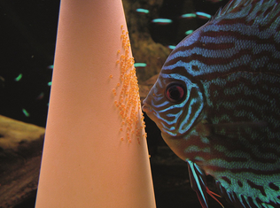
>
> A sziámi harcoshalak és a paradicsomhalak habfészket építenek, és ebbe helyezik az ikrákat, majd a kikelő ivadékokat őrzik. A dajkabéka hímje a nőstény fonalszerűen lerakott petéit több hétig a hátán hordja, majd a vízbe viszi, ahol kikelnek az utódok. A teknősök elássák a tojásokat, esetleg őrzik is a fészket, ahogyan a krokodilok is ezt teszik. A madarak saját testük melegével költik ki tojásaikat. A fészekhagyó madarak utódai már röviddel a kikelés után önálló életre képesek.
>
> 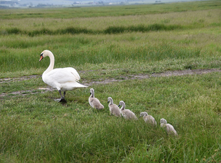
>
> A fészeklakók azonban hosszabb időn keresztül táplálják, gondozzák kicsinyeiket.
>
> 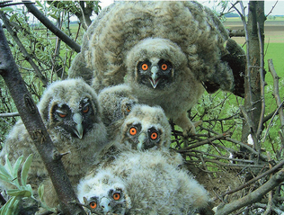
>
> Az emlősök szoptatják a megszületett utódokat, megvédik a ragadozóktól, majd fokozatosan megtanítják a zsákmányszerzés módjaira.
>
> 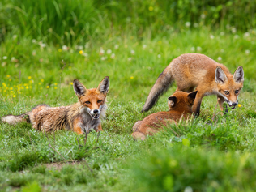
>
> ### Szociális kapcsolatok a közösségben
>
> Az ivadékgondozás fejlettebb formáinál megfigyelhető szociális kapcsolatok az egyedek között egyéb körülmények között is kialakulhatnak. Ennek előfeltétele a genetikusan meglévő társulási hajlam, szociális vonzódás, amely az egyedek közötti távolság csökkenéséhez és ezen keresztül csoportok kialakulásához vezet. A szociális kapcsolatok legegyszerűbb formája az időleges tömörülés. Ilyen társaságot alkothatnak a vonulásra összegyűlt állatok, mint a vándormadarak, a vonuló heringek vagy a rénszarvasok.
>
> 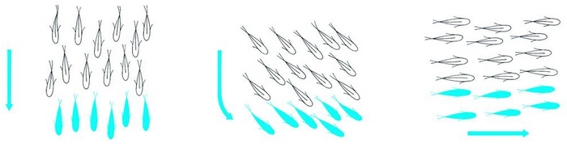
>
> Ezek a vonulás alatti közös védelem és biztonság céljából tömörülnek össze. Hasonló kapcsolat a közös vadászat alkalmával időleges csoportot alkotó farkashorda vagy a telelésre egy helyre húzódó denevérek csapata is. Az időleges tömörülések nyitott közösségek. A tagjaik bármikor kicserélődhetnek más egyedekkel, a létszám tág határok között mozoghat.
>
> A zárt közösségek egyedeit viszont erős szociális vonzalom tartja össze. A kapcsolat tartós, többnyire a teljes szaporodási időszakra, de sokszor az egész élettartamra szól. A közösségbe bekerülő idegen egyedekkel szemben elutasító magatartást tanúsítanak. A gerinces állatokra jellemző zárt közösség a szülőállatok és ivadékaik társas együttese a család. Ez az állatok többségénél rövid életű közösség, az ivadékok felnevelése után általában feloszlik. Ha ez nem következik be, hanem a szülők együtt élnek az egymást követő nemzedékkel, kialakul a nagycsalád. Ez főleg a rágcsáló emlősökre jellemző. Sok család más szerveződésű együttélése a kolónia. Ezekben a család fennmarad, a szülőállatok saját utódaikat gondozzák, de sok család él együtt. Ilyenek a pingvinek kolóniái. A társas költés előnye a nagyobb biztonság, akár az időjárás viszontagságaival, akár a tojásrabló madarakkal szemben. Hasonló jellegű közösség az emlősök legtöbb csordaformája is.
>
> Sajátos társas együttélés jellemzi az államalkotó rovarok közösségeit. A hangyák, a méhek, a trópusi területeken élő termeszek fajai rovarállamokat alkotnak. Ezek közös jellemzői az egyedek óriási létszáma, a közös fészeképítés, a rendszeres lárvagondozás és a kasztrendszer kialakulása. Ez azt jelenti, hogy a közösségen belül az egyes feladatok elvégzésére tökéletes munkamegosztás alakult ki a kifejlett rovarok különböző alakjai között. A rovarállamban minden egyed öröklött magatartásformáival járul hozzá a társas viselkedés összhangjához. A rovarállamok tökéletes összhangú működését bonyolult biológiai mechanizmusok szabályozzák.
>
> ### Rangsor a közösségben
>
> Az együtt élő zárt közösségekben az egyedek ismerik egymást, és a csoporton belül rangsor alakul ki közöttük. A rangsorban elfoglalt helyekért az állatok egymás között megküzdenek.
>
> 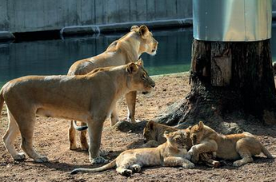
>
A küzdelem az állati agresszió egyik menyilvánulása, amely csak saját fajtárssal szemben értelmezhető. A legyőzött egyed elismeri vereségét, és behódoló pózt vesz fel. Gyakran csak az erő jelzése is elegendő a rangsorvita eldöntésére.
>
> ### A személyes tér kialakítása és védelme
>
> Még a csoportosan élő állatokra is jellemző az egyedek közötti távolságtartás igénye. A személyes tér nagysága fajonként különböző. Vannak testérintkezést tűrő állatok – pl. a denevérek és a vaddisznók –, ezek egyedei elviselik a többiek közelségét, sőt a közvetlen érintkezést is. A testérintkezést nem tűrő állatok viszont egy bizonyos ponton túl megakadályozzák más egyedek közeledését, elhúzódnak tőlük vagy elzavarják azokat.
>
> Az állatoknak létfenntartási és szaporodási viselkedésükhöz megfelelő területre van szükségük. A legtöbb állat az életét egy jól körülhatárolt területen éli le. A saját terület lehet egyetlen állaté vagy azonos fajú egyedek kisebb-nagyobb csoportjáé. Ez a territórium, amelyet az egyed vagy csoport kizárólagosan használ. Kiterjedése az állat méretétől és életmódjától függ. Birtokbavétele lehetővé teszi a rajta élők táplálkozását, szaporodását, ivadékgondozását, megfelelő védelmét. Ezt a területet az állat sajátjának érzi, és még betolakodó fajtársaival szemben is védelmezi.
>
> 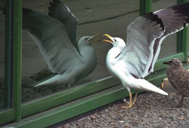
> 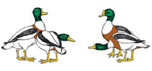
>
> Ebben az esetben területvédő agresszióról beszélünk, amely elsősorban rituális elemekből áll.

---

- [Vissza az előző oldalra](../biologia.md)
- [Vissza a főoldalra](../../../../README.md)

---