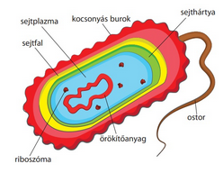
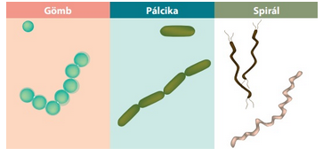
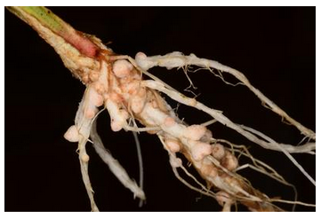
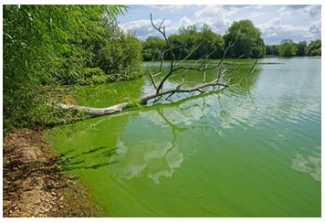
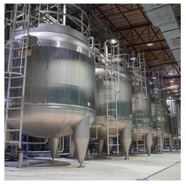
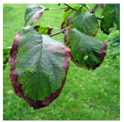
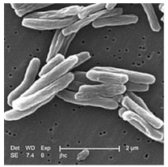
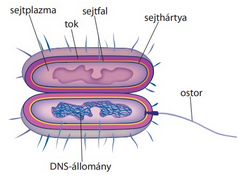

---

- [Vissza az előző oldalra](../biologia.md)
- [Vissza a főoldalra](../../../../README.md)

---

> ## Ökológia
>
> Ökológia a biológia azon része, mely élőlény és környezeténke a kapcsolata.
>
> | Szerveződési szintek |  |
> | :-- | :-- |
> |  |  |
> | **Egyed alatti** | **Egyed feletti** |
> | sejt->szövet->szerv->szervrendszer->szervezet |
> populáció->társulás->biom->bioszféra |
>
> - **Faj**: külső és belső tulajdonságaik hasonlóak egymáshoz, egymással képesek szaporodni és utódaik is szaporító képesek.
> - **Populáció**: tényleges szaporodási közösség egy helyen, térben és időben.
> - **Társulás**: együtt élő populáció pl.: erdő
> - **Biom**: társulások összessége, melyek az éghajlati övezetesség (zonalitás) miatt jön létre
> - **Bioszféra**: összes élőlény
>
> | Környezeti tényezők |  |
> | :-- | :-- |
> |  |  |
> | Abiotikus - élettelen | Biotikus - élő |
> | pl.: hőmérséklet, csapadék, fény | pl.: más élőlények |
>
> Fény: növények -fotoszintézis (szervetlenből szervest állít elő. pl.: szőlőcukor)
>
> ### Tűrőképesség
>
> 
>
> - Tágtűrésű: 
> - Szűktűrésű: 
>
> ### Populációk
>
> Tényleges szaporodási közösség.
>
> | Tulajdonságok |  |
> | :-- | :-- |
> | Egyedszám |  |
> | Ha kritikus, akkor kihalhat |  |
>
> | Térbeli eloszlás |  |
> | :-- | :-- |
> | egyenletes (ritka) |  |
> | véletlen |  |
> | felhalmozódó |  |
> | szigetszerű |  |
>
> | Életkor, koreloszlás |  |
> | :-- | :-- |
> |  |  |
> |  |  |
> | **Alakzatainak neve** |  |
> | piramis alakú |  |
> | méhkas alakú |  |
> | urna alakú |  |
>
> | Populáció egyedszáma |  |
> | :-- | :-- |
> |  |  Környezet eltartóképessége gátat szab |
>
> ### Populációk kölcsönhatása
>
> Hatások jelölése: +, -, 0
> Összes jelölés: ++, +-, +0, --, 0-, 00
>
> - ++ : együttélés, szimbiózis (pl.: pillangós virágú - bab; Nitrogén gyűjtő baktérium)
>
>    - Pl.: zuzmó
> 
>
> - +0 : Asztalközösség, kommenzalizmus
> - +- : zsákmányszervezés, predáció
> - élősködés, parazitizmus
> - -- : versengés
> - 0- : anitbiózis
> - 00 : neutralizmus
>
> ### Társulások
>
> A társulások fontos jellemzője a térbeli szerkezet. A függőleges elrendeződés a szintezettség, amely a növénypopulációk fényért való versengésének eredménye. A különböző növényzeti szintekben eltérő fényviszonyokhoz alkalmazkodott populá­ciók élnek. A fényigényes populációk hatolnak a legmagasabbra, az árnyékkedvelők pedig az alsóbb szintekben élnek. A trópusi esőerdőkben például az óriásfák po­pulációi a leginkább fényigényesek, őket követik a középső lombkoronaszint fái, valamint a ­lombsátor felső részében megtelepedő, fán lakó növények (epi­fitonok) és liánok. Az alsó lombkoronaszint fái, valamint a cserje- és a gyepszint növényei árnyéktűrők.
>
> A növénypopulációk vízszintes elrendeződése alkotja a mintázatot, amely abból adódik, hogy a populációk eloszlása nem egyenletes. A mintázat elsősorban azért alakul ki, mert a környezeti tényezők, például a talajban a víz- és a tápanyagtartalom helyenként eltérő, és a növények populációi versengenek ezekért az erő­forrá­sokért.
>
> A növénypopulációk szintezettségét és mintázatát követve, környezeti igényeiknek megfelelően és a populációk közötti kölcsönhatások által meghatározottan élnek az állatpopulációk egyedei is. A hazai tölgyesekben például az erdei vöröshangyák az avarszintben és a gyepszintben keresik táplálékukat, a keresztespók viszont a cserjeszintben és a lombkoronaszintben feszíti ki a hálóját. A madarak közül a cinegék a fák lombkoronaszintjében fészkelnek, a fülemülék pedig a cserjeszintben.
>
> #### A társulások változásai
>
> A térbeli szerkezet mellett időbeli változások is jellemzőek az életközösségekre. Az időbeli változások a populációk eltérő aktivitásával, élettevékenységével magyarázhatók. Az évszakok váltakozása miatt szabályosan bekövetkező, visszatérő állapotai a társulásoknak az aszpektusok.
>
> 
>
> A hazai erdőkben tavasszal, lombfakadás előtt virágszőnyeg borítja a talajt. Mire a fák rügyei kihajtanak, az aljnövényzet virágos növényei termést és magot érlelnek, majd föld feletti részeik elszáradnak. Lombfakadás után a gyepszintben már csak árnyéktűrő fajokat találunk. Őszre a fák és a cserjék termést érlelnek, majd a hideg elleni védekezésül lehullatják leveleiket, a költöző madarak pedig ősszel elhagyják itteni életközösségeiket.
>
> Ha a környezet tartósan egy irányban változik, akkor lassan átalakul az életközösség fajösszetétele és szerkezete is, vagyis új társulás alakul ki. Ez a természetes társulásfejlődési folyamat a szukcesszió. Az újonnan létrejövő élőhelyen elsőként kialakuló életközösséget pionír fajok jellemzik.
>
> 
>
> A változások során egymást követik a társulások, majd a szukcesszió ­folyamata a zárótársulás kialakulásával ér véget.
>
> 
> 
>
> A szukcessziós folyamatok során egyre összetettebb életközösségek követik egymást az élőhelyen. A záró­társulás az adott környezetben kialakuló legfejlettebb társulás, és általában a sokfélesége is ennek a legnagyobb.
>
> A szukcessziónak két típusát különböztetjük meg. Az elsődleges szukcesszió során olyan területen alakul ki életközösség, ahol korábban nem volt, például sziklás felszíneken. Ilyenkor az első megtelepülő, pionír fajok készítik elő a felszínt a további betelepülőknek. Jellegzetes pionírok a zuzmók, melyek zuzmósavat termelve oldják a kőzet felszínét, elősegítve a talaj kialakulását.
>
> 
>
> A másodlagos szukcesszió olyan területen zajlik, ahol korábban már volt életközösség. Ilyen lehet egy erdőtűz után maradt terület, építkezés utáni bolygatott földfelszín. Másodlagos szukcessziónak nevezzük azt is, amikor egy meglévő ökoszisztéma továbbfejlődik, például egy tó feltöltődik, vagy egy irtásrét beerdősül.
>
> |  |  |  |
> | :-- | :-- | :-- |
> |  |  |  |
>
> Mindkét esetben jellemző, hogy azok a növények jelennek meg először, melyek gyorsan nőnek, de nem túl nagyok, rövid életűek és nagyszámú szaporítóképleteik vannak. Ha a környezeti feltételek megfelelőek, akkor a szukcesszió későbbi stádiu­maiban jelennek meg a nagyobb termetű, lassan növő, de hosszabb életű fajok, melyek majd a zárótársulás tagjai lesznek.

---

> ## Vírusok
>
> ### A vírusok jelentősége
>
> A vírusok baktériumokban, növényekben, állatokban, emberben egyaránt élősködhetnek. Az emberi betegségek közül vírusfertőzés okozza többek között az influenzát, a bárányhimlőt, a kanyarót, a veszettséget, a járványos gyermekbénulást, az AIDS-et és a fertőző májgyulladást (hepatitisz).
>
> ### Származás, rendszerezés
>
> A vírusok származása, rendszertani helye erősen vitatott. Abban egyetértés van a tudósok között, hogy sejtes szerveződésű élőlényekből alakulhattak ki az evolúció során, tekintettel arra, hogy kizárólag élő sejtekben képesek sokszorozódni. A vírusok osztályozása az alak, az örökítőanyag, illetve a gazdasejt típusa szerint (pl. növényi és állati vírusok, bakteriofágok) történik.
>
> ### Sokszorozódás
>
> A vírusok sejtélősködők. Saját anyagcseréjük nincs, kizárólag más élő szervezetek sejtjeiben, azok anyagait, sejtalkotóit felhasználva képesek sokszorozódni. Ezért nem tekintjük élőlényeknek a vírusokat. A vírusfertőzés menetét a baktériumokat fertőző bakteriofágokon mutatjuk be. A fág átszúrja a baktériumsejt falát és sejthártyáját, majd bejuttatja örökítőanyagát a sejtplazmába. A bejutott örökítőanyag átprogramozza a fertőzött sejt működését, és megkezdődik a vírus alkotórészeinek képzése. Végül a vírusalkotó részek összekapcsolódnak. A vírusok rendszerint annyira elszaporodnak, hogy a gazdasejt szétesését okozzák. Az elpusztult sejtből kiszabadult vírusok újabb sejteket fertőznek meg, és a folyamat kezdődik elölről (habár egyes vírusok évtizedekig lappanghatnak). A vírus és a gazdasejt kapcsolata specifikus, csak meghatározott gazdasejte(ke)t fertőzhet meg.
>
> 

---

> ## Baktériumok
>
> ### Sejtfelépítés – rendszerezés
>
> Az élőlényeket sejtjeik felépítése szerint két nagy csoportra osztjuk. A prokarióták (sejtmagnélküliek) sejtjeiben nincs elkülönült sejtmag,
>
> 
>
> míg az eukarióta (valódi sejtmagvas) sejtekben a mag anyagát hártya választja el a sejtplazmától. Prokarióták a baktériumok és a kékbaktériumok, eukarióták a növények, az állatok és a gombák.
>
> A sejtmagnélküliek, más szóval a prokarióták közé tartoznak a mai élővilág legegyszerűbb felépítésű élőlényei. Nevük arra utal, hogy sejtjeikben nem különül el a sejtmag, örökítőanyaguk a sejtplazmában, az úgynevezett maganyagban található. A sejtmagnélküliek közé tartoznak a baktériumok. Ha ezt a szót hallod, elsőként szinte biztosan az jut róluk az eszedbe, hogy betegségeket okozó, az ember számára káros élőlények.
>
> Felépítés
>
> A sejtmagnélküliek sejtjei jóval kisebbek a valódi sejtmagvas sejteknél, rendszerint csak néhány mikrométeresek ($1 mikrométer = 1 μm = 10–6 m$). Alakjuk gömb, pálcika vagy csavart.
>
> 
>
> A baktériumsejtek belsejét a sejtplazma tölti ki, ebben található az örökítőanyag is. A sejtplazmát a sejthártya határolja el a külvilágtól. A szilárdabb sejtfal kívülről borítja a sejthártyát, szerepe a védelem. Egyes baktériumokban a sejtfalon kívül nyálkás burok, úgynevezett tok is körülveszi a sejtet, ami fokozottabb védelmet nyújt, például az immunsejtek ellen.
>
> A baktériumsejteknek mozgásszervecskéjük, csillójuk vagy ostoruk lehet. A fotoszintézisre képes baktériumok sejtjei különböző színanyagokat tartalmaznak, rendszerint a sejthártyájukban, mert színtestjeik nincsenek. A baktériumok kedvező körülmények között rendkívül gyorsan, egyszerű kettéosztódással szaporodnak. Ha az életfeltételek kedve­zőtlenné válnak, sejtjeik köré vastag burkot növesztenek, anyagcseréjük lecsökken. Ezt az állapotot nevezzük baktériumspórának, ebben a formában akár több évig is megőrizhetik életképességüket.
>
> A baktériumok örökítőanyaga a nagy kör alakú (zárt láncú) DNS, amely diffúz módon szabadon helyezkedik el a sejtplazmában. Számos prokarióta kis méretű, kör alakú DNS-molekulákat, plazmidokat is hordoz, amelyek alkalmazkodási előnyöket (pl. ellenállóságot egy vagy több antibiotikummal szemben) nyújthatnak egy adott környezetben, és ivaros szaporodásukat segíti. Ezek a plazmidok fontos szerepet játszanak a géntechnológiában.
>
> ### Anyagcsere
>
> A baktériumok többsége heterotróf anyagcseréjű. Nagyon sok a lebontó (szaprofita) szervezet közöttük. Ilyenek például az anyagok körforgásában fontos korhadékbontó talajbaktériumok, amelyek a légköri oxigén felhasználásával lebontják a talajba került szerves maradványokat. Anyagcseréjük révén gazdagítják a talajt ásványi sókban, a légkörbe pedig szén-dioxidot juttatnak. Heterotrófok az élő szervezetekben megtelepedő, azok anyagaival táplálkozó élősködő (parazita) baktériumok is. Minden bizonnyal ezek a legismertebbek, hiszen sok emberi kórokozó tartozik közéjük. Baktériumfertőzés következménye többek között a vérhas, a vérmérgezés, az orbánc, a pestis, a kolera stb.
>
> A pillangós virágú növényekkel (bab, borsó, lucerna, ló­here) együtt élő (szimbionta) nitrogéngyűjtő baktériumok kü­lönleges anyagcseréjüknek köszönhetően felhasználhatóvá teszik a légköri nitrogént a társnövény számára, amely ugyanakkor szerves tápanyagokkal látja el a baktériumokat.
>
> 
>
> Szimbiózis a közönséges bélbaktériumok és az ember kapcsolata is. Az ember vastagbelében élő, a béltartalomból szerves tápanyagokat nyerő baktériumsejtek létfontosságú vitaminokat termelnek, amelyek felszívódnak keringési rendszerünkbe, és eljutnak sejtjeinkhez.
>
> A baktériumok között vannak autotrófok is. A fotoszintetizálók színanyagaik segítségével a napfény energiáját hasznosítják a szerves anyagok előállításához, majd azok lebontásából nyernek energiát életműködéseikhez. Legjelentősebbek közöttük a cianobaktériumok, amelyek fotoszintézise a magasabb rendű növényekéhez hasonlóan oxigént termel. Az autotróf anyagcseréjű baktériumok fontos termelőszervezetek, kedvező feltételek mellett gyorsan szaporodnak, így bőséges táplálékforrást jelentenek életközösségük kis méretű fogyasztó szervezeteinek, például a papucsállatkáknak és az amőbáknak. Ugyanakkor fontos megemlíteni, hogy a cianobaktériumoknak negatív hatásuk is lehet az élővilágra.
>
> 
>
> Képesek kedvező körülmények között hirtelen elszaporodni (vízvirágzás), és így nagy mennyiségű toxint juttathatnak a vizekbe, károsítva ezzel a vízterek élővilágát.
>
> A fotoszintézis mellett az autotróf anyagcserének egy k­ü­lönleges módja is megfigyelhető a baktériumok körében. A kemoszintézis során a baktériumsejtek egyes kémiai átalakulások energiáját hasznosítják szerves anyagaik egyszerű alkotórészekből történő előállításához. Ke­mo­szin­tetizáló szervezetek például a talajban élő nit­ri­fi­ká­ló baktériumok, amelyek a talajban levő nit­ro­génvegyületeket alakítják át. Az ammóniumionokat (NH+4) nitritekké (NO–2), illetve nitrátokká (NO–3) oxidálják. Ezeknek a ké­miai reakcióknak az energiáját hasznosítva szén-dioxidból és vízből szerves anyagokat állítanak elő. A nitrifikáló baktériumok tehát auto­tróf és kemotróf szervezetek.
>
> ### A prokarióták jelentősége
>
> A baktériumok ipari, mezőgazdasági, ökológiai és egészségügyi szempontból egyaránt jelentősek. Az élelmiszeriparban felhasználják például a tejsavbaktériumokat a tej és tejtermékek savanyítására, a joghurt, tejföl, sajt előállítására.
>
> 
>
> A gyógyszeripar számára nagyon fontosak azok a baktériumok, amelyek más prokarióta szervezetek anyagcseréjét vagy osztódását gátló vegyületeket, úgynevezett antibiotikumokat termelnek. A természetes eredetű antibiotikumok és származékaik nagyon eredményesen alkalmazhatók a baktériumok okozta betegségek gyógyításában.
>
> A mezőgazdaságban elsősorban a növényi és állati kórokozók jelentenek problémát. Baktériumfertőzés következménye például a gyümölcsfák hajtásának gyors elszáradásával járó, ún. tűz­elha­lásos megbetegedés.
>
> 
>
> Az állati kórokozók közül emberre is veszélyt jelent többek között a szarvasmarhákban élősködő, tüdőbajt okozó baktérium.
>
> 
>
> | Betegség neve | Tünetek | Fertőzés módja |
> | :-- | :-- | :-- |
> | Lyme-kór | Vörös bőrpír a csípés helye körül. Fáradékonyság, ízületi gyulladás, végtagfájdalom. | A baktérium a kul­lancs élősködője, így annaka csípésével terjedhet. Hazánkban a kullancsok ­jelentős
része fertőzött. |
> | Kolera | Erős hasmenés, hányás, kiszáradás. A tüneteket a ­baktérium toxinja okozza. | Cseppfertőzés, szennyezett ivóvíz és élelmiszer. |
> | Tífusz (hastífusz) | Magas láz, erős hasi fájdalmak, nyirokcsomók duzzadása, tudatvesztés. | Cseppfertőzés, ivóvíz, élelmiszerek. |
> | Tuber­kulózis (tüdőbaj, gümőkór, tbc) | Étvágytalanság, fogyás, visszatérő láz, görcsös köhögés, gyulladásos gócok a tüdőben, a vesében, a csontokban. | Cseppfertőzés. |
> | Tetanusz | Görcsös izom-összehúzódás. A tüneteket a bakté­rium toxinja okozza. | Szennyeződéssel, seben keresztül. A baktérium ­oxigén hiányában, levegőtől elzárt sebben szaporodik csak. |
> | Diftéria (torokgyík) | A torokban, a garatban, a gégén, az orrüregben szürkés színű lepedék alakul ki, ami akadályozza a légzést. Láz. A bak­térium toxinja okozza a tüneteket. | Cseppfertőzés. |
> | Szamár­­köhögés (pertussis) | A légutak nyálkahártyájának gyulladása, láz, görcsös, fuldokló köhögés. | Cseppfertőzés. |
>
> ### A prokarióta és az eukarióta sejtek összehasonlítása
>
> A prokarióta sejtekben nincsenek membránnal határolt sejtalkotók, sejtplazmájuk nem tagolódik terekre, örökítőanyaguk a sejtplazmában található.
>
> 
>
> A sejtműködésre vonatkozó információkat egy gyűrű alakú DNS-molekula tárolja. A fehérjeszin­tézis a riboszómák felületén történik. Egyetlen membránjuk, a sejthártya felületét betűrődések nagyobbítják. Sejthártyájuk enzimrendszereket tartalmaz, a kék­bak­­­tériu­mok­ban itt találhatók például a fotoszintézisben szerepet játszó fehérjék. Sejtfaluk kémiai összetétele különbözik az eukariótákétól.
>
> | Jellemző | Prokarióta sejt | Eukarióta sejt |
> | :-- | :-- | :-- |
> | sejtmag | nincs | van |
> | membránnal határolt sejtalkotók | nincsenek | vannak |
> | sejthártya | van | van |
> | riboszómák | vannak | vannak |
> | DNS-állomány | gyűrű alakú DNS-molekula | több, fonál alakú DNS-molekula, amelyekhez szerkezeti fehérjék kapcsolódnak |

---

- [Vissza az előző oldalra](../biologia.md)
- [Vissza a főoldalra](../../../../README.md)

---