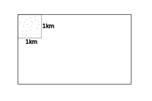
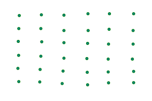
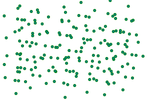
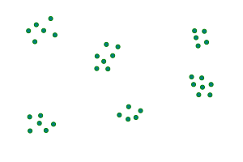

---

- [Vissza az előző oldalra](../biologia.md)
- [Vissza a főoldalra](../../../../README.md)

---

> ## Ökológia
>
> Ökológia a biológia azon része, mely élőlény és környezeténke a kapcsolata.
>
> | Szerveződési szintek |  |
> | :-- | :-- |
> |  |  |
> | **Egyed alatti** | **Egyed feletti** |
> | sejt->szövet->szerv->szervrendszer->szervezet |
> populáció->társulás->biom->bioszféra |
>
> - **Faj**: külső és belső tulajdonságaik hasonlóak egymáshoz, egymással képesek szaporodni és utódaik is szaporító képesek.
> - **Populáció**: tényleges szaporodási közösség egy helyen, térben és időben.
> - **Társulás**: együtt élő populáció pl.: erdő
> - **Biom**: társulások összessége, melyek az éghajlati övezetesség (zonalitás) miatt jön létre
> - **Bioszféra**: összes élőlény
>
> | Környezeti tényezők |  |
> | :-- | :-- |
> |  |  |
> | Abiotikus - élettelen | Biotikus - élő |
> | pl.: hőmérséklet, csapadék, fény | pl.: más élőlények |
>
> Fény: növények -fotoszintézis (szervetlenből szervest állít elő. pl.: szőlőcukor)
>
> ### Tűrőképesség
>
> 
>
> - Tágtűrésű: 
> - Szűktűrésű: 
>
> ### Populációk
>
> Tényleges szaporodási közösség.
>
> | Tulajdonságok |  |
> | :-- | :-- |
> | Egyedszám |  |
> | Ha kritikus, akkor kihalhat |  |
>
> | Térbeli eloszlás |  |
> | :-- | :-- |
> | egyenletes (ritka) |  |
> | véletlen |  |
> | felhalmozódó |  |
> | szigetszerű |  |
>
> | Életkor, koreloszlás |  |
> | :-- | :-- |
> |  |  |
> |  |  |
> | **Alakzatainak neve** |  |
> | piramis alakú |  |
> | méhkas alakú |  |
> | urna alakú |  |
>
> | Populáció egyedszáma |  |
> | :-- | :-- |
> |  |  Környezet eltartóképessége gátat szab |
>
> ### Populációk kölcsönhatása
>
> Hatások jelölése: +, -, 0
> Összes jelölés: ++, +-, +0, --, 0-, 00
>
> - ++ : együttélés, szimbiózis (pl.: pillangós virágú - bab; Nitrogén gyűjtő baktérium)
>
>    - Pl.: zuzmó
> 
>
> - +0 : Asztalközösség, kommenzalizmus
> - +- : zsákmányszervezés, predáció
> - élősködés, parazitizmus
> - -- : versengés
> - 0- : anitbiózis
> - 00 : neutralizmus
>
> ### Társulások
>
> A társulások fontos jellemzője a térbeli szerkezet. A függőleges elrendeződés a szintezettség, amely a növénypopulációk fényért való versengésének eredménye. A különböző növényzeti szintekben eltérő fényviszonyokhoz alkalmazkodott populá­ciók élnek. A fényigényes populációk hatolnak a legmagasabbra, az árnyékkedvelők pedig az alsóbb szintekben élnek. A trópusi esőerdőkben például az óriásfák po­pulációi a leginkább fényigényesek, őket követik a középső lombkoronaszint fái, valamint a ­lombsátor felső részében megtelepedő, fán lakó növények (epi­fitonok) és liánok. Az alsó lombkoronaszint fái, valamint a cserje- és a gyepszint növényei árnyéktűrők.
>
> A növénypopulációk vízszintes elrendeződése alkotja a mintázatot, amely abból adódik, hogy a populációk eloszlása nem egyenletes. A mintázat elsősorban azért alakul ki, mert a környezeti tényezők, például a talajban a víz- és a tápanyagtartalom helyenként eltérő, és a növények populációi versengenek ezekért az erő­forrá­sokért.
>
> A növénypopulációk szintezettségét és mintázatát követve, környezeti igényeiknek megfelelően és a populációk közötti kölcsönhatások által meghatározottan élnek az állatpopulációk egyedei is. A hazai tölgyesekben például az erdei vöröshangyák az avarszintben és a gyepszintben keresik táplálékukat, a keresztespók viszont a cserjeszintben és a lombkoronaszintben feszíti ki a hálóját. A madarak közül a cinegék a fák lombkoronaszintjében fészkelnek, a fülemülék pedig a cserjeszintben.
>
> #### A társulások változásai
>
> A térbeli szerkezet mellett időbeli változások is jellemzőek az életközösségekre. Az időbeli változások a populációk eltérő aktivitásával, élettevékenységével magyarázhatók. Az évszakok váltakozása miatt szabályosan bekövetkező, visszatérő állapotai a társulásoknak az aszpektusok.
>
> 
>
> A hazai erdőkben tavasszal, lombfakadás előtt virágszőnyeg borítja a talajt. Mire a fák rügyei kihajtanak, az aljnövényzet virágos növényei termést és magot érlelnek, majd föld feletti részeik elszáradnak. Lombfakadás után a gyepszintben már csak árnyéktűrő fajokat találunk. Őszre a fák és a cserjék termést érlelnek, majd a hideg elleni védekezésül lehullatják leveleiket, a költöző madarak pedig ősszel elhagyják itteni életközösségeiket.
>
> Ha a környezet tartósan egy irányban változik, akkor lassan átalakul az életközösség fajösszetétele és szerkezete is, vagyis új társulás alakul ki. Ez a természetes társulásfejlődési folyamat a szukcesszió. Az újonnan létrejövő élőhelyen elsőként kialakuló életközösséget pionír fajok jellemzik.
>
> 
>
> A változások során egymást követik a társulások, majd a szukcesszió ­folyamata a zárótársulás kialakulásával ér véget.
>
> 
> 
>
> A szukcessziós folyamatok során egyre összetettebb életközösségek követik egymást az élőhelyen. A záró­társulás az adott környezetben kialakuló legfejlettebb társulás, és általában a sokfélesége is ennek a legnagyobb.
>
> A szukcessziónak két típusát különböztetjük meg. Az elsődleges szukcesszió során olyan területen alakul ki életközösség, ahol korábban nem volt, például sziklás felszíneken. Ilyenkor az első megtelepülő, pionír fajok készítik elő a felszínt a további betelepülőknek. Jellegzetes pionírok a zuzmók, melyek zuzmósavat termelve oldják a kőzet felszínét, elősegítve a talaj kialakulását.
>
> 
>
> A másodlagos szukcesszió olyan területen zajlik, ahol korábban már volt életközösség. Ilyen lehet egy erdőtűz után maradt terület, építkezés utáni bolygatott földfelszín. Másodlagos szukcessziónak nevezzük azt is, amikor egy meglévő ökoszisztéma továbbfejlődik, például egy tó feltöltődik, vagy egy irtásrét beerdősül.
>
> |  |  |  |
> | :-- | :-- | :-- |
> |  |  |  |
>
> Mindkét esetben jellemző, hogy azok a növények jelennek meg először, melyek gyorsan nőnek, de nem túl nagyok, rövid életűek és nagyszámú szaporítóképleteik vannak. Ha a környezeti feltételek megfelelőek, akkor a szukcesszió későbbi stádiu­maiban jelennek meg a nagyobb termetű, lassan növő, de hosszabb életű fajok, melyek majd a zárótársulás tagjai lesznek.

---

- [Vissza az előző oldalra](../biologia.md)
- [Vissza a főoldalra](../../../../README.md)

---