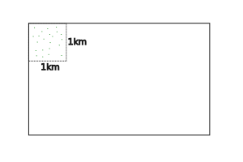
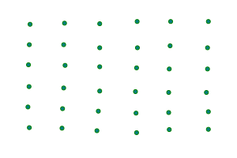
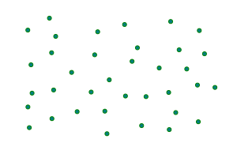
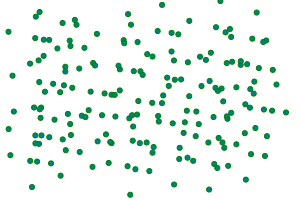
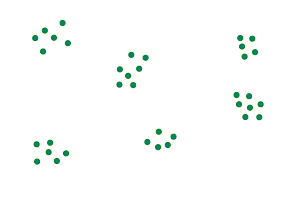

---

- [Vissza az előző oldalra](../biologia.md)
- [Vissza a főoldalra](../../../../README.md)

---

Ökológia a biológia azon része, mely élőlény és környezeténke a kapcsolata.

| Szerveződési szintek |  |
| :-- | :-- |
|  |  |
| **Egyed alatti** | **Egyed feletti** |
| sejt->szövet->szerv->szervrendszer->szervezet | populáció->társulás->biom->bioszféra |

- **Faj**: külső és belső tulajdonságaik hasonlóak egymáshoz, egymással képesek szaporodni és utódaik is szaporító képesek.
- **Populáció**: tényleges szaporodási közösség egy helyen, térben és időben.
- **Társulás**: együtt élő populáció pl.: erdő
- **Biom**: társulások összessége, melyek az éghajlati övezetesség (zonalitás) miatt jön létre
- **Bioszféra**: összes élőlény

| Környezeti tényezők |  |
| :-- | :-- |
|  |  |
| Abiotikus - élettelen | Biotikus - élő |
| pl.: hőmérséklet, csapadék, fény | pl.: más élőlények |

Fény: növények -fotoszintézis

### Populációk

Tényleges szaporodási közösség.

| Tulajdonságok |  |
| :-- | :-- |
| Egyedszám |  |
| Ha kritikus, akkor kihalhat |  |

| Térbeli eloszlás |  |
| :-- | :-- |
| egyenletes (ritka) |  |
| véletlen |  |
| felhalmozódó |  |
| szigetszerű |  |

| Életkor, koreloszlás |  |
| :-- | :-- |
|  |  |
|  |  |
| **Alakzatainak neve** |  |
| piramis alakú |  |
| méhkas alakú |  |
| urna alakú |  |

| Populáció egyedszáma |  |
| :-- | :-- |
|  |  Környezet eltartóképessége gátat szab |

### Populációk kölcsönhatása

Hatások jelölése: +, -, 0
Összes jelölés: ++, +-, +0, --, 0-, 00

- ++ : együttélés, szimbiózis (pl.: pillangós virágú - bab; Nitrogén gyűjtő baktérium)

zuzmó kép

- +0 : Asztalközösség, kommenzalizmus
- +- : zsákmányszervezés, predáció
   - élősködés, parazitizmus
- -- : versengés
- 0- : anitbiózis
- 00 : neutralizmus

---

- [Vissza az előző oldalra](../biologia.md)
- [Vissza a főoldalra](../../../../README.md)

---