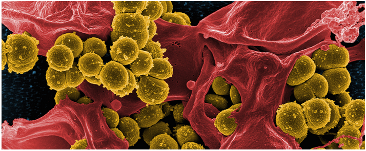
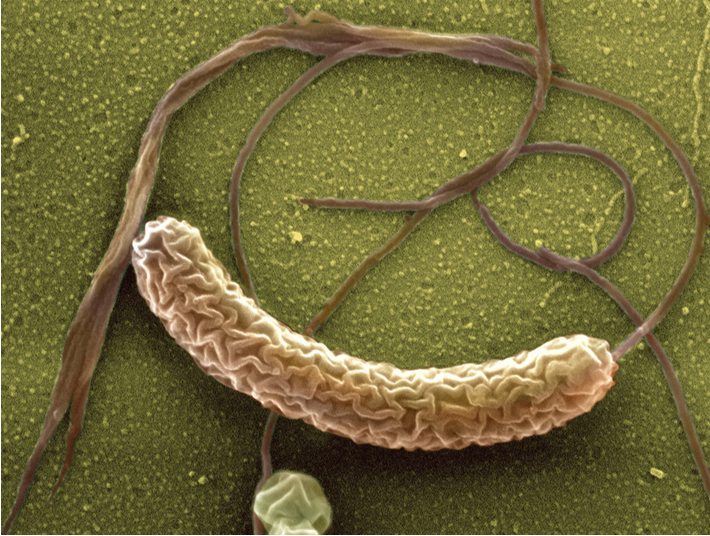
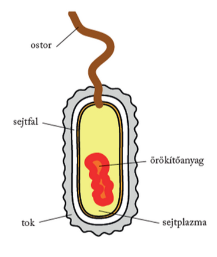
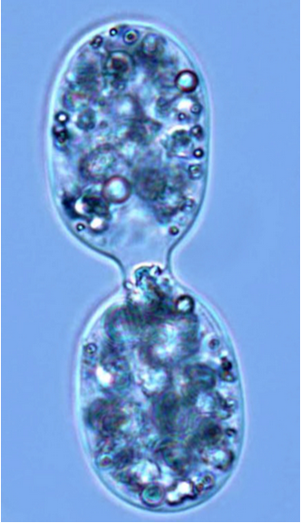

---

> # Egysejtű szerveződés, a prokarióta sejt

> ## A baktériumok eredete
>
> Az első jelzések a baktériumok létezéséről 1658-ból valók. Athanasius Kircher, Rómában élő német tudós, jezsuita páter (1602–1680) fedezte fel őket erős nagyítólencséje alatt. Arról számolt be, hogy a pestisben szenvedő betegek vérében „kis kukacokat” látott.
>
> A sejtes szerveződés legegyszerűbb formáit a baktériumokon figyelhetjük meg. Igen egyszerű felépítésűek, sejtmaggal még nem rendelkeznek, és hiányoznak a sejtszervecskéik is. Mivel még sejtmagjuk nincs, „sejtmag előtti állapotot mutató” prokarióta szervezetek. Megjelenésük körülbelül 3,5 milliárd évvel ezelőttre tehető, az ennyi idős kőzetminták közül több is őrzi az ősi baktériumok lenyomatait.
>
> A prokariótákat két nagy csoportba sorolják: ősbaktériumok és valódi baktériumok. Az ősbaktériumok szélsőséges körülmények között élnek hőforrásokban, erősen sós tavakban. Közülük a metánbaktériumok hidrogénből és szén-dioxidból energianyerés céljából metánt és vizet szintetizálnak. Korábban úgy gondolták, hogy az ősbaktériumok közé tartoztak az első élőlények, erre utal a nevük is. Ez a nézet azonban megdőlt, mivel az ősbaktériumok több tulajdonsága az eukarióta sejtekére emlékeztet.
>
> A baktériumok a leggyakrabban előforduló élőlények. Egyetlen gramm talajban például több millió található belőlük. Elterjedésüket gyors szaporodásuk és kiváló alkalmazkodóképességük tette lehetővé. Mikrométeres nagyságrendűek. Megkülönböztethetünk gömb (coccus), pálcika (bacillus), görbült (vibrio) és csavart (spirillum) alakú baktériumokat.
>
> Gömb alakú baktériumok a coccusok.
>
> 
>
> Pálcika alakú baktériumok a bacillusok.
>
> 
>
> Csavart alakú baktériumok a spirillumok.
>
> 
>
> Hajlott pálcika, azaz vibrio alakú a kolera okozója.
>
> 

> ## A baktériumok felépítése
>
> A baktériumok igen egyszerű felépítésűek.
>
> 
>
> Gyűrű alakú örökítőanyaggal rendelkeznek, amely a sejtplazmájukban helyezkedik el. A sejtplazmát vékony sejthártya, sejtmembrán burkolja. A sejthártya szoros kapcsolatban áll a baktériumot kívülről határoló sejtfallal. A falat főleg fehérjék és szénhidrátok alkotják. A sejtfal merev és vastag. Számos baktériumcsoport sejtfalát még további tok vagy nyálkás burok is védi. Egyesek csillóik segítségével aktív mozgásra képesek. Kettéosztódással szaporodnak. Kedvező körülmények között az új sejt fél órán belül újra osztódhat.
>
> 

> ## A baktériumok csoportosítása életmód szerint
>
> A baktériumok életmódjára jellemző, hogy túlnyomó többségük kész szerves anyagokkal táplálkozik, ezekből építi fel saját anyagait. Egy részük elhalt szerves anyagokat használ fel erre a célra, ezért nagy a jelentőségük a talajba kerülő növényi és állati maradványok lebontásában. Testük felépítéséhez kész szerves anyagokat (pl. fehérjéket, szénhidrátokat, zsírokat) szénforrásként felhasználó élőlényeket közös néven heterotróf élőlényeknek nevezzük. Heterotróf baktériumok az élősködő baktériumok is. Közéjük számos emberi betegséget is előidéző baktérium tartozik, mint például a tüdőbaj kórokozója. A lebontó és az élősködő baktériumok a szerves anyagokat nemcsak szénforrásként hasznosítják, hanem lebontásukból energiát is nyernek. A kémiai energiát hasznosító élőlényeket kemotróf szervezeteknek nevezzük.
>
> Más baktériumok a testük felépítéséhez egyszerű szervetlen vegyületek anyagát használják fel. A szénforrásként szén-dioxidot (hidrogénkarbonátiont) felhasználó élőlényeket közös néven autotróf szervezeteknek nevezzük. Autotróf baktériumok például a talajban élő nitrifikáló baktériumok. Ezek nitrogéntartalmú szervetlen vegyületeket oxidálnak, és az eközben felszabaduló kémiai energiát használják fel a szén-dioxid megkötésére, a szerves anyag szintézisére, vagyis kemotróf szervezetek. Az ilyen típusú anyagcsere a kemoszintézis. A kemoszintetizáló szervezetek tehát kemoautotrófok.
>
> A valódi baktériumok jelentős csoportját képezik a kékbaktériumok. A kékbaktériumok a többi baktériumtól eltérően kékeszöld színanyagokat tartalmaznak sejthártyájukban. Ezek a színanyagok olyan vegyületek, amelyek képesek a napfény energiájának a megkötésére. A fényenergiára azért van szükségük, mert ennek felhasználásával építik be a sejtjeikbe az egyszerű szervetlen anyagokat, vagyis energiaforrás szerint fototróf szervezetek. A kékbaktériumok tehát fotoautotróf szervezetek, jellemző anyagcsere-folyamatuk a fotoszintézis. Fotoszintézisük során oxigén szabadul fel és kerül a környezetbe. Az oxigént termelő baktériumok megjelenésének nagy evolúciós jelentősége volt. A légkörbe juttatott oxigén ugyanis a Nap UV-sugárzásának hatására részben ózonná alakult át. A légkör felső rétegeiben fokozatosan kialakuló ózonpajzs a továbbiakban nem engedte a földfelszínre az élőlényekre káros sugarak nagy részét, így lehetővé vált, hogy az élet kilépjen a szárazföldre.
>
> Oxigén hiányában, más szóval anaerob körülmények között a sejtek erjedéssel nyertek energiát. A légköri oxigén megjelenésével kialakulhatott az energianyerésnek egy sokkal hatékonyabb módja, megjelenhettek a sejtlégzésükhöz oxigént igénylő, aerob szervezetek. 
>
> A kékbaktériumok a talajban és a természetes vizekben egyaránt megtalálhatók. Kedvező körülmények között annyira elszaporodhatnak, hogy a vizet kékeszöld színűre festik. Ez a vízvirágzás. Főleg a víziállatoknak szolgálnak táplálékul.

> ## Hasznos és kórokozó baktériumok
>
> A baktériumok között csekély azok száma, amelyek betegséget idéznek elő, az ember egészsége szempontjából mégis igen jelentősek. Csak néhányat példaként bemutatva: ilyenek a gennykeltő baktériumok, a skarlát, a diftéria, a szamárköhögés kórokozói. A szalmonellabaktériumokkal fertőzött ételek fogyasztása súlyos bélbántalmakat idéz elő. A bélcsatornát támadja meg a kolerabaktérium is, amely rövid idő alatt rendkívüli vízveszteséget, kiszáradást okozhat.
>
> Ugyanakkor az ember igen sok baktériumfajt felhasznál különböző anyagok előállítására. Például anaerob, erjesztő tejsavbaktériumokat alkalmaz savanyú káposzta készítéséhez vagy az uborka téli tartósításához, az aludttej, a joghurtgomba készítésekor. De baktériumokat használnak az ecetgyártásban, sokféle szerves vegyület és gyógyszer előállításához is.

---