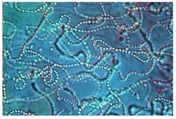
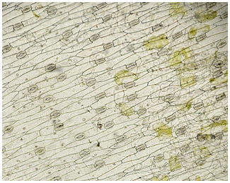
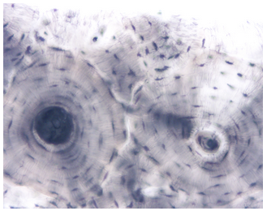
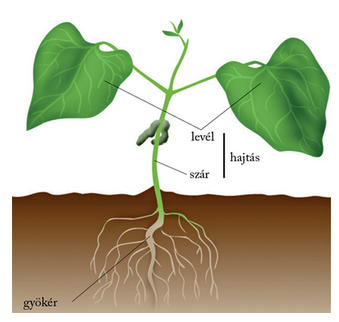
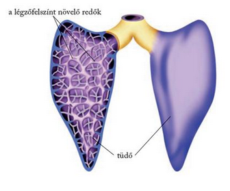
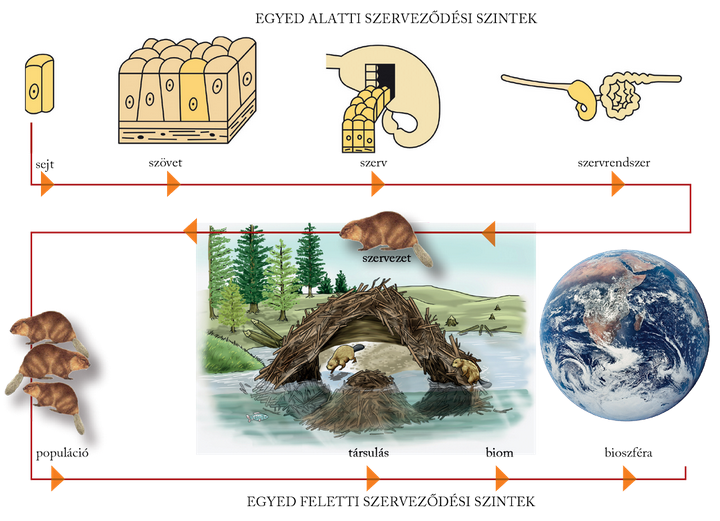

---

> # Szerveződési szintek
>
> ## A fizikai, a kémiai és a biológiai evolúció
>
> Mint láttuk, Földünk fejlődési folyamatát – még jóval az első élőlények megjelenése előtt – megelőzte az anyag fizikai, majd kémiai evolúciója. A fizikai evolúció során alakult ki a csillagközi porból a bolygónk és rajta a kémiai elemek. A kémiai evolúció során ezekből az elemekből egyszerűbb szervetlen vegyületek keletkeztek. A szervetlen vegyületekből szerves vegyületek is kialakultak. Közös jellemzőjük, hogy mindegyikük tartalmaz szenet, hidrogént és oxigént, továbbá egyesek még nitrogént is. A szerves kifejezés arra utal, hogy később ezek a vegyületek az élő anyag kialakulásában fontos szerephez jutottak, és ma is a szervezetek legfontosabb alkotói. Ilyenek a cukrok, a glicerin, a zsírsavak, az aminosavak. Az egyszerű cukrokból összetett cukrok, a zsírsavakból és glicerinből zsírok, más néven lipidek képződtek. Az aminosavakból összetett szerves vegyületek, az élethez ugyancsak nélkülözhetetlen fehérjék jöttek létre. Hasonlóan fontos szerepet töltenek be a nukleinvegyületek is, a ribonukleinsav, röviden RNS, és a dezoxiribonukleinsav, a DNS. A fehérjék és a nukleinsavak számos egyszerűbb szerves vegyületből épülnek fel, ezért különösen nagyméretű részecskék, makromolekulák.
>
> ## A szerveződési szintek
>
> A szerves vegyületekből kialakuló első sejtek mintegy 3,5 milliárd évvel ezelőtt jelenhettek meg a Földön. A sejtes szerveződés az élet legkisebb alaki és működési egysége. Hosszú időn keresztül (mintegy egymilliárd éven át) az önálló egysejtű élőlények jelentették az élet egyetlen megjelenési formáját a Földön
>
> 
>
> A működésmegosztást kialakító első soksejtűek megjelenése minőségi ugrást jelentett az élővilág evolúciójában. Az élővilág fejlődése során fokozatosan alakultak ki azok a minőségileg új szerveződési szintek, amelyek a mai élővilágra jellemzők. A szerveződési szintek hierarchikusak, ami azt jelenti, hogy minden szerveződési szint magában foglalja az összes alatta lévőt, számuk mennyiségi növekedése azonban egy új minőség megjelenését jelenti.
>
> Az együtt maradó, munkavégzésüket egymás között felosztó sejtek tovább specializálódtak, miközben az azonos működést végző sejtek megjelenésükben is közelítettek egymáshoz. Így jöttek létre a szövetek. A szövetek az azonos működést ellátó, ezért többé-kevésbé azonos alakúvá vált sejtek csoportjai. Szövet például a növények leveleinek felszínét borító bőrszövet
>
> 
>
> vagy a gerinces állatok és az ember csontszövete.
>
> 
>
> A különböző szövetek együttesei idővel egy-egy meghatározott működésű szerv kialakulását eredményezték. Szerv például a növények szára, levele
>
> hajtás 
>
> az állatok és az ember gyomra, tüdeje.
>
> 
>
> A szervek a növényvilágban elégségesnek bizonyultak a szervezetek felépítéséhez és működtetéséhez. Az állatokban azonban egy újabb szerveződési szint alakult ki, a szervek szervrendszerekbe szerveződve váltak mind hatékonyabb működésű rendszerekké. Szervrendszer például az állatok és az ember légzési szervrendszere az orrüreggel, a garattal, a légcsővel, a hörgőkkel és a tüdővel. A szervrendszerekből épülnek fel az állatok és az ember megjelenési formái, a szervezetek, az egyedek.
>
> A sejt → szövet → szerv → szervrendszer hierarchikus rendszerét egyed alatti szerveződési szinteknek nevezzük.
>
> 
>
> Az egyedek egyed feletti szintekbe szerveződve kapcsolódnak be Földünk anyagi rendszereinek forgalmába. Az egy fajhoz tartozó, egyszerre, egy időben ugyanott élő egyedek tényleges szaporodási közösségeket, populációkat képeznek egy élőhelyen. A populációk egyedekből állnak, de számos olyan tulajdonsággal rendelkeznek, amelyekkel az egyedek nem. Így például egyedszámuk, ivararányuk van. Az egy időben, egy helyen egyszerre előforduló populációk bonyolult kölcsönhatásokba kerülnek egymással. Vannak, amelyek egymással táplálkoznak vagy vetélkednek egymással a környezet erőforrásaiért, megint mások segítik egymást vagy közömbösek egymás számára. Így jönnek létre az élővilág eggyel magasabb szerveződési szintjét jelentő működési rendszerei, a társulások. A nagy kiterjedésű, zonális társulások a biomok. Végül a társulások a földi élet legmagasabb szintű szerveződését, az egységes, egyetlen bioszférát képezik. Az egyed feletti szerveződési szinteknek mint anyagi működési rendszernek a törvényszerűségeivel az ökológia foglalkozik.

---