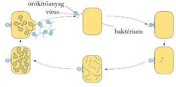
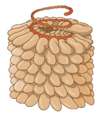
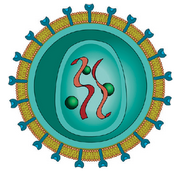
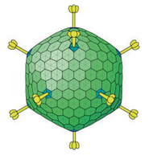
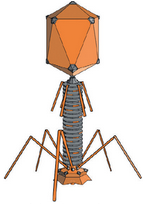
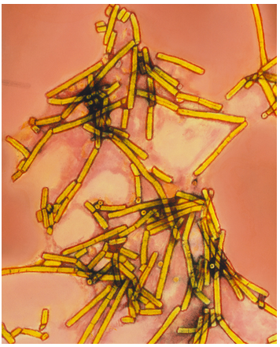
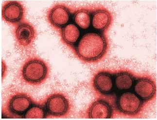
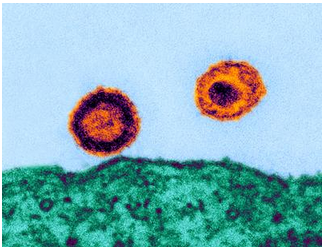

---

> # Vírusok
>
> A vírusok felépítése és jellemzői
>
> A biológiai szerveződés különleges formái a vírusok. Fő alkotórészük az örökítőanyag és az ezt körülvevő fehérjeburok, tehát nem sejtes szerkezetűek. A legtöbb vírus mást nem is tartalmaz. Eredetükre vonatkozóan több feltételezés is kialakult. Legvalószínűbbnek az látszik, hogy a vírusok különböző sejtek örökítőanyagából kiszakadt részletek, amelyek az evolúció során némi önállóságra tettek szert. Az egyszerű felépítés tehát nem jelenti a sejtes szerveződést megelőző állapotot, hanem éppen ellenkezőleg, már meglévőnek feltételezi a sejtet.
>
> A vírusok növényi, állati és emberi megbetegedéseket okoznak. Kórokozásuk alapja, hogy a gazdasejt belsejébe jutva felborítják annak biológiai egyensúlyát. Méretük nanométeres nagyságrendű, ezért csak elektronmikroszkóppal vizsgálhatók. Működésük feltétele a gazdasejt, amelyben élősködhetnek. A bejutott vírus örökítőanyaga beépül a sejtbe, és átszervezi annak működését. Arra kényszeríti, hogy saját építőanyagaiból a vírussal azonos felépítésű új vírusokat termeljen. A vírusok tehát sejtélősködők, örökítőanyaguk átprogramozza a gazdasejtet. A fertőzött sejt saját anyagait felhasználva nagyszámú vírust állít elő, végül szétesik.
>
> 
>
> A megsokszorozódást követően a vírus nyugalmi szakaszba kerül. Ilyen formában szabadul ki a gazdasejtből a környezetbe, és válik újra fertőzőképessé. A vírusfertőzés sokféle módon történhet: cseppfertőzéssel, a fertőzött élőlények közvetlen érintkezésével, testfolyadékok útján stb. A különféle környezeti tényezők (pl. hő, kémiai anyagok) hatására sok vírus elpusztul, de a megmaradtak újra képesek a fertőzésre.
>
> ## A vírusok csoportosítása
>
> A vírusok örökítőanyaga DNS és RNS is lehet. Ez a csoportosításuk egyik szempontja. Másrészt a fehérjeburkuk szerkezete szerint is osztályozhatók. Így három csoportba soroljuk őket. Az első csoport fehérjeburka spirálisan feltekeredett, ezek a helikális vírusok. A második csoportjuk a kubikális vagy köbös vírusok, ezek fehérjeburka szabályos geometriai alakban kristályosodik ki (ikozaéder, 20 egyenlő oldalú háromszög). Végül a kettős vírusok mindkét formát mutatják, ilyenek a baktériumokban élősködő vírusok, a bakteriofágok.
>
> 
> 
> 
> 
>
> ## Vírus okozta megbetegedések
>
> Az élőlények számos betegsége vírusos eredetű. A növények levelein különböző mozaikos foltosodást idéznek elő a mozaikvírusok.
>
> 
>
> Vírus okozza a szarvasmarhák száj- és körömfájás betegségét vagy például a kutyák veszettségét is. Az embert megbetegítő vírusok közül közismertek az influenzát,
>
> 
>
> a kanyarót vagy az AIDS betegséget előidézők.
>
> 
>
> A vírusok nemegyszer okoztak már több kontinensre kiterjedő világjárványokat napjainkban is. Az ellenük való védőoltások kifejlesztését nehezíti, hogy örökítőanyaguk gyakran változik, ezért különböző típusaik alakulnak ki. Az 1918-as, spanyolnátha néven ismert influenzajárványnak több mint 20 millió áldozata volt. Egy-egy vírus – pl. a kanyaróvírus – egy kisebb gyerekközösségben is felléphet járványszerűen. Az ilyen helyi járványok terjedése ellen a beteg elkülönítésével és a higiéniés szabályok betartásával védekezhetünk. A szexuális úton vagy csak testváladékokkal terjedő vírusfertőzéseknek (hepatitis B és C, AIDS) elsősorban felelős magatartással vehetjük elejét. Érdekes, hogy az első védőoltást a XVIII. század végén, a szintén hatalmas járványokat okozó himlővírus ellen alkalmazták, anélkül hogy a vírusokról bármit tudtak volna.
>
> A vírusoknál sokkal kisebb kórokozók a viroidok. Örökítőanyaguk mindig meglehetősen rövid RNS, fehérjeburkuk nincs. Főleg növényi kórokozók.
>
> Egyes betegségeket még a vírusoknál is egyszerűbb felépítésű fertőző fehérjék, a prionok okoznak. Ezek a beteg állat vagy ember idegsejtjeiben halmozódnak fel, és jellegzetes szöveti elváltozást alakítanak ki. Ilyen a szarvasmarhák kergemarhakór néven ismert betegsége, amely az agyvelő szivacsos elfajulását, leépülését, majd az állat biztos pusztulását okozza. Prionok által okozott emberi megbetegedések is ismertek, ilyen például a kuru (nevető halál).

---