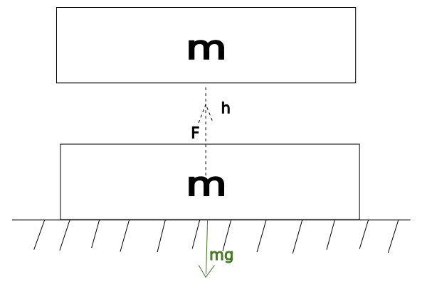

> # Munka
>
> ## A munka definíciója
>
> Az $F$ erő a testen végzett munkáján értjük az erő és a test erőirányának vett elmozdulásának szorzatát.
>
> Jele: $W$
>
> 
>
> $W=F*s^{"}$
>
> Mértékegysége: $[W]=[F]*[s^{"}]=Nm=J$
>
> ## Emelési munka
>
> $W=F*s=m*g*h$
>
> 
>
> $W_{h}=m*g*h$
> ## Gyorsítási munka
>
> $W=F*s=m*a*s$
>
> 
>
> $W_{a}=m*a*s$

> # Teljesítmény
>
> ## Teljesitmény fogalma
>
> Az $F$ erő teljesítményén értjük az erő által végzett munka és a munka idejének hányadosát.
>
> Jele: $P$
>
> Mértékegysége: $[P]=\frac{[W]}{[t]}=\frac{J}{s}=W$ (watt)
>
> $P=\frac{W}{t}$
>
> ## Teljesítmény tétele
>
> $P=\frac{W}{t}=\frac{F*s}{t}=F*v$
>
> $P=F*v$

> # Hatásfok
>
> Egy rendszer hatásfokán értjük a rendszer által felvett ősszes munkának és a rendszer által végzett hasznos munkának a hányadosát
>
> Jele: $\eta$ (éta)
>
> $0<=\eta=\frac{W_{hasznos}}{W_{összes}}<1$

> # Energia
>
> ## Energia definíciója
>
> Egy test energiáján értjük azt a munkát, amelyet a test végezne, ha megfelelő körülmények közé jutna.
>
> Jele: $E$
> 
> Mértékegysége: $J$
>
> ## Mozgás energia
>
> Jele: $E_{h}=mg*h$
>
> ## Helyzeti energia
>
> Jele: $E_{m}=\frac{1}{2}*m*v^{2}$
>
> Ezek együttes neve: mechanikai energia.
>
> Zárt rendszer mechanikai energiája állandó.
>
> ## Hőenergia
>
> Az energiamegmaradás speciális esete.