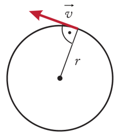
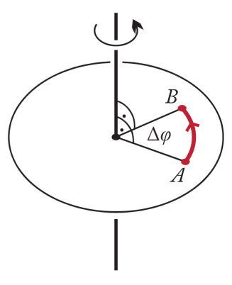

> 1. egyenletes körmozgás fogalma, jellemzői, fizikai mennyiségei
> 1. kerületi sebesség
>    - centripetális gyorsulás
>    - centripetális erő fogalma
> 1. egyenletesen változó körmozgás fogalma
> 1. szöggyorsulás
> 1. merev test fogalma
> 1. a tömegközéppont fogalma
>    - támadáspont
>    - hatásvonal
>    - erőkar
>    - forgatónyomaték
>
> ## Egyenletes körmozgás
>
> Ha a körmozgás során egy pontszerű test egyenlő időtartamok alatt egyenlő ívhosszakat fut be, akkor azt egyenletes körmozgásnak nevezzük.
> Az egyenletes körmozgást végző test kerületi sebességének nagysága állandó, iránya mindig a körpálya érintőjéba esik.
> Egyenletes körmozgás esetén a tömegpont a kör kerületén úgy mozog, hogy a befutott $\Delta i$ ívhossz és a $\Delta t$ időtartam hányadosa állandó.
> A $\frac{\Delta i}{\Delta t}$ hányadost az egyenletes körmozgást végző test kerületi sebességének nevezzük.
> - Jele: $v$
> - $v = \frac{\Delta i}{\Delta t}$
> - Mértékegysége: $\frac{m}{s}$.
>
> 

> ### Fordulatszám
>
> Az egyenletes körmozgást végző test által $\Delta t$ időtartam alatt megtett fordulatok számát ($n$) és a $\Delta t$ időtartam hányadosát fordulatszámnak nevezzük.
> - Jele: $f$
> $f = \frac{n}{\Delta t}$
> - Mértékegysége: $\frac{1}{s}$.
>
> A körmozgást végző test egyetlen fordulatot tesz meg, ekkor $\Delta t = T$ és $n = 1$, ezért a fordulatszámra érvényes összefüggés:
>
> $f = \frac{n}{\Delta t} = \frac{1}{T}$ azaz $f = \frac{1}{T}$
>
> Az egyenletes körmozgás esetén a periódus idő és a fordulatszám egymás reciproka.
>
> A kerületi sebesség is kifejezhető a fordulatszámmal:
>
> $v = \frac{2r * \pi}{T} = 2r * \pi * f$

> ## Szögsebesség
>
> Az egyenletes körmozgást végző test $\Delta t$ idő alatti szögelfordulásának és a $\Delta t$ időtartam hányadosát szögsebességnek nevezzük.
> - Jele: $\omega$
> - $\omega = \frac{\Delta \varphi}\Delta t$
> - Mértékegysége: $\frac{1}{s}$.
>
> 
>
> A szög nagyságát **radián**ban adjuk meg.
> A **radián** (ívmérték) a szögszárak közé eső ív hosszának és a körív sugarának a hányadosa.
> Egy teljes körülfordulás:
> - $\frac{2r * \pi}{r} = 2 \pi$ radiánban mért szög elfordulás
> - $90˚$-nak $\frac{\pi}{2}$ és $30˚$-nak $\frac{\pi}{6}$ radiánban mért szögelfordulás felel meg.
>
> A körmozgást végző test egyetlen fordulatot tesz meg, ekkor $\Delta t = T$, $\Delta \varphi = 2\pi$.
> A szögsebesség képletébe behelyettesítve:
> - $\omega = \frac{\Delta\varphi}{\Delta t} = \frac{2\pi}{T}$
> - $\omega = \frac{2\pi}{T}$
>
> ### A szögsebesség és a kerületi sebesség kapcsolata
>
> Egy $r$ sugarú körpályán mozgó pontszerű test $T$ periódusidővel egyeneltes körmozgást végez, akkor szögsebessége: $\omega = \frac{2\pi}{T}, így
>
> $v = \frac{2r * \pi}{T} = \frac{2\pi}{T} * r$
> $\omega = \frac{2\pi}{T}
>
> ==>>
>
> $v = \omega * r$
>
> Az egyenletes körmozgás sebessége egyenlő az egyemneltes körmozgást végző test szögsebességének és a körpálya sugarának szorzatával.

> ## Centripetális gyorsulás
>
> Az egyenletes körmozgást végző test állandó sebességgel halad, de irány folyamatosan változik. A sebesség iránya minden pillanatban merőleges az adott pontot a kör középpontjával összekötő sugárra. Mivel a sebességvektor folyamatosan változik, a sebességváltozás miatt a testnek van gyorsulása.
>
> 
>
> A körmozgás esetén a gyorsulás iránya merőleges a sebességre. A sebesség éritő irányú, így a gyorsulás a kör középpontja felé mutat. Az egyeneletes körmozgás gyorsulását iránya alapján **centripetális gyorsulás**nak nevezzük.
> - jele: $\vec a_{cp}$
> - $a_{cp} = \frac{v^{2}}{r}$
>
> más alakban:
>
> - $a_{cp} = \frac{v^{2}}{r} = \frac{(r * \omega)^{2}}{r} = r * \omega^{2}$
> - $a_{cp} = \frac{v^{2}}{r} = v \frac{v}{r} = v * \omega$
>
> A körmozgás fenntartásához eredő erő a test tömegének és a centripetális gyorsulásnak szorzata.
>
> A körmozgás létrejöttének dinamikai feltétele, hogy a testre ható erők eredője a kör középpontja felé mutasson, nagysága pedig állandó legyen.
>
> Ezt az eredő erőt centriőetális erőnek nevezzük.
> - jele: $F_{cp}$
> - $F_{cp} = m * a_{cp}$