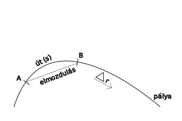

---

- [Vissza az előző oldalra](../fizika.md)
- [Vissza a főoldalra](../../../../README.md)

---

A fizikai jelenségket fizikai mennyiségek segítségével írjuk le.

- súrlódási erő
- gravitációs erő
- villámlás
- áramerősség

Ha számot tudsz hozzárendelni, akkor mennyiség.

Minden fizikai mennyiségnek van jele.

Minden fizikai erőt fizikai mennyiséggel jellemzünk.
Nem minden fizikai mennyiségnek van mértékegysége.

| Fizikai mennyiségek csoportosítása |  |
| :-- | :-- |
| Vektor mennyiségek | Skalár mennyiségek |
| vektor mennyiségek, azok a fizikai mennyiségek, amelyeket két adat jellemez: nagyság, irány vonatos példa | azok a fizikai mennyiségek, melyeket egy adat jellemez: nagyság pl.: tömeg, térfogat, idő |

## Kinematika (mozgástan)

alapfogalmak:
&nbsp;vonatkoztatási rendszer, olyan derékszögű koordináta rendszer, amely minden valami anyagi objektumhoz van hozárendelve.

## Pálya

A pálya (nem csak anyagi pontok halamaza)
&nbsp;azon geometriai pontok halamaza, amelyeket a test mozgása során érintett, érint vagy érinteni fog.
- egyenes
- kör
- elipszis
- parabola (kúpmetszetek)

- [s] = m
- [$\Delta$r] = m

A pálya mérhető részét útnak nevezzük.
A kezdőpontot a végponttal összektötő szakasz az elmozdulás.

---

- [Vissza az előző oldalra](../fizika.md)
- [Vissza a főoldalra](../../../../README.md)

---