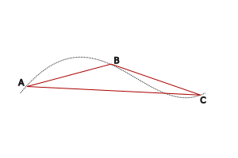

---

### Mozgás

A testek egymáshoz viszonytott helyváltoztatása.
Egy test mozgásáról akkor tudunk érdemben valamit mondani, ha tudjuk, hogy mihez viszonyítjuk a mozgást.
Azt a testet, melyhez a vizsgált test mozgását viszonyítjuk, **vonatkoztatási test**nek nevezzük.A testek mozgásáról csak úgytudunk egyértelműen beszélni, ha meg tudjuk mondani, hogy melyik másik testhez viszonyított mozgásról vagy nyugalomról beszélünk.
A mozgást a földfelszínhez rögzített valamilyen testhez viszonyítjuk.
Ha a vonatkoztatási rendszer megnevezése nélkül beszélünk mozgásról, akkor a földfelszínhez kötött vonatkozási rendszerben írjuk le a mozgást.
A vonatkozatási rendszer megválaszátsa azért fontos, mert így nem csak azt állapíthatjuk meg, hogy a test mozog, hanem azt is, hogy milyen mozgást végez.
A mozgás pályája az a vonal, amely mentén a test mozog.
   - az út jele: s
A mozgás jellemzéséhez nélkülözhetetlen adat az az **idő**, amely alatt a mozgás történik.
   - Jele: t
Egy test mozgásának kezdőpontjából kiinduló és a végpontjába mutató irányított egyenes szakaszt a **test elmozulásá**nak nevezzük.

Az elmozdulás ismeretéhez hozzátartozik az elmozdulás nagysága és az irány ismerete (mérőszám és mértékegység).
Az ilyen mennyiségeket **vektormennyiség**nek, röviden **vetor**nak nevezzük.
Az elmozdulás tehát **vektor**.
Az ábrán az $AB$ és $BC$ vektorok vannak ábrázolva. A két elmozdulás együtt az $AC$ elmozdulást eredményezi. Tehát $AB$ és $BC$ vektorok eredője az $AC$ vektor.
  - $AB + BC = AC$
Az $AB$ és $BC$ vektorokat összetevőnek nevezzük.
A vektorok összeadását, vagyis eredőjük előállítását így végezzük el:
   1. irány és nagyság szerint megrajzoljuk az egyik vektort,
   1. ennek végpontjából irány és nagyság szerint felmérjük a másik vektort,
   1. az eredőt (**összegvektort**) úgy kapjuk meg, hogy megrajzoljuk az első összetevő kezdőpontjából a második végpontjába mutató vektort.