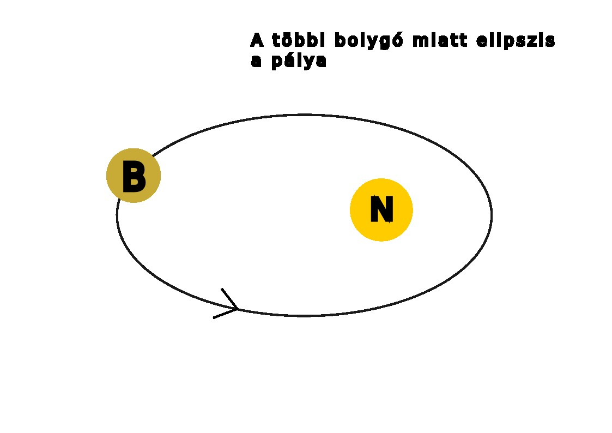
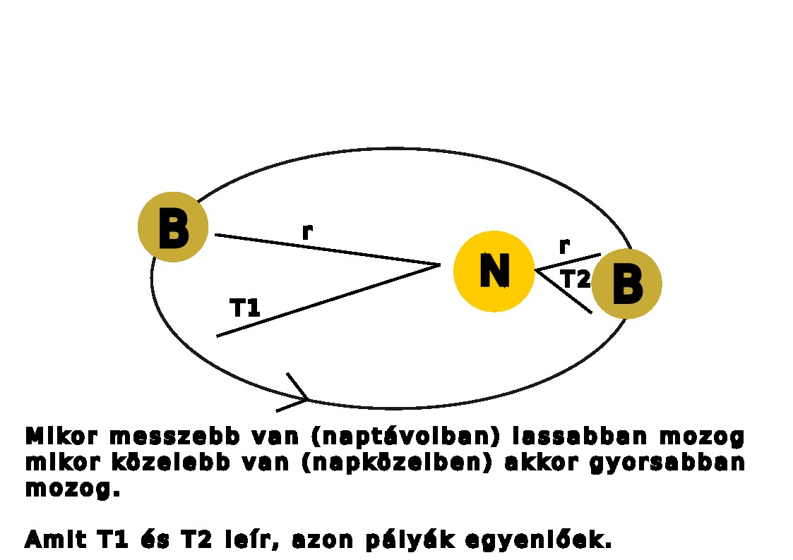
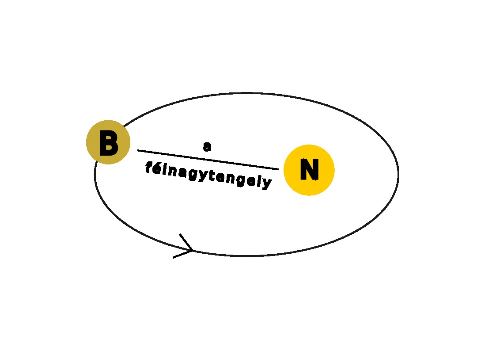

---

2.óra A világképek fejlődése a kezdetektől a napjainkig

---

> **Ókor**
> - Geocentrikus világkép.
> - Stonehendge: kr.e. 2600 csillagvizsgáló maradványa
> - Arisztarkhosz: Nap - Hold távolságának meghatározása
> - Eratoszthenész: Földünk méreteinek kiszámítása
> - Ptolemaiosz: geocentrikus világkép
> - Középkor: heliocentrikus világkép - Kopernikusz
> - Magellán: Föld körbehajózása - gömbalak bizonyítéka
> - Giordano Bruno: Napunk egy csillag a többi között- máglyán végezte ezért a nézetéért
> - Újkor: Galilei - az első tácsöves megfigyelő
> - Kepler: bolygók mozgástörvényeit írta le
> - Newton: tömegvonzás vagy gravitáció törvénye
> - Mai világképünk: Világegyetemünk térben és időben végtelennek tekinthető.
> - Felépítése: Naprendszer - Tejútrendszer - Metagalaxis - Világegyetem (univerzum)

> **Az űrkutatás rövid kronológiája**
> - 1957: szovjet Szputnyik - az első mesterséges hold
> - 1961: Jurij Gagarin - az első ember, aki megkerüli a földet űrhjóval
> - 1962: John Glenn - is Föld körüli pályán
> - 1969: Holdra lépés - Neil Armstrong és Buzz Aldrin
> - 1971: első űrállomás (Szaljut) Föld körüli pályán
> - 1975: közös szovjet-amerikai űrrepülés - Apollo és Szojuz összekapcsolása
> - 1980: magyar űrhajósunk - Farkas Bertalan
> - 1986: MIR űrállomás felbocsátása
> - 1990: Hubble űrteleszkóp üzembe állítása
> - 1997: Pathfinder marsjáró fotókat küld a vörös bolygóról
> - 1998: a Nemzetközi Űrállomás építésének kezdete
> - 2001: 15év után "leszedik" a MIR űrállomást - az első civil (Dennis Tito) az űrben - elkezdik a munkát az épülő, új űrállomáson
> - 2004 - 2005: kutató űrszonda (Mars Expressz) a Mars fölött, űrjárművek (Spirit, Opportunity) vizsgálják a bolygó felszínét
> - 2007: Charles Simonyi űrturista a Nemzetközi Űrállomáson
> - 2008: a Phoneix űrszonda víz után kutat a Marson
> - 2009: Kepler űrtávcső felbocsájtása
> - 2011: intenzíven kutatják az exobolygókat (idegen csillag körül mozgó bolygó) hazánkban is
> - 2012: Kína űrállomást épít - leszállt a Curiosity a Marsra és víz jelenlétét mutatta ki fúrásmintában 2013-ban
> - 2014: meteoritot talált a Curiosity. A Rosetta űrszonda 2014 őszétől vizsgálja a Csurjumov-Geraszimenko üstököst, amelyből vízpára és por lövell ki
> - 2015: a Plútó, Hydra nevű holdját vizsgálja a New Horisons
> - 2016: Kína Föld körüli pályára állított egy kísérleti űrállomást

> ### Érdekesség
> Elon Musk (rakéta)sprotauója az űrben. A SpaceX lőtte ki a piros Tesla Roadstere-t 2018 év elején. Égitestként szerepel a NASA adatbázisában.

> Curiosity: nedves törmelékbe fúrt 6cm mélyen a Marson, önmagát navigálja a terepen, 2000˚C-ot bír a hővédő pajzsa, saját facebook profilja van. **ÉRDEMES MEGNÉZNI**: [Curiosity on Mars](https://de-de.facebook.com/MarsCuriosity/)

---

Törvények, számítások

---

> | Kepler - törvényei |  |
> | :-- | :-- |
> | I. minden bolygó olyan elipszis alakú pályán kering, amelynek az egyik gyújtópontjában a nap helyezkedik el. |  |
> | II. a bolygótól a napig húzott vezérsugár, egyenlő idők alatt egyenlő területeket súrol. |  |
> | III. a bolygók keringési idejének négyzetei úgy aránylanak egymáshoz, mint fél nagytengelyeik köbei.  $\frac{T1^{2}}{T2^{2}} = \frac{a1^{3}}{a2^{3}}$ |  |
>

> Mars keringési ideje:
>
> - $T1$ = Mars
> - $T2$ = Föld
>
> - $\frac{T1^{2}}{T2^{2}} = \frac{a1^{3}}{a2^{3}} = \frac{T1^{2}}{365^{2}} = \frac{228^{3millió}}{150^{3millió}} = \frac{11852352}{3375000} = 3.5$
>
> $365^{2} = 133225 * 3.5 = \sqrt{466287.5} = 683 nap$

> **Newton** - tömegvonzás törvénye:
> - a tömegvonzás egyenesen arányos a testek tömegével, fordítottan viszont a közöttük lévő távolság négyzetével.
>
> $F = G * \frac{m1*m2}{v^2}$
>
> példa:
>
> tanár: 70kg
> diák: 60kg
> távolság köztük: 3.5m
> 
> $\frac{70*60}{3.5^{2}} = \frac{4200}{12.25} = 342.8 \frac{Nm^{2}}{Kg^{2}}$

---

A Tejútrendszer, a Naprendszer és a Nap

---

> ### Tejútrendszer (Galaxis, The milky way):
> Oldalnézetben, mint két egymásra rakott mélytányér, átmérője 100ezer fényév, felülnézetben spirál, óramutató járásával ellentétes forgás.
> 
> Alkotórészei:
> - mag-kb.: 1013-on csillag, csillagközi anyag.
> ### Fogalmak 

---

---

[Vissza](../../../README.md)

---
