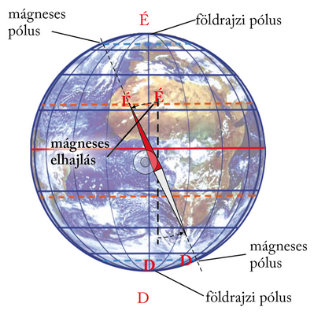
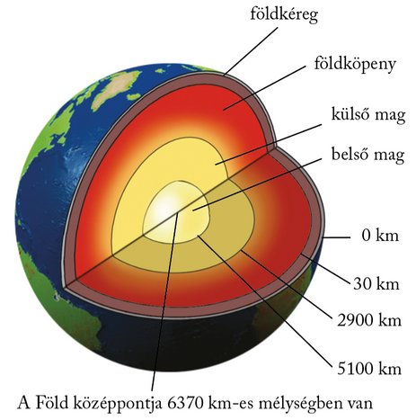
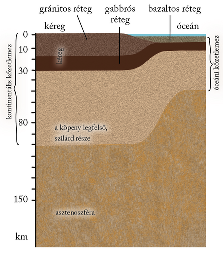
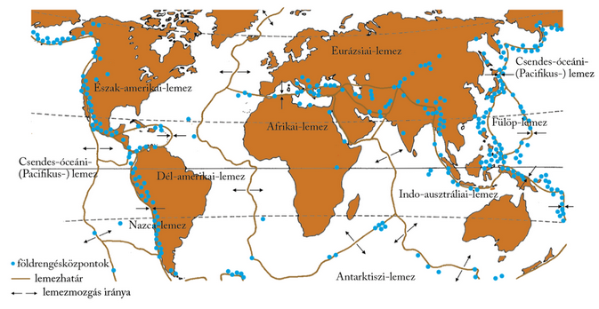

---

> # A Föld belső szerkezete

> ### A Föld gömbhéjai
>
> A Föld fejlődésének kezdetén, a folyamatos hűlés során az anyagok sűrűségük szerint rétegekbe rendeződtek. Ezek a rétegek képezik a Föld belső gömbhéjait, amelyek halmazállapotuk, anyagösszetételük, hőmérsékletük és sűrűségük alapján eltérnek egymástól.
>
> A felszínen és a felszín fölött kialakult külső gömbhéjak a vízburok (hidroszféra), a légkör (atmoszféra), a talaj (pedoszféra) és az ezek metszetében kifejlődött élővilág (bioszféra).
>
> A külső és a belső gömbhéjak között a kőzetburok jelenti a kapcsolatot. A szilárd kőzetburok anyaga részben a Föld belsejéből származik, belőle pedig a talaj épül fel. A felszínen a gömbhéjak szoros kölcsönhatásban állnak egymással.

> ### A Föld belső hője
>
> A mélység felé haladva nő a hőmérséklet. A hőmérséklet-növekedés, a geotermikus gradiens átlagértéke 100 méterenként 3 °C. Földünk ma is változó, aktív területein a geotermikus gradiens ér†éke jóval gyorsabban nő, a Föld idős vidékein viszont sokkal lassabban. A Nápoly melletti vulkán, a Vezúv környékén ez az érték kb. 14 °C/100 m. Az átlagosnál gyorsabban növekszik a hőmérséklet például Budapesten, a budai hévforrások vonalában is (6–8 °C/100 m).
>
> Amit mi a Föld felszínétől számítva hőmérsékletnövekedésnek értelmezünk, valójában pontosan fordított folyamat: a Föld belsejéből érkező hő fokozatos csökkenése bolygónk felszíne felé közeledve. Jelenlegi ismereteink szerint a belső hő radioaktív anyagok (pl. urán, tórium) bomlásából származik.
>
> A Föld belső hője, a geotermikus energia nemcsak a termálvizek melegét adja, hőenergiáját fel lehet használni fűtésre és elektromos áram előállítására is. A geotermikus erőművek alkalmazásában élen jár Izland, ahol az összes elektromos energia több mint 10%-a a Föld belső hőjének felhasználásából ered.

> ### Nyomás és sűrűség a Föld belsejében
>
> A mélyben uralkodó körülményeket azért is nehéz elképzelnünk, mivel a Föld gyomrában – természetesen – más nyomás- és sűrűségviszonyok jellemzőek. A Föld a forgás és a lehűlés hatására a sűrűség szerint rendeződött gömbhéjakba. A nyomás a mélység függvényében majdnem egyenletesen növekszik, és a Föld középpontjában eléri a felszíni nyomás 4000-szeresét. A sűrűség növekedése ezzel szemben hirtelen változásokat mutat.

> ### A mágneses mező
>
> Bolygónkat mágneses tér veszi körül. A mágneses teret a Föld belsejében több ezer kilométer mélyen rejlő vastartalmú fémolvadékok áramlásai keltik. Ezeket az anyagokat pedig éppen a Föld forgása és belső hője tartja mozgásban. A Föld mágnestengelyének felszíni döféspontja, a mágneses pólus, nem esik egybe a Föld forgástengelyének felszíni döféspontjával, a csillagászati pólussal. Az iránytűvel meghatározott észak–déli irány tehát eltér a földrajzi észak–déli iránytól. Ez az eltérés a mágneses deklináció (mágneses elhajlás).
>
> 
>
> A Föld belső áramlásainak változásai miatt a mágneses tér, és így a mágneses pólusok helyzete is változik. A mágnesezhető anyagokat tartalmazó kőzetek – mint megannyi perdöntő ujjlenyomat – megőrzik a keletkezésük idején uralkodó mágneses irányt. Ebből tudjuk, hogy a földtörténet során a mágneses tér erőssége és iránya is többször változott. Sőt gyakran a mágneses sarkok is felcserélődtek. Az egykori mágnesezettséget földtörténeti események korának meghatározására lehet felhasználni.

> ### Utazás a Föld középpontja felé
>
> A 20. század elején fedezték fel, hogy a Földet átszelő földrengéshullámok bizonyos mélységekben részben megváltoztatják sebességüket, mintha más anyagba, más közegbe kerülnének. Ott húzódnak a belső gömbhéjak határai. A fizikai jellemzők változásai alapján bolygónk belsejét négy eltérő gömbhéjra oszthatjuk.
>
> A legkülső réteg a földkéreg, mely a szárazföldek és az óceánok alatt különböző összetételű és vastagságú. A szárazföldi kéreg igen bonyolult szerkezetű, és a Föld különböző területein eltérő felépítésű. Általában azonban két jellegzetes rétegből áll. A szárazföldi kéreg felső része szilikátokban (a kéreg két leggyakoribb elemének, a szilíciumnak (Si) és az oxigénnek (O2) egymással és más anyagokkal egyesülő változataiban) igen gazdag. Jellegzetes kőzete alapján ezt a réteget gránitos kéregnek nevezzük (sűrűsége 2,7 g/cm3). Alatta szilikátokban már szegényebb, fémekben viszont gazdagabb réteg helyezkedik el (sűrűsége természetesen nagyobb, 3,0 g/cm3). Jellemző kőzete után kapta a gabbrós kéreg nevet. A szárazföldi kéreg átlagosan 35–40 km vastag, de ahol nagy terheket hordoz – például hegységek alatt –, vastagsága 70–90 km is lehet.
>
> Az óceáni kéreg egyszerűbb szerkezetű, és Földünk összes óceánja alatt azonos felépítésű. Az óceáni kéreg mindenütt két részből áll. A felső, ún. bazaltos réteget finomabb, az alsó, gabbrós réteget pedig hasonló összetételű, de durvább, szemcsésebb anyag alkotja. Az óceánok alatt a kéreg vastagsága mindössze 7–11 km.
>
> 
>
> A földköpeny nagyjából 2900 km mélységig tart. Vegyi összetételét tekintve lefelé haladva fokozatosan tovább csökken a könnyebb, szilikátos anyagok, és nő a nehezebb, fémes elegyrészek (pl. vas, magnézium) aránya.
>
> A köpeny a legvastagabb gömbhéj. Két részre osztható: alsó és felső köpenyre. A felső köpenyben 100 és 250 km között húzódik egy képlékeny zóna, az asztenoszféra (más néven lágyköpeny). Ez forró, áramló kőzetolvadék, amelyen a köpeny legfelső, szilárd része úszik. A magot körülvevő alsó köpeny szilárd halmazállapotú.
>
> A külső magot maghéjnak is hívják. Ez a „héj” azonban mintegy 1800–2200 km vastag. Anyaga folyékony fémekből (pl. vasból, nikkelből) áll.
>
> A külső és a belső mag határát a kutatók 4700 és 5100 km között húzzák meg. A határfelület pontos mélysége tehát bizonytalan, a kutatók azonban abban egyetértenek, hogy a Föld legbelső tartománya szilárd anyagból, vasból és nikkelből áll.

> ### A kőzetburok
>
> Napjainkra bebizonyosodott, hogy a Föld külső szilárd burka vastagabb, mint csupán a kéreg, és magába foglalja a köpeny legfelső részét is. A földkéreg és a földköpeny legfelső szilárd része együtt alkotja a kőzetburkot, a litoszférát. A kőzetburok – a földkéreghez hasonlóan – vastagabb a szárazföldek (70–100 km), mint az óceánok (kb. 50 km) területén.
>
> 
>
> A kisebb sűrűségű litoszféra úszik a nagyobb sűrűségű, képlékeny köpenyen. A kontinensek alatt a kőzetburok jóval vastagabb, mint az óceánok alatt. A szárazföldek – mint jéghegyek a tengerben – tömegüktől függően eltérő mélységben merülnek a köpeny anyagába. Az egyensúlyi helyzet a hegységképződéssel látszólag megbomlik, hiszen például a gyűrt, takarós szerkezetek kialakulásakor a kőzetburok fokozatosan megvastagodik.
>
> A megbomlott egyensúly a hegységek kiemelkedése során helyreáll. Ugyanaz játszódik le, mint amikor a hajókat megrakják áruval. A kiemelkedés során végül is az érintett kéregrész a takaróvastagodásnak csak töredékével lesz magasabb, mivel sokkal erősebben belemerül a köpenybe. Így például, ha 2000 m vastag takaró tolódik rá egy kéregrészre, a kőzetburok 1600 m-rel mélyebben merül a köpenybe, vagyis a felszín csak 400 m-rel lesz magasabb.

> ### A kőzetburok lemezei
>
> Ma már tudjuk, hogy a litoszféra nem egységes héj, hanem több, egymás melletti kőzetlemezből áll. A Föld felszínét hét nagy (Eurázsiai-, Észak-amerikai-, Csendes-óceáni-, Dél-amerikai-, Afrikai-, Indoausztráliai- és Antarktiszi-) és több kisebb (pl. Arab-, Fülöp-, Nazca-, Karibi-) kőzetlemezre osztjuk.
>
> 
>
> A lemezek közül néhány csak óceáni területet (pl. a Csendes-óceáni- vagy a Nazca-lemez), néhány viszont óceáni és szárazföldi területet (pl. az Eurázsiai-lemez) is hordoz a hátán. A lemezhatárok tenger alatt, tenger és szárazföld találkozása közelében és szárazföldek belsejében is húzódhatnak.
>
> A lemezek folyamatos mozgásban vannak. Mozgásukat a lágyköpeny, az asztenoszféra áramlásai irányítják. A kőzetlemezek egymáshoz képest háromféle mozgást végeznek: közelednek egymáshoz, távolodnak egymástól, vagy ritkább esetben elcsúsznak egymás mellett.

---