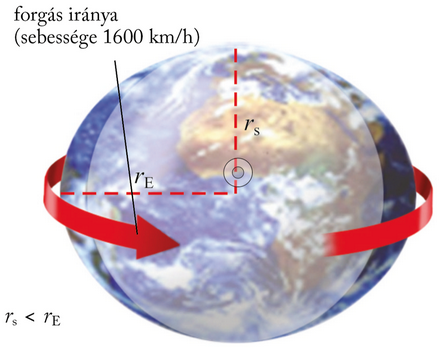
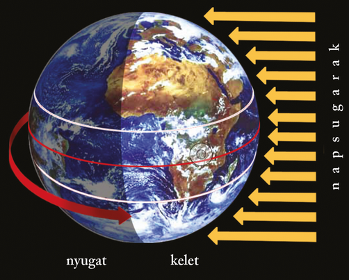
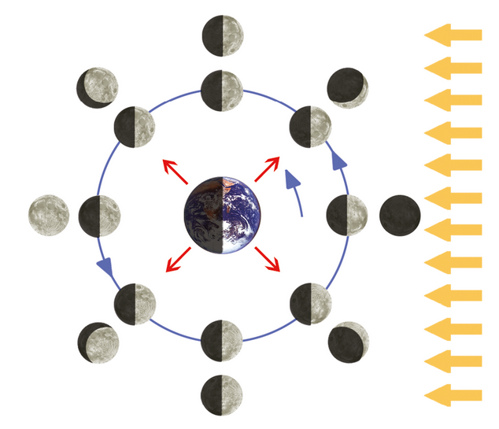

---

> # A Föld és a Hold

> ### A Föld alakja
>
> A Föld saját tengelye körül forog. A forgás következtében fellépő centrifugális erő hatására bolygónk az Egyenlítő mentén megnyúlt, kidudorodott. Emiatt a Föld egyenlítői sugara (6378 km) nagyobb, mint a sarki sugara, vagyis az Északi- és Déli-sarkot összekötő szakasz fele (6357 km). (A Földdel azonos felületű gömb sugara 6371 km lenne.) Mivel bolygónk tömegeloszlása egyenlőtlen, a Föld valódi alakját az a szintfelület rajzolja ki, amely minden pontban merőleges a nehézségi erő irányára. Ezt a szintfelületet geoidnak, földalaknak nevezzük. Földünk gömbhöz hasonlító alakjának egyik legfontosabb következménye az éghajlati övezetek és övek kialakulása.
>
> 

> ### A Föld mozgásai
>
> A Föld egyrészt forog saját tengelye körül, másrészt kering a Nap körül.
>
> #### A Föld ten­gely kö­rü­li for­gá­sa
>
> A Föld képzelt forgástengelyének felszíni döféspontjai az Északi- és a Déli-sark. E tengely körül a Föld 24 óra alatt tesz meg egy teljes fordulatot. Az Északi-sark felől szemlélve a Föld nyugatról keletre, vagyis az óramutató járásával ellentétes irányban forog.
>
> 

> ### A Föld forgása az oka az éjszakák és nappalok (a napszakok) váltakozásának.
>
> A nappalok és éjszakák váltakozása az ember napi életének ritmusát is meghatározza. A megvilágítás mindennapos változása magával vonja az időjárás elemeinek napi alakulását. A Föld forgása a szeleket, tengeráramlásokat is kitéríti eredeti irányukból.
>
> #### A Föld Nap körüli keringése
>
> A Föld a Nap körül ellipszis alakú pályán kering, amelynek egyik gyújtópontjában áll a Nap – tanítja Kepler első törvénye. A keringés időtartama – kerekítve – 365 és 1/4 nap.
>
> A keringési pályasík, az ekliptika nem esik egybe a földi Egyenlítő síkjával. A két sík által bezárt szög nagysága 23,5°. Ezt a síkbeli eltérést nevezzük – az Egyenlítőt alapul véve – az ekliptika ferdeségének. Értéke megegyezik az ekliptikára merőleges sík és a Föld forgástengelye által bezárt szög, a forgástengely ferdeségének szögével.
>
> A Nap körüli keringés és a mindig egy irányba mutató ferde forgástengely miatt ugyanazon a szélességi kör mentén egy év alatt változik a napsugarak hajlásszöge. Ennek következménye az évszakok váltakozása.

> ### Nap-éj egyenlőségek, napfordulók
>
> Az évszakok váltakozása szempontjából fontosak azok a napok, amikor a Nap a nevezetes szélességi körök – az Egyenlítő, illetve a Rák- és a Baktérítő – fölött delel 90°-ban. E napok ugyanis az évszakok csillagászati kezdőnapját jelentik. A Nap az év folyamán kétszer delel 90°-ban az Egyenlítő fölött: március 20-án és szeptember 22-én. E két napon a nappal és az éjszaka a Föld minden pontján 12-12 óráig tart. Ezért e két időpontot nap-éj egyenlőségnek nevezzük. (E napokon kezdődik az északi és déli félgömbön a csillagászati tavasz, illetve ősz.) A Nap június 21-én delel 90°-ban a Ráktérítő és december 21-én a Baktérítő fölött. Mivel e két napon következik be az irányváltoztató fordulat a Nap látszólagos évi járásában, ezért ezeket napfordulónak nevezzük (félgömbönként nyári, illetve téli napfordulónak). A nevezetes napok időnként más dátumokra esnek.)
>
> 

> ### A Föld holdja
>
> A 3476 km átmérőjű Hold ellipszis alakú pályán kering a Föld, potosabban a Föld és a Hold közös tömegközéppontja körül. Ez a tömegközéppont a Föld mintegy nyolcvanszor nagyobb tömege miatt a Föld belsejében található. A közepes Hold–Föld-távolság 384 000 km. A Hold keringési ideje megegyezik tengelyforgásának idejével (27,3 nap). Emiatt a Hold mindig ugyanazt az oldalát fordítja a Föld felé.
>
> A Hold egyenetlen felszíneit tagoló, 10 km magasságig is felemelkedő hegységgyűrűk és a számtalan vulkáni kráterhez hasonló felszínforma legnagyobb része meteoritbecsapódások következménye.
>
> A Holdon nincs élet, ezt a levegő és a víz hiányán túl az igen nagy hőmérsékletingás is lehetetlenné teszi (a napos oldalon +130, az árnyékos részeken –150 °C is lehet a hőmérséklet).
>
> A Holdnak nincs saját fénye, csupán a Napról visszavert fénnyel világít. Fényessége a holdfázisok szerint változik. Holdfázisnak nevezzük a Föld körüli keringéshez kapcsolódó fényváltozásokat. Újholdkor sötét éjszakára számíthatunk, mivel a Hold ilyenkor nem látható. Az első negyedben a látható holdsarló egyre jobban növekszik, „dagad”, majd holdtöltekor az egész holdkorong láthatóvá válik. A negyedik holdfázis, az utolsó negyed során a Hold ismét fogy, „csökken”. (Az első negyedben „dagadó” Holdat könnyen megjegyezhetjük D betű alakjáról, az utolsó negyedben lévőt, amikor „csökken”, pedig a C betű alakról!) Két azonos holdfázis (pl. két újhold) között 29 és 1/3 nap telik el.
>
> A Hold a legközelebbi égitest, Földünk mellékbolygója. A Hold átmérője 1/4 földnyi, tömege a Föld tömegének 80-ad része. A tömegvonzás a Holdon mindössze hatoda a földinek.
>
> A Hold két fő mozgást végez: forog a tengelye körül és kering a Föld körül. (Harmadik mozgása: a Földdel együtt kering a Nap körül.)
>
> 

> ### Napfogyatkozás − holdfogyatkozás
>
> A Földet és a Holdat a Nap világítja meg. Ha a három égitest egy vonalba, és így a Föld vagy a Hold egymás árnyékába kerül, fogyatkozások jönnek létre. A valaha babonás félelmet keltő fogyatkozások idejét pontosan ki lehet számítani.
>
> Újholdkor előfordulhat, hogy a Hold eltakarja a Napot, és árnyéka rávetődik a Földre. Ekkor áll be a napfogyatkozás. A Föld egy részén a Hold teljes árnyékában teljes napfogyatkozás, körülötte a Hold félárnyékában részleges napfogyatkozás lép fel.
>
> Holdtöltekor viszont a Föld vethet árnyékot a Holdra. Ez a holdfogyatkozás, amely szintén lehet teljes és részleges.
>
> Ha a Nap, a Föld és a Hold egy síkban keringene, akkor a fogyatkozások minden hónapban megtörténnének. A  Hold és a Föld pályája azonban 5 fokos szöget zár be egymással, ezért csak ritkán kerül erre sor.

---