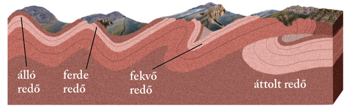
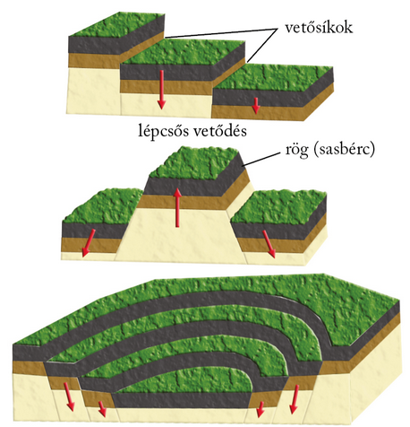
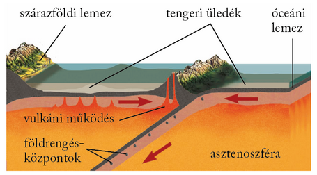
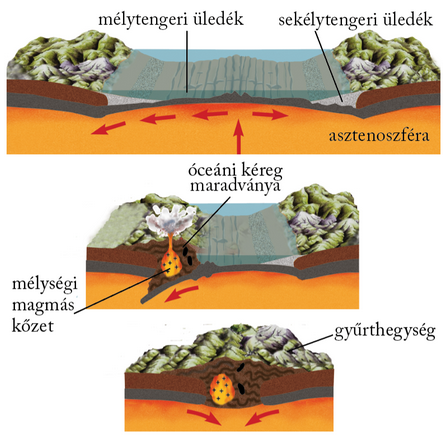
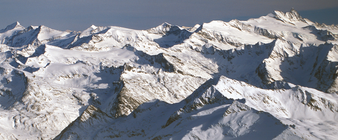
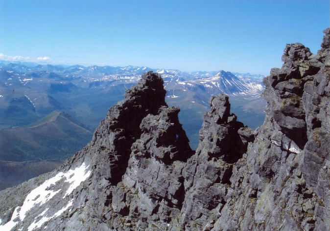
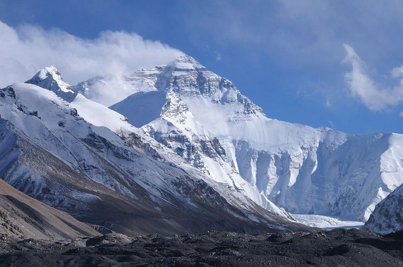

---

> # A hegységképződés

> ### Gyűrődés – vetődés – kiemelkedés
>
> Hegységrendszernek az egy hegységképződési időszak során képződött hegységek összességét nevezzük. A hegységek a kőzetrétegek kiemelkedésével jönnek létre, amelyek előzőleg meggyűrődtek vagy összetöredeztek.
>
> A gyűrődés a földkéreg rétegeinek oldalirányú nyomás hatására kialakuló meghajlása. A mélyben uralkodó nagy nyomás és magas hőmérséklet miatt képlékeny rétegekben megy végbe. A gyűrődés alapformája a redő, amely redőboltozatból, illetve redőteknőből áll.
>
> 
>
> Ha a két irányból érkező nyomás nagysága egyenlő, álló redők keletkeznek. Eltérő nyomás esetén ferde, illetve fekvő redők képződnek. Óriási nyomóerők hatására a ferde és fekvő redők elszakadhatnak eredeti aljzatuktól – gyökerüktől –, és áttolódhatnak más rétegekre. Így jönnek létre az áttolt takaróredők. Az áttolódás akár több száz kilométert is elérhet. Ilyen áttolt takarók igen gyakoriak az Alpokban.
>
> Vetődés játszódik le, amikor a szilárd kőzetanyag két tömbje vetősík mentén elmozdul. Ez függőleges és vízszintes irányban is végbemehet. A vetősíkok által közrefogott kőzettömeg a rög, de a vetődések lépcsőszerűen is követhetik egymást. A párhuzamos vetődések mentén kiemelkedő kéregdarabot sasbércnek, a hasonló módon bezökkenőket ároknak nevezzük. Lépcsős vetődéssel medencék alakulnak ki.
>
> 

> ### Hegységképződés a kőzetlemezek mentén
>
> A lemeztektonikai elmélet a hegységek képződését ősi óceánok történetéhez köti. A majdani hegységek jelentős részét alkotó anyagok az óceánok belső, lemezhatároktól távoli területein képződnek, ott halmozódnak fel, ülepednek le. Meggyűrődésük azonban az alábukási sávok mélytengeri árkaiban megy végbe. A hegységképződés az egymással ütköző lemezek szegélyéhez kapcsolódik.
>
> Két óceáni lemez ütközése a hegységképződés legegyszerűbb változata. Az óceáni kőzetlemezek ütközésekor szigetívek jönnek létre. A szigeteket főként vulkáni kőzetek építik fel, amelyek anyaga az alábukó kőzetlemez megolvadásából származik. Ilyen szigetívekből állnak a Csendes-óceán nyugati részének szigetei (Új-Hebridák, Salamon-szigetek).
>
> 
> 
>
> Óceáni és szárazföldi lemez ütközése ma a Földön az Andok területén figyelhető meg legjobban. A nagyobb sűrűségű óceáni lemez a vastagabb, kisebb sűrűségű kontinentális lemez alá bukik. A mélytengeri árkokhoz kapcsolódó andezites-riolitos vulkánosság miatt a Csendes-óceánt övező hegységekben uralkodó szerepet játszanak a magmás kőzetek. Az alábukás során azonban az üledék egy része is redőkbe gyűrődik.
>
> Kezdetben e térségekben is kisebb óceáni medencék húzódtak, az alábukás során azonban ezek az óceáni területek megsemmisültek. Miközben a szárazföldi lemezek egyre közelebb kerültek egymáshoz, a térrövidülés miatt az óceáni medence üledékei meggyűrődtek. Az eltérő sebességgel mozgó lemezhatárokon ekkor alakultak ki a ferde és fekvő redők, amelyek anyaga az ütközéskor szinte egymásra, illetve a kontinentális lemez idősebb kőzeteire tolódva létrehozta a takaróredőket. Az ütközéskor a kontinentális lemezperemről mikrolemezek szakadtak le, amelyek közbeékelődve megszabták az új hegység vonulatainak elhelyezkedését. Így jöttek létre az Eurázsiai-hegységrendszer tagjai (pl. az Alpok, a Kárpátok, a Pireneusok). Felépítésükben a meggyűrt üledékek játsszák a főszerepet.

> ### A hegységek típusai
>
> A hegységképződések egyik legfontosabb folyamata az üledékes kőzetrétegek gyűrődése. Az így kialakult hegységeket éppen ezért gyűrt szerkezetű hegységeknek nevezzük. Ilyen például az Andok vagy az Alpok. A gyűrt szerkezetű hegységek elsődleges szerkezeti formái a különböző gyűrődéses alakzatok.
>
> 
>
> A hatalmas szerkezeti mozgásokkal járó hegységképződések hatása alól a már megszilárdult, idősebb területek sem vonhatták ki magukat. Területükön törések éledtek fel, a törések mentén rögök emelkedtek ki, és árkok, medencék süllyedtek be. Így alakultak ki a töréses szerkezetű hegységek (pl. az Urál).
>
> 
>
> A gyűrt szerkezetű hegységekben egymással többnyire párhuzamos vonulatokat találunk. Az egyes vonulatok más és más kőzetből állhatnak (pl. üledékes és vulkáni vonulatok). Az egyes hegységek pedig láncszerűen csatlakoznak egymáshoz.
>
> A legtöbb töréses szerkezetű hegység egy korábbi hegység lepusztulás utáni feldarabolódásával keletkezett. Ám találunk olyan töréses szerkezetű hegységeket is, amelyek „fiatalkorukban” sem gyűrődtek meg, hanem törésekkel tagolt és különböző magasságokba emelt üledékeken alakultak ki.
>
> Az alacsonyabb hegységeket többnyire a folyóvizek formálják, a magasra kiemelt hegységek viszont akár jégsapkát is ölthetnek. Emiatt vannak olyan hegységek, amelyeken csak a folyóvíz, de olyanokat is, amelyeken a jég is ott hagyta a nyomát.

> ### Hegységrendszerek
>
> Az óidőben két jelentős hegységképződés is lezajlott. A kaledóniai hegységképződés a kőzetanyag tanúsága szerint két szárazföldi lemez ütközésével ment végbe. Ez kapcsolta össze Ős-Európát és Ős-Észak-Amerikát. A Kaledóniai-hegységrendszerhez tartoznak többek között Skandinávia, Skócia hegységei, Kelet-Grönland hegyei, az észak-amerikai Appalache-hegység északi része. A variszkuszi hegységképződés előbb a már egyesült Ős-Európa–Ős-Észak-Amerikát kapcsolta össze Gondvánával, majd ezt a területet az Urál hegység mentén Ázsia ősével. A Variszkuszi-hegységrendszer maradványai például Dél-Anglia, Franciaország hegységei, a Német-középhegység, a Cseh-medence peremhegységei, a Lengyel-középhegység, a Rodope, az Urál, a kelet-ausztráliai Nagy-Vízválasztó-hegység és az Appalache-hegység déli része.
>
> A középidő utolsó szakaszában tovább folytatódott a Pangea feldarabolódása. Egyre szélesebb lett az Atlanti-óceán északi medencéje, majd Afrika és Dél-Amerika szétsodródásával kinyílt az óceán déli medencéje is. Az Afrikai-lemez egyre jobban megközelítette Eurázsiát. Elkezdődött az Eurázsiai-hegységrendszer kialakulása az óceán üledékeiből, valamint az afrikai és az eurázsiai lemezszegélyek kőzetanyagából.
>
> Az újidőben az Indiai-lemez is összeütközött Eurázsiával, és megkezdődött a Himalája kialakulása. Az Eurázsiai-hegységrendszer legfontosabb tagjai (még afrikai kezdőtagként): az Atlasz, majd a Pireneusok, az Alpok, az Appenninek, a Kárpátok, a Dinári- és a Balkán-hegyvidék, a Kaukázus, Kis-Ázsia és az Iráni-medence peremhegységei, a Himalája.
>
> 
>
> A Pacifikus-hegységrendszer kialakulása már a középidő végén megkezdődött a Csendes-óceán peremvidékén – az egymás felé közelítő óceáni és szárazföldi, illetve óceáni és óceáni lemezek határán. A hegységképződés nagy része az újidőben zajlott. A Csendes-óceánt keretező hegységrendszerhez tartoznak Kelet-Ázsiában többek között Kamcsatka, a Kuril-szigetek, Japán hegyei, hegységei, Észak-Amerikában a Kordillerák, Dél-Amerikában az Andok.

---