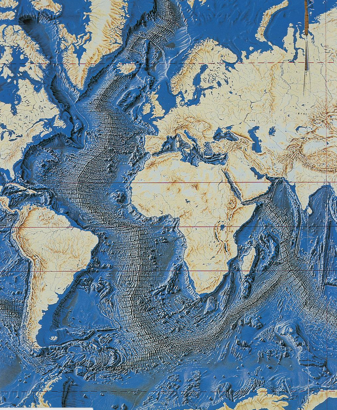
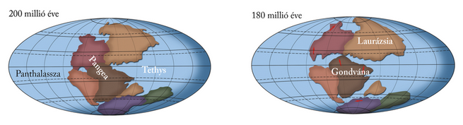
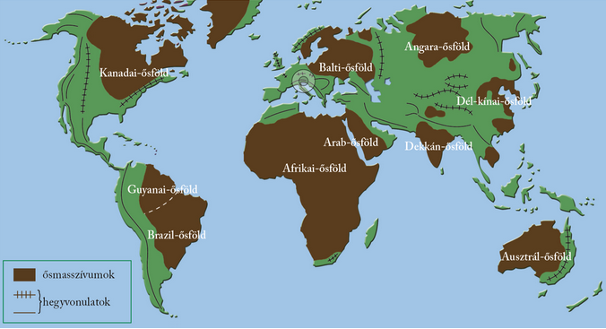
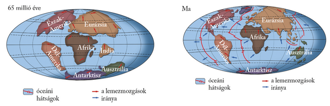

---

> # A lemeztektonika alapjai

> Ma már tudjuk, hogy a kőzetlemezeknek nincs állandó helyük a Föld felszínén, hanem folyamatosan vándorolnak. Mozgásukat akár műholdas helymeghatározással is követni tudjuk, a 20. század elején azonban még azt sem ismerték fel, hogy a Föld szilárd burka nem alkot egy egységet.
>
> A kőzetlemezek mozgásának elméletét és a hozzá kapcsolódó szerkezeti változásokat a kőzetburokban összefoglaló néven lemeztektonikának nevezzük.

> ### A tengerfenék feltérképezése
>
> A tengerfenék domborzatának megismerése nagy lendületet adott a lemeztektonikai kutatásokhoz. Az 1950-es években fedezték fel az Atlanti-óceán közepén az Atlanti-hátságot, ami szinte párhuzamos a szomszédos szárazföldek partjaival. A mélyfúrásokkal vett kőzetmintákból megállapíthatók a kőzetek keletkezési körülményei, ami alátámasztotta, hogy a kontinensek korábban máshol és más formában léteztek. A mágnesezettség vizsgálatai azt mutatták ki, hogy az óceán aljzatának mágnesezettsége sávos elrendeződésű, és a hátság két oldalán a sávok szimmetrikusan helyezkednek el. A hátságtól távolodva az üledékek egyre vastagabbak, a vulkáni kőzetek pedig egyre idősebbek. Feltűnő ezenkívül a partvonalak hasonló futása, főleg Dél-Amerika és Afrika esetében, és egymástól távol fekvő kontinenseknél is meg lehet figyelni hasonló növény- és állatvilágot.
>
> Mindezekre a magyarázat az óceán szétterülése, vagyis az alatta elterülő kőzetlemezek távolodása. De ha az óceánok fokozatosan szétterjednek, akkor a Földnek növekednie kellene – márpedig ez nem így van. A talányra a földrengések vizsgálata adta meg a választ. A vizsgálatok szerint számos földrengés kipattanási helye mélyebben van, mint a szilárd kőzetburok vastagsága. Ennek az az oka, hogy bizonyos helyeken a kőzetlemezek a mélybe buknak.
>
> 

> ### A kőzetlemezek peremén
>
> Az óceánközépi hátságok mentén a kőzetlemezek távolodnak egymástól. A hátság tengelyében hasadék húzódik, és e hasadékból kőzetolvadék buggyan az óceán aljzatára. A felszín alatti kőzetolvadékot magmának nevezzük. Az olvadék lehűlve hozzáforr a hátság pereméhez. Így képződik az óceáni kéreg felső rétegét alkotó bazaltos kőzet. A Föld belsejéből érkező anyag tehát megszilárdulva hozzáforr a hátságok pereméhez, a nyomában felhatoló olvadék pedig magának helyet követelve, a hátságok mentén szétfeszíti az óceánok aljzatát. Sajátos hátság húzódik a Vörös-tenger alatt, ahol jelenleg is születik egy új óceán. A hátság déli folytatása a Kelet-afrikai-árok, amely mentén Afrika néhány tízmillió év múlva ketté fog hasadni. Izland térségében pedig az Atlanti-hátság a vízfelszín fölé emelkedik!
>
> A hátságok mentén születő kéreg a mélytengeri árkok vonalában bukik a mélybe. Ebben a sávban a kőzetlemezek egymáshoz közeledve ütköznek, és a nagyobb sűrűségű óceáni lemez a szárazföldi lemez alá bukik. Szilárd anyaga beolvad az asztenoszférába. E sávok az alábukási, idegen szóval a szubdukciós övezetek. A több ezer méter mély árkokban törmelékanyag is felhalmozódik. Egy részük tengeri üledék, amely az óceáni lemezek hátán érkezik, másik részük a közeli szárazföldről származik. A legmélyebb árok a Mariana-árok a Csendes-óceán nyugati peremén, tőle nem messze fekszik a Japán-árok.
>
> A harmadik, jóval ritkább csoportot az egymás mellett elcsúszó kőzetlemezek alkotják. Ez a folyamat játszódik le például az Észak-amerikai-lemez délnyugati szegélyén, a híres Szent András-törésvonal mentén, és a Kis-ázsiai-peremvidéken, Isztambul környezetében. Mindkét veszélyes, elmozduló zónában emberek tízmilliói élnek!

> ### Lemezmozgások a földtörténet során
>
> A Föld történetét hosszabb szakaszokra, úgynevezett időkre osztjuk (ősidő, előidő, óidő, középidő és újidő). Ezeken a szakaszokon belül időszakokat, az időszakokon belül korokat különböztetünk meg. A földtörténeti idők időtartama az ősidőtől az újidőig egyre csökken. Jelenleg az újidő negyedidőszakának holocén korában élünk.
>
> A Föld 4,6 milliárd éves történetében a kőzetlemezek folyamatosan változtatták a helyüket. A 2,5 milliárd éve kezdődött előidőben jöttek létre az egyes kontinensek magját alkotó ősmasszívumok. Az ősmasszívumok (más néven ősföldek vagy pajzsok) a Föld legősibb kéregdarabjaiból és a hozzájuk forrt hegységek maradványaiból állnak. Az ősmasszívumok között egyaránt találunk síkságokat (pl. a Balti-pajzs jelentős része) és hegységeket (pl. a Brazil-felföld egyes vidékei).
>
> Az óidő elején (kb. 550–590 millió éve) Dél-Amerika, Afrika, Ausztrália, Arábia, India, valamint az Antarktisz ősei egyetlen közös ősföldbe, a Gondvánába tömörültek. Az óidő végére (kb. 235 millió éve) a szárazföldek egyetlen őskontinensben, a Pangeában (Összföld) egyesültek, ezt az ősóceán, a Panthalassza (Össztenger) vette körül. Kelet felől a Tethys-öböl mélyedt a Pangea testébe.
>
> A középidőben (235–65 millió évig) megkezdődött a Pangea feldarabolódása. Előbb az Észak-Amerika, Európa és Ázsia őse által alkotott Laurázsia vált el a déli ősföldtől, a Gondvánától. Ezt követően, Laurázsia testébe ékelődve, megkezdődött az a hátságképződés, amely az Atlanti-óceán kialakulásához vezetett.
>
> 
>
> Végül a Gondvána is három részre darabolódott: a Dél-Amerika-Afrikát, az Ausztrália-Antarktiszt és az Indiát hátukon hordó lemezekre. Egyre szélesebb lett az Atlanti-óceán északi medencéje, majd Afrika és Dél-Amerika szétsodródásával kinyílt az óceán medencéje.
>
> A közép-amerikai földhíd csak az újidőben, mintegy 5 millió évvel ezelőtt alakult ki.
>
> 

> ### A Pangea utódai
>
> A mai földrészek a Pangea leszármazottai, ugyanis annak szétszakadozásával jöttek létre. A földrészek jelenlegi elrendeződése 10–12 millió évvel ezelőttre tehető. A szárazföldek térképekről ismert körvonalai azonban csak pillanatnyi állapotot tükröznek.
>
> A földrészek (kontinensek) minden oldalról tengerrel körülhatárolt, nagy kiterjedésű szárazulatok. Földtani értelemben azonban csak azokat a szárazulatokat nevezhetjük földrészeknek, amelyek önálló ősmasszívummal rendelkeznek.
>
> A földrészek szerkezetileg nem a mai tengerpartoknál végződnek. Hozzájuk tartoznak a 200 méternél sekélyebb tengerrel borított szárazföldi (kontinentális) talapzatok, más néven selfek is. Így például Európa szárazföldi talapzatán ülnek a Brit-szigetek.
>
> 

---