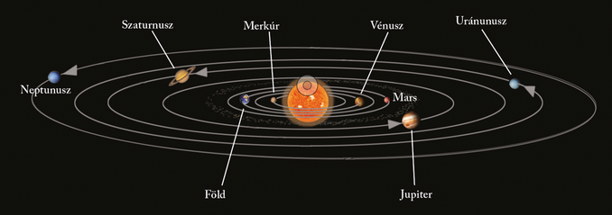

---

> # A Naprendszer és bolygói
>
> A Naprendszer a Tejútrendszernek azt a tartományát jelenti, amelyen belül a Nap gravitációs hatása érvényesül. E gömb alakú tér sugara kb. 2 fényév. Ez a földi méretekhez és az emberiség technikai lehetőségeihez képest akkora távolság, hogy nagyon nehéz megállapítani csillagrendszerünk valós határát. A kutatók még a 20. század végén is módosítottak a Naprendszer kiterjedésének elfogadott álláspontján. 

> ### A Naprendszer mérete
>
> A csillagászok a Naprendszer vizsgálatakor a csillagászati egységet (CSE) használják távolságegységként. Az 1 CSE értéke 149 600 000 km, ami a közepes Nap–Föld távolsággal egyenlő. (E hatalmas méreteket lehetetlen elképzelni. A szemléltetéshez különböző hasonlatokat alkalmaznak. Ha például a Napot akkora gömbként képzeljük el, mint egy futballlabda, akkor a mindössze borsszemnyi Föld 30 méterre, a teniszlabda méretű Jupiter 150 méterre, a csupán mustármagnyi Plútó törpebolygó viszont 1,5 kilométerre keringene…)

> ### A Naprendszer kisebb alkotórészei
>
> A bolygókon kívül kis- és törpebolygók, holdak, üstökösök, meteorok, valamint a bolygóközi anyag a Naprendszer további alkotórészei.
>
> Az üstökösök kőzetekből és jégből álló égitestek. Jellegzetes csóvájuk a Nap közelében felolvadva elpárolgó részük felhője. A meteorok kő- vagy fémdarabok, amelyek a Föld légkörébe jutva felizzanak. Egy részük a légkörben elég, Földre hulló darabjaikat meteoritoknak nevezzük. A porból és gázból álló bolygóközi anyag részben az üstökösök, meteorok törmelékéből, részben azonban a Napból származik.
>
> A törpebolygó a Naprendszerben keringő égitestek egyik típusa, amely átmenetet jelent a nagybolygó és a kisbolygó között. A Nap körül kering, és közel gömb alakú. A Nemzetközi Csillagászati Unió 2006-os prágai kongresszusán határozták meg ezt a kategóriát. Ebbe sorolták át a korábban nagybolygóként emlegetett Plútót is.

> ### A Naprendszer nagybolygói
>
> 
>
> A Naprendszerhez nyolc nagy- és több százezer kisbolygó tartozik. A bolygók valamely csillag (esetünkben a Nap) körül keringő égitestek, amelyeknek nincs saját fényük, csak anyacsillaguk fényét verik vissza.
>
> A Föld típusú vagy belső bolygókhoz (más néven kőzetbolygó) a Naphoz viszonylag közel elhelyezkedő Merkúr, Vénusz, Föld és Mars tartozik. Hasonló tömegűek, viszonylag nagy a sűrűségük (több mint 3 g/cm3), szilárd kőzetburokkal rendelkeznek.
>
> A Jupiter típusú vagy külső bolygók (más néven gázbolygó), a Jupiter, Szaturnusz, Uránusz, Neptunusz, jóval nagyobbak a Föld típusú bolygóknál. Sűrűségük igen kicsi ($0,7–2,2 g/cm^{3}$). A külső bolygók további jellemzője holdakban való gazdagságuk (összesen több mint 200 darab).
>
> Holdnak az egyes bolygók kísérőit nevezzük, amelyek a bolygók körül keringenek.
>
> | Bolygó neve | Tömeg (Föld = 1) | Térfogat (Föld = 1) | Sűrűség ($g/cm^{3}$) | Átlagos keringési seb.($\frac{km}{s}$) | Keringési idő (év) | Egyenlítői átmérő (km) | Közepes naptávolság (mill. km) | Holdak száma |
> | :-- | :-- | :-- | :-- | :-- | :-- | :-- | :-- | :-- |
> | Merkúr | 0,05 | 0,05 | 5,62 | 47,8 | 0,24 | 4 480 | 58 | 0 |
> | Vénusz | 0,81 | 0,83 | 5,09 | 35,0 | 0,62 | 12 228 | 108 | 0 |
> | Föld | 1,00 | 1,00 | 5,51 | 29,8 | 1,00 | 12 756 | 150 | 1 |
> | Mars | 0,10 | 0,15 | 3,97 | 24,1 | 1,88 | 6 770 | 228 | 2 |
> | Jupiter | 317,81 | 1347,00 | 1,30 | 13,0 | 11,86 | 140 720 | 778 | 79 |
> | Szaturnusz | 95,11 | 770,50 | 0,68 | 9,6 | 29,46 | 116 820 | 1432 | 82 |
> | Uránusz | 14,51 | 50,60 | 1,58 | 6,8 | 84,02 | 51 800 | 2884 | 27 |
> | Neptunusz | 17,21 | 42,80 | 2,22 | 5,4 | 164,79 | 49 500 |

> ### Nagybolygók névjegyei
>
> |  | Bolygó neve | Leírás |
> | :-- | :-- | :-- |
> |  | Merkúr | A Naphoz legközelebbi nagybolygó felszínét a holdkráterekhez hasonló gyűrűs hegyek borítják, amelyek valószínűleg meteoritbecsapódások sebhelyei. A Merkúrnak gyakorlatilag nincs légköre. |
> |  | Vénusz | Főként hajnalban és alkonyat táján tűnik fel az égbolton. Erre utal népi elnevezése is: Esthajnalcsillag. Méretei igen közel állnak a Földéhez. A több rétegből felépülő légkörét főleg szén-dioxid alkotja, benne nagy magasságban kénsavból álló vastag felhők úsznak. A levegőburok nagy sűrűsége és magas szén-dioxid-tartalma miatt rendkívül erős az üvegházhatás, ezért a bolygón a hőmérséklet elérheti a 470 °C-ot. A felső légrétegekben heves, 350 km/h sebességű szél tombol, de ez a felszín közelében néhány km/h-ra csendesedik. A bolygó felszínén a nyomás a földi érték 90-szerese. |
> |  | Mars | Felszíni formái sokban emlékeztetnek a Földön megismertekre: a bolygó felszínét hajdani folyó- és gleccservölgyek szelik át, hatalmas vulkánok ismerhetők fel (köztük az egész Naprendszer legmagasabb hegye, a 27 km magas Mons Olympus). Pólusain jégsapkák ülnek. A vékony és ritka légkör miatt alig érvényesül az üvegházhatás: mindössze 5 °C-kal emeli meg a bolygó felszínének hőmérsékletét (ez a Föld esetében 35 °C). Sokkal nagyobb a hőmérséklet ingadozása is. A pólusoknál – a Földhöz hasonlóan – állandó jégsapkák vannak, melyek fagyott szén-dioxidból (szárazjég), valamint kisebbrészt vízjégből állnak. Az adott félteke nyarán a szárazjég szublimál, de a vízjég megmarad. |
> |  | Jupiter | Tömege két és félszer nagyobb az összes többi bolygó együttes tömegénél. Vastag légkörében sávos elrendeződésű felhők, valamint hatalmas légköri örvények (pl. az ún. Nagy Vörös Folt) ismerhetők fel. |
> |  | Szaturnusz | Méreteiben a Jupiter után következő bolygó főként gyűrűrendszeréről híres, amely parányi kő- és jégdarabokból áll. |
> |  | Uránusz | „Rokonai” közül rendkívül gyors tengelyforgásával tűnik ki. Forgástengelye és pályasíkja közel azonos. Légkörének fő összetevője a hidrogén és a hélium. |
> |  | Neptunusz | Légkörének összetétele az Uránuszhoz, a légkörében száguldozó nagy sebességű szelek és örvények a Szaturnuszhoz teszik hasonlóvá. |

---