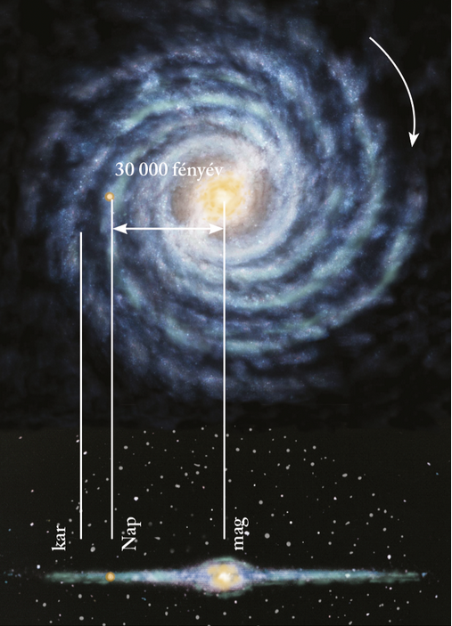

---

> # A világegyetem peremétől a Napig

> ### A Naptól a világegyetem pereméig
>
> A 19. század csillagászati kutatásai arra is fényt derítettek, hogy a Nap nem a világegyetem, hanem csupán a Naprendszer központja, a Naprendszer pedig a mintegy 200 milliárd csillagból álló Tejútrendszer (galaxis) része. A Tejútrendszeren kívül több mint egymilliárd hasonló csillagrendszer – extragalaxis – alkotja a metagalaxis tartományát, amely még mindig csak töredéke az egész univerzumnak! Mindehhez kiváló távcsövekre is szükség volt, de nagy lökést adott a csillagászat fejlődésének a színképelemzés alkalmazása is, melynek segítségével fel lehetett deríteni a csillagok anyagi összetételét. A 20. század elején olyan új módszerek birtokába jutottunk, amelyekkel a nagyon távoli csillagok távolságának mérése is lehetővé vált. E csillagok vizsgálatában mérföldkövet jelentett a Hubble-űrtávcső Föld körüli pályára állítása (1990). Ma az űrszondák, űrhajók és űrrepülőgépek folyamatosan szállítják az adatokat a világűr távoli részeiről, tovább gazdagítva ismereteinket a világmindenségről.

> ### A világegyetem keletkezése
>
> Az univerzum keletkezésének legelfogadottabb elmélete az ún. nagy bumm (Big Bang) vagy ősrobbanás, amely egy rendkívül sűrű kozmikus anyagtömeg szétrobbanása volt. Ennek következtében a tér minden irányába hatalmas mennyiségű anyag- és energiaáramlás indult meg. Az elemi részecskékből néhány milliárd év alatt alakultak ki azok az anyagsűrűsödések, amelyekből később hosszú fejlődés során galaxisok keletkeztek.
>
> Az univerzum életkorát ma mintegy 14-15 milliárd évre becsüljük.

> ### A Tejútrendszer
>
> A szabad szemmel látható csillagok nagy része egy óriási rendszerbe tartozik, a mi galaxisunkba, melyet Tejútrendszernek nevezünk. A Tejút égbolton derengő sávja csillagmilliárdok összeolvadó képéből áll. A csillagok saját fényű gázgömbök. A Tejútrendszer felülnézeti képe csigavonalszerű karokra, oldalnézeti képe két, egymással szembefordított mélytányérra emlékeztet. Jókora tányérokat kell elképzelnünk, hiszen a Tejútrendszer átmérője 100 000 fényév. A fényév az a távolság, amelyet a légüres térben 300 000 km/s sebességgel haladó fény egy év alatt megtesz. A tányérok közrefogta tér közepén helyezkedik el a Tejútrendszer 100 millió naptömegnyi magja.
>
> A Tejútrendszer mintegy 200 milliárd csillagból, saját fényű gázgömbökből áll. Ezek egyike a Nap, ami a Naprendszer központja, és 30 000 fényév távolságra van a Tejút központjától.
>
> 

> ### A Nap
>
> A Naprendszer középpontjában elhelyezkedő Nap gáz-halmazállapotú csillag. A kb. 110 földátmérőjű (1,4 millió km) Nap kémiai összetétele szerint 80% hidrogénből és 20% héliumból áll. A Nap energiatermelését a hidrogén héliummá való, atommag-reakcióban lejátszódó átalakulása biztosítja. E folyamat még kb. 10 milliárd évig fedezi az energiatermelést. A Nap felszínén 6100 K hőmérséklet uralkodik.
>
> A Nap forog a saját tengelye körül, miközben ellipszis alakú pályán a Tejútrendszer tömegközéppontja körül kering.

> ### Naptevékenységek
>
> A Nap működésében mutatkozó változások a naptevékenységek. A felszínen, a fotoszférában jelennek meg a nagy területű, sötét napfoltok. Ott alakulnak ki, ahol a mágneses térerősség megnövekedik. Hőmérsékletük alacsonyabb a fotoszféra átlagos hőmérsékleténél (kb. 4000 K). A napfoltok sűrűsége 11 évente ciklikusan változik, néha több, néha kevesebb napfolt figyelhető meg.
>
> A naptevékenységek leglátványosabb elemei a napkitörések. Ekkor a naplégkör bizonyos helyeken kifényesedik, megnő a sugárzás mennyisége és részecskék dobódnak ki az űrbe. A jelenség összefügg a Nap mágneses terének változásával.
>
> Napszélnek nevezzük azt a jelenséget, amikor a Nap légkörének külső részéről a napkitörések során elektromos részecskék jutnak a bolygóközi térbe. Ezek néhány nap alatt elérik a Földet, de annak mágneses mezeje védőburkot képez   napszéllel szemben. A pólusok környékén azonban a mágneses mező hasadékain keresztül a Napból érkező részecskék behatolnak a légkörbe. Ezek okozzák a sarkvidékeken a sarki fény megkapó jelenségét.

> ### A Nap földi hatásai
>
> A napsugárzás alapvető jelentőségű a földi élet szempontjából. Ez melegíti fel bolygónk légkörét, és teszi azt az emberiség számára élhető hellyé.
>
> A növények a Nap sugárzó energiáját hasznosítva építik fel testük szerves vegyületeit. Ez a folyamat a fotoszintézis, amely során nemcsak nagy energiatartalmú szénhidrátok keletkeznek, hanem oxigén is felszabadul.
>
> A növényeket elfogyasztó emberek és állatok az életfolyamataik során közvetve ugyancsak a Nap energiáját hasznosítják. A napsugárzás elengedhetetlen az emberi szervezet számára létfontosságú D-vitamin előállításához is. Ugyanakkor ne felejtsük el, hogy a tartósan erős napsugárzás (pl. nem körültekintő napozás során) károsíthatja is a szervezetet!
>
> Az emberiség szempontjából nélkülözhetetlen szerves energiahordozók szintén a napsugarak energiáját zárták magukba. De a napsugarak jelenthetik a mindinkább energiaszűkébe kerülő világ számára az alternatív, megújulni képes energiaforrást is.
>
> A Napból érkező hőenergia befogására különböző lehetőségek állnak rendelkezésre. A napkollektorok a napfény melegét raktározzák el úgy, hogy a bennük tárolt folyadék felmelegszik. Ezt később például mosáshoz vagy fűtéshez is lehet használni. A napelemek a napenergiát elektromos árammá alakítják. Ezzel lehet közvetlenül is működtetni elektromos készülékeket – sok ilyennel találkozhatunk az utcán is. Egyre több országban telepítenek összekapcsolt panelekből óriási napelemrendszereket is. A napsugárzásból előállított energiát rá lehet csatlakoztatni az országos elektromos hálózatra.

---