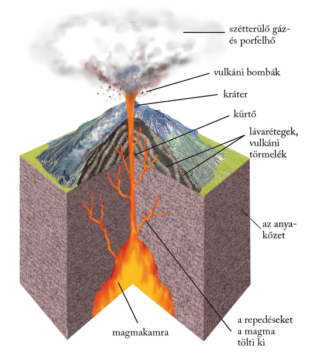
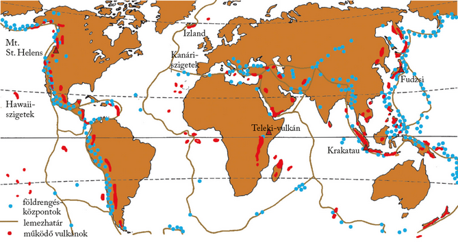
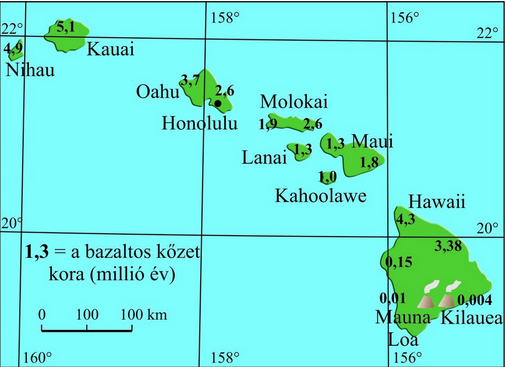

---

> # A vulkáni tevékenység

> ### Mélységi magmatizmus és felszíni vulkánosság
>
> A fölfelé hatoló kőzetolvadék, a magma nem éri el minden esetben a felszínt, hanem alacsonyabb hőmérsékletű szintbe érve, még a felszín alatt szilárdul kőzetté. Ezeket mélységi magmás kőzeteknek nevezzük. Ilyen kőzet például a földkéreg felépítésében fontos szerepet játszó gránit és gabbró.
>
> Ahogy csökken a magma hőmérséklete, különböző alkotórészei fokozatosan válnak és kristályosodnak ki. Mivel a mélységi magmás kőzetek lehűlése igen lassan megy végbe, bőségesen van idő nagy kristályok kialakulására.
>
> Vulkánosságról csak akkor beszélünk, ha a magma eléri a Föld felszínét. A magma felszínre lépési helyén képződik a vulkán, a felszínre kerülő magmát pedig lávának nevezzük. A vulkáni tevékenység során képződő vulkáni kőzetek szoros rokonságban állnak azzal a magmafajtával, amelyből származnak. Másfajta lávakőzet képződik tehát a gabbróból, illetve a gránitból. A felszíni vulkáni kőzetek közös jellemzője, hogy mivel a felszínen gyorsan hűlnek ki, apró kristályokból állnak.

> ### A tűzhányók eloszlása és a kőzetlemezek
>
> A vulkánok földfelszíni eloszlására, működésük törvényeire is a lemeztektonika adta meg a legteljesebb magyarázatot.
>
> A működő tűzhányók kevés kivétellel tengerpart közelében helyezkednek el. Tenger közelében vagy éppen szigeteken működnek Európa híres tűzhányói, a Vezúv, az Etna, a Stromboli éppúgy, mint Japánban a Fudzsi, vagy Indonézia, illetve az amerikai kontinens vulkánjai. Számtalan tengerparti területen viszont nyoma sincs tűzhányóknak. A vulkánok elhelyezkedésénél nem a tengerpart közelsége, hanem az a döntő, hogy e területek egyben lemezhatárok-e.
>
> A vulkáni működés és a felszínre kerülő anyag jellege a magma kémiai összetételétől függ. Az egyes magma-, illetve vulkáni kőzettípusokat a gáz- és a fémtartalom, elsősorban azonban a szilícium-dioxid (SiO2) alapján csoportosíthatjuk.
>
> A különböző típusú lemezszegélyeken eltérő összetételű magma nyomul a felszín felé. Ezért az egyes lemezhatártípusokhoz jellegzetes kőzetanyagú, működésű és formájú vulkánok kötődnek.

> ### Vulkánosság távolodó lemezszegélyeknél
>
> A felszínre érkező magma 80%-a az óceánközépi hátságok mentén tör fel. A hátságok magmája nagy mélységből, az asztenoszférából érkezik. A hőmérséklete igen magas (1100–1200 °C). A nagy mélységből származó anyag fémes elegyrészekben gazdag, SiO2-ban viszont szegényebb. Ez a bázisos kőzetek csoportja. A mélységi magmás kőzetek közül ilyen a gabbró, amelynek felszíni kiömlési kőzetpárja a bazalt.
>
> A tenger alatti lejtőkön leguruló rögök belseje még izzik, külső burkuk viszont már lehűlve bekérgeződik. Ezen a kérgen azonban még ki-kibuggyan a forró anyag, és így jön létre a kerekded párnaláva.
>
> A szárazföldön felszínre kerülő bazaltláva hígan folyós. Így jöttek létre a Föld enyhe lejtőjű pajzsvulkánjai és lapos bazaltfennsíkjai. Az előbbiekre Izlandon és a Hawaii-szigeteken, az utóbbiakra ugyancsak Izlandon és a Dekkán-fennsíkon is találunk példákat.

> ### Vulkánosság közeledő lemezszegélyeknél
>
> A mélytengeri árkok mentén alábukó kőzetlemez anyaga megolvad. Az árkokhoz kötődő tűzhányók magmája tehát nem az asztenoszférából, hanem az alábukó kőzetlemezből származik. Ezért hőmérséklete alacsonyabb, kb. 800–900 °C. Az alábukó kőzetlemezek sok vízdús tengeri üledéket is mélybe szállítanak, ami megnöveli a magma nyomását, gáztartalmát, illetve a felszínre törő láva erejét. Mivel a magma a szárazföldi kőzetlemez repedésein keresztül tör a felszínre, útközben magába olvasztja a szárazföldi kéreg szilikátokban gazdag anyagának egy részét is. Emiatt több szilícium-dioxidot, viszont kevesebb fémet tartalmaz.
>
> A mélytengeri árkokhoz kapcsolódó vulkánkitörések lávája sűrűbben folyik, ezért a belőle felépülő vulkáni kúpok meredekebb lejtőjűek. A magasabb gáztartalom miatt a kitörések gyakran heves robbanással járnak. A robbanásos kitörések nemcsak lávaömléssel, hanem heves törmelékszórással járnak együtt. A kiszórt törmelékből, hamuból és salakból vulkáni törmelékes kőzet, tufa képződik.
>
> A keletkező semleges vulkáni kőzetek közé tartozik a mélységi magmás diorit, amelynek kiömlési kőzetpárja az andezit. A magas SiO2-tartalmú savanyú vulkáni kőzetek közül mélységi magmás a gránit, amelynek felszíni kiömlési kőzetpárja a riolit.
>
> Váltakozóan települő andezitlávából és tufából állnak a rétegtűzhányók (sztratovulkánok). Ezek közé tartoznak Földünk legszabályosabb vulkáni kúpjai (pl. a Vezúv Olaszországban, a Fudzsi Japánban).
>
> A rétegtűzhányók magmacsatornáján felnyomuló anyag a kürtőn keresztül tör a felszínre. A kürtő a felszínen kráterben végződik (kráterkúpos tűzhányók). A kráterkúp tetejét egy újabb, heves robbanásos kitörés a levegőbe röpítheti, vagy a magmakamra kiürülése miatt beszakadhat. Így jönnek létre a kráternél jóval nagyobb átmérőjű robbanásos, illetve beszakadásos kalderák (kalderakúpos tűzhányók). Ilyen kalderaképződés játszódott le 1980-ban az észak-amerikai Mount St. Helens tűzhányón.
>
> 
>
> 

> ### Vulkánosság a kőzetlemezek belső területein
>
> Főleg a Csendes-óceán térségében sok tűzhányót találunk a kőzetlemezek szegélyétől távol is. Közös jellemzőjük, hogy a vulkánok láncszerűen helyezkednek el, és kőzeteik a lánc egyik végétől, ahol még ma is tarthat a működés, fokozatosan idősödnek. Ilyenek például a Hawaii-szigetek vagy a Kanári-szigetek tűzhányói is. Kialakulásukat az úgynevezett „forró pontokkal” magyarázzák.
>
> 
>
> E pontokon a köpenyből feláramló magma egy felszínre vezető magmacsatornát olvaszt a kőzetburokba, és így jön létre a vulkáni működés. Közben (néhány százezer év alatt) a kőzetlemez továbbhalad a helyhez kötött forró pont fölött. Az előző helyen megszűnik a vulkáni működés, de mint ahogy a varrógép is újabb lyukat üt a továbbhúzott anyagba, a forró pont is újabbat éget a litoszférába.

> ### A vulkáni kísérőjelenségek

A vulkáni működés szüneteiben, illetve a kitörések után még akár évmilliókig is gőz- és gázszivárgások figyelhetők meg. Ezeket összefoglalóan vulkáni kísérőjelenségeknek nevezzük. Ilyenek többek között:
>
> - a fumarolák: 200–900 °C-os, főleg vízgőzből álló kigőzölgések, amelyekhez különféle vegyületek (pl. $NaCl, KCl$) társulhatnak;
> - a szolfatárák: 200–400 °C-os, kénvegyületeket ($H_{2}S, SO_{2}$) tartalmazó kigőzölgések (nevüket a Nápoly melletti, kéntől sárgálló Solfatara-kráterről kapták);
> - a mofetták: 100 °C alatti, jórészt száraz $CO_{2}$-gázfeltörések (pl. a Kutya-barlang Nápoly mellett vagy a torjai Büdös-barlang a Székelyföldön).
>
> A vulkáni kísérőjelenséghez tartoznak a különféle vulkáni szénsavas források (savanyúvizek) is, mint Erdély borvizei vagy a Mátra csevicéi.
>
> A leglátványosabb vulkáni kísérőjelenség a gejzír, az időszakos szökőhévforrás (pl. az észak-amerikai Yellowstone Nemzeti Parkban vagy a jelenség névadó helyszínén, Izlandon). A gejzírek pár tíz méter mély kürtőjében a vulkáni kőzetek melege hevíti fel a felszínről bekerült vizet. A kürtőben lévő vízoszlop fokozatosan felmelegszik. A mélyebben lévő és így nagyobb nyomás alatt álló víztömeg 100 °C fölött forr fel. A kitörés azonban csak akkor indul el, ha a lenti nyomás már meghaladja a fölötte lévő vízoszlop kitörést gátló súlyát. Ekkor kifejezetten meleg, vagy épp forró víz és gőz lövell a felszínre. A kilövellt víz zöme aztán visszahull és visszáramlik a kürtőbe, ahol a folyamat újrakezdődik.

---