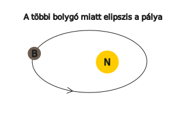
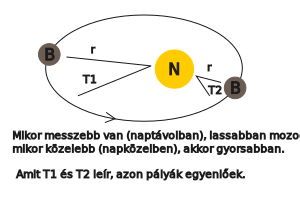
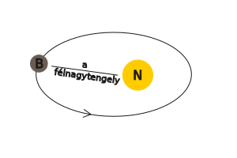
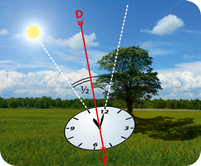
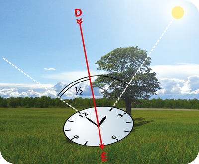
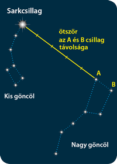
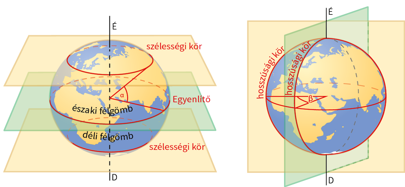
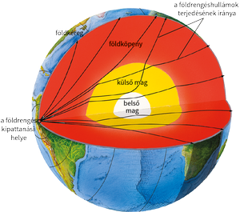

---

- [Vissza az előző oldalra](../foldrajz.md)
- [Vissza a főoldalra](../../../../README.md)

---

# Első negyedéves vizsga

---

- **Kepler törvényei**
   - I. minden bolygó olyan elipszis alakú pályán kering, amelynek az egyik gyújtópontjában a nap helyezkedik el.
      - 
   - II. a bolygótól a napig húzott vezérsugár, egyenlő idők alatt egyenlő területeket súrol.
      - 
   - III. a bolygók keringési idejének négyzetei úgy aránylanak egymáshoz, mint fél nagytengelyeik köbei.
      - 
      - $ \frac{T1^{2}}{T2^{2}} = \frac{a1^{3}}{a2^{3}} $

- **Newton tömegvonzás törvénye**
   - a tömegvonzás egyenesen arányos a testek tömegével, fordítottan viszont a közöttük lévő távolság négyzetével. $F = G*\frac{m1*m2}{v^{2}}$

- **helyi idő és zónaidő+fokszámok**

- **É-i irány meghatározása**
   - Óralappal
   - Cillagképpel
   - GPS-el

> ***Az északi irány meghatározása mutatós óra és a Nap segítségével***
> Rajzoljunk egy papírlapra egy mutatós órát (mert nem biztos, hogy olyan van a karunkon), mely a pontos időt mutatja. A kismutatót irányítsuk a Nap felé, majd a kismutató és a 12-es közötti szöget felezzük meg. A szögfelező az ábrákon látható módon kijelöli az észak–déli irányt. A nyári időszámításnál az óraállítást figyelembe kell venni, tehát a műveletet úgy érdemes elvégezni, hogy gondolatban visszaállítjuk a kismutatót egy órával, vagy a 12-es helyett az 1-es és a kismutató közti szöget felezzük meg.
> 
> 

> ***Északi irány meghatározása csillagképek segítségével***
> Az északi félgömbön a csillagképek látszólagos mozgásukat a Sarkcsillag körül végzik. Erre mutat jelenleg a Föld tengelye, tehát erre van észak. Azonosítása a Göncölszekér segítségével történhet, ami a Nagy Medve csillagkép része. A Sarkcsillagot úgy a legkönnyebb megtalálni, hogy a Göncölszekér két hátsó kerekét alkotó csillag közötti távolságot a két csillagot összekötő egyenes mentén az ábrának megfelelően ötször felmérjük. Persze a Sarkcsillag sem egészen pontosan észak felé található, hanem attól majdnem háromnegyed fokra eltér, tehát az északi égi pólushoz képest ilyen kicsi szögben körbejár.
> 

- **méretarány számítás**

- **földrajzi koordináták (szélességi és hosszúsági körök)**
   - A földgömb Földünk arányosan kicsinyített mása. A föld­gömbön a szélességi és a hosszúsági körökből álló koordináta-rendszer, a földrajzi fokhálózat segítségével tájékozódhatunk. A szélességi és hosszúsági fokok segítségével minden földfelszíni pont helyzete megadható.
   - A szélességi körök a Föld forgástengelyére merőleges síkok által kimetszett változó kerületű körök a gömbfelszínen. A szélességi körök értékét az a szög adja meg, amelyet a Föld középpontjától az illető helyhez húzott sugár az Egyenlítő síkjával bezár.
   - A hosszúsági körök a szélességi körökre merőleges vonalak (félkörök), amelyek a pólusokon (az Északi- és Déli-sarkon) haladnak át, és metszik egymást. A hosszúsági körök értékét a kezdő hosszúsági körtől számított, az Egyenlítő körén mért szögtávolság adja.
   - 

- **Földünk gömbhéjas szerkezete**
   - A Föld anyaga a forgás és a lehűlés hatására sűrűség szerint rendező­dött gömbhéjakba. A nyomás a mélység függvényében nő, és a Föld középpontjában eléri a felszíni nyomás négyezerszeresét. A sűrűség ezzel szemben hirtelen megnő bizonyos mélységekben. Értéke éppen ott módosul jelentősen, ahol a földrengéshullámok is változásokra utalnak. A hőmérséklet a felszín felé fokozatosan csökken. A belső hő tartja mozgásban a felszínt alakító hő- és anyagáramlásokat (pl. a lemezmozgásokat, a vul­kanizmust).
   - 

- **holdfázisok**
   - $29 és \frac{1}{3} - nap$
   - Újhold az első negyed
   - Telihold (holdtölte) az utolsó negyed
   - holdfogyatkozás (Nap-Föld-Hold helyzet)
   - napfogyatkozás (Nap-Hold-Föld helyzet) 

- **Föld keringése és forgása**
   - Forgási elipszoid.
   - Földünk forog képzeletbeli tengelye körül,ez centrifugális erőt kelt, így az Egyenlítőnél kidudorodik (kissé lapult lesz). Valódi alak a geoid: az a szintfelület, amely minden pontban merőleges a nehézségi erő irányára (nehézségi erő = tömegvonzás + centrifugális erő) rajz, magayarázat.
   - Földünk mozgásai:
      - Nap körüli keringés
      - keringési sík (ekliptika)
      - ellipszis alakú pálya
      - iránya Ny-K,
      - 365 + 1 4 nap (1év)
      - tengelyferdeség
      - nappalok, éjszakák hosszának váltakozása
      - felmelegedés mértékének változása az év során
      - évszakok váltakozása rajz
    - Képzeletbeli tengely körüli forgás iránya: Ny-K 24óra (1 nap alatt 360°, 1 óra alatt 15°, 4 perc alatt 1°-os elfordulás, szögsebesség, kerületi sebesség) nappalok, éjszakák váltakozása, szelek tengeráramlások eltérülése, apály-dagály jelensége

- **fogalmak (csillag, fényév, csillagászati egység)**
   - Csillag: gáz (plazma) állapotú, saját fénye és hőtermelése van
   - Fényév: az a távolság, amelyet a fény 1 év alatt megtesz. $300000\frac{m}{s}$
   - 1 CSE (csillagászati egység): 150 millió km

- egy kis űrkutatás
   - 1957: szovjet Szputnyik - az első mesterséges hold
   - 1961: Jurij Gagarin - az első ember, aki megkerüli a földet űrhjóval
   - 1962: John Glenn - is Föld körüli pályán
   - 1969: Holdra lépés - Neil Armstrong és Buzz Aldrin
   - 1971: első űrállomás (Szaljut) Föld körüli pályán
   - 1975: közös szovjet-amerikai űrrepülés - Apollo és Szojuz összekapcsolása
   - 1980: magyar űrhajósunk - Farkas Bertalan
   - 1986: MIR űrállomás felbocsátása
   - 1990: Hubble űrteleszkóp üzembe állítása
   - 1997: Pathfinder marsjáró fotókat küld a vörös bolygóról
   - 1998: a Nemzetközi Űrállomás építésének kezdete
   - 2001: 15év után "leszedik" a MIR űrállomást - az első civil (Dennis Tito) az űrben - elkezdik a munkát az épülő, új űrállomáson
   - 2004 - 2005: kutató űrszonda (Mars Expressz) a Mars fölött, űrjárművek (Spirit, Opportunity) vizsgálják a bolygó felszínét
   - 2007: Charles Simonyi űrturista a Nemzetközi Űrállomáson
   - 2008: a Phoneix űrszonda víz után kutat a Marson
   - 2009: Kepler űrtávcső felbocsájtása
   - 2011: intenzíven kutatják az exobolygókat (idegen csillag körül mozgó bolygó) hazánkban is
   - 2012: Kína űrállomást épít - leszállt a Curiosity a Marsra és víz jelenlétét mutatta ki fúrásmintában 2013-ban
   - 2014: meteoritot talált a Curiosity. A Rosetta űrszonda 2014 őszétől vizsgálja a Csurjumov-Geraszimenko üstököst, amelyből vízpára és por lövell ki
   - 2015: a Plútó, Hydra nevű holdját vizsgálja a New Horisons
   - 2016: Kína Föld körüli pályára állított egy kísérleti űrállomást

---

- [Vissza az előző oldalra](../foldrajz.md)
- [Vissza a főoldalra](../../../../README.md)

---