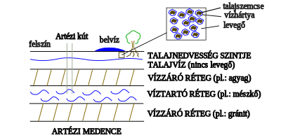

---

- [Vissza az előző oldalra](../foldrajz.md)
- [Vissza a főoldalra](../../../../README.md)

---

# Év végi szóbeli vizsga

---

    
Halmazállapot változások ismerete példákkal illusztrálva, nagyobb tavaink kialakulása.

---

## Halmazállapot-változások

A halmazállapot-változás az az állapot, amikor egy anyag fizikai tulajdonságai megváltoznak anélkül, hogy kémiai összetétele módosulna. Ezek a változások általában hőmérséklet- és nyomásfüggőek. Az energia felvétele vagy leadása kíséri őket. A négy alapvető halmazállapot a szilárd, folyékony, gáz és plazma, de a mindennapi életben leginkább az első hárommal találkozunk.

Nézzük a leggyakoribb halmazállapot-változásokat és példákat rájuk:
- Olvadás: Szilárd halmazállapotból folyékonnyá válás hőfelvétel hatására.
    - Példa: A jég felolvad vízzé egy pohárban, vagy a vaj megolvad a forró serpenyőben.

- Fagyás (megszilárdulás): Folyékony halmazállapotból szilárddá válás hőleadás hatására.
    - Példa: A víz jéggé fagy a fagyasztóban, vagy a megolvadt csokoládé újra megszilárdul hűtés hatására.

- Párolgás (forrás): Folyékony halmazállapotból gázzá válás hőfelvétel hatására. A párolgás a folyadék felszínén megy végbe bármilyen hőmérsékleten, míg a forrás a folyadék belsejében is buborékok képződésével, meghatározott hőmérsékleten (forráspont).
    - Példa: A nedves ruha megszárad a napon (párolgás), vagy a fazékban forró víz gőzzé válik (forrás).

- Kondenzáció (lecsapódás): Gáz halmazállapotból folyékonnyá válás hőleadás hatására.
    - Példa: A hideg ablaküvegen kicsapódik a pára, vagy a felhőkből eső hullik.

- Szublimáció: Szilárd halmazállapotból közvetlenül gázzá válás folyékony állapot kihagyásával, hőfelvétel hatására.
    - Példa: A szárazjég (szilárd szén-dioxid) közvetlenül gázzá alakul szobahőmérsékleten, vagy a fagyasztóban lévő jégkockák idővel kisebbek lesznek anélkül, hogy előbb vízzé válnának.

- Depozíció (kicsapódás): Gáz halmazállapotból közvetlenül szilárddá válás folyékony állapot kihagyásával, hőleadás hatására.
    - Példa: A dér képződése hideg felületeken, amikor a levegőben lévő vízgőz közvetlenül jéggé fagy.

## Nagyobb tavaink kialakulása

Magyarország nagyobb tavai, mint a Balaton, a Fertő tó és a Velencei-tó, mindannyian geológiai folyamatok eredményeként jöttek létre, bár a pontos mechanizmusban vannak különbségek.

### Balaton
A Balaton Közép-Európa legnagyobb tava, és a kialakulása egy összetett geológiai történet eredménye. Főként tektonikus mozgásokhoz, azaz a Föld kérgének süllyedéséhez köthető.
- Tektonikus süllyedés: A miocén korban (kb. 23-5 millió évvel ezelőtt) a mai Balaton medencéje egy hatalmas, fokozatosan süllyedő árkot képezett a Pannon-medence tektonikus mozgásainak hatására. Ezt a süllyedést törésvonalak mentén zajló mozgások kísérték.
- Folyóvízi feltöltődés: A süllyedő medencét a Pannon-tenger visszahúzódása után (amely egy hatalmas, sekély beltenger volt a mai Kárpát-medence helyén) folyóvizek, például az Ős-Zala öntötte el és töltötte fel üledékkel.
- Vízgyűjtő terület: A mai Balaton kialakulásában kulcsszerepe volt a vízgyűjtő területéről érkező csapadékvíznek és a befolyó patakoknak. Az éghajlatváltozások is befolyásolták a tó vízszintjét és méretét a geológiai idők során.

### Fertő tó
A Fertő tó (Neusiedler See) Közép-Európa harmadik legnagyobb tava, és Ausztria, valamint Magyarország határán fekszik. A Fertő tó is tektonikus eredetű, hasonlóan a Balatonhoz.
- Tektonikus eredet: A tómedence egy észak-déli irányú tektonikus árokban fekszik, amely a harmadidőszak végén, a negyedidőszak elején süllyedt be. Ezt a süllyedést szintén a Pannon-medence geológiai mozgásai okozták.
- Sekély mélység: A Fertő tó rendkívül sekély, átlagos mélysége mindössze 1 méter körüli. Emiatt a vízszintje erősen ingadozik, és a tó időszakosan akár ki is száradhatott a múltban.
- Iszapos feltöltődés: A sekély medencét folyamatosan tölti fel az iszap és az üledék, amelyet a befolyó patakok és a szél hord be. A nádasok kiterjedt területei is hozzájárulnak a tó feltöltődéséhez.

### Velencei-tó
A Velencei-tó Magyarország harmadik legnagyobb természetes tava, és a Balatonhoz hasonlóan tektonikus süllyedés eredménye.
- Tektonikus mélyedés: A tómedence egy törésvonal mentén keletkezett süllyedékben fekszik, amely a harmadidőszak végén, negyedidőszak elején alakult ki a Gerecse és a Velencei-hegység közötti területen.
- Folyóvízi eredet: A mélyedést a történelem során különböző folyók (pl. az Ős-Duna egykori ágai) táplálták, amelyek lerakódásai hozzájárultak a tómedence kialakulásához.
- Sekély, ingadozó vízszint: A Velencei-tó is viszonylag sekély, átlagosan 1,5 méter mély. Vízszintjét nagyban befolyásolja a csapadék mennyisége és a befolyó patakok vize.

Összességében elmondható, hogy nagyobb tavaink kialakulásában a tektonikus mozgások, amelyek a Föld kérgének süllyedését eredményezték, játszották a legfontosabb szerepet, amit a vízgyűjtő területekről érkező csapadék és a befolyó vizek feltöltése egészített ki.

---

    
Felhő-és csapadékképződés, jellegzetes talaj menti és felhőből hulló csapadékfajták.

---

## Felhő- és Csapadékképződés

A felhő- és csapadékképződés a légkörben zajló bonyolult fizikai folyamatok eredménye, melyek a vízkörforgás fontos részét képezik.

### Felhőképződés
A felhők képződéséhez három alapfeltétel szükséges:
- Vízgőz a levegőben: A Föld felszínéről (óceánok, tavak, folyók, talaj, növények) elpárolgó víz formájában vízgőz kerül a légkörbe.
- Levegő lehűlése a harmatpont alá: Ahhoz, hogy a vízgőz folyékony vízcseppé vagy szilárd jégkristállyá alakuljon, a levegőnek le kell hűlnie egy bizonyos hőmérsékletre, az úgynevezett harmatpontra. A harmatpont az a hőmérséklet, amelyen a levegő telítetté válik vízgőzzel, és további lehűlés hatására a vízgőz kicsapódik (kondenzálódik). A levegő lehűlhet:
    - Felszálló áramlatok: A meleg, nedves levegő felemelkedik (konvekció), és a magasabb, hidegebb légrétegekbe jutva lehűl. Ez gyakori folyamat például nyári zivatarok esetén.
    - Orografikus emelkedés: Amikor a levegő egy hegyláncba ütközik, felemelkedésre kényszerül, és lehűl.
    - Frontális emelkedés: Hideg és meleg légtömegek találkozásakor a melegebb, könnyebb levegő a hideg, sűrűbb levegő fölé emelkedik, és közben lehűl.
    - Sugárzásos lehűlés: Éjszaka a talaj és az azt körülvevő levegő kisugározza a hőt az űrbe, lehűlve ezzel.
- Kondenzációs magok: A levegőben lebegő apró por-, pollen-, sókristály- vagy koromszemcsék (aeroszolok) felülete biztosítja azokat a parányi felületeket, amelyeken a vízgőz kicsapódhat. Ezek nélkül a vízgőz alig, vagy egyáltalán nem kondenzálódna.

Amint a vízgőz kicsapódik, apró, mikroszkopikus méretű vízcseppek vagy jégkristályok keletkeznek, amelyek a levegőben lebegve alkotják a felhőket.

### Csapadékképződés
A felhőkben lévő parányi vízcseppek (kb. 0,01 mm átmérőjűek) túl kicsik ahhoz, hogy csapadékként lehulljanak. A csapadékképződéshez a felhőelemeknek jelentősen meg kell nőniük. Ez két fő mechanizmussal történhet:
- Kollízió-koaleszcencia (ütközés-egyesülés) folyamat (meleg felhőkben):
    - Meleg felhőkben (ahol a hőmérséklet 0°C felett van) a különböző méretű vízcseppek eltérő sebességgel mozognak és ütköznek egymással.
    - Az ütközés során a kisebb cseppek beolvadnak a nagyobbakba, vagy a nagyobb cseppek "begyűjtik" a kisebbeket.
    - Ahogy a cseppek mérete növekszik, egyre nagyobb súlyuk lesz, míg végül a gravitáció legyőzi a levegő felhajtóerejét és a feláramlásokat, és csapadékként lehullanak.
- Bergeron-Findeisen folyamat (hideg felhőkben, vagy vegyes fázisú felhőkben):
    - Ez a legfontosabb csapadékképződési mechanizmus a mérsékelt égövön.
    - Olyan felhőkben megy végbe, amelyekben egyidejűleg vannak jelen túlhűlt vízcseppek (0°C alatt, de még folyékonyak) és jégkristályok.
    - A vízgőznyomás telítési értéke alacsonyabb a jégkristályok felett, mint a túlhűlt vízcseppek felett. Ez azt jelenti, hogy a jégkristályok könnyebben gyűjtik a vízgőzt, mint a folyékony vízcseppek.
    - A vízgőzmolekulák a túlhűlt vízcseppek felületéről elpárolognak, és a jégkristályokra fagyva növelik azok méretét.
    - A jégkristályok gyorsan növekednek, leesnek a felhőből, és útközben olvadva esővé válnak (ha a felhő alatti levegő hőmérséklete 0°C felett van), vagy hóként hullanak le (ha a hőmérséklet 0°C alatt marad).

### Jellegzetes csapadékfajták
A csapadékokat két fő csoportra oszthatjuk: talaj menti csapadékok és felhőből hulló csapadékok.

#### Talaj menti csapadékfajták
Ezek a csapadékok a felszín közelében, a lehűlt levegőből közvetlenül a tárgyakra vagy a talajra válnak ki.
- Harmat:
    - Kialakulása: Derült, szélcsendes éjszakákon, amikor a talaj és az azt körülvevő levegő a kisugárzás miatt gyorsan lehűl. Ha a felszín hőmérséklete a harmatpont alá csökken, és a hőmérséklet 0°C felett marad, a levegőben lévő vízgőz apró vízcseppek formájában kicsapódik a hideg felületeken (fűszálakon, leveleken, autókon).
    - Jellemzői: Apró, átlátszó vízcseppek.
    - Példa: Kora reggeli harmatcseppek a fűben.
- Dér:
    - Kialakulása: Hasonlóan a harmathoz, derült, szélcsendes éjszakákon keletkezik, de akkor, ha a felszín hőmérséklete 0°C alá süllyed. A vízgőz ekkor közvetlenül szilárd halmazállapotba (jégkristályokká) fagy, ahelyett, hogy vízcseppé válna. Ez tulajdonképpen depozíció.
    - Jellemzői: Fehér, pelyhes, kristályos bevonat.
    - Példa: Dér borítja a fűszálakat és a növényeket hideg reggel.
- Zúzmara:
    - Kialakulása: Főként hideg, ködös, párás időben, amikor a levegő hőmérséklete fagypont alatt van. A ködben lévő túlhűlt vízcseppek ráfagynak a hideg tárgyakra (faágakra, vezetékekre, oszlopokra), amelyek hőmérséklete 0°C alatti. A szél áramlása segíti a képződését, mivel újabb túlhűlt cseppeket juttat a tárgyakhoz.
    - Jellemzői: Fehér, amorf (alaktalan) vagy kristályos jéglerakódás, amely a szélirány felőli oldalon vastagabb.
    - Példa: A faágakon vastagon képződő fehér bevonat télen, tartós ködös időben.
- Köd:
    - Kialakulása: Lényegében a talajfelszínhez közeli felhő. Akkor keletkezik, amikor a talajközeli levegő a harmatpont alá hűl, és a vízgőz apró vízcseppek (vagy jégkristályok, ha fagypont alatt van) formájában kicsapódik a levegőben lévő kondenzációs magvakon.
    - Jellemzői: A látástávolságot erősen rontó, földfelszínhez közeli felhőzet.
    - Példa: Vastag köd borítja a tájat hideg, párás reggelen.

#### Felhőből hulló csapadékfajták
Ezek a csapadékok a felhőkből hullanak alá a gravitáció hatására.
- Eső:
    - Kialakulása: Amikor a felhőben (általában réteges esőfelhőből, nimbostratus vagy vastag stratocumulus) a vízcseppek elég nagyra nőnek (általában 0,5 mm-nél nagyobb átmérőjűek), hogy lehulljanak. A légkör teljes keresztmetszetében 0°C feletti a hőmérséklet.
    - Jellemzői: Folyékony halmazállapotú, folytonos, viszonylag egyenletes intenzitású csapadék.
    - Példa: Hosszú, csendes eső a nap folyamán.
- Szitálás:
    - Kialakulása: Hasonló az esőhöz, de a vízcseppek sokkal kisebbek (kevesebb mint 0,5 mm átmérőjűek), és nagyon kis intenzitással hullanak. Általában alacsony rétegfelhőkből (stratus) vagy ködből hullik.
    - Jellemzői: Alig észrevehető, finom, cseppekből álló csapadék, amely lassan hullik.
    - Példa: Ködös, enyhe napon szitáló eső.
- Hó:
    - Kialakulása: Amikor a felhőben keletkező jégkristályok a felszínig vezető úton végig 0°C alatti hőmérsékletű levegőben maradnak. A jégkristályok összeállhatnak hópelyhekké.
    - Jellemzői: Szilárd halmazállapotú, fehér, kristályos csapadék.
    - Példa: Hóesés télen.
- Havas eső:
    - Kialakulása: Amikor a felhőből hó hullik, de a levegőben van egy vékony, 0°C feletti réteg, ahol a hó részben megolvad, majd egy újabb, 0°C alatti rétegben ismét lehűl, de nem fagy meg teljesen. Eredményül hó és eső keveréke hullik.
    - Jellemzői: Hó és eső egyidejű hullása.
    - Példa: A tavaszi vagy őszi időszakban gyakori.
- Ónos eső:
    - Kialakulása: Akkor keletkezik, amikor a magasabb légrétegekben eső hullik, majd a felszín közelében egy vastag, 0°C alatti, hideg légréteg található (úgynevezett hidegpárna). Az esőcseppek ezen a hideg rétegen áthaladva túlhűltté válnak (folyékonyak maradnak fagypont alatt), majd a hideg tárgyaknak vagy a talajnak ütközve azonnal jéggé fagynak.
    - Jellemzői: Átlátszó, jégbevonat, amely rendkívül csúszóssá teheti az utakat, tárgyakat.
    - Példa: Tél elején vagy végén gyakori, amikor a hideg légtömeg a talaj közelében megreked.
- Hódara:
    - Kialakulása: Általában gomolyfelhőkből (cumulus) hullik. Apró, átlátszatlan jégszemcsék, amelyek a túlhűlt vízcseppeknek jégkristályokra való ráfagyásával keletkeznek. Ezek lazább szerkezetűek, mint a jégdara, és általában puha, pelyhes tapintásúak.
    - Jellemzői: Fehér, puha, rugalmas jégszemcsék, 2-5 mm átmérővel.
    - Példa: Tavaszi záporokban előfordulhat.
- Jégdara (jégszemcse):
    - Kialakulása: Hasonlóan a hódarához, de a jégszemcsék átlátszóak és keményebbek. Túlhűlt vízcseppek fagynak rá jégkristályokra, majd a feláramlásban többször is felemelkedhetnek és ismét fagyhatnak.
    - Jellemzői: Átlátszó, kemény jéggömböcske, 2-5 mm átmérővel, belül gyakran fehér maggal.
    - Példa: Gyakran esővel együtt hullik.
- Jégeső:
    - Kialakulása: Erős feláramlásokkal rendelkező zivatarfelhőkből (cumulonimbus) hullik. A jégdarabok a felhőben többször is fel-le mozognak, minden körben újabb jégréteget szedve magukra, amíg olyan nagyok nem lesznek, hogy a feláramlás már nem tudja megtartani őket. Emiatt a jégdaraboknak réteges szerkezete van.
    - Jellemzői: Gömb vagy szabálytalan alakú, gyakran több centiméteres átmérőjű jégdarabok, amelyek komoly károkat okozhatnak.
    - Példa: Nyári heves zivatarokat kísérő, pusztító jelenség.

---

    
Felszín alatti vizek ismertetése, folyók jellemzői (torkolat típusok, vízhozam...).

---

## Felszín alatti vizek
A felszín alatti vizek azok a vizek, amelyek a talajszint alatt, a kőzetek pórusaiban és repedéseiben helyezkednek el. Jelentőségük hatalmas, hiszen a Föld édesvízkészletének legnagyobb részét képezik, és számos ökoszisztéma, valamint emberi tevékenység számára létfontosságúak.

A felszín alatti vizek kialakulása és mozgása a víz körforgásának szerves része. A csapadék (eső, hó) egy része beszivárog a talajba, majd a vízzáró rétegig lefelé haladva kitölti a pórusokat és repedéseket.

### Felszín alatti vizek típusai:
- Talajvíz:
    - Ez a felszín alatti vizek legfelső rétege, amely a vízzáró réteg felett helyezkedik el.
    - A talajvízszint (a talajvíz felső határa) ingadozik a csapadékmennyiség, a párolgás és a vízkivételek függvényében.
    - Általában a felszínhez közel található, ezért könnyen szennyeződhet. Fontos ivóvízforrás lehet, de tisztítása gyakran szükséges.
    - A kutak döntő többsége a talajvizet csapolja meg.

- Rétegvíz:
    - A talajvíz alatt, két vízzáró réteg közé bezárva helyezkedik el.
    - Mivel alulról és felülről is vízzáró réteg határolja, általában nagyobb nyomás alatt van, és tisztább, mint a talajvíz, mivel kevésbé érzékeny a felszíni szennyeződésekre.
    - Gyakran ivóvízellátásra használják.
    - Ha a rétegvíz nyomása olyan nagy, hogy a fúrás helyén a víz magától a felszínre tör, artézi kútról beszélünk.
- Karsztvíz:
    - Karsztos területeken (mészkőből, dolomitból álló vidékeken) alakul ki, ahol a víz a kőzet repedésein, hasadékain keresztül szivárog le, oldva a kőzetet és üregeket, barlangokat hozva létre.
    - A karsztvíz áramlása gyors és bonyolult, a járatok rendszerein keresztül történik.
    - A karsztforrásokból gyakran nagy mennyiségű, hideg, tiszta víz tör elő.
    - Példa: Aggteleki-karszt, Bakony.
- Hévíz (Termálvíz):
    - A felszín alatti vizek közül a hévíz az, amelynek hőmérséklete meghaladja a 20°C-ot, és a földkéreg mélyebb rétegeiből, geotermikus energia hatására melegedve tör fel.
    - Ásványi anyagokban gazdag, és gyógyászati, fürdő- és fűtési célokra is hasznosítják.
    - Példa: Budapest számos gyógyfürdője (Széchenyi, Gellért), Hévízi-tó.

### Folyók jellemzői

A folyók természetes vízáramlások, amelyek egy meghatározott mederben, a gravitáció hatására a magasabb területekről az alacsonyabbak felé haladnak, végül tavakba, tengerekbe, óceánokba torkollanak.

#### A folyók szakaszai és jellemzői:
A folyók jellegzetesen három szakaszra oszthatók:
- Felső szakasz (hegyi szakasz):
    - Jelentős esés, nagy sebességű áramlás.
    - Fő tevékenysége az erózió (pusztítás): a folyó mélyíti és tágítja a völgyét, hordalékot szállít.
    - Jellemző formák: V-alakú völgyek, vízesések, zúgók, szurdokok.
    - Hordalék: durva szemcsés, nagy kövek, görgetegek.
- Középső szakasz (dombvidéki, síkvidéki átmeneti szakasz):
    - Az esés csökken, a sebesség lassul.
    - Az erózió és az akkumuláció (feltöltés) egyensúlyba kerül.
    - Jellemző formák: szélesebb völgyek, kanyarulatok (meanderek) kezdenek kialakulni, zátonyok, szigetek jelennek meg.
    - Hordalék: vegyes szemcsézetű, homok, kavics.
- Alsó szakasz (síkvidéki szakasz):
    - Nagyon csekély esés, lassú áramlás.
    - Fő tevékenysége az akkumuláció: a folyó lerakja a hordalékát, feltölti a medrét és a környező síkságot.
    - Jellemző formák: széles árterek, holtágak, morotvák, ártéri erdők, delta.
    - Hordalék: finom szemcsés, iszap, agyag.

### Vízhozam:
A vízhozam (vagy debitek) az a víztérfogat, amely egy folyó adott keresztmetszetén időegység alatt átfolyik. Mértékegysége általában m3/s (köbméter per másodperc).
- Jelentősége: A vízhozam alapvető hidrológiai adat, amely befolyásolja a folyó energiáját, hordalékszállítási képességét, a vízellátást, árvízvédelmet és a vízi élővilágot.
- Ingadozása: A vízhozam a csapadékmennyiség, a hóolvadás, a párolgás, a vízkivételek (öntözés, ivóvíz) és a mellékfolyók befolyása miatt folyamatosan ingadozik. Megkülönböztetünk kisvízi, középvízi és nagyvízi időszakokat.
- Vízjárás: A vízhozam időbeli változását a vízjárás jellemzi.

### Torkolattípusok:
A torkolat az a hely, ahol egy folyó egy nagyobb víztestbe (óceánba, tengerbe, tóba vagy másik folyóba) ömlik. Két fő torkolattípus létezik:
- Delta torkolat:
    - Kialakulása: Akkor alakul ki, ha a folyó az alsó szakaszán hatalmas mennyiségű hordalékot (iszap, homok) szállít, és a torkolatánál a tenger, tó vagy óceán vize sekély, árapály-mentes (vagy gyenge árapályú) és a folyók áramlásánál kisebb az eróziós hatása. A folyó lelassul, a hordalék lerakódik, elzárva a főágat, ami miatt a folyó több kisebb ágra (deltoid ágra) bomlik szét, és egy jellegzetes, háromszög vagy legyező alakú feltöltődés (delta) jön létre.
    - Jellemzői: Elágazó folyóágak, sekély, mocsaras, üledékkel feltöltött terület, gazdag élővilág.
    - Példák: Nílus-delta, Duna-delta, Mississippi-delta.
- Tölcsértorkolat (esztuárium):
    - Kialakulása: Akkor jön létre, ha a folyó viszonylag kevés hordalékot szállít, vagy a torkolatnál erős az árapály és/vagy tengeráramlatok, amelyek elszállítják a folyó hordalékát, így megakadályozva a delta képződését. A folyó egyetlen, tölcsérszerűen kiszélesedő öbölben éri el a tengert.
    - Jellemzői: Egyetlen, széles, tölcsér alakú torkolat, ahol a sós és édesvíz keveredik (brakkvíz). Fontos hajózási útvonalak, kikötők jöhetnek létre itt.
    - Példák: Thames torkolata (Anglia), Elba torkolata (Németország), Szent Lőrinc-folyó torkolata (Kanada).

Ezen felül létezik még a sima torkolat is, ahol a folyó viszonylag egyenesen ömlik a víztestbe, anélkül, hogy jelentős delta vagy tölcsér alakulna ki.

---

    
Ciklonok és frontok kialakulása, jellemzői, anticiklonok jellegzetességei.

---

A ciklonok, frontok és anticiklonok a légkör dinamikus rendszereinek kulcsfontosságú elemei, melyek alapvetően meghatározzák az időjárás alakulását a Földön.

## Ciklonok

A ciklon egy nagy kiterjedésű, közel függőleges tengelyű légörvény, amelyben a légnyomás a középpont felé haladva csökken (alacsony nyomású rendszer). Az északi féltekén az óramutató járásával ellentétes, a déli féltekén az óramutató járásával megegyező irányban forog a Coriolis-erő hatására.

### Kialakulása:
A mérsékelt övi ciklonok kialakulása a polárfront elmélet alapján írható le a legjobban:
- Sarki front hullámzása: A hideg (sarki) és meleg (szubtrópusi) légtömegek találkozási zónáját nevezzük polárfrontnak. Ez a front eredetileg egyenes, de különböző zavarok (pl. hegyek, légáramlások) hatására hullámzást mutat. A hideg levegő dél felé, a meleg levegő észak felé mozdul el.
- Hullám erősödése és örvénylés: A hullám erősödik, és az érintkezési vonalon örvénylés alakul ki. A meleg levegő "nyelvét" hideg levegő veszi körül.
- Frontok képződése: Az örvényben két fő időjárási front alakul ki:
    - Melegfront: ahol a meleg levegő a hideg fölé siklik.
    - Hidegfront: ahol a hideg levegő a meleg alá ékelődik.
    - A ciklon középpontjában a légnyomás a legalacsonyabb.
- Okklúzió (elzáródás): A hidegfront általában gyorsabban mozog, mint a melegfront. Ennek következtében a hidegfront utoléri a melegfrontot, és a két frontfelület egybekapcsolódik, létrehozva az okklúziós frontot. Ez a folyamat (okklúzió) a ciklon életének végét, gyengülését jelzi, mivel a meleg levegő elszakad a felszíntől.
- Feloszlás: Az okklúzió során a meleg levegő teljesen felemelkedik, elszigetelődik a talajtól, és a ciklon fokozatosan feloszlik.

### Jellemzői és időjárása:
- Légnyomás: Középpontjában alacsony (minimum 1015 hPa alatt).
- Szél: Az északi féltekén az óramutató járásával ellentétes irányban, spirálisan a középpont felé fúj (konvergens áramlás).
- Vertikális mozgás: A középpontban a levegő felszáll. Ez a feláramlás a vízgőz kondenzációjához és felhőképződéshez vezet.
- Felhőzet és csapadék: Általában felhősebb, borultabb, csapadékosabb időjárás jellemzi. A markáns időjárási változások a frontátvonulásokhoz kapcsolódnak.
- Hőmérséklet: A ciklonon belül jelentős hőmérsékleti különbségek vannak a hideg és meleg légtömegek jelenléte miatt.
- Kiterjedés: Több száz, akár több ezer kilométer átmérőjű.
- Élettartam: Néhány naptól egy hétig terjedhet.
- Mozgás: A mérsékelt övben általában nyugatról kelet felé mozognak.

### Trópusi ciklonok:
Külön kategória a trópusi ciklon, melyek a meleg (26-27°C feletti) tengerfelszínek felett, a 10. és 20. szélességi kör között alakulnak ki. Energiaforrásuk a vízgőz kondenzációjából felszabaduló látens hő. Nincsenek bennük frontok, középpontjukban egy felhőmentes, nyugodt "szem" található. Neveik: hurrikán (Karib-tenger, Észak-Amerika), tájfun (Délkelet-Ázsia), ciklon (Indiai-óceán). Rendkívül pusztítóak lehetnek, óriási szélsebességgel és özönvízszerű esővel.

## Frontok
A frontok a légkörben eltérő fizikai tulajdonságú (hőmérséklet, páratartalom, sűrűség) légtömegek közötti átmeneti zónák, határfelületek. Nem éles vonalak, hanem több tíz, vagy száz kilométer széles átmeneti sávok.

A frontok közeledését általában a légnyomás süllyedése, a páratartalom emelkedése, a szélfordulás és szélerősödés, valamint jellegzetes felhőképek jelzik.
1. Melegfront:
- Kialakulása: Akkor keletkezik, amikor egy meleg légtömeg hideg légtömeg felé mozog, és annak tetejére fölé siklik, mivel a meleg levegő könnyebb. A frontfelület nagyon lapos szögben emelkedik.
- Időjárása (átvonulás előtt és alatt):
    - Légnyomás: Folyamatosan és erősen csökken.
    - Felhőzet: Először magas szintű fátyolfelhők (cirrus, cirrostratus) jelennek meg, majd fokozatosan rétegfelhők (altostratus, nimbostratus) vastagodnak és süllyednek.
    - Csapadék: Általában hosszú, egyenletes, csendes eső (vagy hó) hullik a front előtt és alatt.
    - Hőmérséklet: A front átvonulásával fokozatosan emelkedik.
    - Szél: Általában gyengébb, egyenletesebb szél.
    - Látástávolság: Rosszabb, párásabb.
- Jellemzői: Hosszú, kiterjedt csapadékzóna. A tünetek gyakran már órákkal a front átvonulása előtt jelentkezhetnek (fejfájás, vérnyomás-ingadozás).
2. Hidegfront:
- Kialakulása: Akkor keletkezik, amikor egy hideg légtömeg mozdul el a meleg légtömeg felé, és a nagyobb sűrűsége miatt a meleg levegő alá ékelődik, azt hirtelen felemelve. A frontfelület meredekebb, mint a melegfronté.
- Időjárása (átvonulás előtt és alatt):
    - Légnyomás: A front előtt csökken, majd az átvonuláskor hirtelen és jelentősen emelkedik.
    - Felhőzet: Gyakran tornyos, gomolyos felhők (cumulus, cumulonimbus – zivatarfelhők) jellemzőek. Az üllő alakú zivatarfelhők a hidegfront legszembetűnőbb jelzői.
    - Csapadék: Heves, rövid ideig tartó záporok, zivatarok, jégesővel kísérve.
    - Hőmérséklet: Az átvonulás után hirtelen és jelentősen csökken.
    - Szél: Gyakran lökésszerűen viharossá erősödik, szélfordulással jár.
    - Látástávolság: Az átvonulás után jelentősen javul, kitisztul a levegő.
- Jellemzői: Keskenyebb, de intenzívebb csapadéksáv. A tünetek (pl. ízületi fájdalmak, asztmás rohamok) inkább a front átvonulása után jelentkezhetnek.
3. Okklúziós front (záródott front):
- Kialakulása: Amikor a gyorsabban mozgó hidegfront utoléri a melegfrontot, és a meleg légtömeget teljesen a magasba kényszeríti. Két típusa van:
    - Hideg okklúzió: Ha az okklúziós front mögötti hideg levegő hidegebb, mint a front előtti hideg levegő.
    - Meleg okklúzió: Ha az okklúziós front mögötti hideg levegő enyhébb, mint a front előtti hideg levegő.
- Időjárása: Összetett, a meleg- és hidegfront jellemzőit ötvözi. Kezdetben intenzív csapadék, majd a ciklon gyengülésével a csapadék is alábbhagy.
4. Stacionárius front (állófront):
- Kialakulása: Amikor két eltérő légtömeg határa hosszú ideig egy helyben marad, és egyik légtömeg sem tudja kiszorítani a másikat.
- Időjárása: Napokig tartó, egyhangú, gyakran borult, szitáló esős, esetleg ködös idő.

## Anticiklonok
Az anticiklon (más néven magas nyomású rendszer) egy nagy kiterjedésű, közel függőleges tengelyű légörvény, amelyben a légnyomás a középpont felé haladva növekszik (magas nyomású rendszer). Az északi féltekén az óramutató járásával megegyező, a déli féltekén az óramutató járásával ellentétes irányban forog a Coriolis-erő hatására.

### Kialakulása:
Az anticiklonok többnyire ott jönnek létre, ahol a levegő a magasban leszáll, és a felszínen szétáramlik.
- Leszálló légáramlások: A ciklonok környezetében, vagy a nagyméretű légkörzésben (pl. szubtrópusi magasnyomású övben) a levegő leáramlik.
- Lehűlés a felszínen: Télen a szárazföldek (pl. Szibéria) felett az erős felszíni kisugárzás következtében a levegő hideggé és sűrűvé válik, ami magas nyomású rendszert hoz létre.

### Jellemzői és időjárása:
- Légnyomás: Középpontjában magas (általában 1015 hPa felett, nem ritkán 1040 hPa feletti értékekkel).
- Szél: Az északi féltekén az óramutató járásával megegyező irányban, spirálisan a középponttól kifelé fúj (divergens áramlás).
- Vertikális mozgás: A középpontban a levegő leszáll. Ez a leáramlás melegíti és szárítja a levegőt, gátolja a felhőképződést.
- Felhőzet és csapadék: Általában derült, felhőmentes, száraz, csapadékmentes időjárás jellemző.
- Hőmérséklet:
    - Nyáron: Tartós, zavartalan napsütés, nagy meleg, kánikula, nagy napi hőingás (éjszaka erős kisugárzás miatt hideg lehet).
    - Télen: Gyakran stabil, hideg, ködös, párás idő (különösen a Kárpát-medencében a hidegpárna miatt). Ilyenkor az inverzió miatt a talaj közelében hidegebb van, mint a magasban. Derült téli anticiklonban viszont nagyon hideg éjszakák lehetnek.
- Légszennyezettség: Ködös, szélcsendes anticiklonos helyzetekben a légszennyező anyagok a felszín közelében rekednek, rontva a levegő minőségét.
- Kiterjedés: Általában kisebb, mint a ciklonoké (400-600 km).
- Élettartam: Akár több hétig is fennmaradhatnak, stabilabb képződmények, mint a ciklonok.
- Mozgás: Általában keveset mozognak, viszonylag állandóak.

:memo: Összefoglalva: A ciklonok alacsony nyomású, örvénylő rendszerek, amelyek feláramlással, felhőkkel és csapadékkal járnak, és gyakran fronthatások kísérik. Az anticiklonok magas nyomású, örvénylő rendszerek, amelyek leszállással, tiszta éggel és száraz idővel járnak, de télen ködös, párás időt is okozhatnak.

---

    
A tengervíz mozgásai, különösen a tengeráramlatok kialakulása és hatásai, ismertebb hazai és európai tavak kialakulása.

---

## A tengervíz mozgásai
A tengervíz sosem áll mozdulatlanul; folyamatosan mozgásban van. Ezt a mozgást alapvetően három fő típusra oszthatjuk: a hullámzásra, az árapályra és a tengeráramlatokra.

## Hullámzás
A hullámzás a szél hatására jön létre a vízfelszínen. A szél energiát ad át a víznek, ami a vízrészecskék körkörös vagy ellipszis alakú mozgásával jár. Fontos megjegyezni, hogy a hullámok nem a víztömeget, hanem az energiát továbbítják. Egy hullámzó tengerben a vízrészecskék csak minimális mértékben mozdulnak el, miközben a hullámforma halad.
- Kialakulása: A szél ereje, időtartama és a nyílt vízfelület (hullámfront) hossza határozza meg a hullámok méretét. Erős szél, hosszú ideig tartó fúvás és nagy vízfelület hatalmas hullámokat generálhat.
- Típusai:
    - Szélhullámok: A szél közvetlen hatására keletkeznek.
    - Holt hullámok (duzzadó hullámok): A szél elültével is megmaradó, messze elkúszó, szabályos hullámok.
    - Törőhullámok: Amikor a hullám megközelíti a partot és a vízmélység a hullám magasságának kb. 1,3-szerese lesz, a hullám teteje túlságosan gyorsan mozog ahhoz képest, hogy az alja súrlódna a fenéken. Emiatt instabillá válik és "összetörik", habzó víztömeggé válik.
    - Cunami: Nem a szél, hanem tenger alatti földrengések, vulkánkitörések vagy tenger alatti földcsuszamlások által kiváltott óriási, hosszú hullámok, amelyek a nyílt óceánon alig észrevehetőek, de a partokhoz közeledve pusztító magasságúvá válhatnak.
## Árapály (tengerjárás)
Az árapály a Hold és kisebb mértékben a Nap gravitációs vonzásának, valamint a Föld forgásából adódó centrifugális erőnek a következménye.
- Kialakulása: A Hold gravitációs vonzása a Földnek a Holdhoz közelebb eső oldalán nagyobb, mint a Föld középpontjában, és kisebb a Föld Holdtól távolabbi oldalán. Ez a különbség okozza a víztömeg deformációját. Emellett a Föld és a Hold rendszerének forgása során keletkező centrifugális erő is hozzájárul a víztömeg "kitüremkedéséhez" a Holddal ellentétes oldalon. Ennek eredményeként a Földnek két oldalán egyszerre keletkezik "dagály dudor".
- Típusai:
    - Dagály (magasvíz): Amikor a vízszint emelkedik.
    - Apály (alacsonyvíz): Amikor a vízszint süllyed.
- Gyakoriság: Naponta általában két dagály és két apály váltja egymást, mivel a Föld 24 óra alatt egyszer fordul meg a tengelye körül, és a Hold is mozog. Így két dagály között kb. 12 óra 25 perc telik el.
- Árapály-ingadozás: Ennek mértéke helytől függően változó, a nyílt óceánon mindössze néhány centiméter, míg szűk öblökben (pl. Fundy-öböl) akár 15-20 métert is elérhet.
- Szökőár és vakár:
    - Szökőár: Akkor alakul ki, amikor a Nap, a Hold és a Föld egy vonalba esik (újhold vagy telihold idején). Ekkor a Nap és a Hold gravitációs ereje összeadódik, és különösen magas dagályok és alacsony apályok jönnek létre.
    - Vakár: Akkor következik be, amikor a Nap és a Hold a Földhöz képest derékszögben áll (első és utolsó negyed idején). Ekkor a két égitest vonzóereje részben kioltja egymást, ami kisebb dagályokat és magasabb apályokat eredményez.
## Tengeráramlatok
A tengeráramlatok a tengervíz nagy kiterjedésű, tartós és szervezett mozgásai, amelyek hatalmas víztömegeket szállítanak az óceánokon keresztül. Kulcsszerepet játszanak a Föld hőmérsékletének eloszlásában és az éghajlat alakulásában.

### Kialakulásuk okai:
- Szél: A domináns szelek (pl. passzátszelek, nyugati szelek) súrlódó hatása az óceánfelszínen hosszan tartó vízáramlást indít el. Ez az egyik legfontosabb tényező a felszíni áramlatok kialakulásában.
- Coriolis-erő: A Föld forgása miatt fellépő tehetetlenségi erő, amely az áramlatokat az északi féltekén jobbra, a déli féltekén balra téríti el eredeti irányuktól. Ezért alakulnak ki az óceáni medencékben az óramutató járásával megegyező (északi félteke) és ellentétes (déli félteke) irányú körforgások (gyre-ek).
- Hőmérséklet- és sótartalom-különbségek (termohalin áramlatok):
    - A hideg víz sűrűbb, mint a meleg víz.
    - A magasabb sótartalmú víz sűrűbb, mint az alacsonyabb sótartalmú.
    - A sarkvidéki területeken a lehűlő, sósabbá váló (a jég képződése során a só kiválik) felszíni víz lesüllyed a mélybe, és hideg, lassú, mélytengeri áramlatokat indít el, amelyek az óceánok alján mozognak. Ez a "globális szállítószalag" néven ismert rendszer létfontosságú a hő elosztásában.
- Kontinensek elhelyezkedése és tengerfenék domborzata: A szárazföldi akadályok és a tengerfenék morfológiája (hegyláncok, árkok) terelik és módosítják az áramlatok irányát.
### Hatásai:
- Éghajlat befolyásolása: Talán a legfontosabb hatásuk az éghajlat alakításában játszott szerepük.
    - Meleg áramlatok: A meleg áramlatok (pl. Golf-áramlat) a trópusi területekről hőt szállítanak a sarkvidékek felé, enyhébbé téve a part menti területek (pl. Nyugat-Európa) éghajlatát.
    - Hideg áramlatok: A hideg áramlatok (pl. Humboldt-áramlat) hűtik a partvidéki területeket, gyakran száraz, sivatagos éghajlatot okozva (pl. Atacama-sivatag).
- Élővilág és halászat: Az áramlatok oxigént és tápanyagokat szállítanak, ami befolyásolja a planktonok és halak eloszlását. A hideg áramlatok által okozott feláramlások (upwelling) tápanyagdús vizet hoznak a felszínre, ami rendkívül gazdag halászterületeket eredményez.
- Hajózás: A tengerészek kihasználják az áramlatokat a gyorsabb és gazdaságosabb utazás érdekében.
- Szennyeződés terjedése: A szennyeződések (pl. olajszennyezés, műanyag hulladék) is az áramlatokkal terjednek, globális problémát okozva.
- Időjárás: Az áramlatok közvetve befolyásolják az időjárási rendszereket, a ciklonok és anticiklonok mozgását.

## Ismertebb hazai és európai tavak kialakulása
### Hazai tavak:
Magyarország legnagyobb tavai geológiai folyamatok eredményeként jöttek létre.
- Balaton:
    - Kialakulása: Főként tektonikus süllyedés következménye. A miocén korban (kb. 23-5 millió éve) a Pannon-medence tektonikus mozgásai során egy hatalmas, fokozatosan süllyedő árok alakult ki, melyet később a Pannon-tenger visszahúzódása után folyóvizek töltöttek fel. Az Ős-Zala folyó is hozzájárult a medence feltöltéséhez. A mai alakja a későbbi vízszint-ingadozások és az emberi beavatkozások (szabályozás) eredménye.
    - Típus: Tektonikus.
- Fertő tó:
    - Kialakulása: Szintén tektonikus eredetű. A tómedence egy észak-déli irányú törésvonal mentén süllyedt be a harmadidőszak végén. Rendkívül sekély (átlagosan kb. 1 méter), vízszintje erősen ingadozik, időszakosan akár ki is száradhat.
    - Típus: Tektonikus.
- Velencei-tó:
    - Kialakulása: A Balatonhoz hasonlóan tektonikus süllyedékben fekszik, mely a Velencei-hegység és a Gerecse közötti területen alakult ki. Az Ős-Duna egykori ágai is táplálták. Sekély tó, érzékeny a vízszint-ingadozásra.
    - Típus: Tektonikus.
### Európai tavak:
Európában számos tó található, melyek a legkülönfélébb geológiai és éghajlati folyamatok eredményeként jöttek létre.
- Genfi-tó (Svájc, Franciaország):
    - Kialakulása: Jellegzetes jégkorszaki (gleccser) eredetű tó. A pleisztocén idején az Alpokból leereszkedő hatalmas gleccserek által kimélyített medencében jött létre. A gleccserek olvadékvize töltötte fel a mélyedést.
    - Típus: Gleccser vájta medence.
- Bodeni-tó (Németország, Svájc, Ausztria):
    - Kialakulása: Szintén gleccser eredetű. Az Alpok előterében elhelyezkedő tavak egyike, melyet a Rajna-gleccser formált.
    - Típus: Gleccser vájta medence.
- Loch Ness (Skócia):
    - Kialakulása: Egy tektonikus törésvonal mentén kialakult, majd jégkorszaki gleccserek által tovább formált és kimélyített tó. Hosszú és keskeny, rendkívül mély.
    - Típus: Tektonikus-gleccser.
- Ladoga-tó (Oroszország):
    - Kialakulása: Európa legnagyobb tava, amely a jégkorszaki gleccserek eróziós tevékenysége és az azt követő posztglaciális felrepeszkedés (a jégtakaró súlyának megszűnése miatti emelkedés) eredménye. Egy hatalmas, alacsonyan fekvő, jég által vájt medencét töltött fel az olvadékvíz és a folyók.
    - Típus: Gleccser-tektonikus.
- Kaszpi-tenger (Európa és Ázsia határán):
    - Kialakulása: Földrajzilag tónak tekinthető, de mérete és sós vize miatt tenger névvel illetik. Egy egykori óceán (Tethys-óceán) maradványa, amely a kontinensek mozgása során elzáródott és fokozatosan zsugorodott. Sós vizét a folyók által behordott sók és a párolgás okozza.
    - Típus: Maradványtó (reliktumtó).
A tavak kialakulása tehát rendkívül sokszínű lehet, függően a geológiai és éghajlati viszonyoktól.

---

    
A levegő felmelegedését befolyásoló tényezők, nevezetes szélességi körök.

---

## A levegő felmelegedését befolyásoló tényezők
A levegő hőmérsékletét alapvetően a ** napsugárzás** energiája határozza meg, de számos más tényező is befolyásolja, hogy ez az energia hogyan oszlik el és hogyan melegíti fel a légkört. A levegő nem közvetlenül a napsugárzástól melegszik fel (a napsugárzás nagy része átengedi a légkörön), hanem a földfelszínről felszálló hőtől.
### A legfontosabb tényezők a következők:
- Földrajzi szélesség (napállás szögállása):
    - Ez a legfontosabb tényező, amely az éghajlati övek kialakulásáért is felelős.
    - A magasabb napállás (egyenesebb napsugárzás) esetén a napsugarak kisebb felületre koncentrálódnak, és kevesebb légkörön kell áthaladniuk, így intenzívebben melegítenek. Ez jellemző az Egyenlítő körüli területekre.
    - A laposabb napállás (ferdébb napsugárzás) esetén a napsugarak nagyobb felületen oszlanak el, és hosszabb utat tesznek meg a légkörben, így energiájuk jobban szétszóródik és elnyelődik. Ez jellemző a sarkvidéki területekre.
    - Az éves hőingás is a szélességi körökkel összefügg: az Egyenlítőnél kicsi, a sarkok felé haladva növekszik.
- A felszín anyaga és színe:
    - Szín: A sötétebb felszínek (pl. aszfalt, sötét talaj, erdő) több napsugárzást nyelnek el, és jobban felmelegszenek, mint a világosabb felszínek (pl. hó, jég, homok), amelyek jobban visszaverik a napsugárzást (magasabb albedó).
    - Anyag: A különböző anyagok eltérően vezetik és tárolják a hőt.
        - A víz lassan melegszik fel és lassan hűl le, nagy a hőtároló képessége. Ezért az óceáni területek hőmérséklete kiegyenlítettebb, mint a szárazföldeké.
        - A szárazföld gyorsan felmelegszik és gyorsan lehűl, kisebb a hőtároló képessége. Ezért a szárazföldi területek (kontinentális éghajlat) hőingása nagyobb.
        - A növényzet párologtatással hűti a környezetét, és csökkenti a talaj felmelegedését.
- Magasság:
    - A troposzférában (a légkör alsó rétege) a hőmérséklet általában a magassággal csökken (átlagosan kb. 0,65°C/100 méter). Ez azért van, mert a levegő elsősorban a földfelszínről melegszik fel, és minél távolabb vagyunk a hőforrástól, annál hidegebb van.
    - A magas hegyek hidegebbek, mint a tengerszint közelében lévő területek.
- Távolság a tengertől (óceánoktól):
    - Az óceánok nagy hőtároló képessége miatt a part menti területek (óceáni éghajlat) hőmérséklete kiegyenlítettebb, mint a kontinensek belső, szárazföldi területeié (kontinentális éghajlat).
    - A tengerpartokon nyáron hűvösebb, télen enyhébb az idő, mint az azonos szélességi körön fekvő, szárazföld belsejében lévő helyeken.
- Tengeráramlatok:
    - A meleg tengeráramlatok (pl. Golf-áramlat) hőt szállítanak a melegebb területekről a hidegebbek felé, így enyhítik a part menti területek (pl. Nyugat-Európa) éghajlatát.
    - A hideg tengeráramlatok (pl. Humboldt-áramlat) hűtik a part menti területeket.
- Domborzat (lejtők fekvése):
    - A déli lejtők (északi féltekén) több napsugárzást kapnak, ezért melegebbek és szárazabbak, mint az északi lejtők. Ez befolyásolja a növényzet eloszlását is (pl. szőlőtermesztés).
    - A völgyekben éjszaka hideglevegő gyűlhet össze (inverzió), ami lehűlhet a környező domboldalakhoz képest.
- Felhőzet és légköri viszonyok:
    - A felhők visszaverik a beérkező napsugárzást (csökkentve a felszín felmelegedését) és gátolják a hőkisugárzást éjszaka (csökkentve a lehűlést). Ezért a felhős ég nappal hűvösebb, éjszaka enyhébb időt eredményezhet.
    - A légköri szennyezőanyagok (pl. aeroszolok, üvegházhatású gázok) is befolyásolják a napsugárzás bejutását és a hő visszatartását.
## Nevezetes szélességi körök
A nevezetes szélességi körök fontosak a Föld éghajlati övezeteinek és a napsugárzás szempontjából.
- Egyenlítő (0° szélesség):
    - A Föld legnagyobb szélességi köre, amely a Földet két egyenlő félre, északi és déli félgömbre osztja.
    - Itt éri a napsugárzás a legmeredekebb szögben a felszínt egész évben, a nap egyenlítői delelése évente kétszer (tavaszi és őszi napéjegyenlőségkor) zenitben van.
    - Emiatt az Egyenlítő környékén a legmagasabb az éves átlaghőmérséklet és a legkisebb az éves hőingás.
- Ráktérítő (Északi Baktérítő) (23,5° északi szélesség):
    - A legészakibb szélességi kör, ahol a Nap nyári napfordulókor (június 21-22. körül) zenitben delel.
    - A trópusi övezet északi határát jelöli.
    - Nevét arról kapta, hogy a Nap ekkor a Rák csillagképben tartózkodott.
- Baktérítő (Déli Ráktérítő) (23,5° déli szélesség):
    - A legdélebbi szélességi kör, ahol a Nap téli napfordulókor (december 21-22. körül) zenitben delel.
    - A trópusi övezet déli határát jelöli.
    - Nevét arról kapta, hogy a Nap ekkor a Bak csillagképben tartózkodott.
- Északi sarkkör (66,5° északi szélesség):
    - Az a szélességi kör, amelytől északra legalább évente egyszer előfordul a sarki éjszaka (a Nap 24 óránál tovább nem kel fel) és a sarki nappal (a Nap 24 óránál tovább nem nyugszik le).
    - Az északi hideg övezet határa.
- Déli sarkkör (66,5° déli szélesség):
    - Az a szélességi kör, amelytől délre legalább évente egyszer előfordul a sarki éjszaka és a sarki nappal.
    - A déli hideg övezet határa.
Ezek a nevezetes szélességi körök segítenek az éghajlati övek (forró, mérsékelt, hideg) elhatárolásában és a napsugárzás térbeli eloszlásának megértésében.

---

    
A légkör szerkezete, ismertebb gázok jellemzése, hatása az élővilágra, élettelen környezetre.

---

## A légkör szerkezete és összetétele
A légkör (atmoszféra) a Földet körülvevő gázburok, amely alapvető fontosságú az élet fenntartásához, a Föld éghajlatának szabályozásához és a káros sugárzások elleni védelemhez.
A légkör réteges szerkezete (hőmérsékleti rétegződés alapján):

A légkör magasság szerinti hőmérsékleti változásai alapján koncentrikus rétegekre osztható:
- Troposzféra:
    - Magasság: A légkör legalsó rétege, a tengerszintről kb. 8 km-ig (sarkoknál) – 18 km-ig (Egyenlítőnél) terjed.
    - Hőmérséklet: A magassággal folyamatosan csökken (átlagosan 0,65 °C/100 m).
    - Jellemzői: Itt zajlanak a legfontosabb időjárási jelenségek (felhőképződés, csapadék, szél), mivel a légtömeg 75-80%-a itt található. A légkör vízgőztartalmának szinte egésze ebben a rétegben van.
- Sztratoszféra:
    - Magasság: A troposzféra felett, kb. 18 km-től 50 km-ig terjed.
    - Hőmérséklet: A magassággal emelkedik (kb. -60 °C-ról 0 °C-ra).
    - Jellemzői: Itt található az ózonréteg, amely elnyeli a Napból érkező káros ultraibolya (UV) sugárzás nagy részét, védve ezzel az élővilágot. A hőmérséklet emelkedését is az UV-sugárzás elnyelése okozza. Ebben a rétegben stabilak a légköri viszonyok, nincsenek jelentős feláramlások.
- Mezoszféra:
    - Magasság: A sztratoszféra felett, kb. 50 km-től 80-85 km-ig terjed.
    - Hőmérséklet: A magassággal ismét csökken (0 °C-ról kb. -90 °C-ra), ez a légkör leghidegebb része.
    - Jellemzői: Itt égnek el a meteorok, mielőtt elérnék a Föld felszínét. Nagyon ritka a levegő.
- Termoszféra (Ionoszféra):
    - Magasság: A mezoszféra felett, kb. 80-85 km-től 600-1000 km-ig terjed.
    - Hőmérséklet: A magassággal erősen emelkedik (akár több száz, sőt ezer °C-ra), de a levegő rendkívül ritka, így hőérzetünk mégsem lenne meleg.
    - Jellemzői: A napenergia hatására a gázmolekulák ionizálódnak (elektronokat veszítenek vagy nyernek), ezért ionoszférának is nevezik. Ez a réteg fontos a rádióhullámok visszaverése szempontjából, ami lehetővé teszi a rádiókommunikációt nagy távolságokon. Itt figyelhető meg a sarki fény (aurora borealis/australis) jelensége.
- Exoszféra:
    - Magasság: A termoszféra felett, 600-1000 km-től fokozatosan átmegy a világűrbe (kb. 10 000 km-ig).
    - Hőmérséklet: Folyamatosan emelkedik.
    - Jellemzői: A légkör legkülső rétege, ahol a gázmolekulák olyan ritkák, hogy ütközés nélkül is kijuthatnak az űrbe. Itt keringenek a műholdak.
## A légkör főbb gázai és jellemzésük:
A légkör összetétele a tengerszint közelében viszonylag állandó (száraz levegőre vonatkoztatva), kivéve a vízgőzt, amely erősen változó koncentrációjú.
- Nitrogén ($$N_{2}$$):
    - Arány: Kb. 78% (a leggyakoribb gáz).
    - Jellemzők: Inert (reagálásra kevésbé hajlamos) gáz.
    - Hatás az élővilágra: Lényeges eleme a fehérjéknek és nukleinsavaknak. Bár az élőlények többsége nem tudja közvetlenül felvenni a légköri nitrogént, bizonyos baktériumok (nitrogénkötő baktériumok) átalakítják azt felvehető formává a növények számára. Védőgázként gátolja az égési folyamatokat.
    - Hatás az élettelen környezetre: Szerepet játszik a kémiai időjárásban, de közvetlen hatása kevésbé hangsúlyos, mint az oxigénnek vagy a szén-dioxidnak.
- Oxigén ($$O_{2}$$):
    - Arány: Kb. 21%.
    - Jellemzők: Rendkívül reaktív gáz, létfontosságú az életfolyamatokhoz.
    - Hatás az élővilágra: Az aerob élőlények (köztük az ember) légzéséhez nélkülözhetetlen. A fotoszintézis során termelődik.
    - Hatás az élettelen környezetre: Fontos szerepet játszik az oxidációs folyamatokban (pl. rozsdásodás, égés), az ásványok mállásában, a talajképződésben. Az ózon ($$O_{3}$$) formájában az UV-sugárzás ellen véd.
- Argon ($$Ar$$):
    - Arány: Kb. 0,93%.
    - Jellemzők: Nemesgáz, kémiailag inert.
    - Hatás: Nincs közvetlen biológiai hatása. Ipari célokra használják (pl. védőgázként hegesztésnél, izzólámpákban).
- Szén-dioxid ($$CO_{2}$$):
    - Arány: Kb. 0,04% (az utóbbi évtizedekben folyamatosan növekszik).
    - Jellemzők: Üvegházhatású gáz.
    - Hatás az élővilágra: Létfontosságú a növények fotoszintéziséhez. Az élőlények légzése és a szerves anyagok bomlása során keletkezik.
    - Hatás az élettelen környezetre: Az egyik legfontosabb üvegházhatású gáz, amely elnyeli a Földről kisugárzott hőt, és visszatartja azt a légkörben, hozzájárulva a Föld átlaghőmérsékletének fenntartásához (természetes üvegházhatás). Az emberi tevékenység (foszilis tüzelőanyagok égetése, erdőirtás) miatt megnövekedett koncentrációja az éghajlatváltozás egyik fő okozója (globális felmelegedés). Vízben oldódva szénsavat képez, ami szerepet játszik a karsztos kőzetek mállásában.
- Ózon ($$O_{3}$$):
    - Arány: Nagyon kis mennyiségben, főként a sztratoszférában (ózonréteg), és a troposzférában (szmog alkotóelemeként).
    - Jellemzők: Az oxigén háromatomos módosulata.
    - Hatás az élővilágra:
        - Sztratoszféra: Védő hatású, elnyeli a káros UV-B és UV-C sugárzást, amely károsíthatja a DNS-t, bőrrákot, szürkehályogot okozhat, és károsíthatja a növényeket.
        - Troposzféra (talajközeli ózon): Erős oxidálószer, a szmog egyik alkotóeleme. Magas koncentrációban káros az emberi légzőrendszerre, irritálja a szemet, károsítja a növényeket és az építőanyagokat.
    - Hatás az élettelen környezetre: Szerepet játszik a légköri kémiai reakciókban.
- Vízgőz ($$H_{2}O$$):
    - Arány: Erősen változó (0-4% között).
    - Jellemzők: Az egyetlen anyag, amely mindhárom halmazállapotban előfordul a légkörben. A legfontosabb üvegházhatású gáz.
    - Hatás az élővilágra: Létfontosságú a vízkörforgásban, a felhőképződésben és a csapadék kialakulásában. Befolyásolja a hőmérsékletet és a páratartalmat, ami alapvető az élővilág számára.
    - Hatás az élettelen környezetre: Meghatározó szerepe van az időjárásban és az éghajlat alakulásában. Az üvegházhatás legnagyobb részéért felelős. A nedvesség befolyásolja a kőzetek mállását és a talajképződést.
## Összefoglalás – Hatás az élővilágra és az élettelen környezetre:
- Az élet alapfeltétele: A légkör biztosítja az oxigént a légzéshez, a szén-dioxidot a fotoszintézishez, és az ózonréteggel véd a káros UV-sugárzástól. Fenntartja a Föld átlaghőmérsékletét, elkerülve a szélsőséges hőmérsékleti ingadozásokat.
- Időjárás és éghajlat: A légkör mozgása (szél), vízgőz-tartalma (felhő, csapadék) és összetétele (üvegházhatású gázok) alapvetően formálja az időjárást és az éghajlatot, befolyásolva a víz elérhetőségét, a hőmérsékletet és az élőhelyek eloszlását.
- Geológiai folyamatok: Az oxigén és a vízgőz részt vesz a kőzetek mállásában, a szén-dioxid a karsztos folyamatokban. A szél (levegőmozgás) formálja a tájat (erózió, defláció, dűnék képződése).
- Környezeti problémák: Az emberi tevékenység (szennyezőanyag-kibocsátás) megváltoztathatja a légkör összetételét (pl. megnövekedett $$CO_{2}$$ és más üvegházhatású gázok, ózonréteg-károsító anyagok, légszennyezés), ami súlyos negatív következményekkel jár az élővilágra (pl. klímaváltozás, savas eső, szmog) és az élettelen környezetre.

A légkör dinamikus rendszer, amely folyamatosan kölcsönhatásban áll a földfelszínnel, az óceánokkal és az élővilággal. Ennek a rendszernek a megértése kulcsfontosságú a bolygónk jövőjének szempontjából.

---

---

- [Vissza az előző oldalra](../foldrajz.md)
- [Vissza a főoldalra](../../../../README.md)

---