---

- [Vissza az előző oldalra](../foldrajz.md)
- [Vissza a főoldalra](../../../../README.md)

---

# A légkör szerkezete és felmelegedése

---

> A Földet körülvevő, több tízezer kilométer vastagságú légkör (atmoszféra) egy dinamikusan átalakuló, mozgó rendszer.
>
> Változhat az egyes alkotórészek jelenlétének aránya, változnak a nyomásviszonyok vagy a hőmérséklet is. Magát az éghajlatot szintén folyamatos változás jellemzi, ennek pedig komoly légköri okai is vannak.
>
> A légkör egyik alkotórésze az oxigén, amelynek a belélegzése tart életben. A légkörben lejátszódó időjárási jelenségek megszabják az emberi letelepedés, élelemtermelés jellegét vagy éppen határát. Az atmoszféra bizonyos rétegei védőernyőként óvják a Földet a Nap káros sugárzásától, és megszűrik a Föld felé száguldó meteorok nagy részét.

> ## A légkör összetétele
>
> A légkör anyaga, a levegő különböző gázok keveréke, de cseppfolyós és szilárd részeket is tartalmaz. A légköri gázokat mennyiségük tartóssága alapján osztályozzuk. Azokat a gázokat, amelyek mennyisége hosszú időn át változatlannak tekinthető, állandó gázoknak (nitrogén, oxigén, különféle nemesgázok [argon, neon, hélium, kripton, xenon]) nevezzük. Azok a légköri gázok, amelyeknek a mennyisége néhány éven vagy évtizeden belül már észrevehetően módosul, a változó gázok (szén-dioxid, metán, hidrogén, ózon) csoportját alkotják. Végül az erősen változó gázok (vízgőz, szén-monoxid, nitrogén-dioxid, ammónia, kén-dioxid, kén-hidrogén) csoportjába azokat soroljuk, amelyek mennyisége már néhány nap vagy hét leforgása alatt is változik.
>
> Ha a légköri gázok adott térfogaton belüli arányait (viszonylagos mennyiségét) vesszük figyelembe, a légkör legfontosabb alkotórészei:
> - nitrogén ($N_{2}$) 78%,
> - oxigén ($O_{2}$) 21%,
> - argon ($Ar$) 0,9%,
> - szén-dioxid ($CO_{2}$) 0,03%.

> ## A légkör szerkezete
>
> A Föld tömegvonzása miatt a légkör túlnyomó része, tömegének 95%-a az alsó 20 km-es rétegben sűrűsödik össze. 80 km fölött már csupán tömegének 0,001%-a található! A légkör felső határát nem lehet pontosan meghatározni. A Föld felszínétől távolodva egyre ritkuló légkör több tízezer km magasságban éles határ nélkül megy át a bolygóközi tér rendkívül ritka anyagába.
>
> A légkört mintegy 1000 km-es magasságig hőmérsékleti tulajdonságai alapján négy szintre osztjuk. Az egyes rétegeket (szférákat) ott határoljuk el egymástól, ahol a hőmérséklet csökkenése vagy növekedése ellenkező irányú folyamatba vált át.
>
> Az átlagosan mindössze 10–12 km vastagságú troposzféra a légkör legfontosabb tartománya. Ez a réteg tartalmazza a légkör tömegének kb. 80%-át, valamint a légkör csaknem teljes vízmennyiségét. Kevés kivétellel itt játszódnak le az időjárási jelenségek. Felső határa közelében halad a legtöbb polgári repülőgép. A troposzférában a hőmérséklet a Föld felszínétől távolodva fokozatosan csökken.
>
> A sztratoszféra mintegy 11 és 50 km közötti magasságban helyezkedik el. E tartományban a hőmérséklet jelentősen emelkedik. Ennek oka az ózonréteg jelenléte. Az ózon a Nap ibolyántúli sugárzásának hatására közönséges oxigéngázból ($O_{2}$) keletkezik. Az ultraibolya sugárzás a kétatomos oxigénmolekulák egy részét atomokká bontja szét. Az ibolyántúli sugárzás – mivel roncsolja a sejteket – igen veszélyes a földi élővilágra. Az oxigénatomok kétatomos oxigénmolekulákkal egyesülve hozzák létre az ózont ($O_{3}$). Az ózon, miközben elnyeli az ibolyántúli sugarakat, ismét atomos és molekuláris oxigénre bomlik. Ezekből viszont újabb ózonmolekulák egyesülnek. Az ózon tehát igen bomlékony anyag, az ózonréteg a bomlás és keletkezés állandó körforgását mutatja. Az ózonréteg energiát nyel el, ami felmelegedéssel jár. Emiatt a sztratoszféra felső határán a hőmérséklet a földfelszíni érték közelében mozog.
>
> Az efölött lévő mezoszférában a hőmérséklet ismét csökken. Jórészt a mezoszférában égnek el a Föld felé tartó meteorok. A mezoszféra kb. 85 km magasságban húzódó felső határa a légkör leghidegebb része.
>
> A fölötte elhelyezkedő termoszféra szintén elnyeli az ibolyántúli sugárzás egy részét, emiatt hőmérséklete egyre nő (átlagos értéke 100 °C körül mozog). A termoszféra ritka anyaga ionokból, vagyis elektromos töltésű részecskékből áll. Ezért ezt az elektromosság vezetésére alkalmas réteget ionoszférának is nevezzük. E távoli légköri réteg is igen fontos az emberiség számára, mivel visszaveri a rádióhullámokat.
>
> 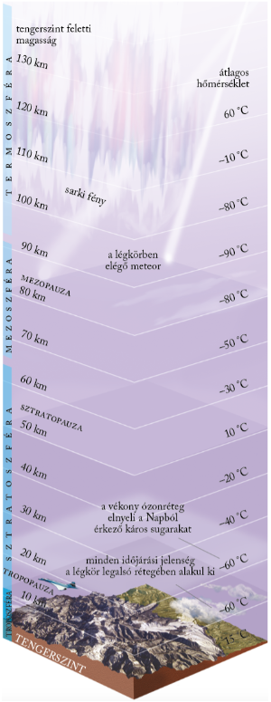

> ## A napsugarak útja
>
> A Napból érkező sugárzásmennyiségnek csak egy része éri el a Föld felszínét. Egy jelentős része (27%) a légkörből, részben a felhőkről visszaverődik a világűrbe, mintegy 15%-a pedig elnyelődik a légkörben. Az ibolyántúli sugarak egy részét az ózon, az infravörös sugarak bizonyos részét a vízgőz és a szén-dioxid nyeli el. Az elnyelés hőt termel, és felmelegedéssel jár, ez azonban csak kismértékben melegíti fel a levegőt.
>
> 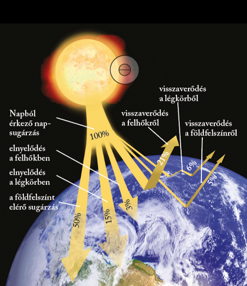

> ## A levegő felmelegedése
>
> A napsugárzásnak mintegy fele éri el a Föld felszínét. A földfelszínre érő napsugárzás elnyelődve hővé alakul. Ebből a hőből juttat a felszín a levegő legalsó rétegének. A Nap tehát végeredményben alulról, a földfelszín közvetítésével melegíti fel a levegőt. (Ez magyarázza a földfelszíntől egészen a troposzféra felső határáig tartó hőmérséklet-csökkenést is!)
>
> A felszín által kibocsátott sugárzás nagyobb részét a levegő vízgőz- és szén-dioxid-tartalma elnyeli, és hővé alakítva sugározza vissza a Föld irányába. A légkörnek ez a hővisszatartó tulajdonsága az üvegházhatás. Az üvegházhatás jelentősen emeli a földközeli rétegek hőmérsékletét. Nélküle a földfelszín átlagos hőmérséklete a jelenlegi +15 °C helyett –20 °C lenne!
>
> Az üvegházhatás évtizedek óta tapasztalható fokozódása az ipar által a légkörbe juttatott gázok (elsősorban a szén-dioxid) mennyiségének növekedésére vezethető vissza. Az átlaghőmérséklet akár 1 °C-os növekedése is komoly következményekkel jár.
>
> Nappal tehát a Nap felől érkező besugárzás és a felszínről kiinduló kisugárzás egyaránt megfigyelhető. Éjszaka csak a kisugárzás folyik.

> ## A felmelegedést befolyásoló tényezők
>
> A sugárzás hatására meginduló felmelegedés mértékét a napsugarak hajlásszöge, a sugárzás időtartama, a felszín anyaga, jellege is befolyásolja.
>
> Minél nagyobb a napsugarak földfelszínnel bezárt hajlásszöge, annál több energia jut a földfelszín ugyanakkora területére. A napsugarak csillagászatilag lehetséges hajlásszöge a gömb alakú Földön az Egyenlítőtől a sarkok felé csökken. Egy adott szélesség mentén a Nap látszólagos járásának megfelelően naponta változik a hajlásszög, és így a felmelegedés. Módosító szerepet játszik a domborzat is, illetve az, hogy melyik égtáj felé tekint a lejtő. Ez a tényező a lejtőkitettség.
>
> 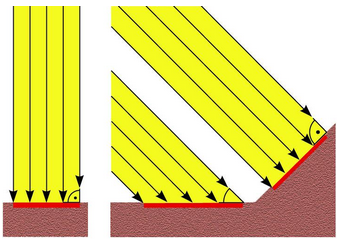
>
> A napsugárzás időtartamát napfénytartamnak nevezzük, és órában fejezzük ki. Így például Skóciában az évi napfénytartam mindössze 800 óra, a Szahara belső területein viszont 4000 óra. Magyarországon 2000 óra körüli a napfénytartam.
>
> A felszín jellege, anyaga, növényborítottsága azonos sugármennyiség mellett is eltérő felmelegedést okoz. Az alacsony fajhőjű szárazföldi térszínek kisebb hőenergia hatására is felmelegszenek, a nagy fajhőjű vízfelületek felmelegítéséhez eleve több hőenergia szükséges. A szárazföldek esetében az energia csak a felszín felmelegítésére fordítódik, a tengereknél viszont a hő a felső, mintegy 20 méteres szintben raktározódik el. A tengerek tehát lassabban, de tartósabban melegszenek fel, a szárazföldek gyorsabb és erősebb felmelegedéséhez gyorsabb é erősebb lehűlés társul.
>
> A különféle színű és minőségű szárazföldi területek felmelegedését a felszín sugárzás-visszaverő képessége, az albedó értéke befolyásolja.
>
> A felszínre érkező sugárzásból a friss hófelszín 85–95, a homokfelszín 37–40, a szántóföld 15–20, a lombos erdő 10–20, a tűlevelű erdő 5–15%-ot sugároz vissza, vagyis ennyi az albedójuk.

---
---

> # A hőmérséklet, a légnyomás és a szél

> ## Idő − időjárás − éghajlat
>
> "Milyen idő van kint?" Az idő ebben az értelemben egy adott helyen a légkör pillanatnyi fizikai állapotát jelenti. Az időjárás az egymást váltó pillanatnyi állapotok egy adott helyen néhány óra vagy nap alatt lejátszódó változása. (Így használják ezt a fogalmat, amikor az előrejelzésben „a holnapi napra várható időjárás”-ról beszélnek.) Az éghajlat egy adott hely időjárásának hosszabb időszak (néhány évtized) alatt megfigyelhető szabályszerű, vissza-visszatérő eseményeiből kialakuló rendszere.
>
> Mindhárom fogalom csak "egy adott helyre", azaz földrajzilag jól körülhatárolható, meghatározott térségekre érvényes. Az egyes térségek jellemzőit azonban csak akkor tudjuk meghatározni, ha számokkal leírható adataink vannak. Ezek a számokkal jellemezhető adatok az időjárási elemek (hőmérséklet, légnyomás, szél, vízgőztartalom, csapadékmennyiség). Az időjárási elemek egyben éghajlati elemek is, ez utóbbiak jellemzésekor viszont nem egyedi mérések adatait, hanem statisztikai átlagszámítások eredményeit használjuk fel (pl. évi középhőmérséklet, átlagos szélirány és -erősség, sokéves csapadékátlag). Az időjárási, illetve éghajlati elemek a környezettel és egymással bonyolult kölcsönhatásban álló rendszert alkotnak.
>
> Földünk éghajlata nem állandó, hanem folyamatosan változik. Ez a főként földtörténeti távlatban érzékelhető átalakulás azonban időnként felgyorsul, és a földi életet is alapvetően megváltoztató, drasztikus környezeti folyamatokat indíthat be. Az éghajlat az emberi történelem során is többször jelentős változásokon ment át. A szárazodások népvándorlásokat indítottak el, a felmelegedések megváltoztatták a tengerszintet, a vízhez kötődő kultúrák életét. A mintegy150 éve zajló, emberi tevékenység által is befolyásolt változó ütemű felmelegedés jelenleg is zajlik.

> ## A hőmérséklet
>
> Mivel a levegő a földfelszín közvetítésével melegszik fel, a hőmérséklet napi járása késve követi a Nap látszólagos járását, a delelés után csak délután 2 óra körül éri el legmagasabb értékét. A hőmérséklet évi járása a Föld tengelyferdeségétől és Nap körüli keringésétől, és ezzel összefüggésben a napsugarak beesési szögének változásától függ.
>
> A meteorológiai állomásokon mért hőmérsékleti adatokból először napi középhőmérsékletet (a napi adatok számtani átlaga) számolnak, ezekből a havi középhőmérsékletet, majd a havi átlagos adatokból adódik az évi középhőmérséklet.
>
> A középhőmérsékletek elfedik a valós mért értékeket és a köztük lévő különbségeket. Például Szombathelyen az évi középhőmérséklet 10 °C, de ebből nem derül ki, hogy télen –10, nyáron pedig akár 35 °C is lehet. A hőmérsékleti különbségek kifejezésében a hőingás segít. Az évi, illetve havi közepes hőingás az egy éven, illetve egy hónapon belüli legkisebb és legnagyobb középhőmérséklet közti különbséget adja meg. A valódi mért értékek közti különbséget az abszolút hőingással lehet kifejezni. Ezt is számolhatjuk egy éven, egy hónapon vagy egy napon belül.
>
> A hőmérséklet leggyakrabban használt mértékegysége a Celsius-fok (°C).
>
> A hőmérséklet eloszlását térképeken is ábrázolhatjuk. Az egyenlő hőmérsékletű pontokat összekötő görbét izotermavonalnak nevezzük.
>
> - [izotermavonalak](../images/foldrajz-izotermavonalak.png)

> ## A légnyomás
>
> A légnyomás a földfelszín adott egysége fölötti levegőoszlop súlya. Ahogyan a tengerszint feletti magasság növekedésével ritkul a levegő, a légnyomás egyre kisebb lesz. A tenger szintjére számítva átlagosan 1013,25 hektopascal (hPa).
>
> A légnyomás szorosan összefügg a hőmérséklettel. A felmelegedő levegő kitágul, ezért a légnyomása alacsonyabb lesz. A hidegebb, nagyobb sűrűségű levegőnek magas a nyomása.
>
> Az azonos légnyomású területeket is ábrázolhatjuk térképen. Az azonos légnyomású pontokat összekötő görbéket izobároknak nevezzük. Izobártérképeket előszeretettel alkalmaznak időjáráselőrejelzésnél.
>
> 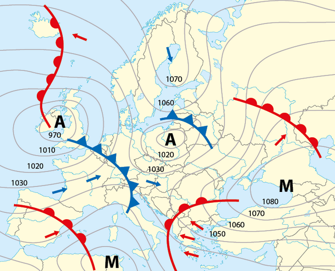
>
> A hőmérséklet és a légnyomás fordítottan arányos egymással. A felmelegedő levegő kitágul, térfogata nő. Így az adott térség légnyomása csökken.

> ## A szél
>
> Két szomszédos területen a levegő eltérő mértékű felmelegedése miatt légnyomáskülönbség alakul ki. A légnyomáskülönbség kiegyenlítésére légáramlás, légkörzés indul meg, amelyben a levegő a magas nyomású helyről az alacsonyabb nyomású hely felé áramlik. E mozgásrendszernek a Föld felszínével párhuzamosan futó ágát nevezzük szélnek. A szelek arról a világtájról kapták nevüket, ahonnan fújnak. A szél azonban a valóságban nem pontosan a magas és az alacsony légnyomású terület között halad. A Föld forgásából származó eltérítő erő (Coriolis-erő) ugyanis a szelek irányát is befolyásolja. Emiatt a szél az izobárokkal közel párhuzamosan fúj.
>
> 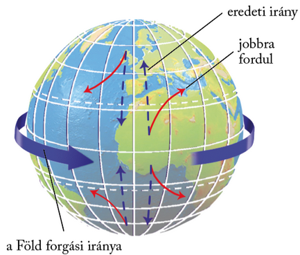

> ## Helyi szelek
>
> A Föld számos pontján alakulnak ki időszakosan fújó helyi szelek, amelyek egy-egy sajátos adottságnak köszönhetik létrejöttüket. Ilyen például a hegyvölgyi szél. A napszakosan változó irányú légmozgás oka a hegytető és a völgy eltérő felmelegedése által kiváltott légnyomáskülönbség. Nappal a szél a hegytető felé (völgyi szél), éjszaka fordítva, a völgy irányába fúj (hegyi szél).
>
> A tengerek, nagyobb állóvizek part menti területein alakul ki a parti légkörzés. Mozgatója a szárazföld és a víz eltérő felmelegedése miatt kialakuló légnyomáskülönbség. Nappal a szél a hűvösebb vízfelszín felől fúj (tengeri vagy tavi szél), éjszaka iránya megfordul, és szárazföldi (parti) szélként fúj a víz felé.
>
> Az Alpokban különösen tavasszal gyakori a hegytetőn átbukó, a szélárnyékos lejtőn lesiető meleg, száraz szél, a főn. A gyors olvadást hozó szelet hófalónak is nevezzük. A síelők jó, ha tudják, hogy a főnszeles időszakban megnő a lavinaveszély.
>
> Hazánkban nyáron alakul ki a Balaton felett a Bakony felől közeledő hidegfront hatására az ún. gerenda vagy görgővihar, amely hirtelen csap le a tóra. A viharos szelet heves zápor és zivatar is kísérheti. Ezért is fontos, hogy figyeljük a viharjelzést, és betartsuk a fürdőzés, vitorlázás szabályait!

> ## Veszélyes szelek
>
> A szél erőssége a teljes szélcsendtől a viharos erejű szélig változhat. Akár 100 km/h-nál is sebesebb (úgynevezett orkánerejű) szelek is kialakulhatnak időnként. A nagy erejű szelek faágakat törhetnek le, tetőcserepeket mozdíthatnak el, vezetékeket szaggathatnak le. Ha erős széllökések várhatók, a meteorológiai szolgálat riasztást ad ki.
>
> A mérsékelt övezet forgószelei a tornádók. Kialakulásuk a heves feláramláshoz, a nagy hőmérséklet-különbségekhez kötődik. Az elmúlt években hazánkban is több alkalommal figyeltek meg kisebb tornádókat!

> ## A szél energiája
>
> A szél megújuló energiaforrás. A szélerőművek a szél mozgási energiáját hasznosítják, amelyből elektromos áramot állítanak elő. Azokon a területeken, ahol nagy szélerősség jellemző, egyre gyakoribb a szélerőművek alkalmazása. Sok helyen nagy szélparkokat létesítenek. Néhol a tengerre telepítik a szélkerekek sorait, hogy minél jobban kíméljék a szárazföldi környezetet.

---
---

> # A csapadékképződés

> A légkör a földi vízkészlet térfogatának kb. 1 ezrelékét (‰) tartalmazza, ami jelentéktelennek tűnik, ám ebből a folyamatosan megújuló készletből származnak a bolygónkat öntöző csapadékfajták.

> ## Tényleges és viszonylagos vízgőztartalom
>
> A légköri vízgőz mennyiségét g/m3-ben fejezzük ki: ez a tényleges vízgőztartalom. Ez az érték azonban keveset árul el az adott levegőtömeg nedvességi viszonyairól. Minél magasabb ugyanis a levegő hőmérséklete, annál több vízgőzt (gáz-halmazállapotú vizet) tartalmazhat. A telítettségi táblázatból leolvashatjuk, hogy bizonyos léghőmérséklet mellett a levegő mennyi vízgőzt képes befogadni (pl. 0 °C-on 4,8, míg 10 °C-on 9,4 $g/m^{3}$-t). Ezt a hőmérsékletet telítettségi hőmérsékletnek vagy harmatpontnak nevezzük. Azt, hogy bizonyos léghőmérsékletű levegőben lévő vízgőz hány százaléka az adott hőmérsékleten befogadhatónak, a viszonylagos (relatív) vízgőztartalommal fejezhetjük ki.
>
> ### Adott hőmérsékletű levegő maximális vízgőztartalma
>
> | Hőmérséklet ($˚C$) | Vízgőz ($g/m^{3}$) |
> | :-- | :-- |
> | –25 | 0,7 |
> | –15 | 1,5 |
> | –10 | 2,2 |
> | 0 | 4,8 |
> | 5 | 6,8 |
>
> |Hőmérséklet ($˚C$) | Vízgőz ($g/m^{3}$) |
> | :-- | :-- |
> | 10 | 9,2 |
> | 15 | 12,9 |
> | 20 | 19,2 |
> | 25 | 23,1 |
> | 30 | 30 |
> | 40 | 50 |
>
> A levegő kétféle módon válhat telítetté, érheti el a 100%-os viszonylagos vízgőztartalmat:
> - adott hőmérséklet mellett további nedvességet vesz fel, vagy
> - azonos tényleges vízgőztartalom mellett csökken a hőmérséklete.

> ## A kicsapódás fajtái
>
> Ha a léghőmérséklet a harmatpont alá süllyed, a levegő a páratartalomra nézve túltelített lesz, megkezdődik a vízgőz kicsapódása, vagyis a korábban légnemű anyag halmazállapot-változása.
>
> A kicsapódás végbemehet a szabad légtérben, de egy-egy tárgy felületén is. A szabad légtérben lejátszódó kicsapódás felhő- vagy ködképződéssel jár. A harmatpont alá süllyedt hőmérsékletű levegőben a vízgőz kicsapódása sókristályokon, porszemeken vagy egyéb szennyező anyagokon indul meg. A vízgőz e kicsapódási magvakon sűrűsödik vízcseppekké. A nagy magasságban gyülekező vízcseppekből keletkeznek a felhők, a talajközeli légrétegekben kicsapódókból a köd.
>
> A talajfelszín fölött, szabadban lévő testek (tárgyak, növények) felületén végbemenő kicsapódáskor harmat, dér vagy zúzmara keletkezik. Az éjszakai kisugárzás következtében a testek lehűlnek, és lehűtik környezetük léghőmérsékletét is. A lehűlő levegőből kicsapódó vízgőz 0 °C fölött harmatként, 0 °C alatt dérként válik ki.
>
> 
>
> A harmat, illetve a dér derült, szélcsendes időben képződik. A jégkristályokból álló zúzmara képződése ezzel szemben éppen a szélnek kitett helyeken megy végbe. A zúzmara a tartósan hideg területre beáramló melegebb levegőből képződik, amikor a hőmérséklet 0 °C alatt csökken a harmatpont alá. A kiálló testeket bevonó zúzmara komoly terhelést jelent. A zúzmara ezért gyakran faágakat tör, elektromos vezetékeket szaggat le.
>
> 

> ## Csapadékképződés
>
> Csapadék a levegő lehűlésével keletkezhet, mivel csupán így válhat ki belőle vízgőztartalma. A harmat, a dér és a zúzmara a lehűlő felszínen kialakuló csapadék, ezért ezeket összefoglalóan talaj menti csapadéknak is nevezzük. Ezek mennyisége azonban elenyésző a felemelkedés közben lehűlő levegőből kialakuló hulló csapadékhoz képest.
>
> A levegő magasba emelkedését a felmelegedés indítja el. A felmelegedő levegő ugyanis kiterjed, így környezeténél ritkábbá és könnyebbé válik, és ezért felemelkedik. Emelkedés közben a levegő 100 méterenként 1 °C-kal hűl le. Ha a harmatpont elérése után is folytatódik az emelkedés, kezdetét veszi a felhőképződés. A felhőképződés megindulását követően a tovább emelkedő levegő hőmérséklete 100 méterenként már csak 0,5 °C-kal csökken. A kicsapódáskor felszabaduló hő ugyanis mérsékli a további lehűlést.
>
> Csapadék csak olyan felhőkből érkezik, amelyekben a vízcseppek mellett fokozatosan növekvő, hízó jégkristályok is jelen vannak. A feláramlást a vízcseppek ugyanis nem képesek legyőzni, belőlük tehát nem képződhet hulló csapadék. A jégkristályokra viszont egyre több víz fagy rá, s növekedve, a feláramlást végül legyőzve, kihullanak a felhőből.
>
> Hasonló, felhőképződéssel járó folyamat játszódik le akkor is, amikor a levegőt domborzati akadály, például nagyobb hegység készteti felemelkedésre.
>
> 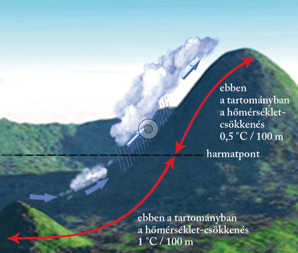
>
> A hegység szélárnyékos oldalán azonban a levegő leszáll. Hőmérséklete – a felemelkedés ellentétes folyamataként – 100 méterenként 1 °C-kal nő, így egyre több vízgőz befogadására lenne képes. Tényleges vízgőztartalma azonban nem változik, a viszonylagos ellenben fokozatosan csökken, a hegység lábához tehát száraz, lebukó szélként érkezik meg.

> ## Csapadékfajták
>
> Ha a hőmérséklet a felszín közelében 0 °C fölötti, a kristályok elolvadva eső, ha fagypont alatti, havazás formájában érkeznek a talajra. A nyári jégesők heves, igen erős feláramláshoz kötődnek, amikor olyan nagy jégszemek keletkeznek, hogy még aláhullva sem olvadnak el.
>
> 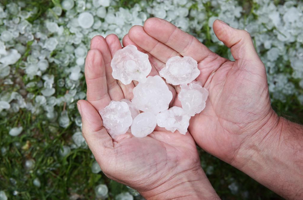
>
> Az ónos eső túlhűlt (0 °C alatti hőmérsékletű) vízcseppekből álló hulló csapadék, amely a felszínre érkezve azonnal kifagy, és jégbevonatot képez. Akkor keletkezik, amikor a hideg levegő fölé a magasban enyhébb légrétegek áramlanak, ezért az ónos eső többnyire a közelgő enyhülés előjele. A felszínre fagyott jégpáncél komoly veszélyt jelent a biztonságos közlekedésre, ilyenkor még körültekintőbben kell közlekednie autósnak, gyalogosnak egyaránt. A fákra, vezetékekre rakódott jég súlya szintén károkat okozhat. Sajnos hazánk medencehelyzete kedvez az ónos eső kialakulásának.
>
> A nyári kánikulákhoz kötődő jégeső nagy károkat tud okozni. Előfordul, hogy olyan nagy jégdarabok hullanak az égből, hogy behorpasztják az autók karosszériáját, kitörik az ablakokat. A termést már a kisebb méretű, nagy intenzitású jégeső is könnyedén elveri. A égesőszemek általában borsó vagy babszem nagyságúak, de volt már rá példa, hogy alma vagy grépfrút nagyságú darabok hullottak.

> ## A csapadék gazdasági jelentősége
>
> A csapadék nagyon fontos gazdasági tényező, a mezőgazdasági termelés egyik feltétele. A csendes, tartós eső kedvező a talaj vízutánpótlása szempontjából. A heves záporok és felhőszakadások vize azonban gyorsan leszalad a felszínről, és magával viheti a termőréteg felső részét is. A téli hótakaró megvédi az őszi vetéseket a fagytól, a lassú hóolvadás pedig javítja a talaj vízellátottságát. A tartós csapadékhiány, az aszály veszélyezteti a mezőgazdasági termelést, rontja a termés minőségét és mennyiségét. Száraz időben a hajnali harmat apró vízcseppjei jelenthetik az egyetlen vízforrást a növények számára.

---
---

> # Ciklonok – anticiklonok

> ## A ciklonok
>
> A ciklonok nagy sebességgel áramló és ezért örvénylő mozgást keltő levegőben, illetve hideg és meleg levegő találkozásakor jönnek létre. Egy-egy ciklon több ezer km átmérőjű, óriási légörvény. Közepén a Föld felszínén alacsony légnyomás uralkodik, ezért a levegő a környező magas nyomású területek felől befelé áramlik. Ha a Föld forgásából eredő eltérítő erő nem hatna, a szél egyenesen a ciklon közepe felé fújna. Az eltérítő erő hatására azonban a levegő a ciklonban az északi félgömbön az óramutató járásával ellenkező irányban áramlik befelé. A befelé áramlás csak a felszínközeli súrlódási rétegben megy végbe. A ciklon belsejében a levegő felfelé áramlik. Felemelkedésre a gyorsabban örvénylő hideg levegő készteti a lassabban mozgó meleg levegőt.
>
> 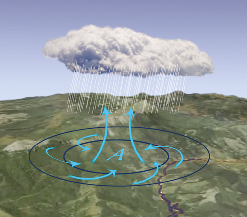

> ## Az anticiklonok
>
> A ciklonokban felemelkedő levegő a ciklonok környezetében leszáll. A leszállás magas nyomású területén a levegő örvénylő szétáramlásával anticiklon keletkezik. Az anticiklon közepén magas légnyomás uralkodik, ezért a levegő az anticiklon közepéből kifelé áramlik.
>
> Ha a Föld forgásából származó eltérítő erő nem hatna, a szél egyenesen az anticiklon pereme felé fújna. Az eltérítő erő hatására azonban a levegő az anticiklonban az északi félgömbön az óramutató járásával megegyező irányban áramlik. Középpontjában leszáll, és a felszín közelében szétáramlik. Anticiklon jön létre akkor is, amikor a lehűlő felszín lehűti a fölötte elhelyezkedő levegőt. Szibériában és Kanadában az erős lehűlés miatt télen képződnek anticiklonok. Mivel a levegő az Északi- és a Déli-sark környékén egész évben hideg, mindkét sarkvidéket anticiklonok uralják (a grönlandi, illetve antarktiszi anticiklon).
>
> 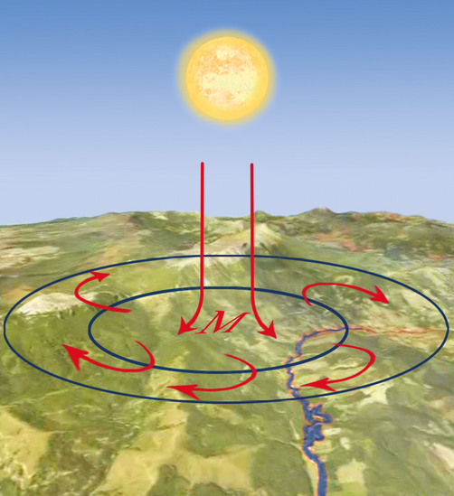

> ## Frontok a ciklonban
>
> A meleg és hideg levegő határán kialakult ciklonokhoz jelentős mennyiségű csapadékképződés társul. A csapadék az eltérő hőmérsékletű légtömegek határvonalához kapcsolódik. Ezeket a határvonalakat időjárási frontoknak (hideg-, illetve melegfrontoknak) nevezzük. Az elkülönítés alapja az, hogy melyik légtömeg áramlik a másik irányába. A hidegfront mentén hideg levegő érkezik a melegebb levegőjű területre, a melegfrontban pedig meleg levegő áramlik hideg levegőjű területre.
>
> A hidegfront gyorsan mozgó hideg levegője hirtelen magasba emeli a könnyebb, meleg levegőt. A felemelkedés oly hevesen történik, hogy viszonylag keskeny (50–70 km-es) sávban záporeső, gyakran zivatar és jégeső keletkezhet. A front átvonulása után a korábbinál hűvösebb, de ragyogóan tiszta, napos idő köszönt be.
>
> A melegfront könnyebb, meleg levegője, miközben maga előtt tolja a hideg levegőt, felsiklik a hideg légtömeg fölé. A felsiklás sávjában húzódik a melegfront. E lassú mozgáshoz széles (300–400 km-es) sávban akár többnapos, csöndes eső társul.
>
> A ciklonokban mind a hideg-, mind pedig a melegfront megtalálható. A ciklon fejlődése során a sokkal gyorsabban mozgó hidegfront beéri a lassabban haladó melegfrontot, és a teljes meleg légtömeget a magasba hajtja.
>
> Ekkor a ciklon pályafutása véget ér, mivel a két eltérő hőmérsékletű légtömeg közül a meleg teljesen felemésztődik.
>
> A térképen a hideg és meleg légtömegek találkozási felületének felszínnel való érintkezésénél jelöljük a frontot.
>
> 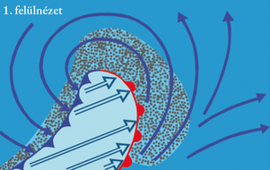
> 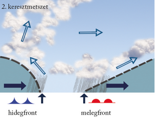

> ## A fronthatások
>
> A légkörben lejátszódó folyamatok az emberi szervezetre is hatással vannak. Elsősorban a gyors légnyomás- és hőmérsékleti változásokkal járó frontok viselik meg szervezetünket. A frontérzékenység egyénenként nagyon különböző formában jelentkezhet. Főleg a túlhajszolt, stresszes életmódot folytató, valamint a gyengébb fizikumú, idős vagy egyes betegségekben szenvedő (pl. reumatológiai, idegrendszeri, szív- és érrendszeri krónikus betegségek) embereket viselik meg jobban az időjárás-változások. Melegfront esetén a tünetek már néhány órával a front átvonulása előtt jelentkezhetnek: vérnyomáscsökkenés, pulzusszám-emelkedés, esetleg a depressziós tünetek, migrénes panaszok felerősödése. Hidegfront esetén a tünetek inkább a front átvonulása után jelentkeznek: az ízületi és reumás bántalmak, asztmás rohamok, az emésztőrendszeri panaszok erősödhetnek. Sőt összefüggésbe hozták a koraszülések számának emelkedésével, illetve a szívinfarktusok gyakoribb előfordulásával is. Egyes általános idegrendszeri tünetek mindkét fronthatáskor jellemzőek, például a levertség, az ingerlékenység, az alvászavar, a reflexek lassulása, a koncentrálóképesség csökkenése és a fejfájás. A kellemetlen tünetek egészséges, vitaminokban gazdag táplálkozással és rendszeres testmozgással enyhíthetők.

> ## Trópusi ciklonok
>
> A mérsékelt övezeti ciklonok „viharos” rokonai a hatalmas károkat okozó trópusi ciklonok. Ezeket a Karib-tenger térségében hurrikánnak, a Csendes-óceán északi medencéjében tájfunnak nevezzük.
>
> A trópusi forgószelek, ciklonok a légkör legpusztítóbb jelenségei közé tartoznak. A trópusi ciklonok akár 400–500 km átmérőjű, rendkívül alacsony nyomású központ körül kialakuló, orkánerősségű széllel pörgő képződmények. A ciklonban forgó szél sebessége éppen a nagy légnyomáskülönbség miatt elérheti az akár 200–250 km/órát is. A trópusi ciklonok születési helyei a legjobban fölmelegedő óceáni térségek. Eszerint a trópusi ciklonok – a hőmérsékleti egyenlítő elmozdulását követve – az északi és a déli féltekén is kialakulhatnak. Mivel azonban az óceánok hőmérséklete az év nagy részében az Egyenlítőtől északra melegebb (hogy miért, arról szó lesz az óceánokról szóló leckékben), a trópusi ciklonok elsősorban az északi féltekén jönnek létre. Születési helyükről – a ciklonokhoz hasonlóan – fokozatosan északabbra sodródnak. A Földön évente átlagosan ötven trópusi ciklon jön létre, a legtöbb a Csendes-óceán északi medencéjében, illetve a Karib-tenger térségében.
>
> A tájfunoknak, hurrikánoknak korábban női neveket adtak, az 1980-as évek óta a forgószelek - az egyenjogúság jegyében – már férfineveket is viselnek.
>
> A trópusi forgószelek fákat csavarnak ki tövestül, embereket, tárgyakat ragadnak a levegőbe, esőzéseiket áradások, földcsuszamlások követik.
>
> Az utóbbi évtizedekben is több súlyos pusztítással járó trópusi ciklon csapott le a szárazföldre. Ma már a meteorológiai műholdképek segítségével sikerül a hurrikánok, tájfunok vonulását nyomon követni, és így az előrejelzés és a riasztás is biztosabb.

---
---

> # Az általános légkörzés és a monszun szélrendszer

> ## A Föld leggyorsabb szelei – a futóáramlások
>
> A troposzféra felső részében az egész Földön nyugatias szelek uralkodnak. Ezeket az Egyenlítő és a sarkvidékek közötti hőmérséklet- és légnyomáskülönbség tartja életben, irányukat pedig a Föld forgásából származó eltérítő erő határozza meg. Legnagyobb sebességüket a legnagyobb hőmérséklet-különbségű térségekben, a térítőkörök és a sarkkörök között érik el. Ezért a troposzféra felső határán a legerősebb szelek a 30. és a 60. szélességi fokok között fújnak. Ezek az egész Földet körülfutó nyugatias szelek a futóáramlások (angol néven jet streamek). Sebességük a 30. és a 60. szélességi fokok között, a troposzféra felső határán a 300–500 km/órát is elérheti! A nagy sebesség bizonytalanná teszi a nyugatias áramlást, és a futóáramlások kanyarulatokká fejlődő hullámaiból ciklonok és anticiklonok képződnek.

> ## Légnyomási övek közötti légcsere
>
> A legerősebben felmelegedő Egyenlítő térségében alacsony, a legerősebben lehűlő sarkvidékek területén magas légnyomású öv fogja körül a Földet. Ezek az övek hőmérsékleti hatásra alakultak ki. A 30. és a 60. szélességi körök mentén is találunk egy-egy jellegzetes nyomású övet. A 30. szélességi kört magas, a 60. szélességi kört alacsony nyomású öv fonja körbe. Ezeket nem magyarázhatjuk meg hőmérsékleti okokkal. Kialakulásuk a futóáramlásokban képződő ciklonokhoz és anticiklonokhoz kapcsolódik.
>
> 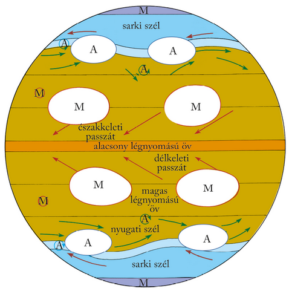
>
> Az általános vagy más néven nagy földi légkörzés nem más, mint az eltérő nyomású övek közötti légcsere.

> ## Nyugati szelek szállította, kisodródó ciklonok és anticiklonok
>
> A futóáramlások nagy sebességük következtében magukkal ragadják az alacsonyabban elhelyezkedő légtömegeket is. Ezért a 30. és a 60. szélességi körök mentén a felszínközeli rétegekben is nyugati szelek uralkodnak. A ciklonokat és anticiklonokat az ebben az övben uralkodó nyugati szelek magukkal sodorják kelet felé. Közben a Föld forgásából származó eltérítő erő mindkét félgömbön módosítja a légáramlások útját. Az eltérítő erő nagysága a sarkok felé növekszik. Az északi félgömbön az óramutató járásával ellentétesen örvénylő ciklonokra a legerősebb eltérítő erő az örvény északi oldalán hat. Ez a nyugati szelek hajtotta ciklonokat északkelet felé sodorja ki. Az óramutató járásával megegyezően örvénylő anticiklonokra is az örvény északi oldalán hat a legerősebb eltérítő erő. Ez azonban az ellentétes forgómozgás miatt a nyugati szelek szállította anticiklonokat délkelet felé sodorja. A 60. szélességi kör mentén kialakuló alacsony nyomású öv tehát az oda kisodródó számtalan ciklonból tevődik össze. (Hasonló módon – csak éppen ellentétes irányú kisodródással – jön létre alacsony nyomású öv a déli félgömb 60. foka mentén.)
>
> Az anticiklonok az északi féltekén délkelet felé sodródnak, és a 30. szélességi kör mentén létrehozzák a magas nyomású övet. (A déli félgömbön északkelet felé kisodródva alakítják ki a hasonló szélességben lévő magas nyomású övet.)

> ## A keleties irányú sarki szelek
>
> A sarkvidékeken a nehéz, hideg levegő felhalmozódása miatt magas a légnyomás. A magas nyomású anticiklonokból a hosszúsági körök mentén kifelé áramlik a levegő, de a tengely körüli forgásból származó eltérítő hatása miatt az Északi-sarkvidéken az északkeleti, a Déli-sarkvidéken a délkeleti sarki szelek váltak uralkodóvá.

> ## A keleties irányú passzátszelek
>
> Az Egyenlítő menti alacsony és a 30. szélességi fok tájéki magas légnyomású öv között az eltérítő erő hatására az északi félgömbön északkeleti, a déli félgömbön délkeleti szél alakul ki a felszínközeli légrétegekben. Ez a 30. szélességi kör tájékáról az Egyenlítő felé fújó szél az északkeleti, illetve a délkeleti passzát. A passzátszél kisebb-nagyobb szünetekkel csaknem állandóan fúj, miközben iránya és sebessége alig változik. A vitorlás hajók e kedvező tulajdonságokat évszázadokon keresztül rendszeresen felhasználták. (Kolumbusz hajóinak vitorlázata is a passzátszél áramába kapaszkodott a nyugat felé vezető úton, hogy aztán magasabb szélességeken hajózva a nyugati szelek hozzák vissza a hajókat Európába.)
>
> A levegő az Egyenlítő vidékén az erős felmelegedés és a passzátszelek összeáramlása miatt felemelkedik. A vízszintes légmozgás, tehát a szél ebben az összeáramlási sávban igen ritka és gyenge. Hasonlóképpen szélcsendes sáv a 30. szélességi kör magas nyomású öve, ami a vitorlás hajókat korábban gyakori kényszerpihenőre ítélte. Több hajós nemzet nyelvén ezt a sávot „paripák szélességeinek” nevezik, mivel az élelem fogyatkozásával a hajókon szállított lovakat kényszerültek levágni…

> ## A trópusi monszunszél, azaz: „Vigyázat, a passzátot eltérítik!”
>
> A passzátszeleket irányító légnyomásövek az évszakok váltakozásának megfelelően észak–déli irányban eltolódnak. Az északkeleti és a délkeleti passzátszél a felszín közelében valójában nem a csillagászati Egyenlítő, hanem a legmagasabb hőmérsékletű és így legalacsonyabb nyomású térség felé fúj. Ezt a vonalat, a hőmérsékleti egyenlítőt a Föld mindenkori legmelegebb pontjait összekötve kapjuk meg. Futása a tengerek és szárazföldek különböző mértékű felmelegedése miatt még csak nem is párhuzamos a szélességi körökkel. Így a déli félgömbről induló és a hőmérsékleti egyenlítő felé fújó délkeleti passzátszél az északi félgömb nyarán átlépi a csillagászati Egyenlítőt, és útját az északi félgömbön folytatja. Mivel a Föld forgása az északi félgömbön jobb kéz felé téríti el az áramló levegőt, a déli félgömb délkeleti passzátja az Egyenlítőtől északra mint délnyugati szél folytatja útját.
>
> Az északi félgömb telén viszont a déli féltekére húzódik a hőmérsékleti egyenlítő, és így utat enged az északkeleti passzátszélnek. Mivel a Föld forgása a déli félgömbön bal kéz felé téríti el az áramló levegőt, az északi félgömb északkeleti passzátja az Egyenlítőtől délre mint északnyugati szél folytatja útját.
>
> A földrajzi Egyenlítőtől északra és délre (pl. Afrikában a Guineai-öböl vidékén, Elő-Indiában, az Indonéz-szigetvilágban) tehát évszakos váltakozással majdnem teljesen ellentétes irányú szelek fújnak. Az évszakonként ellentétes irányból fújó szeleket (ha az  irányváltás legalább 120°-os) monszunnak nevezzük. Az északi (illetve a déli) félgömb trópusi téli monszunja az illető félteke passzátszelével azonos északkeleti, illetve délkeleti irányú szél. Az északi (illetve a déli) félgömb trópusi nyári monszunja a másik félgömbről átlátogató passzátszél, a földforgás hatására eltérített délnyugati (illetve délen északnyugati) irányú szele.

> ## A mérsékelt övezeti monszun
>
> Évszakosan változó irányú monszunszél kialakul a mérsékelt övezetben is, az évszakosan eltérő mértékben és váltakozva felmelegedő szárazföldek és óceánok partvidékén. A csapadékban gazdag nyári monszun az óceánok felől, a szárazságot okozó téli monszun a szárazföldek belsejéből fúj. A mérsékelt övezeti monszun a szárazföldek keleti peremén jön létre (pl. Észak-Amerika: Florida; Ázsia: Kelet-Kína, Kelet-Oroszország). E területekre ugyanis a kontinensen átkelő nyugati szél már száraz légtömegként érkezik meg (téli monszun). Ahol a szárazföld elég nagy (Ázsia, Észak-Amerika), a belső területeken nyáron erős felmelegedés alakul ki. Ez alacsony légnyomású képződményt alakít ki, amely vonzza az óceáni légtömegeket (nyári monszun). A mérsékelt övezeti monszun a leghatalmasabb kontinens, Ázsia keleti peremterületén alakult ki a legszabályosabban.
>
> Mind a trópusi, mind pedig a mérsékelt övezeti monszunterületek Földünk legszélsőségesebb csapadékeloszlású vidékei.

---
---

> # Globális légköri problémák

> A kibocsátástól a leülepedésig
>
> A légszennyező anyagok kibocsátását idegen szóval emissziónak nevezzük. Az emisszió lehet pontszerű (pl. egyetlen gyárkémény), történhet vonal mentén (pl. országút), illetve egyszerre nagyobb területen (pl. iparvidék). A levegőbe jutott anyagokat a szél tovaszállítja, eközben a szennyeződések a levegővel, illetve egymással kémiai reakcióba léphetnek, és így újabb anyagok jöhetnek létre. A szennyeződés visszajuthat a földfelszínre, illetve a felszínközeli légtérbe. Ez történhet a csapadék útján, de a levegőből való száraz leülepedéssel is. És a légszennyezés sem ismer határokat, globális méretű problémák forrása.

> ## A savas csapadék képződése
>
> A gyárak, hőerőművek, közlekedési eszközök egyre több nitrogén-oxidot, kén-dioxidot juttatnak a levegőbe. Az emisszió során leülepedő savas anyagok részben közvetlenül károsítják a növényeket, részben pedig a talajban feldúsulnak, és így elsavanyítják azt. A növények gyökereiken keresztül kevesebb vizet és tápanyagot tudnak felvenni, kevésbé képesek a kártevők ellen védekezni, és pusztulásnak indulnak. Különösen veszélyeztetettek a tűlevelű erdők, ahol a fenyők felkopaszodnak, elszáradnak. A hazai tölgyesek is károsodnak a savas esők miatt.
>
> Az elsavanyodást meszezéssel, a kártevők pusztítását például szúcsapdák felállításával igyekeznek megakadályozni. Mindez azonban csak tüneti kezelés. Az erdőpusztulás végső soron a káros anyagok kibocsátásának visszaszorításával oldható meg!
>
> 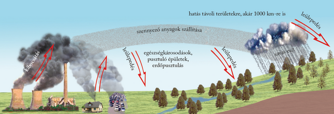
>
> A légszennyezés ismert következménye a szmog (füstköd). Sűrűn lakott nagyvárosokban jellemző, ahol a közlekedés, a fűtés, az ipar által kibocsátott légszennyező anyagok nagy koncentrációban vannak jelen.
>
> Két típusát különböztetjük meg. A londoni típusú (redukáló) szmog hűvös, párás, szélcsendes időben alakul ki. A levegőben feldúsuló szennyező anyagok (kén-dioxid, szén-monoxid, por, korom) a fosszilis tüzelőanyagok, főként a szén elégetéséből származnak. A tartósan szennyezett levegő légúti betegségek kialakulásához, illetve azok felerősödéséhez vezethet. A Los Angeles-i típusú (oxidáló vagy fotokémiai) szmog meleg, napos, szélcsendes időben képződik. Kialakulásában a közlekedés által kibocsátott nitrogén-oxidok, szénhidrogének és a szén-monoxid játszanak szerepet. Elsősorban a nagy forgalmú, zártabb medencékben fekvő városokat veszélyezteti. A Nap ultraibolya sugarainak hatására a légkörben lévő szennyező anyagok fotokémiai reakciókba lépnek, amelynek során például nitrogén-dioxid ($NO_{2}$), ózon ($O_{3}$) és igen agresszív peroxivegyületek alakulnak ki. A folyamat rendszerint a reggeli csúcsforgalom idején kezdődik, és a déli órákra teljesedik ki. A fotokémiai szmog erősen irritálja a nyálkahártyát, és annak gyulladásos megbetegedéseihez vezethet. Ráadásul az ózon származékai sejtkárosító és rákkeltő hatásúak.
>
> Szmogveszélyes időszakban biztonsági óvintézkedésekkel mérséklik a káros folyamatokat. Korlátozzák a gépjárművek közlekedését, csökkentik vagy leállítják a nagy porkibocsátással járó üzemek működését. Tájékoztatják a lakosságot a kialakult helyzetről, és figyelmeztetnek a veszélyforrásokra. Hosszabb távon azonban csak a környezettudatos gondolkodás (pl. a közlekedésszervezés, a fűtés vagy az ipari termelés területén) jelenthet megoldást.

> ## A vékonyodó ózonernyő
>
> Az Antarktiszon az 1950-es évek óta folynak ózonmérések. 1977 óta észlelték az ottani tavaszi hónapokban (szeptember–november) a sztratoszférabeli ózon csökkenését. Kiderült, hogy az ózon mennyisége az 1950-es évekbeli 275–325 Dobson-egységről átlagosan 170-re esett vissza, sőt egy 1987-es méréskor kirívóan alacsony, 125 egységet észleltek.
>
> Az ózon folyamatosan képződő és bomló anyag. A képződés és bomlás egyensúlyát az emberi tevékenység bontotta meg. A „vétkesek” a szórópalackokban hajtógázként, klímaberendezésekben pedig hűtőanyagként alkalmazott freonok, illetve a sztra-
toszférába hatoló repülőgépek égéstermékei. De miért éppen tavasszal csökken oly erősen a Déli-sarkvidék fölött a sztratoszféra ózontartalma? Ennek oka, hogy a rendkívül hideg tél folyamán a nagy magasságban képződő ritkás felhők parányi jégkristályai megkötik az ózon lebontásában közrejátszó klórvegyületeket, amelyek a tavaszi napsütés hatására hirtelen „szabaddá” válnak. Másrészt az Antarktisz felett kialakult légörvény ekkor még távol tartja az észak–déli légáramlatokat, amelyek az Egyenlítő irányából ózont szállíthatnának ebbe a térségbe. E természetes folyamatok azonban csak az ózonbontó gázok mennyiségének növekedése miatt váltak kritikussá.
>
> Az Antarktisz fölött az ózonréteg néhány év alatt felére csökkent, ám később megkezdődött a regenerálódása. Ez annak köszönhető, hogy betiltották az ózonromboló hajtógázok alkalmazását. A 21. század második felére várható, hogy ezek a gázok kiürülnek a légkörből.
>
> 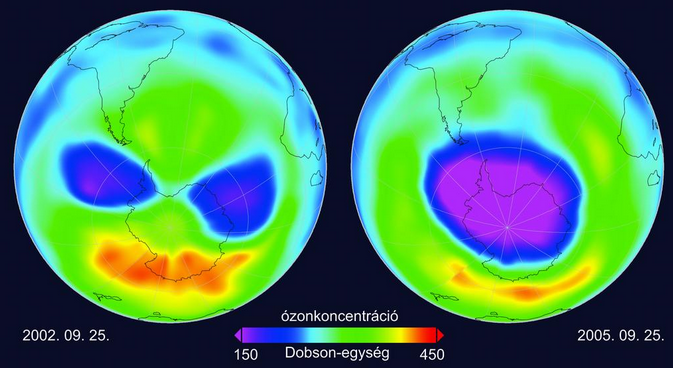

> ## A globális felmelegedés és az éghajlatváltozás
>
> Immár évtizedek óta kiemelt és egyre aktuálisabb kérdés a éghajlatváltozás, illetve az annak hátterében álló globális felmelegedés. Globális felmelegedésnek nevezzük azt a jelenséget, amikor a Földön az átlaghőmérséklet hosszabb időn keresztül emelkedik.
>
> A felmelegedés elsődleges oka a természetes üvegházhatás fokozódása. Ezt elsősorban az emberi tevékenység által a légkörbe juttatott üvegházgázok megnövekedett koncentrációja váltotta ki.
>
> Az üvegházgázok közül elsősorban a szén-dioxidot ($CO_{2}$) teszik felelőssé a globális felmelegedésért. Koncentrációja a levegőben az ipari forradalom óta másfélszeresére növekedett, a kibocsátás különösen a 20. század második felétől ugrott meg, amikor az iparosodási hullám a fejlődő országokat is elérte. Elsődleges forrásai a fosszilis energiahordozókat égető hőerőművek.
>
> A metán ($CH_{4}$) hússzor intenzívebb üvegházgáz a szén-dioxidnál. Nagy kibocsátói részben természetes források (pl. mocsaras területek, rizsföldek, kérődző állatok), de a légköri metán kétharmada emberi eredetű. Főleg a biomassza égetésével, energiatermeléssel kerül a levegőbe.
>
> A szén-dioxidnál mintegy háromszázszor erősebb üvegházgáz a dinitrogén-oxid ($N_{2}O$). Az ember főleg a műtrágyákkal, állattenyésztéssel, biomassza égetésével juttatja a levegőbe.
>
> A földi átlaghőmérséklet növekedése miatt gyakoribbá váltak az extrém időjárási jelenségek. A kiáradó folyók hatalmas árvizekkel okoznak környezeti katasztrófát. Közép-Amerikában nagy erejű hurrikánok, Délkelet-Ázsiában tájfunok pusztítanak. Egyre több olyan terület van, ahol hosszúra nyúló aszályos időszakok nehezítik a lakosság életét.
>
> A hőmérséklet emelkedése miatt zsugorodik a magashegységek jege, olvadnak a sarkvidéki jégtakarók, gleccserek és csökken a tengeri jég kiterjedése is. Mindez közvetlenül érinti az élővilágot is – az északi-sarkvidék óriás ragadozói, a jegesmedvék már veszélyeztett állatfajnak minősülnek. A jégolvadás a globális felmelegedést is tovább fokozza: míg ajégnek nagy az albedója, a víz többet elnyel a sugárzásból, ezzel pedig jobban felmelegíti a levegőt.
>
> A szárazföldi jég olvadása, az olvadékvizek révén közvetlenül megemeli a tengerszintet. Míg pl. 8 ezer évvel ezelőtt még 40 méterrel (!) alacsonyabban volt a tengerszint, mint ma (mivel akkor jóval terjedelmesebb jégborítás volt a földön, mint jelenleg), ma avízszint növekedése számos szigetet és alacsonyan fekvő szárazföldi területet veszélyeztet. Számítások szerint a 21. század végére a világtenger szintje nagyjából 1 méterrel fog megemelkedni.
>
> A tengervíz sótartalmának és hőmérsékletének változása a tengeráramlásokat is módosítja, amelyek pedig a szárazföldek éghajlatára gyakorolnak komoly befolyást.
>
> A felmelegedés maga után hozza az éghajlat megváltozását is. Az éghajlatok határa eltolódik, ezzel együtt a természetes növényzet és az állatvilág is módosul.
>
> A hosszabb távra szóló forgatókönyvek némelyike igencsak borúsan látja a Föld jövőjét a globális éghajlatváltozás fényében, de a legoptimistább előrejelzések is súlyos következményekre hívják fel a figyelmet. Amennyiben a hőmérséklet emelkedése a jelenlegi ütemben halad, akkor a század végére az átlaghőmérséklet akár 2–6 °C-kal is nőhet.
>
> Az egyik hosszú távú megoldás a fosszilis energiahordozóknak a környezetkímélő erőművekkel való kiváltása lehet.

---

- [Vissza az előző oldalra](../foldrajz.md)
- [Vissza a főoldalra](../../../../README.md)

---