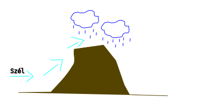
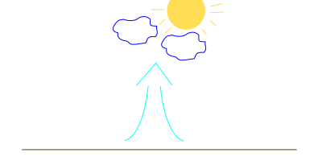
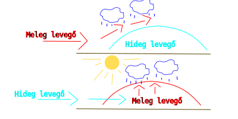
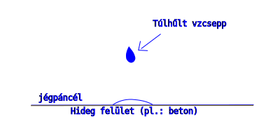
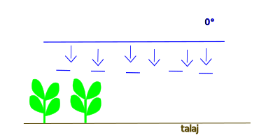
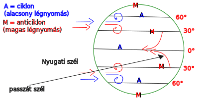

---

- [Vissza az előző oldalra](../foldrajz.md)
- [Vissza a főoldalra](../../../../README.md)

---

# Felhő és csapadék képződés

---

> ## Csapadék képződés
>
> 
>
> 
>
> 
>
> Amikor az emelkedő levegő hőmérséklete harmatpont alá csökken, akkor a vzgőz tartalom kicsapódik a kondenzációs magvakra (sókristály, porszemcse,...) és láthatóva válik a felhő.
>
> Ha a felhőben lévő vzcseppek, jégmagvak olyan nagyra nőnek, hogy a gravitáció legyőzi a felhajtóerőt, akkor kiesnek a felhőből.
>
> - Ónos eső:
>
> 
>
> - harmat:
>
> 
>
> ## Általános légkörzés
>
> 

---

- [Vissza az előző oldalra](../foldrajz.md)
- [Vissza a főoldalra](../../../../README.md)

---