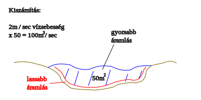
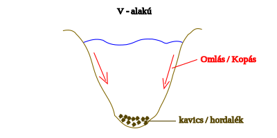
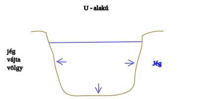
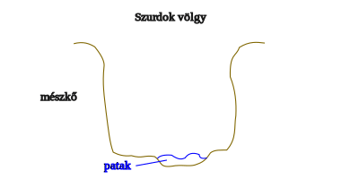
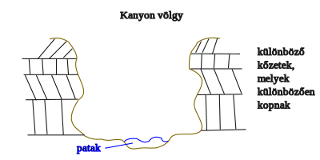
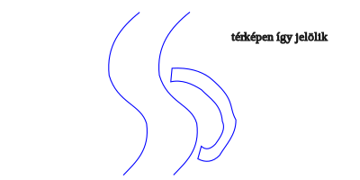
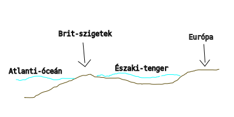

---

- [Vissza az előző oldalra](../foldrajz.md)
- [Vissza a főoldalra](../../../../README.md)

---

# Folyók, tavak, tengerek, óceánok

---

> ## Felszín alatti vizek
>
> 

> ## Folyók
>
> - Tölcsértorkolat:
>    - alapvetően nyílt óceánokba torkollik

> ## Vízállás
>
> a folyó vízszint magassága.

> ## Vízjárás
> - egyenletes
> - ingadozó

> ## Vízhozam
>
> a folyó adott keretsztmetszetén áthaladó vízmennyiség.
>
> 

> ## Folyóvölgyek
>
> **V-alakú**:
> 
>
> **U-alakú**:
> 
>
> **szurdok völgy**:
> 
> például: Gaja-patak, Hóv-patak, ...
>
> **kanyon völgy**:
> 
> például: Grand-kanyon

> ## Tavak kialakulása
>
> - Süllyedeékben kialakult tó:
>    - Balaton
>    - Velencei-tó, ...
> - Elgátolt tó:
>    - Fertő-tó
> - Homokvidéki tó:
>    - Fehér-tó
> - Forrás tó:
>    - Hévízi-tó
> - Morotva vagy holtág tó:
>    - folyók menti kis kanyarocskák
> 
> - mesterséges tavak: 
>    - Tisza-tó
>    - halas tavak
>    - víztározók
>    - bányatavak

> ## Tengeráramlatok
>
> **Hatalmas "folyók" az óceánokban**
>
> Az egy környéki melegvíz cserélődik ki a sarkvidék környéki hideg vizekre.
> A hőmérséklet különbség indítja be a vízmozgást $->$ fizikai törvényszerűség a hőmérséklet különbség kiegyenlítésére való törekvés.
>
> Az irányát, mozgását befolyásolják a szelek (három nagy szélrendszer: sarki, nyugati és passzát szelek) és a földrészek partvonalainak elhelyezkedése. A Föld forgása és a Hold is befolyásolja.

## Óceánok és tengerek

> Jeges-tenger -> Jeges-óceán, Antarktiszt övező terület -> Déli-óceán

> **Óceán**:
> - Általános mélységük 4-5000m
> - áramlási rendszerük van
> - átlagos sótartalmuk $35-38 °/$_{oo}$

> **Tenger**:
> - szigetekkel, félszigetekkel, szorosokkal határolódnak el az óceántól.
> - nincs számottevő áramlásuk
> - sótartalmuk változó $1-41$ °/$_{oo}$

> **Beltenger**:
> - földrészek között vagy földrészen belül találhatóak
> - pl.: Földközi-tenger, Vörös-tenger, Fekete-tenger, Kaszpi-tenger, Balti-tenger

> **Perem tenger**:
> - földrészeket kísérő kis vízborítású vízfelületek
> - pl.: Északi-tenger
>
> 

> **Sós tengerek**:
> - száraz meleg területeken a jelentős párolgás miatt

> **Édes tengerek**:
> - csapadékos hideg területeken

---

- [Vissza az előző oldalra](../foldrajz.md)
- [Vissza a főoldalra](../../../../README.md)

---