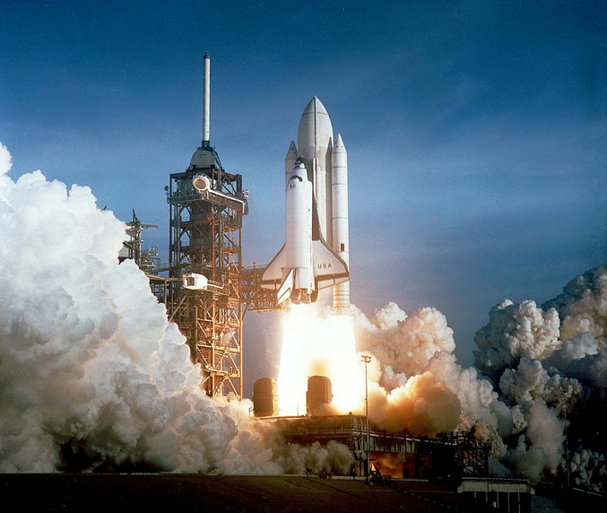
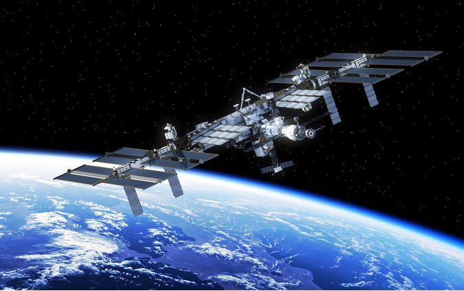
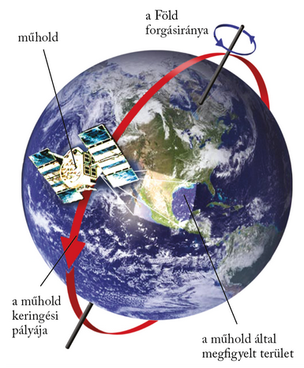
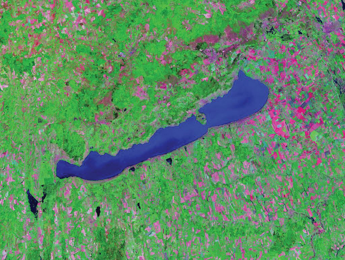

---

> # Modern technika a térképészetben

> Az űrkutatás története
>
> Az űrkutatás alapjait több évszázad csillagászati ismeretei, illetve a 19–20. század technikai újításai vetették meg, maga az űrkutatás azonban csak fél évszázados múltra tekint vissza. Az első műholdat 1957-ben bocsátották fel a Szovjetunióban. Az első ember, aki eljutott a világűrbe, a szovjet Jurij Gagarin volt, aki 1961. április 12-én 89 perces utat tett a Föld körül a Vosztok–1 fedélzetén. 1969. július 20-án pedig az amerikai Apollo–11 űrhajósa, Neil Armstrong személyében először lépett ember a Holdra. Nyomában járva még 12 amerikai űrhajós fordult meg a Holdon. A másik űrhatalom, a Szovjetunió ezután nem is próbálkozott a holdra szállással, helyette inkább a hosszú űrutazást lehetővé tevő űrállomások kialakításába fogott. Ilyen űrállomáson, a Szaljut–6-on töltött nyolc napot 1980 májusában az első magyar űrhajós, Farkas Bertalan is. 1981 ismét fontos év az űrutazások történetében, ekkor lőtték fel az USA-ban az első űrsiklót, a Columbiát.
>
> 
>
> Az űrállomások történetében 1998 novembere mérföldkőnek számít. Ekkor kezdték meg a Nemzetközi Űrállomás (ISS) összeszerelését a világűrben. A több ország (űrügynökség) együttműködésével épült űrlaboratórium 2004-ben készült el, de már 2000 novemberétől van állandó, minimum kéttagú személyzete. Már két magánkézben lévő űrkutatási vállalat is bekapcsolódott az ISS utánpótlás-szállításába. Az űrállomás körülbelül 360 km magasságban, 92 percenként kerüli meg a Földet.
>
> Az ISS a tudományos kutatásokat végző személyzet mellett ma már „űrturistákat” is fogad. Az űrállomás magyar vonatkozásai a Pille névre keresztelt dózismérő, valamint a 2009 februárjában magyar tudományos közreműködéssel végrehajtott fémhabkísérletek. Charles Simonyi magyar származású informatikus pedig már két alkalommal is járt az űrállomáson.
>
> 

> ### Új kutatási módszer: a távérzékelés
>
> Sajátos módon az űrhajózás, vagyis a Földtől való eltávolodás vitte közel a földtudományok kutatóit számos probléma megoldásához. Az űrkutatás egyik nagy vívmánya az űr- vagy más néven műholdfelvételek megjelenése. A műholdfelvételek kiértékelésén alapuló kutatási módszert távérzékelésnek nevezzük.
>
> Részben hasonló módszerek már a 20. század kezdetétől ismertek voltak, hiszen már évtizedek óta készítettek repülőgépekről légi felvételeket. A műholdfelvételek azonban korábban elképzelhetetlen nagyságú területről nyújtanak átfogó képet. Egy-egy műholdfelvétel akkora területet tár elénk, amit korábban több száz légi felvétel fedett le. Az űrfelvételek másik előnye, hogy lehetővé teszik egymástól távoli vidékek összehasonlítását is.
>
> A műholdak a bolygók körül keringő mesterséges égitestek. 1957 óta több ezer műholdat fellőttek már a világűrbe. A Földön kívül más égitestek, például a Hold és a Mars körül is keringenek már műholdak.
>
> A Masat–1 magyar készítésű műholdat 2012-ben az Európai Űrügynökség (ESA) keretein belül állították pályára.
>
> 

> ### A műholdfelvételek fajtái
>
> Az űrhajósok által hagyományos fényképezőgépekkel készített felvételek napjainkra elvesztették jelentőségüket. Az 1960-as években azonban ezeken a képeken tűnt fel először a Föld görbülete, vált láthatóvá a Földet fényes burokként övező légkör, rajzolódott ki elsőként a kontinensek körvonala. A felvételek használhatóságát mindig is korlátozta, hogy az űrhajók ablakából készített felvételek a földfelszínt torzítva ábrázolják, így a térképekkel való összevetésük nehéz. Ezen kívül a több száz kilométer magasságból készített képeken a légkör zavaró hatása miatt alig különíthetőek el a színek.
>
> A többlencsés, színszűrős felvételekhez több összekapcsolt fényképezőgép szükséges, amelyek minden tagja csak bizonyos hullámhosszakat tud felvenni.
>
> Ezek a fényképezőgépek részben már az emberi szem számára nem érzékelhető, a látható fény tartományán kívül eső sugarakat (pl. az infravörös tartományt) is felfogták. Így sokkal több felszíni elemet (kőzetet, növényzetet, mesterséges építményt) sikerült elkülöníteni. A képek azonban csak később, esetleg hetekkel a felvétel elkészülte után jutottak el a kutatókhoz.
>
> A műholdak elterjedéséhez kötődik a többsávos, letapogató módszer megjelenése.
>
> Ezek a műholdak már nem fényképeket készítenek, hanem speciális berendezések, szkennerek segítségével több száz kilométer magasságból „letapogatják” a Föld felszínét. A berendezések a Föld felszínéről érkező sugárzás (pl. a visszavert napsugárzás) területi különbségeit érzékelik.
>
> A jeleket a műhold földi fogadóállomásokra továbbítja, ahol azokat számítógépeken tárolják, és felvételekké alakítják át. E felvételek egyik legnagyobb előnye, hogy számítógép segítségével kiértékelhetőek. A műholdak a látható fény, illetve az infravörös tartományba eső jeleket is továbbítják. Ilyen módszerrel dolgoznak például az amerikai Landsat (ejtsd: lendszet) és a francia SPOT (ejtsd: szpot) műholdak.
>
> A műholdfelvételeknél igen lényeges, hogy mekkora kiterjedésű felszíni elemek különíthetők még el a képeken. Ezt a felbontóképesség értékével adhatjuk meg.
>
> Az állandóan működő műholdak folyamatos megfigyelést tettek lehetővé. A műholdak bizonyos időn belül visszatérnek ugyanazon hely fölé (a Landsat például 16 naponként), így a felvételek a változások rögzítését is lehetővé tették. (Több műhold „bevetésével” a visszatérés gyakorisága növelhető.)

> ### A műholdak fajtái
>
> A földrajzi helymeghatározáshoz jeleket sugárzó navigációs műholdakon kívül a műholdaknak még több típusa van. A távközlési műholdak feladata a telekommunikációs kapcsolatok segítése a Föld egymástól távol eső pontjai között. Nekik köszönhetjük a legtöbb televíziócsatorna adását és az internetkapcsolatot is. A csillagászati műholdak elsődleges feladata az űrkutatás. Kiegészítik az űrszondák és az űrállomások munkáját. A meteorológiai műholdak elsősorban a légköri jelenségeket (kiemelten a felhőzetet) vizsgálják, de ezen kívül a fényszennyezettséget, a hó- és a jégtakaró változásait is. A távérzékelő műholdak a  öldfelszín megfigyelését végzik, elsősorban környezeti és térképészeti céllal. A felderítő műholdak katonai célokat szolgálnak. Jellegükből adódóan működésükről keveset lehet tudni.

> ### A műholdas helymeghatározás
>
> A mára világszerte és számos felhasználási területen alkalmazott műholdas helymeghatározás alapjai is a műholdak. A műholdas helymeghatározás olyan rendszeren alapul, amely műholdak segítségével minden földrajzi hely pontos koordinátáját képes meghatározni. Az egyetlen teljesen kiépített navigációs rendszer jelenleg az amerikai fejlesztésű és működtetésű GPS-rendszer (Global Positioning System).
>
> A rendszer fő pillére 24 műhold, amelyek naponta kétszer kerülik meg a bolygónkat. A műholdak azonos időben sugározzák aktuális pozícióikat a földi vevőkészülékeknek, amelyek a rádióhullámok terjedési sebességét alapul véve ebből távolságot számítanak. Három műhold jeleiből már ki lehet számolni egy adott pont földrajzi koordinátáit. A GPS-rendszer úgy épül fel, hogy a Föld minden pontjáról legalább négy műhold jelei foghatók egy időben, így a hosszúsági és szélességi értékeken kívül a magasság is megadható.

> ### Hamisszínes képek
>
> A műholdak letapogatta jelekből ún. hamisszínes képeket készítenek. Ezeket a különböző hullámhossztartományok jeleinek kombinációjából állítják elő. A különböző sugárzási értékekhez eltérő színárnyalatot rendeltek hozzá. Az így készült hamisszínes képeken a növényzet élénkvörös, a sugárzást elnyelő vízfelületek sötét, olykor fekete színben rajzolódnak ki. A jól elkülönülő színárnyalatok elősegítik például a kőzetek, a talajviszonyok meghatározását, a különféle környezetszennyezési gócok felismerését.
>
> 

---