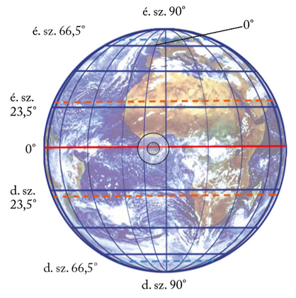
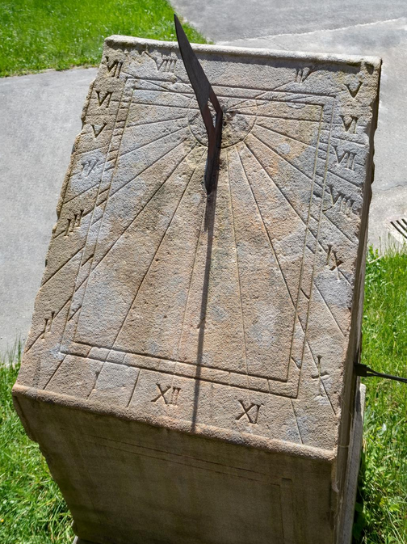

---

> # Tájékozódás az időben

> ### Az időmérésben is segítséget nyújt a fokhálózat
>
> A földrajzi fokhálózat a szélességi és hosszúsági körökből álló koordináta-rendszer. A hálózat szélességi körei az Egyenlítő és a vele párhuzamos körök. A hálózat hosszúsági körei a sarkokon át húzott körök. A hosszúsági köröket délkörnek (meridiánnak) is nevezik, mivel minden, az adott hosszúsági körön fekvő helyen ugyanakkor delel a Nap.
>
> A földrajzi szélességmérés alapsíkjául önként kínálkozik a Földet északi és déli félgömbre osztó Egyenlítő. A földrajzi szélesség értékei mind az északi, mind a déli félgömbön 0° és 90° között váltakozhatnak (északi és déli szélesség). Az egyes szélességi körök rendre 111 km-re vannak egymástól. A szélességi körök közül az ekliptika ferdesége és a Föld tengelyferdesége alapján jelölhetők ki az északi és a déli szélesség 23,5°-a mentén a térítőkörök (a Ráktérítő és a Baktérítő), illetve az északi és a déli szélesség 66,5°-a mentén a sarkkörök (északi és déli sarkkör).
>
> 
>
> A hosszúsági körök között – kezdő hosszúsági körként – 1884-ben, megállapodás alapján fogadták el a London egyik külvárosában, Greenwichben lévő csillagvizsgálón áthaladó délkört. A greenwichi délkör nyugati és keleti félgömbre osztja a Földet. A hosszúsági körök szögértékét a kezdő délkörtől számított, az Egyenlítő körén mért szögtávolság adja meg. A földrajzi hosszúság értékei tehát mind a keleti, mind a nyugati félgömbön 0° és 180° között váltakozhatnak (keleti és nyugati hosszúság).

> ### Időszámítás, időmérés
>
> Az időmérés egységei közül az év és a nap a Nap látszólagos mozgásaihoz, valójában a Föld forgásához és keringéséhez igazodik.
>
> #### Napi időszámítás
>
> A „nap” a Nap két egymást követő delelése között eltelt idő. Kepler második törvényéből azonban tudjuk, hogy a Föld a Naphoz közelebb gyorsabban, a Naptól távolabb lassabban halad pályáján. Emiatt a Nap – látszólagos – járása sem pontos, azaz nem mindig pontosan 24 óránként delel. E valódi napidő pontatlansága miatt vezették be az elméleti, képzelt középnapot, amelynek hossza mindig 24 óra (középnapidő, vagy röviden középidő). A valódi napidő egy év alatt kb. 15 percet késhet, illetve siethet a középnapidőhöz képest. (Csak egyetlen órafajta van, amely a valódi napidőt mutatja: a napóra!)
>
> 
>
> Azonban a középnapidő sem oldott meg minden problémát. A Nap delelése ugyanis függ az észlelő tartózkodási helyének földrajzi hosszúságától. Tudjuk, hogy ugyanazon hosszúsági kör (délkör) minden pontján a Nap azonos időpontban delel. Ez azonban az ún. helyi időt adja meg. Más délkörön máskor delel a Nap, vagyis minden délkörnek más a helyi ideje. (Ha óráink a helyi idő szerint járnának, akkor például Debrecenben előbb, Győrött viszont később kezdődne reggel nyolckor a tanítás, mint Budapesten.)
>
> Emiatt határozták el – a greenwichi kezdő délkör kijelölésével egy időben – a világidő és a zónaidő bevezetését. Világidőként a greenwichi 0° hosszúsági körhöz tartozó középnapidőt fogadták el. Az időzónáknak is Greenwich lett a kiindulópontja. A hosszúsági körök mentén 360 fokra osztott Földön a nap 24 órájának megfelelően 24 „gerezdet”, időzónát jelöltek ki. Így  egy-egy időzónába 15 foknyi területsáv került. Minden időzónán belül azonos időszámítást, az ún. zónaidőt használják.
>
> Az első zóna a greenwichi kezdő délkörtől a keleti és a nyugati hosszúság 7,5 fokáig terjed. Ezen az időzónán belül mindenütt a Greenwichben mért középidőt (Greenwich Mean Time = GMT), vagyis a világidőt mutatják az órák. A határoló délköröket átlépve kelet felé egy órával előbbre, nyugatnak tartva pedig eggyel vissza kell állítani az órákat. Magyarországon a zónaidőnk a GMT + 1 óra.
>
> Az időzónák pontos határa azonban nem esik egybe mindenütt a hosszúsági körökkel. A zónák szélét ugyanis sokfelé az országhatárokhoz igazították.
>
> Nagyjából a 180°-os hosszúsági kör mentén húzták meg az ún. dátumválasztó vonalat. Ezt a vonalat keletről nyugati irányba átlépve az órákat egy nappal előre, nyugatról keletnek haladva pedig egy nappal vissza kell állítani. Így küszöbölték ki, hogy az utazók keletről nyugatra tartva egy napot „nyerjenek”, fordított irányban pedig egy napot „veszítsenek”. A dátumválasztó vonalat lehetőleg lakatlan óceáni területeken húzták meg, hogy ne okozzon gondot az ott élőknek.
>
> #### Évi időszámítás
>
> Az év a Föld egyszeri Nap körüli keringése alatt eltelt idő. Ez kerekítve 365 és 1/4 nap, pontosan 365 nap, 5 óra, 48 perc, 46 másodperc. A naptári év viszont csak egész napokból állhat. A napév tehát hosszabb, mint a 365 napos naptári év. Ezt küszöböli ki az ókor óta bevezetett, négyévenkénti 366 napos szökőév.
>
> A római naptárrendszerhez köthető, hogy a szökőnap a közhiedelemmel ellentétben nem február 29-e, hanem február 24-e.

---