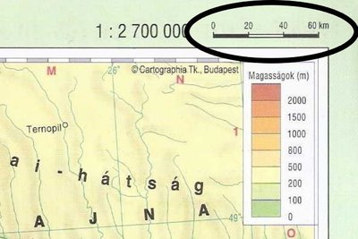

---

- [Vissza az előző oldalra](../foldrajz.md)
- [Vissza a főoldalra](../../../../README.md)

---

# Térképészeti alapismeretek

---

Térkép: a földfelszínnek vagy egy részének felülnézeti kicsinyített, egyszerűsített rajza. Egységes jelmagyarázattal jelölik a tereptárgyakat (domb, vasút, ...)

Atlasz: térképek gyűjteménye

Méretarány: 1:1425000

1cm = 14250m ~ 14.25km

Mértékléc: 

Térkép fajtái:
- földrajzi
- szaktérkép (temotikus térkép)
- helyszínrajzi

---

- [Vissza az előző oldalra](../foldrajz.md)
- [Vissza a főoldalra](../../../../README.md)

---