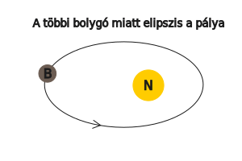
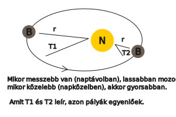

---

- [Vissza az előző oldalra](../foldrajz.md)
- [Vissza a főoldalra](../../../../README.md)

---

# Törvények, számítások

---

| Kepler - törvényei |  |
| :-- | :-- |
| I. minden bolygó olyan elipszis alakú pályán kering, amelynek az egyik gyújtópontjában a nap helyezkedik el. |  |
| II. a bolygótól a napig húzott vezérsugár, egyenlő idők alatt egyenlő területeket súrol. |  |
| III. a bolygók keringési idejének négyzetei úgy aránylanak egymáshoz, mint fél nagytengelyeik köbei.  $\frac{T1^{2}}{T2^{2}} = \frac{a1^{3}}{a2^{3}}$ |  |

Mars keringési ideje:

- $T1$ = Mars
- $T2$ = Föld

- $\frac{T1^{2}}{T2^{2}} = \frac{a1^{3}}{a2^{3}} = \frac{T1^{2}}{365^{2}} = \frac{228^{3millió}}{150^{3millió}} = \frac{11852352}{3375000} = 3.5$

$365^{2} = 133225 * 3.5 = \sqrt{466287.5} = 683 nap$

**Newton** - tömegvonzás törvénye:
- a tömegvonzás egyenesen arányos a testek tömegével, fordítottan viszont a közöttük lévő távolság négyzetével.

$F = G * \frac{m1*m2}{v^2}$

példa:

tanár: 70kg
diák: 60kg
távolság köztük: 3.5m
 
$\frac{70*60}{3.5^{2}} = \frac{4200}{12.25} = 342.8 \frac{Nm^{2}}{Kg^{2}}$

---

- [Vissza az előző oldalra](../foldrajz.md)
- [Vissza a főoldalra](../../../../README.md)

---