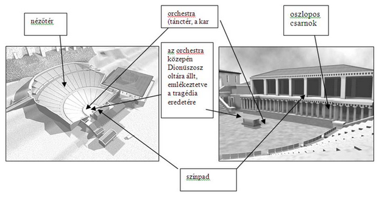
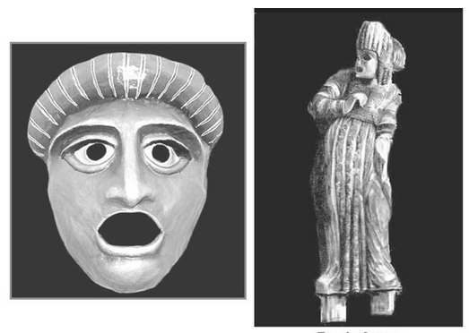

---

- [Vissza az előző oldalra](../irodalom.md)
- [Vissza a főoldalra](../../../../README.md)

---

> ## Iliász
>
> Keletkezése: kr.e. 8.sz.
>
> A trójai háború 10 évéből 52 napos szakaszt emel ki. A középpontban Achilleus áll és az ő haragja.
>
> Verselése: időmértékes, 15700 hexameterből áll.
>
> Szerkezete: 24 ének, lineárisan előremutató a cselekmény.
>
> Embereszmény: Achilleus a hősi halállal megszerezhető dicsőséget választja a hosszú békés, de névetelen, dicstelen élet helyett. A katonai erényekben, harci dicsőségekben megtestesülő emberi nagyság a homéroszi kor nemesség ideálja volt.

---

> ## Odüsszeia
>
> Keletkezése: kr.e. 8.sz. végén
>
> Témája: a trójai háború után, Odüsszueusz bolyongása, 10 évig tartó küzdelme a hazatérésért.
>
> Verselése: időmértékes 12110 hexameterből áll
>
> A hősköltemény jelen ideje 40 nap. Ennyi idő telik el a cselekmény megindulása (a hős hazatérését) elhatározó istengyűlés és befejeződés (Itthakai békekötés) között.
>
> Szerkezete: 24 ének, ezen belül az 1 és 12 ének Odüsszeusz kalandos utazása, 13 és 24 ének a hazatérése. (9-12 kalandok, 1-4 Itthaka, 5-8 Kalipszo nimfánál)
>
> Odüsszeusz kalandjai:
> - a kikónok városában
> - a lótusszedők földjén
> - a küklopsz kaland
> - Aiolié szigetén
> - iaisztvégonok pusztítása
> - Aiaié szigetén
> - alvilág
> - találkozás a szirénekkel
> - Szküla és Kharübdóisz
> - Éeliosz marháinak megdézsmálása
>
> Embereszménye: a sokat tapasztalt, bölcs, leleményes, másokkal is törődő Oüsszeusz, aki saját sorsának irányítója, a polisz polgárság eszménye.

---

> ## Szophoklész - Antigoné
>
> Témáját a thébai mondakörből meríti.
>
> | Szereplők |  |
> | :-- | :-- |
> | Antigoné Iszméné | Oidipusz lányai |
> | Kreon | a király |
> | Haimon | Kreon fia, Antigoné vőlegénye |
> | Teiresziász | a vak jós |
> | Eurüdiké | Kreon felesége |
> | Az őr |  |
> |  |  |
> | Emlegetik |  |
> | Epeoklész | védte a várost |
> | Polüneikész | támadta a várost |
> | Oidipusz |  |
>
> Konfliktusok rendszere:
>
> 
>
> **Antigoné**: fontosak számára a szokások, a hagyományok. Határozott, magabiztos lány, makacs, megrendíthetetlen, de bátran vállalja tetteinek következményeit. Ő az egyetlen, aki a lelkiismeret parancsát életénél is drágábbnak tartja.
>
> **Kreon**: Kreon célja, hogy a város békéjét helyre állítsa és fenntartsa. Zsarnokként viselkedik, nem hallgat senkire, nem befolyásolható, tévedhetetlennek tartja magát. A tragédia végén saját bűnei miatt omlik össze.
>
> **Iszméné**: óvatos, törvénytisztelő, fejet hajt a zsarnok előtt, bár nem ért egyet vele. Testvérét nem segíti a temetésben, de mikor Antigonét elítélik, akkor ő bűnrészességet akar vállalni, ezt családszeretetére, becsületességére vall.
>
> **Haimon**: bölcs, okos, érvekkel próbálja apját meggyőzni, hogy lássa be hibáit, ezzel szembe száll apjával és a kor értékrendjével. Inkább Antigonét a szerelmét választja.
>
> **Teiresziász**: kívülálló, tárgyilagosan tud ítélni, bár vak, ő lát a "legitsztábban". Érzelmek nem befolyásolják. Biztos az érzékeiben.

---

> ## Görög színház
>
> 1. Vallási eredet
>
> A színház- és drámatörténet kezdete a valláshoz kapcsolódik. Az ókori görögök vallásos szertartásokat mutattak be isteneik tiszteletére.
>
> Tudomásunk van arról, hogy ie. VII. szd. környékén évente tartottak vallásos ünnepet Dionüszosz isten tiszteletére. Ennek középpontjában Dionüszosz mítoszának megjelenítése volt, egy tánccal, zenével kísért vallási esemény. Összefügg ezzel, hogy a dráma szó eredete a  dran ‘cselekedni’ szó volt (arra utal, hogy a történetet eljátszották).
>
> Később valószínűleg más mitológiai történeteket is  megjelenítettek, a görög tragédiák mitológiai történetet dolgoztak fel. Mindebből adódik a tragédia vallásos jellege.
>
> 2. Vallásos szertartásból színház
>
> Az ünnepre felvonuló csoportnak volt egy karvezetője. A kar kommentálta a megjelenített eseményeket (kardal=dithirambosz).
>
> Ie.  a VI. szd-ban Theszpisz, a görög drámaíró felléptetett egy színészt is, aki párbeszédet folytatott a karral és karvezetővel. Ez az eredete annak, hogy a dráma dialógusokból áll.
>
> Az idő előrehaladtával a kar szerepe egyre csökkent, a színészé pedig, aki magyarázta akar énekeit, egyre nőtt.
>
> Ie. az V. szd-ban Aiszkhülosz már 2 színészt alkalmazott, Szophoklész pedig már hármat.  A színészek száma ilyen módon nőtt, a dialógusok száma is. Az egész folyamat végeredményeképpen a színész szerepe önállósult, és a hajdan főszerepet betöltő kar szorult háttérbe.
>
> 3. Az épület
>
> A görög színházakat hegyoldalba építették az akusztika miatt. Ügyeltek arra, hogy a színpad mögötti táj látványa impozáns legyen (máskor a színpad hátteréül palota-díszletet építettek).
>
> A színház részeit mutatja az alábbi ábra:
>
> 
>
> Az épületek több tízezer ember befogadására is alkalmasak voltak. Az epidauroszi színház például 12 ezer nézőt fogadhatott egyszerre.
>
> 4. Kellékek
>
> 
>
> A színészek tógában, álarcban és magasított talpú cipőben, a kothornoszban játszottak. Színészként csak férfiakat foglalkoztattak, még a női szerepekre is. Érdekes technikai megoldás volt az az emelőszerkezet, amellyel az istenség földre szállását tudták érzékeltetni (deus ex machina). Az ókori görög színházban nem volt függöny, az előadást nem tagolták felvonásokra és kosztümöt sem alkalmaztak.
>
> 5. A színház helye a társadalom életében
>
> A színház, mai korunkkal ellentétben nem csupán alkalmi szórakozás volt a görögök számára, a társadalom életében betöltött szerepe rendkívüli volt. A drámaírók állami ösztöndíjat kaptak, hogy zavartalanul dolgozhassanak. A kiválasztott drámák szerzői pénzt kaptak a kar megszervezésére. A drámai verseny nyertese óriási megbecsülésben részesült, városa büszkesége lett.
>
> A városok gazdag polgárok finanszίrozták az előadást, kiválasztották a drámákat, szétosztották a díjakat. Befektetésük nem térült meg, adományként és önként adták, hiszen egy sikeresen megszervezett drámaünnep az ő dicsőségük is volt. Az előadások célja nem a szórakoztatás volt, sokkal inkább hasonlított az istentiszteletre.
>
> Nem jelentett mindennapi szórakozást, csak alkalmanként játszottak. Az előadások nappal folytak, ilyenkor az elöljárók munkaszüneti napot biztosítottak. Az  előadások ingyenesek voltak.
>
> 6. A színházi előadások (drámai versenyek) rendje
>
> A drámai versenyeket évente egyszer rendezték meg. Az előadássorozat négy napig tartott, amelynek rendje a következő volt:
>
> |  |  |  |
> | :-- | :-- | :-- |
> | 1. nap | 5 komédiaíró | 5 komédia |
> | 2. nap | 3 tragédiaíró versenye | 3 tragédia  + 1 szatírjáték |
> | 3. nap |  | 3 tragédia  + 1 szatírjáték |
> | 4. nap |  | 3 tragédia  + 1 szatírjáték |
>
> 7. A tragédia formája és a görög színház
>
> A klasszikus tragédia meghatározása a következő:
>
> A drámai műnembe tartozó műfaj. Színpadi előadásra szánják, színészek adják elő, formája párbeszédes. A klasszikus tragédia részei: expozíció, bonyodalom, konfliktus, tetőpont, feloldás. Jellemző rá a  hármas egység elve (tér, idő és cselekmény egysége).
>
> A dráma eseménysort ábrázol, a szereplők jellemét, gondolatait, egymáshoz való viszonyát dialógusaikból, monológjaikból és tetteikből ismerhetjük meg. Témaként olyan történetet választ, amelyben hirtelen értékveszteség, értékpusztulás következik be. A cselekmény szintjén ez a kiemelkedő hős halálában vagy lelki összeomlásában nyilvánul meg. A tragikus hős többnyire a korszakban általánosan elismert pozitív erkölcsi értékeket képvisel. Bukása a félelem és együttérzés érzelmeit váltja ki a nézőből, és megerősíti a hős által képviselt értékek tiszteletét (katarzis).
>
> A tragédia 24 óra alatt, egy helyszínen játszódik – mivel nincsenek felvonások és függöny, nem is lehetne érzékeltetni a tér- és idősík-váltást. Mivel a drámai előadás kultikus esemény, nincs helye semmiféle hatásvadászatnak. A színpadon így soha nem ábrázolták a görögök a halált, a gyilkosságot. Mivel nincs mód arcjátékra (egyrészt messze vannak a színészek, másrészt álarcban játszanak), a szövegnek, a dialógusnak, a monológnak központi jelentősége van.
>
> A színház felépítése megfelel a tragédiák szereplői struktúrájának: külön helye van a karnak és a színészeknek.

---

> ## Noé története
>
> Mivel az emberek nem váltották be a hozzájuk fűzött reményeket, ezért Isten úgy döntött, hogy elborítja a bolygót egy őzőnvízzel és Noé családjának és a bárkára menekült állatoknak a kivételével minden élőlényt megöl "amelyik lélegzik". (A Biblia szerzői nemigen tudták, hogy a növények is lélegeznek, ezért nem minden növény halt meg, de ez csak később derül ki.)
"A tiszta és tisztátalan állatok közül kettő-kettő, egy hím és egy nőstény ment Noéval a bárkába, ahogy Isten megparancsolta." 40 napig esett az eső, a bárkát megemelte a víz és minden élőlény elpusztult, ami lélegzett. Isten megölt minden állatot, minden növényt és minden embert. A víz még 150 napig áradt a földön. Ekkor a víz visszahúzódott és a bárka megfeneklett az Ararát nevű hegyen. Noé 40 nap múlva kiengedett egy hollót, (amelyikről nem beszélünk, nyilván csak véletlenül maradt a Szentírásban, hiszen fekete, szennyes és sátáni madár) és egy galambot is kiengedett, ami szépséges és tiszta és szelíd, ezért az Istennel való szövetség jelképe lett. A galamb nem talált szárazföldet, ezért visszament. Újabb 7 nap elteltével Noé újra kiengedett egy galambot, aki egy friss olajággal tért vissza, (amit ördög tudja honnan hozhatott mert a növényvilág is víz alatt van már lassan egy éve.) Újabb hét nap múlva a kiengedett galamb már nem tért vissza, ebből Noé arra következtetett, hogy fészket rakott (miből?) és nem arra, hogy megfulladt. Noé valamikor kiszállt a bárkából és áldozatot mutatott be az Úrnak: minden tiszta állatból egyet egyet "égő áldozatként" mutatott be Istennek. (Tehát a Földet ezután tisztátalan élőlények népesítették be, mert a tiszta élőlénypárok 1-1 tagját Noé elégette.) "Amikor az Úr megérezte a jó illatot, így szólt: Nem törlök el még egyszer minden élőlényt, ahogy megtettem. Az ember olyan, hogy ifjú korától hajlik a rosszra, nem átkozom meg ezért még egyszer a földet"
Ez az álláspontja egészen Szodoma és Gomoráig tartott.

---

> ## Jónás története
>
> Isten megkérte Jónást, hogy menjen el Ninivébe és mondja meg a lakosságnak, hogy Isten tud a gonoszságukról. Jónás ezt nem akarta megtenni, ezért elbujdosott és felszállt egy Tarsis-ba induló hajóra. A tengeren azonban viharba keveredtek és Jónásra terelődött a gyanú, hogy miatta tört ki a vihar. Jónás vállalta, hogy miatta van és azt kérte, dobják a tengerbe. (Gondolom szombat lehetett, ezért nem ugrott be magától, ugyanis a hithű zsidók nem dolgoznak szombaton.) A tenger örömmel fogadta Jónást, mert rögtön megnyugodott és a vihar elült. A hajó legénysége áldozatot mutatott be Istennek, Isten pedig küldött egy nagy halat, ami elnyelte Jónást három napra.
Arról nincs szó a Bibliában, hogy miért nem fullad meg vagy hogyan kerül ki a halból, de Isten újra megkéri, hogy menjen Ninivébe és ijesztgesse a jónépet. Jónás ezúttal elmegy Ninivébe és mondogatja a lakóknak, hogy "Még negyven nap és Ninive elpusztul!" Erre az emberek böjtöt hirdetnek és zsákruhát öltenek. A király és a főemberek elrendelik Ninivében, hogy: "Öltsön zsákruhát ember és állat és harsány hangon könyörögjön az Istenhez!"
Természetesen ez tetszik Istennek, ezért nem törli el Ninivét is a föld színéről.
>
> Jónás a városon kívülre letelepedve várta Isten pusztítását, nagyon szenved a tűző napon és immár sokadszor itt is majdnem meghal. Csalódott, hogy elmarad a beígért ingyen cirkusz.
Isten egy tököt növeszt (régebbi fordításokban ricinus növényt), hogy árnyékot adjon a csalódott Jónásnak. Másnap azonban egy féreggel megrágatja a növényt és leszárítja, amin Jónás tökre kiakad. Isten pedig azt mondja neki: "Bánkódsz emiatt a növény miatt, holott nem te nevelted, nem gondoztad.... és én ne kegyelmezzek Ninivének a nagyvárosnak, amelyben több mint százhúszezer olyan ember van, aki még nem tud különbséget tenni a jobb és a bal keze között, és igen sok állat?"
És a történetnek itt vége szakad.

---

> ## József története
>
> Az ószövetségi történet szerint - mivel ő volt apja kedvenc fia - féltestvérei irigységből eladták rabszolgának. József álmokat látott, amikben testvérei leborultak előtte. Egyiptomba került, ahol a fáraó főemberének, a testőrök parancsnokának, Potifárnak a szolgája lett. Jó viszonyba került gazdájával. Gazdájának felesége megpróbálta több ízben elcsábítani. Potifárt eunuchként említik gyakran, ami azt is jelentheti, hogy feleségével nem volt képes nemi életre, ezért is kívánkozott az asszony a szép megjelenésű József után. József ellenállt neki, egyrészt mert vallása tiltotta a házasságtörés bármilyen formáját, másrészt hűséges volt Potifárhoz. Erre a dühös feleség megvádolta, hogy József megpróbálta megerőszakolni. Potifár börtönbe vetette Józsefet. Ez a motívum egy, a korabeli világban rendkívül elterjedt mítosz, az Asertu és Baál (hettita Aszerdusz és a Viharisten, ugariti Atirat és Baál, föníciai Asera és Baál). Az istennő neve összevethető József feleségének nevével, Aszenáthhal.
Bartolome Esteban Murillo: József és Potifár felesége
>
> József börtönbe került, ahol megfejtette két rab álmát: az egyikre kivégzés várt, a másikat szabadon bocsátották. Az egyik a fáraó pékmestere, a másik a fáraó főpohárnoka volt. Mikor ez bekövetkezett, József arra kérte a főpohárnokot, hogy ne felejtse el megemlíteni ezt a fáraónak. A pohárnoknak mégis kiment a fejéből, és csak két év múlva emlékezett vissza, mikor a fáraónak különös álmai voltak. A pohárnok javaslatára a fáraó hívta Józsefet, hogy fejtse meg álmát, amely így hangzott: A Nílusból hét szép, jól táplált tehén lépett elő, és legelészett az ártéren. Majd felbukkant hét satnya, vézna tehén, amelyek elnyelték a kövéreket, de éppoly hitvány jószágok maradtak. A másik álomban a fáraó hét bőtermő kalászt látott, amit viszont elnyelt hét aszott kalász, de azok is éppoly hitványak maradtak. József elmagyarázta, hogy a két álom ugyanazt takarja, és a jövendőt mondja a fáraónak: A hét hízott tehén és hét bő kalász hét bő esztendő, míg a hét girhes tehén és hét satnya kalász hét szűk esztendő Egyiptom földjén. Nem szabad hát fecsérelni a javakat, hanem raktározni kell, hogy legyen elég az ínség idejére. A fáraó és főemberei elcsodálkoztak a megfejtésen, és megtetszett nekik József bölcsessége, s megnyerő megjelenése, ezért a fáraó országa helytartójává tette, s átadta neki pecsétgyűrűjét és aranyláncát. Majd megparancsolta az embereknek, hogy fogadjanak szót Józsefnek.
>
> Így Egyiptom élelmet tudott raktározni József vezetésével, és mikor az egész térségben bekövetkezett az éhínség, József apja és testvérei is a családjaikkal együtt Egyiptomba vándoroltak, hogy ne haljanak éhen. Jákob leszármazottaiból - a Biblia alapján - később rabszolgák lettek, és végül Mózes vezetésével hagyták el az országot.
>
> A fáraó Józsefnek a héber neve helyett a Czafenát-Pahneákh egyiptomi nevet adományozta, aminek jelentése: élők eledele, élet kenyere, kenyérosztó. Felesége Aszenáth volt, Ré héliopoliszi főpapjának lánya; két fiuk, Efraim és Manassze két zsidó törzs ősatyja lett. József története szerepel a Koránban is.
>
> József 30 évesen jutott nagy hatalomhoz Egyiptomban, és 110 éves koráig élt, valószínűleg Kr. e. 1750 - 1600 között halt meg. Halála után testét bebalzsamozták, amelyet később a zsidók, Egyiptomból való kivonulásuk idején magukkal vittek, és végül a kánaáni Szikem közelében temették el.

---

> ## A tékozló fiú története
>
> Egy fiú kikérte apjától az örökség rá eső részét és elment egy távoli országba, ahol eltékozolta a vagyont. Kénytelen volt munkát vállalni, sertéseket őrzött egy gazdánál. Rossz sora volt, még a sertések eledelét is irigyen nézte és vágyakozva gondolt arra, hogy még apja szolgái is jobbat esznek, mint ő, szeretett volna inkább közéjük tartozni. Hazatért és az apja elébe ment, hogy csókkal üdvözölje fiát. (csók = megbocsátás jele). A fiú bűnbánóan így szólt apjához: "Apám, vétkeztem az ég ellen és teellened, arra, hogy fiadnak nevezz már nem vagyok méltó." Az apa azonban rögtön hozatott a szolgákkal nemes ruhát, gyűrűt (= a szolgák feletti hatalom jelképe) és sarut ( =a szabadság jelképe) ajándékul a hazatért fiának és nagy örömében még lakomát is rendezett neki, ahol a hizlalt borjút vágatta le. Ekkor megérkezett kimerülten az idősebbik testvér és látta a nagy felhajtást a léha testvére miatt. Haragot érzett és amikor apja kérdőre vonta, elmondta neki, hogy: "sok éve szolgálok neked és egyszer sem szegtem meg a parancsodat és még egy gödölyét sem adtál soha, hogy egyet mulassak a barátaimmal". Erre az apa: "Fiam, te mindig itt vagy velem... de illett vigadnunk, mert az öcséd halott volt és megkerült." (Egyes fordításokban "Neked is vigadnod kellene, hogy megkerült.")
>
> Mint minden példázat a Bibliában, ez is magyarázat nélküli, tehát az olvasóra van bízva az értelmezése.
Természetesen az apa ilyen hozzáállása igazságtalan. Újra együtt van a Család, ezért van ok az ünneplésre, de az apának feltétlenül ki kellene fejeznie a hűséges fia iránti tiszteletét. Az idősebbik fiú mellette maradt, vitte a gazdaságot, a Család ereje volt, míg a másik elherdálta a pénzt. Esetleg most a másik fiú kérhetné ki az örökségét és értelmesen befektetve bizonyíthatná a apjának, hogy többre képes, mint a testvére. Ráférne, hogy végre a maga ura legyen, főleg azok után, hogy az apja nem becsülte meg.

---

- [Vissza az előző oldalra](../irodalom.md)
- [Vissza a főoldalra](../../../../README.md)

---
