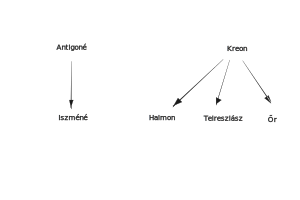

---

- [Vissza az előző oldalra](../irodalom.md)
- [Vissza a főoldalra](../../../../README.md)

---

Témáját a thébai mondakörből meríti.

| Szereplők |  |
| :-- | :-- |
| Antigoné Iszméné | Oidipusz lányai |
| Kreon | a király |
| Haimon | Kreon fia, Antigoné vőlegénye |
| Teiresziász | a vak jós |
| Eurüdiké | Kreon felesége |
| Az őr |  |
|  |  |
| Emlegetik |  |
| Epeoklész | védte a várost |
| Polüneikész | támadta a várost |
| Oidipusz |  |

Konfliktusok rendszere:

**Antigoné**: fontosak számára a szokások, a hagyományok. Határozott, magabiztos lány, makacs, megrendíthetetlen, de bátran vállalja tetteinek következményeit. Ő az egyetlen, aki a lelkiismeret parancsát életénél is drágábbnak tartja.

**Kreon**: Kreon célja, hogy a város békéjét helyre állítsa és fenntartsa. Zsarnokként viselkedik, nem hallgat senkire, nem befolyásolható, tévedhetetlennek tartja magát. A tragédia végén saját bűnei miatt omlik össze.

**Iszméné**: óvatos, törvénytisztelő, fejet hajt a zsarnok előtt, bár nem ért egyet vele. Testvérét nem segíti a temetésben, de mikor Antigonét elítélik, akkor ő bűnrészességet akar vállalni, ezt családszeretetére, becsületességére vall.

**Haimon**: bölcs, okos, érvekkel próbálja apját meggyőzni, hogy lássa be hibáit, ezzel szembe száll apjával és a kor értékrendjével. Inkább Antigonét a szerelmét választja.

**Teiresziász**: kívülálló, tárgyilagosan tud ítélni, bár vak, ő lát a "legitsztábban". Érzelmek nem befolyásolják. Biztos az érzékeiben.

---

- [Vissza az előző oldalra](../irodalom.md)
- [Vissza a főoldalra](../../../../README.md)

---