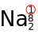

---

# Kémia

---

Atomok

---

Tk.: Mozaik 9. kémia - írta: Siposné Éva

Érdemes elolvasni: 'Halvány lila gőzünk sincs' (lila színű könyv), egy fizikus írta (izgalmassá, érdekessé tette a fizikát)

### Atom modellek

Atom felépítése -nagyon kicsi
'Démokrétosz és Arisztotelész elméletét fogadták el

Thompson felfedező 'mazsolás kalács kísérlete'

Rutherford zseni kísérlete:
neutron; proton = nehéz részecske
elektron = könnyű részecske 6x1023</sup10-27

- proton: p+
- neutron: $n^0$
- elektron: e-
- ('kvarkok)

### Atommag

(Zsírban oldódó vitaminok)
Az atommagot, magerő tartja össze

A protonok száma egyenlő a rendszámmal
A proton és a neutron szám nem mindig egyezik meg.

### atomok elektronszerkezete

elektronburok szerkezete:
 - 7 elektronhéj - ide épülnek az elektronok
 - 

Pálya típusok:

| Héj | Alhéj |
| :-- | :-- |
| K | 1s |
| L | 2s, 2p |
| M | 3s, 3p, 3d |
| N | 4s, 4p, 4d, 4f |

| Atompályák jelölése | Atompályák betöltődési sorrendje |
| :-- | :-- |
|  |  |

---

Kötések

---

A pozitív töltésű fém atomtörzsek és a delokalizált elektronok közötti vonzást **fémes kötés**nek nevezzük.
A fémes kötéssel összekapcsolt fém atomtörzsek halmaza a **fémrács**.

Az  szeretne a külső három elektronjától megszabadulni, elérje a nemesgáz szerkezetet.

$Al -> Al^{3+} + 3e^{-}$

- leadott elektron
- 2 elektronhéja lezárt
- a harmadik héjon lévő vegyérték elektronok vesznek részt a folyamatban
- pozitív a fématomtörzs
- nem helyhez kötöttek (Delokalizált), szabadon mozognak

- egyszeres pozitív töltésű ionokat alkot
- 9 db nátrium ion van és 9 db elektron bolyong körülötte

---

---

[Vissza](../../../README.md)

---
