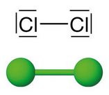
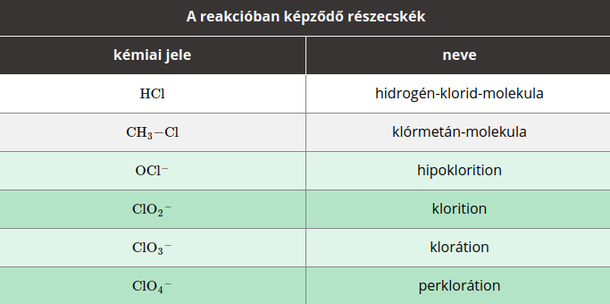

---

- [Vissza az előző oldalra](../kemia.md)
- [Vissza a főoldalra](../../../../README.md)

---

> # A halogénelemek
> :memo: Számos olyan elem van, amely tiszta, elemi állapotban akár veszélyes is lehet az élő szervezetre, ugyanakkor átalakulásukat követően létfontosságú vegyület jön létre. Például az emberi szervezetre igen veszélyes nátriumot és a mérgező klórgázt reagáltatva az élő szervezet számára kiemelt jelentőségű nátrium-klorid, vagyis konyhasó keletkezik.
>> $2Na+Cl_{2}->2NaCl$
>
> A periódusos rendszer 17. csoportját (VII. A főcsoportját) alkotó elemeket halogénelemeknek nevezzük. A szó jelentése „sóképző”, utalva igen gyakori előfordulási formájukra. A csoport elemei közé tartozik a fluor, a klór, a bróm, a jód és az asztácium. Amíg az első négy elem nagyon hasonló kémiai tulajdonsággal rendelkezik, az asztácium számos tekintetben különbözik ezektől.
>
> ## A klór
> ### A klóratom izotópjai és elektronszerkezete
> A klór két izotóp, a $^{35}Cl$, és a $^{37}Cl$ keveréke. A természetben a $^{35}Cl$-izotóp nagyjából háromszor nagyobb mennyiségben fordul elő, mint a 37-es tömegszámú izotóp.
>
> A klóratom vegyértékhéjának elektronszerkezete $3s^{2} 3p^{5}$.
> ### A klórmolekula szerkezete
> A klóratom hét vegyértékelektronnal rendelkezik. Ebből hat elektron párosítva helyezkedik el, míg a hetedik elektron párosítatlan. Két klóratom az egy-egy párosítatlan elektronját közössé téve kétatomos elemmolekula jön létre.
>
> 
>
> A klór apoláris molekulákat képez. A szilárd halmazállapotban kialakuló molekularácsot a molekulák között működő gyenge diszperziós kölcsönhatás tartja egyben.
> ### Fizikai tulajdonságok
> A klór egy sárgászöld színű, szúrós szagú, köhögésre ingerlő gáz. Az apoláris molekulákat gyenge másodrendű kölcsönhatás tartja egyben, ezért azokat nagyon könnyű eltávolítani egymástól, így alacsony olvadás- és forráspont jellemzi.
>
> Az apoláris klórgáz az apoláris oldószerekben (például benzinben) jól, poláris oldószerekben viszont rosszul oldódik. A vízben való kismértékű oldódását reakció segíti.
>
> A levegőnél sokkal nagyobb sűrűségű gáz, ezért lefelé száll. Ha klórgázt szeretnénk felfogni, azt szájával felfelé tartott edényben tehetjük meg.
> ## Kémiai tulajdonságok
>
> A klórmolekulában található egyszeres kovalens kötés már a látható, pontosabban a kék fény hatására is könnyen felbontható. A klór a második legnagyobb reakcióképességű halogénelem a fluor után.
>
> A reakciói eredményeképpen számos esetben halogenidion (kloridion) keletkezik:
> $Cl_{2}->2Cl^{-}+2e^{-}$
>
> Emellett azonban a reakciói változatos összetételű molekulákat, illetve összetett ionokat eredményeznek.
>
> 
>
> A klór a reakcióiban erélyes oxidálószerként viselkedik.
> ### Reakció nemfémes elemekkel
> A klór oxigénnel nem lép reakcióba, éghetetlen gáz.
>
> A hidrogénnel keveredve a klórgáz sötétben, szobahőmérsékleten nem reagál. Láng, szikra hatására azonban robbanásszerű sebességgel megy végbe az átalakulás:
> $H_{2}+Cl_{2}->2HCl$
>
> A hidrogén- és a klórgáz 1 : 1 térfogatarányú elegyét klórdurranógáznak nevezzük.
>
> ### Reakció fémekkel
> A megolvasztott vagy felhevített fémek többségével heves, olykor tűzjelenség által kísért reakció játszódik le:
> - $2Na+Cl_{2}->2NaCl$ (nátrium-klorid, fehér)
> - $Mg+Cl_{2}->MgCl_{2}$ (magnézium-klorid, fehér)
> - $2Fe+3Cl_{2}->2FeCl_{3}$ (vas(III)-klorid, barna)
> - $Cu+Cl_{2}->CuCl_{2}$ (réz(II)-klorid, zöld)
>
> Az atomos állapotú (más néven naszcensz) klór reakciókészsége olyan nagy, hogy az inert fémekkel, így az arannyal és a platinával is reakcióba léphet.
> ### Reakció vízzel
> Vízzel egyensúlyi reakcióban lép kölcsönhatásba, klóros víz keletkezése közben: $H_{2}O+Cl_{2}<->HCl+HOCl$
>
> A reakcióban keletkező hipoklórossav már kevés fény hatására is elbomlik: $HOCl->HCl+^{'}O^{'}$
>
> A bomlás során hidrogén-klorid és naszcensz oxigén (vagyis atomos oxigén) keletkezik, amely igen erélyes oxidálószer. 
> ### Reakció lúgokkal
> A klórgáz nátrium-hidroxid-oldatban való elnyeletésekor nátrium-hipoklorit ($NaOCl$) állítható elő, ami a háztartási hipó hatóanyaga: $2NaOH+Cl_{2}->NaCl+NaOCl+H_{2}O$
> ### Reakció halogenidekkel
> A klórgáz olyan erélyes oxidálószer, hogy a bromidokból, illetve a jodidokból elemi halogént állít elő. A fluoridokkal azonban nem képes reakcióba lépni.
> - $Cl_{2}+2KBr->2KCl+Br_{2}$
> - $Cl_{2}+2KI->2KCI+I_{2}$
>
> ### Előfordulás
> Nagy reakcióképessége miatt elemi állapotban csak nagyon ritkán fordul elő a természetben. Egyes vulkáni gázok összetevőjeként jelenik meg.
>
> Ionos vegyületei viszont annál gyakoribbak. A kloridjai közül a nátrium-klorid igen nagy mennyiségben fordul elő a természetben, főleg tengerek, óceánok oldott anyagaként, illetve kősótelepeken.
>
> A kovalens vegyületei sokkal ritkábbak.
> - $MnO_{2}+4HCl->MnCl_{2}+2H_{2}O+Cl_{2}$
> - $2KMnO_{4}+16HCl->2MnCl_{2}+2KCl+8H_{2}O+5Cl_{2}$
>
> Az iparban a klórgázt nátrium-klorid-oldat elektrolízisével állítják elő. A folyamat során hidrogéngáz és nátrium-hidroxid-oldat is keletkezik.
> - $2Cl^{-}(aq)->Cl_{2}(g)+2e^{-}$
> ### Felhasználás és jelentőség
> Felhasználása igen széles körű. Baktériumölő, fertőtlenítő hatása miatt a vezetékes vizek kezelésekor alkalmazzák. A festékeket roncsolja, így a textilipar is használja. Emellett felhasználják számos szerves klórvegyület előállítására.
>
> A klórgáz nagyon mérgező, a nyálkahártyát ingerlő gáz, belélegezve tüdővizenyőt okoz.

---

- [Vissza az előző oldalra](../kemia.md)
- [Vissza a főoldalra](../../../../README.md)

---