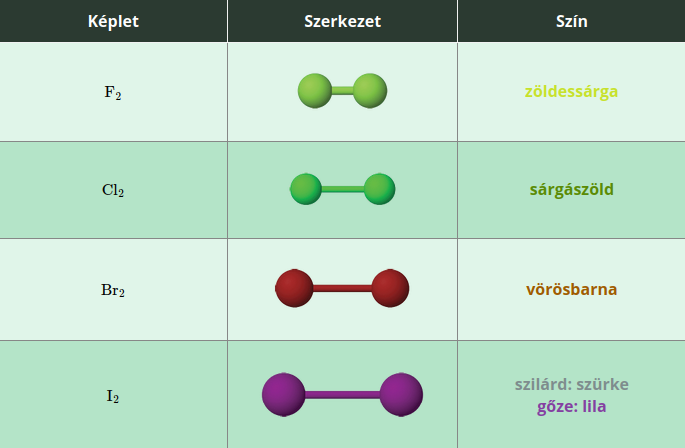

---

- [Vissza az előző oldalra](../kemia.md)
- [Vissza a főoldalra](../../../../README.md)

---

> # A halogénelemek
> :memo: Számos olyan elem van, amely tiszta, elemi állapotban akár veszélyes is lehet az élő szervezetre, ugyanakkor átalakulásukat követően létfontosságú vegyület jön létre. Például az emberi szervezetre igen veszélyes nátriumot és a mérgező klórgázt reagáltatva az élő szervezet számára kiemelt jelentőségű nátrium-klorid, vagyis konyhasó keletkezik.
>> $2Na+Cl_{2}->2NaCl$
>
> A periódusos rendszer 17. csoportját (VII. A főcsoportját) alkotó elemeket halogénelemeknek nevezzük. A szó jelentése „sóképző”, utalva igen gyakori előfordulási formájukra. A csoport elemei közé tartozik a fluor, a klór, a bróm, a jód és az asztácium. Amíg az első négy elem nagyon hasonló kémiai tulajdonsággal rendelkezik, az asztácium számos tekintetben különbözik ezektől.
>
> ## A klór
> ### A klóratom izotópjai és elektronszerkezete
> A klór két izotóp, a $^{35}Cl$, és a $^{37}Cl$ keveréke. A természetben a $^{35}Cl$-izotóp nagyjából háromszor nagyobb mennyiségben fordul elő, mint a 37-es tömegszámú izotóp.
>
> A klóratom vegyértékhéjának elektronszerkezete $3s^{2} 3p^{5}$.
> ### A klórmolekula szerkezete
> A klóratom hét vegyértékelektronnal rendelkezik. Ebből hat elektron párosítva helyezkedik el, míg a hetedik elektron párosítatlan. Két klóratom az egy-egy párosítatlan elektronját közössé téve kétatomos elemmolekula jön létre.
>
> 
>
> A klór apoláris molekulákat képez. A szilárd halmazállapotban kialakuló molekularácsot a molekulák között működő gyenge diszperziós kölcsönhatás tartja egyben.
> ### Fizikai tulajdonságok
> A klór egy sárgászöld színű, szúrós szagú, köhögésre ingerlő gáz. Az apoláris molekulákat gyenge másodrendű kölcsönhatás tartja egyben, ezért azokat nagyon könnyű eltávolítani egymástól, így alacsony olvadás- és forráspont jellemzi.
>
> Az apoláris klórgáz az apoláris oldószerekben (például benzinben) jól, poláris oldószerekben viszont rosszul oldódik. A vízben való kismértékű oldódását reakció segíti.
>
> A levegőnél sokkal nagyobb sűrűségű gáz, ezért lefelé száll. Ha klórgázt szeretnénk felfogni, azt szájával felfelé tartott edényben tehetjük meg.
> ## Kémiai tulajdonságok
>
> A klórmolekulában található egyszeres kovalens kötés már a látható, pontosabban a kék fény hatására is könnyen felbontható. A klór a második legnagyobb reakcióképességű halogénelem a fluor után.
>
> A reakciói eredményeképpen számos esetben halogenidion (kloridion) keletkezik:
> $Cl_{2}->2Cl^{-}+2e^{-}$
>
> Emellett azonban a reakciói változatos összetételű molekulákat, illetve összetett ionokat eredményeznek.
>
> 
>
> A klór a reakcióiban erélyes oxidálószerként viselkedik.
> ### Reakció nemfémes elemekkel
> A klór oxigénnel nem lép reakcióba, éghetetlen gáz.
>
> A hidrogénnel keveredve a klórgáz sötétben, szobahőmérsékleten nem reagál. Láng, szikra hatására azonban robbanásszerű sebességgel megy végbe az átalakulás:
> $H_{2}+Cl_{2}->2HCl$
>
> A hidrogén- és a klórgáz 1 : 1 térfogatarányú elegyét klórdurranógáznak nevezzük.
>
> ### Reakció fémekkel
> A megolvasztott vagy felhevített fémek többségével heves, olykor tűzjelenség által kísért reakció játszódik le:
> - $2Na+Cl_{2}->2NaCl$ (nátrium-klorid, fehér)
> - $Mg+Cl_{2}->MgCl_{2}$ (magnézium-klorid, fehér)
> - $2Fe+3Cl_{2}->2FeCl_{3}$ (vas(III)-klorid, barna)
> - $Cu+Cl_{2}->CuCl_{2}$ (réz(II)-klorid, zöld)
>
> Az atomos állapotú (más néven naszcensz) klór reakciókészsége olyan nagy, hogy az inert fémekkel, így az arannyal és a platinával is reakcióba léphet.
> ### Reakció vízzel
> Vízzel egyensúlyi reakcióban lép kölcsönhatásba, klóros víz keletkezése közben: $H_{2}O+Cl_{2}<->HCl+HOCl$
>
> A reakcióban keletkező hipoklórossav már kevés fény hatására is elbomlik: $HOCl->HCl+^{'}O^{'}$
>
> A bomlás során hidrogén-klorid és naszcensz oxigén (vagyis atomos oxigén) keletkezik, amely igen erélyes oxidálószer. 
> ### Reakció lúgokkal
> A klórgáz nátrium-hidroxid-oldatban való elnyeletésekor nátrium-hipoklorit ($NaOCl$) állítható elő, ami a háztartási hipó hatóanyaga: $2NaOH+Cl_{2}->NaCl+NaOCl+H_{2}O$
> ### Reakció halogenidekkel
> A klórgáz olyan erélyes oxidálószer, hogy a bromidokból, illetve a jodidokból elemi halogént állít elő. A fluoridokkal azonban nem képes reakcióba lépni.
> - $Cl_{2}+2KBr->2KCl+Br_{2}$
> - $Cl_{2}+2KI->2KCI+I_{2}$
>
> ### Előfordulás
> Nagy reakcióképessége miatt elemi állapotban csak nagyon ritkán fordul elő a természetben. Egyes vulkáni gázok összetevőjeként jelenik meg.
>
> Ionos vegyületei viszont annál gyakoribbak. A kloridjai közül a nátrium-klorid igen nagy mennyiségben fordul elő a természetben, főleg tengerek, óceánok oldott anyagaként, illetve kősótelepeken.
>
> A kovalens vegyületei sokkal ritkábbak.
> - $MnO_{2}+4HCl->MnCl_{2}+2H_{2}O+Cl_{2}$
> - $2KMnO_{4}+16HCl->2MnCl_{2}+2KCl+8H_{2}O+5Cl_{2}$
>
> Az iparban a klórgázt nátrium-klorid-oldat elektrolízisével állítják elő. A folyamat során hidrogéngáz és nátrium-hidroxid-oldat is keletkezik.
> - $2Cl^{-}(aq)->Cl_{2}(g)+2e^{-}$
> ### Felhasználás és jelentőség
> Felhasználása igen széles körű. Baktériumölő, fertőtlenítő hatása miatt a vezetékes vizek kezelésekor alkalmazzák. A festékeket roncsolja, így a textilipar is használja. Emellett felhasználják számos szerves klórvegyület előállítására.
>
> A klórgáz nagyon mérgező, a nyálkahártyát ingerlő gáz, belélegezve tüdővizenyőt okoz.
> ## A fluor, a bróm és a jód
> ### Elektronszerkezet és elektronegativitás
> A klóratomhoz hasonlóan minden halogén­atom hét külső elektronnal rendelkezik. A vegy­értékhéjuk elektronszerkezete $ns^{2}np^{5}$, ahol az $n$ a főkvantumszámot, azaz a periódus sorszámát jelöli.
>
> A halogénatomok elektronvonzó képessége a legnagyobb értékű abban a periódusban, amelyikben a halogénelem található. A fluor elektronegativitása az összes elemet figyelembe véve is a legnagyobb értékű.
> ### A halogénmolekulák szerkezete
> A halogének kétatomos, apoláris molekulákat alkotnak (26.2. táblázat). Szilárd halmazállapotban gyenge diszperziós kölcsönhatás tartja egyben a molekularácsot. A molekulák méretének növekedésével a diszperziós kölcsönhatás fokozatosan erősebbé válik az egyre növekvő polarizálhatóság miatt.
>
> 
> ### Fizikai tulajdonságok
> A molekulák méreteinek növekedésével a halogénelemek színe egyre sötétebb lesz, az olvadás- és forráspontjuk egyre inkább nő. Ennek megfelelően a fluor és a klór gáz-halmazállapotú, a bróm folyékony, míg a jód szilárd halmazállapotú. A jód megfelelő körülmények között szublimációra képes, míg a bróm már közönséges körülmények között is erőteljesen párolog.
>
> Mindegyik halogénelem szúrós szagú, apoláris oldószerben (pl. benzinben) jól oldódó anyag.
>
> A jód oldódására jellemző, hogy különböző színnel oldódik annak megfelelően, hogy az oldószer molekulái tartalmaznak-e oxigénatomot vagy sem. A jód lila színnel oldódik azokban az oldószerekben, amelyek molekulái oxigén­atomot nem tartalmaznak. Ezzel szemben az oldat vörösesbarna, ha az oldószer molekulái oxigént is tartalmaznak. Az előbbi esetre példa a benzin és a szén-tetraklorid, míg utóbbira az etil-alkohol és az éter.
>
> A jód vízben rosszul, azonban a kálium-jodid vizes oldatában nagyon jól oldódik. Az így kapott vörösbarna színű kálium-jodidos jódoldatot Lugol-oldatnak nevezzük. Az oldódás közben kémiai változás is bekövetkezik: a jódmolekulák a jodidionokkal reagálnak, miközben vízben jól oldódó trijodidionok keletkeznek:
> $I_{2}+I^{-}<->I_{3}^{-}$
> ### Kémiai tulajdonságok
>
> A fluor a legnagyobb reakciókészséggel bíró elem. A reakcióiban erélyes oxidálószerként viselkedik.
> A mindössze néhány kivételtől eltekintve ($He,Ne,Ar,O_{2},N_{2}$, nemesfémek) az elemek többségével reakcióba lép.
>
> A bróm és a jód valamivel kisebb reakciókészségű, mint a fluor és a klór. A reakcióikban szintén főként oxidálószerként viselkednek.
>
> A hidrogénnel való reakció a halogénatomok rendszámának növekedésével egyre lassúbb.
>
> A fluor sötétben és alacsony hőmérsékleten is robbanásszerűen reagál.
> - $H_{2}+F_{2}->2HF$
>
> A bróm és a jód a hidrogénnel csak magasabb hőmérsékleten (800 °C) lép reakcióba, miközben egyensúlyi reakció megy végbe.
> - $H_{2}+Br_{2}<->2HBr$
> - $H_{2}+I_{2}<->2HI$
>
> A fémekkel történő reakció során haloge­nidek (fluoridok, bromidok, illetve jodidok) keletkeznek. A fémekkel való reakció gyakran igen hevesen megy végbe.
>
> A nátrium a fluorral igen heves reakcióban nátrium-fluoriddá alakul:
> $2Na+F_{2}<->2NaF$
>
> Vízmentes körülmények között egyes fémek (pl. az ólom) felületén kialakuló fluoridréteg gátolja a további reakciót.
>
> Amennyiben egy brómot tartalmazó kémcsőbe egy kis méretű alufóliából készült golyót dobunk, igen heves, gyakran tűztünemény közben végbemenő átalakulást figyelhetünk meg. A fejlődő hő miatt a bróm egy része elpárolog, ezért a kísérletet kizárólag jól szívó vegyifülke alatt szabad elvégezni.
> - $2Al+3Br_{2}->2AlBr_{3}$ Alumínium-bromid
>
> Az alumínium és a jód közötti reakció ennél sokkal lassabban indul be. A kísérlet során először a jódot alaposan elporítjuk, majd óvatosan, egyenletesen összekeverjük finom eloszlású alumíniumporral. Ezután egy-két csepp vizet cseppentünk a porkeverékre, elősegítve a reakció beindulását. Ekkor azt tapasztaljuk, hogy a reakciótérből lila színű gőzök távoznak, a porkeverék pedig tűztünemény közben alakul át. A látottak magyarázata, hogy a víz elősegíti az alumínium- és jódszemcsék találkozását, segítségével heves reakció indul be. A lila jódgőz képződése a magas hőmérséklet hatására bekövetkező szublimáció eredménye.
> - $2Al+3I_{2}->2AlI_{3}$ Alumínium-jodid
>
> A vízzel történő reakciójuk különbözőképpen megy végbe.
>
> A fluor a vízzel történő reakciója során oxigéngázt és ózont is képez:
> - $2F_{2}+2H_{2}O->4HF+O_{2}$
> - $3F_{3}+3H_{2}O->6HF+O_{3}$
>
> A bróm a vízzel a klórhoz hasonlóan reagál, hidrogén-bromid és hipobrómossav képződése közben:
> $H_{2}O+Br_{2}<->HBr+HOBr$
>
> A jód a vízzel nem lép reakcióba.
>
> A lúgoldatokkal végbemenő reakciók közül a bróm és a jód reakciója bír nagyobb jelentőséggel.
> - $2NaOH+Br_{2}->NaBr+NaOBr+H_{2}O$
> - $2NaOH+I_{2}->NaI+NaOI+H_{2}O$
>
> A halogenidekkel való reakció esetében általános szabályként írható fel, hogy a kisebb rendszámú halogénelem reagálni képes a nagyobb rendszámú halogénelem ionjával. Fordítva viszont nem megy a reakció.
> - $F_{2}+2KCl->2KF+Cl_{2}$
> - $F_{2}+2KBr->2KF+Br_{2}$
> - $F_{2}+2KI->2KF+I_{2}$
> - $Br_{2}+2KI->2KBr+I_{2}$
> ### Előfordulás
> A fluor csak vegyületei formájában fordul elő a természetben. Ilyen például a folypát vagy fluorit ($CaF_{2}$). A bróm szintén csak vegyületei, főleg bromidok formájában fordul elő a természetben. A jód a vegyületek mellett elemi állapotban is előfordul. Így kis mennyiségben a tengervízben is megtalálható, míg a tengeri növények, algák nagy mennyiséget képesek felhalmozni a szervezetükben.
> ### Előállítás
> Ezeket a halogénelemeket az iparban állítják elő. A fluort kizárólag a vegyületei olvadék­elektrolízisével lehet előállítani. A brómot és a jódot főleg a bromidokból, illetve a jodidokból állítják elő klór segítségével. Viszonylag ritkán alkalmazzák az elektrolízist az előállításra.
> ### Felhasználás és jelentőség
> A fluort főleg különböző fluortartalmú vegyületek előállítására használjuk. Ilyen termék például a teflon nevű műanyag.
>
> A brómot főleg a gyógyszeripar használja különböző készítmények előállítására. Emellett a szerves minőségi analízis egyik fontos reagense.
>
> A jódot főként az egészségügyben használatos fertőtlenítőszerek előállítására (pl. jódtinktúra, Betadine) használják.
>
> A fluor egy mérgező gáz, belélegezve súlyos egészségkárosodáshoz vezet. A bróm bőrre kerülve fekélyes sebet okoz, a gőzét be­lélegezve akár halálhoz is vezethet. A jód baktériumölő, fertőtlenítő hatású. A jódszegény táplálkozás golyvás megbetegedésekhez vezethet.

---

- [Vissza az előző oldalra](../kemia.md)
- [Vissza a főoldalra](../../../../README.md)

---