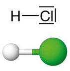
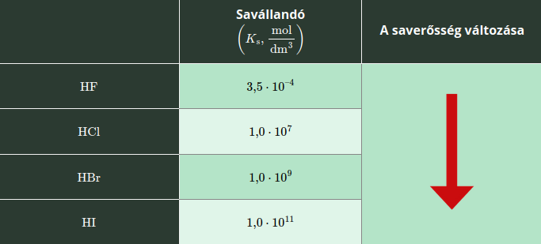

---

- [Vissza az előző oldalra](../kemia.md)
- [Vissza a főoldalra](../../../../README.md)

---

> # A hidrogén-halogenidek
> :memo: A sósav az egyik leggyakrabban használt laboratóriumi vegyszer, a kémiaórák szinte állandó résztvevője. A sósav nem más, mint a hidrogén-klorid-gáz vizes oldata.
> :memo: A sósav számos fémmel reakcióba lép, miközben hidrogéngáz keletkezik. Ilyen fém a cink, a magnézium, az alumínium, illetve a vas is.
>
>A hidrogén-klorid a klór- és hidrogéngáz reakciójából keletkezett vegyület. Ahogy a klór, úgy a többi halogénelem is képez hidrogénnel vegyületeket, amelyeket összefoglaló néven hidrogén-­halogenideknek nevezünk. Ilyen hidrogén-halogenid a hidrogén-fluorid **$HF$**, a hidrogén-klorid **$HCl$**, a hidrogén-bromid **$HBr$** és a hidrogén-jodid **$HI$**. A hidrogén-halogenidek számos tulajdonságban hasonlóak.
>
> A hidrogén-klorid a mindennapi életben, illetve az iparban is kiemelkedő jelentőséggel bír.
> ## A hidrogén-klorid
> ### A hidrogén-klorid-molekula szerkezete
> A poláris hidrogén-klorid-molekula lineáris alakú. A molekulán belül a hidrogén- és a klóratom között poláris kovalens kötés működik. Szilárd halmazállapotban molekularácsot képez, amit a dipólus-dipólus kölcsönhatás tart össze.
>
> 
> ### Fizikai tulajdonságok
> A hidrogén-klorid színtelen, szúrós szagú, a levegőnél nagyobb sűrűségű gáz. Az olvadás- és forráspontja a moláris tömegnek megfelelő értékű. Kellően nagy nyomás hatására akár szobahőmérsékleten is cseppfolyósítható.
>
> Vízben kiválóan oldódik, miközben az oldódást kémiai változás is kíséri. A hidratált ionok kialakulása közben kismértékű hőfejlődés tapasztalható.
>
> Az oldódási folyamat mértéke jól szemléltethető a sósavszökőkút nevű kísérlettel. A frissen előállított, száraz hidrogén-klorid-gázt egy száraz lombikba vezetjük. Ezután a lombikot lezárjuk egy olyan gumidugóval, amelyen egy vékony üvegcső van átvezetve. Az üvegcső lombikba lógó vége összeszűkül. Pár csepp vizet juttatunk a lombikba, befogjuk az üvegcső szabad végét, és összerázzuk a lombik tartalmát.
>
> Ezt követően a lombikot lezáró dugóban található üvegcső még mindig zárva tartott végét az indikátorral festett víz felszíne alá helyezzük, majd az üvegcső nyílását szabaddá tesszük.
>
> Azt tapasztaljuk, hogy a víz szökőkútszerűen áramlik a lombikba, miközben az indikátorral megfestett víz színe megváltozik.
>
> A jelenség a hidrogén-klorid-gáz kiváló víz­old­hatóságával, illetve a savas kémhatású sósav képződésével magyarázható. A gáz nagy része ugyanis beoldódik a néhány csepp vízbe, ezáltal a lombikban a belső nyomás lecsökken. Mivel a légköri nyomás nagyobb, mint a lombikban uralkodó nyomás, az indikátoros vizet szökőkútszerűen a lombikba préseli. Az indikátoros víz semleges kémhatású, a lombikban található hidrogén-kloridot oldva sósav keletkezik, az indikátor savas kémhatást jelez.
>
> A sósav jellemzően 38 w%-os, tömény oldatként kerül forgalomba, azonban megfelelő körülmények között akár 42 w%-os oldatot is készíthetünk a hidrogén-kloridból. A tömény savból párolgó hidrogén-klorid-gáz a levegő víztartalmával ködöt képez, ezért a füst megjelenése miatt tévesen füstölgő sósavnak is szokás nevezni.
> ### Kémiai tulajdonságok
> A hidrogén-klorid gázhalmazállapotban nehezebben, míg oldatformában könnyen reakcióba lép.
>
> Oxigénnel nem lép reakcióba, éghetetlen vegyület. 
> ### Reakció fémekkel
> A reakcióképes fémekkel, mint amilyenek az alkálifémek, az alkáliföldfémek, az alumínium vagy a cink, a sósav hidrogéngáz fejlődése közben reagál:
>
> $$
> \begin{aligned}
> Zn+2HCl->ZnCl_{2}+H_{2}\\
> 2Al+6HCl->2AlCl_{3}+3H_{2}
> \end{aligned}
> $$
>
> A sósav a kis reakciókészségű fémekkel nem lép reakcióba. Így nem reagál például rézzel, ezüsttel, arannyal, illetve higannyal.
>
> :memo: Amennyiben a réz és sósav környezetében egy erélyes oxidálószer is jelen van, mint az oxigén vagy például a hidrogén-peroxid, igen lassan, de bekövetkezik egy átalakulás. Ilyenkor azonban az első lépésben az oxidálószer a rézből réz(II)-oxidot képez, és csak ez reagál a sósavval.
>
> :memo: A tömény sósav és salétromsav 3 : 1 térfogatarányú elegye a királyvíz, ami oldani képes a fémek királyát is, az aranyat.
> ### Reakció vízzel
> A hidrogén-klorid vízben történő oldódása közben sav-bázis reakció is végbemegy, miközben savas kémhatású oldat keletkezik. A hidrogén-klorid erős savként viselkedik.
> $$
> \begin{aligned}
> HCl+H_{2}O<->Cl^{-}+H_{3}O
> \end{aligned}
> $$
> ### Reakció bázisokkal
> Minden esetben erős savként viselkedik:
>
> $$
> \begin{aligned}
> NaOH+HCl->NaCl+H_{2}O \\
> NH_{3}+HCl->NH_{4}Cl
> \end{aligned}
> $$
> ### Reakció fémvegyületekkel
> A sósav könnyen reakcióba lép számos oxiddal, szulfiddal, szulfittal, karbonáttal és hidrogén-karbonáttal. Ez utóbbi négy vegyülettípus esetében gázfejlődés megy végbe:
> $$
> \begin{aligned}
> MgO+2HCl->MgCl_{2}+H_{2}O \\
> FeS+2HCl->FeCl_{2}+H_{2}S \\
> Na_{2}SO_{3}+2HCl->2NaCl+SO_{2}+H_{2}O \\
> CaCO_{3}+2HCl->CaCl_{2}+H_{2}O+CO_{2} \\
> NaHCO_{3}+HCl->NaCl+H_{2}O+CO_{2}
> \end{aligned}
> $$
> ### Előfordulás
> A hidrogén-klorid egyes vulkanikus gázok összetevőjeként fordul elő. Sokkal fontosabb azonban, hogy az emlősök, így az ember gyomornedvének is a fő komponense.
> ### Előállítás
> A laboratóriumi elállítása Glauber módszerével történik. Hígabb savat alkalmazva 1 : 1 arányban, míg tömény kénsavval és melegítés közben 2 : 1 arányban reagál a nátrium-klorid:
>
> $$
> \begin{aligned}
> NaCl+H_{2}SO_{4}->NaHSO_{4}+HCl \\
> 2NaCl+H_{2}SO_{4}->Na_{2}SO_{4}+2HCl
> \end{aligned}
> $$
>
> Az iparban régebben sósavszintézissel, vagyis a hidrogén- és a klórgáz megfelelően szabályozott reakciójával állították elő.
>
> Napjainkban a vegyiparban véghez vitt szerves kémiai folyamatok során olyan nagy mértékben keletkezik melléktermékként hidrogén-klorid, aminek oldásával teljes mértékben fedezhető a világ sósavigénye.
> ### Felhasználás és biológiai jelentőség
> Felhasználása igen sokrétű. Az egyik legfontosabb laboratóriumi reagens, de használják fémipari, gyógyszeripari és festékipari alapanyagként is. A háztartásban vízkőmentesítésre szokás alkalmazni.
>
> A hidrogén-klorid mérgező, köhögésre ingerlő gáz. A sósav maró hatású folyadék, a megmart bőrfelszínt pirossá teszi.
>
> Napjaink egyik népbetegsége a gyomorégés, amely a megnövekedett sósavmennyiség eredménye. A tünetek enyhítése a gyomorban felhalmozódott sósav mennyiségének csökkentésén alapul. Adott mértékű sósavra azonban szükség van, mert elősegíti a pepszin (egy lebontó enzim) működését, így a savmennyiséget egy adott szintre állítják be a kezelés során.
>
> :memo: A háztartási tisztítószerek között egyaránt megtalálható a háztartási sósav és a hipó is. A sósavat vízkőoldóként, a hipót fertőtlenítőszerként alkalmazzuk. A kettő együttes alkalmazása azonban életveszélyes is lehet, ugyanis reagálnak egymással:
> $HCl+NaOCl->NaCl+H_{2}O+Cl_{2}$
> A fejlődő klórgáz belélegzése halálos lehet! Jegyezd meg, hogy nemcsak sósav, de más savas kémhatású anyag (pl. ecet) használatakor is fejlődhet klórgáz!
>
> ## A hidrogén-halogenidek
> ### A molekuláik és a halmazuk szerkezete
> Kétatomos, lineáris alakú, poláris molekulákat képeznek. A **$HF$** molekuláit hidrogénkötés, a **$HCl$**, a **$HBr$** és a **$HI$** molekuláit dipólus-dipólus kölcsönhatás tartja egyben. Szilárd állapotban molekularácsot képeznek.
> ### Fizikai tulajdonságok
> Mindegyik hidrogén-halogenid színtelen, szúrós szagú, a levegőnél nagyobb sűrűségű gáz. A **$HF$** a hidrogénkötések miatt kiugróan magas olvadás- és forrásponttal rendelkezik, míg a többi hidrogén-halogenid esetében a molekuláik méretének növekedésével fokozatosan nő az olvadás- és forráspont. Vízben kiválóan oldódnak.
> ### Kémiai tulajdonságok
> A hidrogén-halogenidek vizes oldatban igen könnyen reakcióba vihetők. A saverősségük a molekulák méretének növekedésével párhuzamosan nő. A legkisebb méretű molekulával rendelkező **$HF$** még csak középerős sav, a másik három viszont már erős. A legerősebb sav a hidrogén-halo­genidek közül a **$HI$**.
>
> 
>
> A hidrogén-fluorid-oldat (hétköznapi nevén a folysav) egyik legérdekesebb tulajdonsága, hogy képes a szilícium-dioxiddal (ez van a homokban is), illetve az üvegben található szilíciumtartalmú vegyületekkel is reagálni. Ez utóbbi miatt lehet a folysavat üvegmaratásra használni:
> $4HF+SiO_{2}->SiF_{4}+2H_{2}O$
> ### Előfordulás, előállítás, felhasználás
> A **$HF$**, **$HBr$** és a **$HI$** természetben tiszta állapotban nem fordul elő, a sóik azonban igen.
>
> Előállításuk az iparban a sóikból történő felszabadítással, illetve szintézissel valósul meg.
>
> A folysavat üvegmaratásra használják.

---

- [Vissza az előző oldalra](../kemia.md)
- [Vissza a főoldalra](../../../../README.md)

---