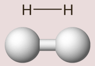
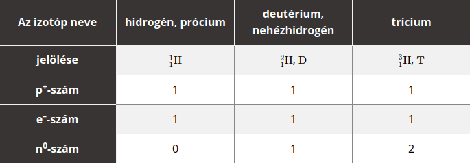
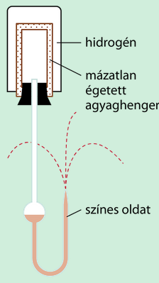

---

- [Vissza az előző oldalra](../kemia.md)
- [Vissza a főoldalra](../../../../README.md)

---

> # A hidrogén
> A hidrogénatom a legkisebb rendszámú atom. Felépítésében mindössze 1 proton és 1 elektron vesz részt. Ez az egy elektron az első héjon található, legközelebb az atommaghoz.
> Elektronszerkezete $1s^{1}$.
>
> A hidrogénatomnak a stabilis nemesgázszerkezet eléréséhez egy további elektronra van szüksége. Ezt a leggyakrabban egy közös elektronpár, azaz kovalens kötés kialakításával éri el. Kétatomos molekulát alkot, amelyben egyszeres kovalens kötés található az atomok között.
>
> 
>
> Mivel ebben az esetben a molekulában két azonos atom kapcsolódik össze kovalens kötéssel, mindkét atom ugyanolyan mértékben vonzza a kötő elektronpárt, így nem jön létre töltéseltolódás, a kovalens kötés apoláris lesz. Kétatomos molekula esetén a kötés polaritása egyértelműen meghatározza a molekula polaritását. Ennek megfelelően a hidrogénmolekula is apoláris lesz.
>
> Szilárd halmazállapotban a molekularács­ban elhelyezkedő apoláris molekulák, így a hidrogénmolekulák között is csak az igen gyenge diszperziós kölcsönhatás alakul ki.
> ## A hidrogénatom izotópjai és elektronszerkezete
> A hidrogénnek összesen három izotópját ismerjük:
>
> 
> ## A hidrogénmolekula kialakulása és szerkezete
> :memo: A hidrogénmolekula kétatomos. A két hidrogénatom egy-egy atompályájából egy molekulapálya jön létre, ezért a kötés kialakulása szerint kolligatív. A kialakuló molekulapálya tengelyszimmetrikus, azaz szigma-kötés jön létre. A kialakuló kötés egyszeres apoláris kovalens kötés.
>
> Amennyiben a hidrogént megfelelő nyomáson lehűtjük, előbb folyékony, majd szilárd halmazállapotú lesz. Szilárd halmazállapotban molekularácsot alkot. A rácspontokban hidrogénmolekulák találhatóak, a rácsösszetartó erő az igen gyenge diszperziós kölcsönhatás.
> ##  Fizikai tulajdonságok
> A hidrogén standardállapotban színtelen, szagtalan gáz. A hidrogénmolekula apoláris, és a legkisebb moláris tömegű molekula. Így a molekulák között létrejövő igen gyenge diszperziós kölcsönhatást nagyon könnyű felbontani. Ez alacsony olvadás- és forráspontot eredményez.
>
> Mivel a hidrogén a legkisebb moláris tömegű gáz, emiatt egyben a legkisebb sűrűségű gáz.
>
> A levegőhöz viszonyított sűrűsége nagyon kicsi:
> $p=\frac{M_{H_{2}}}{M_{levegő}}=\frac{2\frac{g}{mol}}{29\frac{g}{mol}}=\frac{1}{14,5}$
>
> Ezért száll felfelé a hidrogéngázzal töltött léggömb, illetve emiatt a hidrogéngáz csak a szájával lefelé fordított edényben fogható fel. A hidrogénnek kis moláris tömege miatt nagy a diffúziósebessége. Ezt a tulajdonságát jól szemlélteti a mázatlan agyaghengeres kísérlet:
>
> 
>
> A kísérletben egy mázatlan agyaghengert egy U alakú csővel kapcsolunk össze, amelyben színezett folyadék található. Egy szájával lefelé tartott főzőpohárban hidrogéngázt fogunk fel. Hirtelen ráborítjuk az agyaghengerre a hidrogénnel telt főzőpoharat.
>
> Azt tapasztaljuk, hogy az U alakú cső nyitott végében megemelkedik a folyadék szintje. A jelenség magyarázata, hogy a hidrogén nagy diffúziósebessége miatt nagyobb mennyiségű hidrogén áramlik be az agyaghengerbe, mint amennyi levegő áramlik ki abból. Ennek következtében az agyaghengerben megnő a nyomás, a beáramolt gáz elkezdi a folyadékot az U alakú csőből kipréselni.
>
> A hidrogén – apoláris molekulái miatt – az apoláris oldószerekben jól oldódik, poláris oldószerekben azonban nem oldódik, ezért a hidrogéngáz víz alatt felfogható.
>
> :memo: Kis méretű molekulája miatt fémekben, például a nikkelben vagy a platinában is „oldódik”. A platina nagy méretű atomjai közé be tud ékelődni a hidrogén molekulája. Ebben a helyzetben a hidrogénmolekula kovalens kötése könnyebben felszakad, ezért a platinát katalizátorként alkalmazzák a hidrogén reakcióiban.
> ## Kémiai tulajdonságok
>
> A reakciókészséget leginkább a molekulában található kötés erőssége határozza meg. A hidrogénatomok kis mérete miatt a hidrogénmolekulában előforduló egyszeres kovalens kötés igen nehezen szakítható fel. Emiatt a hidrogén közönséges körülmények között kevéssé reakcióképes anyag. A hőmérséklet emelésével vagy katalizátor alkalmazásával azonban a reakciókészség jelentősen nő.
>
> A hidrogén számos reakcióban redukálószerként viselkedik, miközben a részecskéi oxidálódnak. 
> ## Reakciói nemfémekkel
> A hidrogén- és az oxigéngáz közönséges körülmények között nem lép reakcióba egymással, mert a hidrogénben és az oxigénben is erős kovalens kötés található, amit nehéz felbontani. Magasabb hőmérsékleten vagy szikra hatására azonban robbanásszerűen egyesülnek.
>> $2H_{2}+O_{2}->2H_{2}O$
>
> A durranógázpróbát az előállított hidrogén tisztaságának (oxigénmentességének) ellenőrzésére használják.
>
> :memo: A kísérletben az előállított hidrogént víz alatt felfogjuk egy kémcsőben. A kémcső száját az ujjunkkal elzárjuk, és nyílt lánghoz közelítjük. Amennyiben az előállított hidrogéngáz tartalmaz oxigéngázt is, azt tapasztaljuk, hogy sivító, visító hang kíséretében játszódik le a reakció. Ha az előállított gáz oxigént nem tartalmaz, akkor nagyon halk pukkanás kíséretében ég el a hidrogén. A kémcső fala párás lesz. Ennek az a magyarázata, hogy a tiszta hidrogén szinte hangtalanul ég el, míg oxigénnel robbanóelegyet alkot.
>
> A halogénekkel való reakcióját leíró egyenletek nagyon hasonlóak, a reakció körülményei azonban különbözőek.
>
> A hidrogén a fluorral sötétben és alacsony hőmérsékleten is robbanásszerűen reagál.
>> $H_{2}+F_{2}->2HF$
>
> Klórgázzal fény vagy hő hatására robbanásszerűen megy végbe a reakció.
>
> Emiatt is nevezzük a hidrogén- és klórgáz 1 : 1 térfogatarányú elegyét klórdurranógáznak.
>> $H_{2}Cl_{2}->2HCl$
>
> Brómmal és jóddal magasabb hőmérsékleten (800 °C) egyensúlyi reakció megy végbe.
>> $H_{2}+Br_{2}<->2HBr$
>>
>> $H_{2}+I_{2}<->2HI$
>
> A nitrogénnel lejátszódó egyensúlyi reakció az ammónia ipari előállításának folyamata.
>> $N_{2}+3H_{2}<->2NH_{3}$
>
> Az iparban optimális, közepes hőmérsékleten (~ 500 °C), nagy nyomáson (25–30 MPa) és vaskatalizátor alkalmazásával érik el a megfelelő hatásfokot. 
> ##  Reakciói fém-oxidokkal
> Amennyiben egy szájával lefelé fordított, enyhén ferdén rögzített kémcsőbe fekete színű réz(II)-oxidot teszünk és hevítjük, majd a kémcsőbe hidrogéngázt vezetünk, azt tapasztaljuk, hogy a fekete színű szilárd anyag vörös színűvé válik, miközben a kémcső fala bepárásodik. A jelenség magyarázata az, hogy a folyamat során a fekete színű réz(II)-oxidból vörös színű réz és víz keletkezett.
>> $CuO+H_{2}->Cu+H_{2}O$
>
> A hidrogén redukálószerként viselkedett, redukálta a réz(II)-oxidot.
> ## Reakciói fémekkel
> A hidrogén a nála erősebb redukálószerekkel szemben redukálódik, azaz oxidálószerként viselkedik. Ilyen következik be az alkáli- és alkáliföldfémek hidrogénnel történő reakciója során.
>> $2Na+H_{2}->2NaH$
>>
>> $Ca+H_{2}->CaH_{2}$
>
> A keletkező hidridek ionrácsosak, bennük a pozitív töltésű fémionok mellett –1 töltésű nemesgáz-szerkezetű hidridionok találhatóak.
> ## Előfordulás
> Elemi állapotban a világegyetem leggyakoribb eleme, a csillagok fő alkotója. Kötött állapotban a vízben és a szerves vegyületekben fordul elő nagy mennyiségben.
> ## Előállítás
> **Laboratóriumi előállítá**sa leggyakrabban sósavból történik cink segítségével.
>> $Zn+2HCl->ZnCl_{2}+H_{2}$
>
> Az **ipari előállítás** többféleképpen lehetséges. Megvalósulhat a metán hőbontásával:
>> $CH_{4}->C+2H_{2}$
>>
>> a metán és vízgőz reakciójával: $CH_{4}+H_{2}O->CO+3H_{2}$
>> 
>> illetve vízbontással is: $2H_{2}O->2H_{2}+O_{2}$
> ## Felhasználás
> A hidrogéngázt felhasználják az ammónia gyártására, rakéták üzemanyagaként, margarinkészítéshez, illetve egyes fémek előállítására.

---

- [Vissza az előző oldalra](../kemia.md)
- [Vissza a főoldalra](../../../../README.md)

---