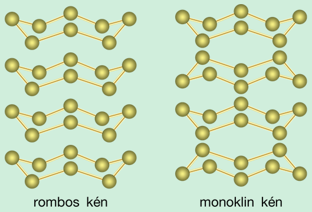
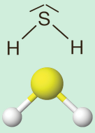

---

- [Vissza az előző oldalra](../kemia.md)
- [Vissza a főoldalra](../../../../README.md)

---

> # A kén és a kén-hidrogén
>A kén a nemfémes elemek közé tartozik. A periódusos rendszer 16. csoportjának (VI. A főcsoportjának) második eleme, vagyis az oxigénhez hasonlóan egy kalkogén elem.
>
> Elektronszerkezete: 2, 8, 6.
>
> A kén közönséges körülmények között szilárd halmazállapotú.
> ## A kén
> ### A kénatom elektronszerkezete
> A kénatom elektronszerkezete az oxigénéhez hasonlít, vagyis hat darab vegyértékelektronja van.
>
> A vegyértékhéj elektronszerkezete: $3s^{2}3p^{4}$.
> ### A molekula- és halmazszerkezet
> A kén nyolcatomos, apoláris elemmolekulájában minden kénatom két darab egyszeres kovalens kötéssel kapcsolódik két másik kénatomhoz, korona alakot formálva.
>
> 
>
> Szilárd halmazállapotában molekularácsot képez, amelyet gyenge diszperziós kölcsönhatás tart össze.
>
> Az oxigénhez hasonlóan a kénnek is több allotrop módosulata van. Ezek azonban nem a molekulák felépítésében különböznek egymástól, hanem a molekulák rácsban történő elhelyezkedésében.
>
> 
>
> A harmadik módosulat a kristályszerkezet nélküli, képlékeny, amorf kén.
> ### Fizikai tulajdonságok
>
> A kén egy sárga színű, tiszta állapotban szagtalan szilárd anyag. Olvadás- és forráspontja viszonylag alacsony.
>
> A közönséges körülmények között előforduló rombos ként melegítve, 95,5 °C fölött átalakul a másik kristályos formába, monoklin kénné. A melegítést tovább folytatva azt tapasztaljuk, hogy előbb egy igen hígan folyó, sárga színű folyadékká alakul. További melegítés hatására a sárga folyadék sötétbarna színű, közepes viszkozitású folyadékká alakul, majd magasabb hőmérsékletet elérve egy sűrűn folyó, viszkózus, sötétbarna anyag keletkezik. Ha a melegítést nem fejezzük be ezen a ponton, akkor a megolvasztott kén ismét könnyen folyóvá válik.
>
> Amennyiben ezt az olvadékot hirtelen hideg vízbe öntjük, a kén megdermed, és egy gumiszerű anyag jön létre.
>
> Az egymást követő furcsa változások magyarázata a gyűrűs, korona alakú molekulával kapcsolatosan bekövetkező változásokra vezethető vissza. A molekularácsos, immáron monoklin kén 119 °C-on megolvad, a gyenge diszperziós kölcsönhatások megszűnnek. A gyűrűs molekulák elgördülnek egymáson, az anyag hígan folyóvá válik. További melegítésre a nyolcatomos molekulák felszakadnak, és nyolcatomos, egymásba gabalyodó láncokká alakulnak. Emiatt a rendszer viszkozitása nő. A melegítés folytatása a nyolcatomos kénláncok felaprózódását eredményezi, 2–4 atomos molekulák képződnek. Ezek a részecskék már nem tudnak egymásba gabalyodni, így a folyadék viszkozitása csökken.
>
> A hideg víz hatására képződött anyag nem más, mint az amorf kén, ami állás közben igen lassan rombos kénné alakul át. Az amorf kénnek, ellentétben a rombos és monoklin kénnel, nincs meghatározott, konkrét olvadáspontja, csak egy lágyulási hőmérséklet-tartománya van.
>
> A kén vízben nem, bizonyos szerves oldószerekben (például benzinben) kismértékben, míg a szén-diszulfidban ($CS_{2}$) jól oldódik.
> ### Kémiai tulajdonságok
> A kén kis reakciókészségű elem. 
> ### Égése
> Meggyújtva kék lánggal történő égés közben kén-dioxiddá alakul:
>
> $$
> \begin{aligned}
> S+O_{2}->SO_{2} \\
> \end{aligned}
> $$
> ### Reakció fémekkel
> Fémek többségével reakcióba lép, miközben szulfidok keletkeznek. Ez alól kivételt képez az arany, illetve a platinafémek egy része.
>
> Az ezüsttel és a higannyal már szobahőmérsékleten képes elreagálni, bár az átalakulás lassan megy végbe.
>
> A hagyományos lázmérőkből esetlegesen kiömlő higany összegyűjtése a rászórt kénporral történik. Ez három-négy óra alatt fekete színű, nem mérgező higany(II)-szulfiddá alakul:
>
> $$
> \begin{aligned}
> Hg+S->HgS \\
> \end{aligned}
> $$
>
> Magasabb hőmérsékleten a vas-, illetve a cinkpor is igen heves reakcióba lép a kénnel:
>
> $$
> \begin{aligned}
> Fe+S->FeS / vas(II)-szulfid \\
> Zn+S->ZnS / cink-szulfid \\
> \end{aligned}
> $$
> ### Előfordulása
> A kén elemi állapotban terméskén formájában található meg a természetben, főleg vulkanikus eredetű telepeken, bányákban.
>
> A vegyületei közül leginkább a szulfidok (pl.$ZnS$, $FeS$), illetve a szulfátok ($CaSO_{4}*2H_{2}O$, $MgSO_{4}*7H_{2}O$) fordulnak elő a természetben. Az élő szervezetek szintén tartalmaznak kötött állapotú ként, a fehérjék felépítésében vesz részt.
> ### Előállítás
> Az ipar a helyi adottságok alapján valósítja meg az előállítást. Amennyiben az országban vannak kénbányák, úgy a terméskén kibányászásával, majd tisztításával nyerik a ként.
>
> Ha az adott régióban nincsenek ilyen bányák, akkor az ásványi szenek vagy a szulfidos ércek kéntartalmának kinyerésével állítják elő a ként.
> ### Felhasználás
> A ként legnagyobb mennyiségben a gumiipar a vulkanizáláshoz használja. Emellett fontos felhasználási terület a kénsavgyártás is. A gyógyszeripar kenőcskészítéshez, az agrárium pedig permetezőszer előállításához használja.
> ## A kén-hidrogén
> ### Molekula- és halmazszerkezet
> A dihidrogén-szulfid, vagy más néven a kén-hidrogén, a vízhez hasonlóan V alakú, poláris molekulákból áll.
>
> 
>
> A molekulában 92,3°-os kötésszög mérhető.
>
> Szilárd halmazállapotban molekularácsot képez, amelyet dipólus-dipólus kölcsönhatás tart össze.
> ### Fizikai tulajdonságok
> Színtelen, kellemetlen, záptojásszagú gáz. Olvadás- és forráspontja a moláris tömegnek megfelelő értékű. A levegőnél nagyobb sűrűségű. Vízben jól oldódik, vizes oldatát kén-hidrogénes víznek nevezzük.
> ### Kémiai tulajdonságok
> A dihidrogén-szulfid számos anyaggal már közönséges körülmények között is elreagál.
> ### Égése
> Oxigénnel viszonylag alacsony hőmérsékleten reagál, de levegővel képzett elegye is robbanékony.
>
> $$
> \begin{aligned}
> 2H_{2}S+3O_{2}->2SO_{2}+2H_{2}O \\
> \end{aligned}
> $$
> ### Sav-bázis sajátság
> Gyenge kétértékű savként viselkedik:
>
> $$
> \begin{aligned}
> H_{2}S+H_{2}O<->HS^{-}+H_{3}O^{+} \\
> HS^{-}+H_{2}O<->S^{2-}+H_{3}O^{+} \\
> \end{aligned}
> $$
>
> Bázisokkal sókat (szulfidokat) képez:
>
> $$
> \begin{aligned}
> H_{2}S+2NaOH->Na_{2}S+2H_{2}O \\
> \end{aligned}
> $$
> ### Reakció fémionokkal
> A kén-hidrogén gáz és/vagy oldat formában számos fémionnal jellegzetes, olykor könnyen beazonosítható színű szulfidot választ le:
>
> $$
> \begin{aligned}
> Fe^{2+}+H_{2}S->FeS+2H^{+} / vas(II)-szulfid \\
> Pb^{2}+H_{2}S->PbS+2H^{+} / ólom(II)-szulfid \\
> 2Ag^{+}+H_{2}S->Ag_{2}S+2H^{+} / ezüst(II)-szulfid \\
> \end{aligned}
> $$
> ### Reakció halogénekkel
> A kén-hidrogén könnyen oxidálható, mivel jó redukálószer. A brómot és jódot is redukálja:
>
> $$
> \begin{aligned}
> H_{2}S+Br_{2}->S+2HBr
> \end{aligned}
> $$
>
> A reakció jól követhető, mivel a színes oldatok, a brómos, illetve a jódos víz színe fokozatosan elhalványul, végül elszíntelenedik.
> ### Előfordulás, előállítás, felhasználás
> A kén-hidrogén vulkánok gőzeiben és gyógyvizekben is előfordul (30.6. ábra). Emellett a kéntartalmú fehérjék bomlásának környékén is megtalálható. Rendkívül mérgező gáz.
>
> A gyógyfürdőkben olyan kis koncentrá­cióban van jelen, ami még nem mérgező, sőt kedvező hatással van a fürdőzőkre.
>
> Előállítása laboratóriumban vas(II)-szulfid és sósav reakciójából történhet egyszerűen:
>
> $$
> \begin{aligned}
> FeS+2HCl->FeCl_{2}+H_{2}S \\
> \end{aligned}
> $$
>
> Az ipari előállítása a szulfidos ércekből erős savval történő felszabadításával valósul meg.
>
> Ma már ritkán használják, régebben azonban a fémionok kimutatására használták.

---

- [Vissza az előző oldalra](../kemia.md)
- [Vissza a főoldalra](../../../../README.md)

---