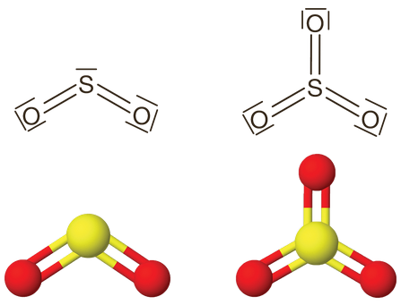
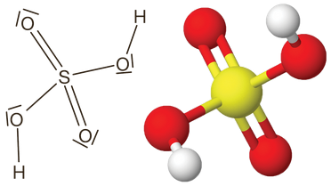

---

- [Vissza az előző oldalra](../kemia.md)
- [Vissza a főoldalra](../../../../README.md)

---

> # A kén oxidjai és oxosavai
> ## A kén-dioxid és a kén-trioxid
> ### A molekulák és a halmazok szerkezete
> A kén oxidjai a kén-dioxid ($SO_{2}$) és a kén-trioxid ($SO_{3}$).
>
> A kén-dioxid V alakú, poláris molekulákból áll. Szilárd halmazállapotban molekularácsot képez, amelyet dipólus-dipólus kölcsönhatás tart össze.
>
> A molekulában 119,5°-os kötésszög mérhető.
>
> A kén-trioxid síkháromszög alakú, apoláris molekulákból áll. Szilárd halmazállapotban molekularácsot képez, amelyet gyenge diszperziós kölcsönhatás tart össze.
>
> 
>
> A molekulában 120°-os kötésszög mérhető.
> ### Fizikai tulajdonságok
> A kén-dioxid egy színtelen, szúrós, fojtó szagú, a levegőnél nagyobb sűrűségű gáz. Az olvadás- és forráspontja a moláris tömegnek megfelelő. Könnyen cseppfolyósítható. Vízben jól oldódik.
>
> A kén-trioxid szobahőmérsékleten nagy sűrűségű, színtelen, könnyen párolgó folyadék.
> ### Kémiai tulajdonságok
> A kén mindkét oxidja viszonylag könnyen reakcióba lép. 
> ### Reakció nemfémekkel
> A kén-dioxid az oxigénnel kb. 500 °C hőmérsékleten, vanádium-pentaoxid ($V_{2}O{5}$) katalizátor mellett (kontakt katalízis) reagál, miközben kén-trioxid keletkezik:
>
> $$
> \begin{aligned}
> 2SO_{2}+O_{2} \harr 2SO_{3} \\
> \end{aligned}
> $$
>
> A kén-dioxid a reakcióiban redukáló- és oxidálószerként is viselkedhet. Például a jóddal szemben redukálószerként viselkedik:
>
> $$
> \begin{aligned}
> SO_{2}+I_{2}+2H_{2}O \rarr H_{2}SO_{4}+2HI \\
> \end{aligned}
> $$
>
> A kén-hidrogénnel szemben viszont oxidálószerként viselkedik:
>
> $$
> \begin{aligned}
> SO_{2}+2H_{2}S \rarr 2H_{2}O+3S \\
> \end{aligned}
> $$
>
> Ez a reakció az alapja a füstgázok kénmentesítésének.
> ### Reakció vízzel
> A kén-dioxid-gáz a vízzel egyensúlyi reakcióban reagál, miközben a bomlékony kénessav keletkezik:
>
> $$
> \begin{aligned}
> SO_{2}+H_{2}O \harr H_{2}SO_{3} \\
> \end{aligned}
> $$
>
> A kénessav ($H_{2}SO_{3}$) csak vizes oldatban létezik. Sói a szulfitok (pl. $Na_{2}SO_{3}$) és hidrogén-szulfitok (pl.$NaHSO_{3}$), amelyek a kénessavnál stabilabbak.
>
> A kén-trioxid vízzel hevesen reagál, de a reakcióban keletkező kénsavköd nehezen cseppfolyósodik:
>
> $$
> \begin{aligned}
> SO_{3}+H_{2}O \rarr H_{2}SO_{4} \\
> \end{aligned}
> $$
> ### Előfordulás
> A kén-dioxid főként vulkanikus eredetű gázokban fordul elő, míg a kén-trioxid mesterséges vegyület.
> ### Előállítás
> A kén-dioxidot az iparban kétféleképpen állítják elő. Ahol rendelkezésre áll terméskén, ott a kén égetésével történik az előállítás:
>
> $$
> \begin{aligned}
> S+O_{2} \rarr SO_{2} \\
> \end{aligned}
> $$
>
> Terméskén hiányában jellemzően szulfidos ércek pörkölésével történik az előállítás. Az egyik leggyakrabban alkalmazott érc erre a feladatra a pirit ($FeS_{2}$):
>
> $$
> \begin{aligned}
> 4Fes_{2}+11O_{2} \rarr 2Fe_{2}O_{3}+8SO_{2} \\
> \end{aligned}
> $$
>
> Laboratóriumi körülmények között szintén kétféle módszer használatos. Az egyik előállítás során szulfitokat reagáltatnak erős savval. Eközben az erős sav felszabadítja a sójából a gyengébb kénessavat, aminek a bomlásából kapjuk a kén-dioxidot:
>
> $$
> \begin{aligned}
> Na_{2}SO_{3}+2HCl \rarr H_{2}O+2NaCl+SO_{2} \\
> \end{aligned}
> $$
>
> A kén-dioxid előállítható még forró, tömény kénsav és réz reakciójával:
>
> $$
> \begin{aligned}
> Cu+2H_{2}SO_{4} \rarr CuSO_{4}+SO_{2}+2H_{2}O \\
> \end{aligned}
> $$
>
> A kén-trioxidot kizárólag az iparban állítják elő, mégpedig a kén-dioxid égésével.
> ### Felhasználás és jelentőség
> Mindkét oxidot az ipar elsősorban a kénsavgyártásra használja. Emellett a kén-dioxidot használják még fehérítésre (papírgyártás), fertőtlenítésre (borászat), konzerválásra (élelmiszeripar).
> ## A kénsav
> ### A molekula- és halmazszerkezete
> A kénsav torzult tetraéderes alakú, poláris molekulákból áll. Szilárd halmazállapotban molekularácsot képez, amelyet erős hidrogénkötés tart össze.
>
> 
> ### Fizikai tulajdonságok
> Színtelen, szagtalan, olajszerű, a víznél nagyobb sűrűségű, nem illékony folyadék. Olvadás- és forráspontja a molekulák között működő hidrogénkötések miatt magas.
>
> Vízzel korlátlanul elegyedik, a folyamat erősen exoterm. Hígítását csak védőfelszerelésben (védőszemüveg, köpeny, gumikesztyű) végezhetjük, miközben a tömény savat vékony sugárban, kevergetés közben, lassan adagoljuk a vízhez. Fordítva végezve igen veszélyes, intenzívebb a hőfejlődés, kifröccsen a kénsav.
>
> Erősen higroszkópos (nedvességmegkötő) anyag, a levegő víztartalmát is megköti, ezáltal hígul.
> ### Kémiai tulajdonságok
> A kénsav igen nagy reakciókészségű. A reakciói­ban erős savként, illetve erélyes oxidálószerként viselkedik.
> ###  Sav-bázis reakciói
> A kénsav egy kétértékű, erős oxosav.
>
> Az első lépésben erős, a második lépésben középerős savként adja le a protonjait.
>
> $$
> \begin{aligned}
> H_{2}SO_{4}+H_{2}O \harr HSO_{4}^{-}+H_{3}O^{+} \\
> HSO_{4}^{-}+H_{2}O \harr SO_{4}^{2-}+H_{3}O^{+} \\
> \end{aligned}
> $$
>
> Lúgokkal közömbösíthető:
>
> $$
> \begin{aligned}
> H_{2}SO_{4}+2NaOH \rarr Na_{2}SO_{4}+2H_{2}O \\
> \end{aligned}
> $$
>
> A kénsav sói a szulfátok és a hidrogén-szulfátok.
> ### Reakció fémekkel
> A híg kénsavoldat a nagyon reakcióképes fémekkel reakcióba lépve hidrogént fejleszt.
>
> $$
> \begin{aligned}
> Zn+H_{2}SO_{4} \rarr ZnSO_{4}+H_{2} / cink-szulfát \\
> Fe+H_{2}SO_{4} \rarr FeSO_{4}+H_{2} / vas(II)-szulfát \\
> \end{aligned}
> $$
>
> A réz, az ezüst és az arany nem elég reakcióképes ahhoz, hogy végbemenjen a reakció. Az ólom sem oldódik híg kénsavban, mivel a felületén keletkező ólom(II)-szulfát passziválja a fémet, elzárva a további reakciótól.
>
> A forró, tömény kénsav olyan erélyes oxidálószer, hogy még a kis reakciókészségű fémekkel is elreagál kén-dioxid-gáz fejlődése mellett:
>
> $$
> \begin{aligned}
> 2Ag+2H_{2}SO_{4} \rarr Ag_{2}SO_{4}+2H_{2}O+SO_{2} \\
> \end{aligned}
> $$
>
> A tömény kénsav azonban passziválja az alumíniumot és vasat. Az érintkezés pillanatában ugyanis a felületükön oxidréteg alakul ki, amely gátolja a további reakciót.
> ### Vízelvonás vegyületekből
> Higroszkópos tulajdonsága olyan erős, hogy szerves anyagokból képes a vizet az alkotóelemeiből is kivonni, az anyagot elszenesíteni. Az emberi bőrre cseppenve súlyos égési sérülést okoz.
>
> De képes akár a kristályvizes sókból a kristályvíztartalmat is kivonni.
> ### Előfordulás
> A kénsav nagyon ritkán fordul elő a természetben. Legfeljebb vulkanikus eredetű folyók vizében lehet kimutatni. A szulfátok a természetes vizekben is előfordulnak.
> ### Előállítás
> Az ipari előállítása, a kontakt kénsavgyártás, több lépésben játszódik le:
> 1. Kén-dioxid előállítása kén égésével vagy pirit pörkölésével.
> 1. A kén-dioxid átalakítása kén-trioxiddá $V_{2}O_{5}$-katalizátor felületén (ezért kontakt kénsavgyártás a folyamat neve).
> 1. A kén-trioxid elnyeletése tömény kénsav­oldatban, miközben dikénsav (óleum, vit­riol) keletkezik:
>     - $ SO_{3}+H_{2}SO_{4} \harr H_{2}S_{2}O_{7} $
> 1. Az óleumot vízzel hígítják, beállítva a megfelelő töménységűre a kénsavat:
>     - $ H_{2}S_{2}O_{7} \harr 2H_{2}SO_{4} $
> ### Felhasználás és biológiai jelentőség
> Felhasználása sokrétű: fontos laboratóriumi vegyszer, de használja a festék- és a bőripar, gyártanak a segítségével műtrágyát, robbanóanyagot, gyógyszert, ólomakkumulátort.
>
> A szervezettel érintkezve igen súlyos sérüléseket okoz, a seb környéke megszürkül.
> ## A kén oxidjai és oxosavai
> - A kén-dioxid és kén-trioxid:
>     - $SO_{2}$: poláris, V alakú molekula, molekularács, dipólus-dipólus kölcsönhatás
>     - $SO_{3}$: apoláris, síkháromszög alakú molekula, molekularács, diszperziós kölcsönhatás
>     - fizikai tulajdonságok:$SO_{2}$: színtelen, szúrós szagú gáz, vízben jól oldódik
>     - kémiai tulajdonságok:$SO_{2}$: égésével $SO_{3}$ keletkezik, oxidáló- és redukálószer
>     - előállítás:$SO_{2}$: kén égésével, illetve szulfitokból vagy fémekből savakkal
> - A kénessav: bomlékony, $SO_{2}$ vízzel való reakciójában keletkezik, sói a szulfitok
> - A kénsav:
>     - fizikai tulajdonságok: színtelen, olajszerű folyadék, vízzel korlátlanul elegyedik
>     - kémiai tulajdonságai: erős savként és erélyes oxidálószerként viselkedik, higroszkópos tulajdonságú
>     - előállítása kontakt kénsavgyártással történik, felhasználása széles körű
>     - sói a szulfátok és a hidrogén-szulfátok

---

- [Vissza az előző oldalra](../kemia.md)
- [Vissza a főoldalra](../../../../README.md)

---