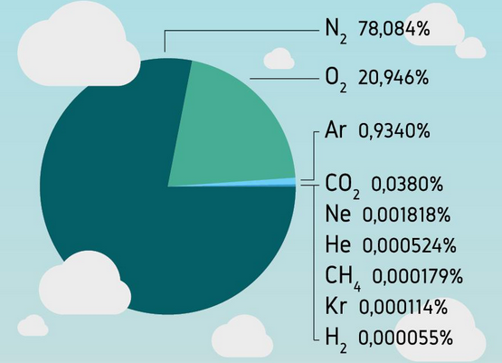
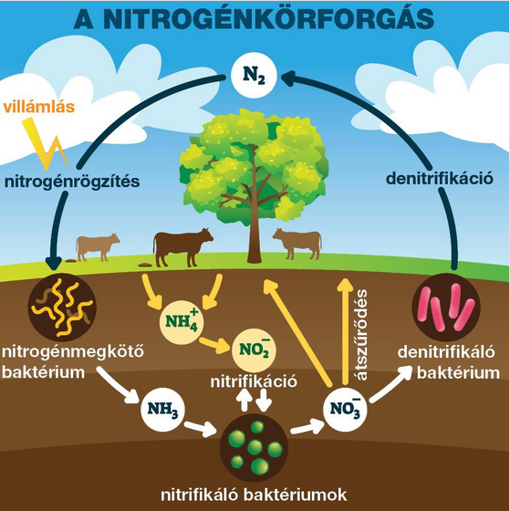

---

- [Vissza az előző oldalra](../kemia.md)
- [Vissza a főoldalra](../../../../README.md)

---

> # A nitrogén és az ammónia
> A nitrogén a periódusos rendszer 15. csoportjának (V. A főcsoportjának) első eleme. Az elektronjai két elektronhéjon helyezkednek el, elektronszerkezete: 2, 5. A vegyértékhéj elektronszerkezete: $2s^{2} 2p^{3}$.
>
> A nitrogén kétatomos molekulát képez, amelyben a két atomot háromszoros kovalens kötés tartja egyben.
>
> 
>
> A legnagyobb mennyiségben a nitrogén a levegőben található meg, annak közel
é teszi ki. Mennyisége közel állandó, mert körforgásban van.
>
> 
> ## A nitrogén
> ### A nitrogénatom elektronszerkezete
> A nitrogénatom alapállapotban három párosítatlan és két párosított elektront tartalmaz a vegyértékhéján.
>
> A vegyértékhéj elektronszerkezete: $2s^{2} 2p^{3}$.
> ### A nitrogén molekula- és halmazszerkezete
> A nitrogén kétatomos, lineáris, apoláris moleku­lák­ból áll. Az atomok között erős, háromszoros kovalens kötés alakul ki. Szilárd hal­mazállapotban molekularácsot képez, amit nagyon gyenge diszperziós kölcsönhatás tart össze.
>
> 

> $$
> \begin{aligned}
> \end{aligned}
> $$

---

- [Vissza az előző oldalra](../kemia.md)
- [Vissza a főoldalra](../../../../README.md)

---