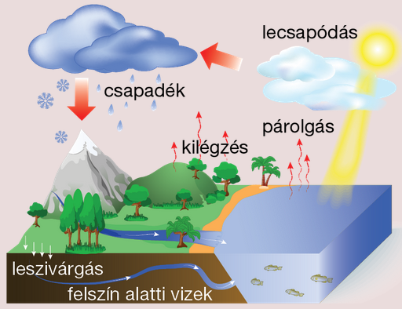
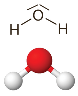
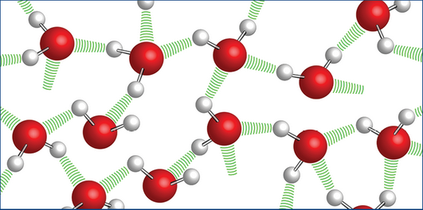
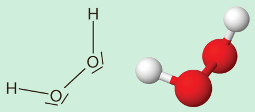

---

- [Vissza az előző oldalra](../kemia.md)
- [Vissza a főoldalra](../../../../README.md)

---

> # A víz és a hidrogén-peroxid
> :memo: A víz a legnagyobb jelentőséggel bíró oxigénvegyület. Jelenlegi ismereteink alapján minden élőlény számára életfeltétel. Ez a magyarázata annak, hogy a Földön kívüli élet lehetőségeinek vizsgálata során többek között a víz nyomait keresik az adott égitesten. A víz meglehetősen szokatlan tulajdonságokkal rendelkező folyadék. Például a legtöbb cseppfolyós anyagtól eltérően a fagyása során a térfogata megnő. A fagyás során bekövetkező térfogat-növekedés felelős a kőzetek mállásáért is.
>
> A víz a természetben folyamatos körforgásban van:
>
> 
> ## A víz
> ### A vízmolekula szerkezete
> A poláris, háromatomos vízmolekulán belül erősen poláris kovalens kötések alakulnak ki. Az oxigén­atom nemkötő elektronpárjai miatt a molekula V alakú.
>
> 
>
> A molekulában 104,5°-os kötésszög mérhető.
>
> A szilárd halmazállapotban kialakuló molekularácsot erős hidrogénkötések tartják egyben:
>
> 
> ### Fizikai tulajdonságok
>
> A víz színtelen, szagtalan folyadék. Az olvadás- (0 °C) és forráspontja (100 °C) a molekulák között ható hidrogénkötések miatt jóval magasabb annál, mint amekkora a moláris tömeg alapján várható volna.
>
> A víz a leggyakrabban alkalmazott poláris oldószer. Kiváló oldószere a poláris molekularácsos anyagoknak, illetve az ionrácsos vegyületek többségének. Apoláris oldószerekkel (pl. a benzinnel és az éterrel) azonban nem elegyedik.
>
> A sűrűsége megközelítőleg $1\frac{g}{cm^{3}}$. A legnagyobb sűrűségérték 4 °C-on mérhető. A jég sűrűsége ennél jóval kisebb, $0.92\frac{g}{cm^{3}}$ körüli érték. Ezért is úszik a jég a cseppfolyós víz felszínén.
>
> A jég kisebb sűrűségének magyarázata a szerkezetében működő hidrogénkötésekkel kapcsolatos. Hidrogénkötések ugyan már a cseppfolyós vízben is jelen vannak, de sokkal kisebb mennyiségben, mint szilárd halmazállapotban. A hidrogénkötéseknek nagy a térigénye, így amikor a cseppfolyós víz fagyása közben további hidrogénkötések jönnek létre, a vízmolekulák egymástól távolabb kerülnek. A jég ezért lesz nagyobb térfogatú és kisebb sűrűségű, mint a cseppfolyós víz.
>
> A víz felületi feszültsége nagy. Emiatt például a vizet könnyen át lehet önteni egy másik edénybe. Ez ismét egy olyan tulajdonság, amiben a víz eltér a legtöbb folyékony anyagtól, mint például a benzintől vagy az étertől.
> ### Kémiai tulajdonságok
> A vizet nemcsak kiváló oldószerként, de számos reakció kiindulási anyagaként is ismerjük. 
> ### Reakció nemfémekkel
> A víz közönséges körülmények között a nemfémes elemek közül csak a halogénelemekkel lép reakcióba:
>
> $$
> \begin{aligned}
> 2F_{2}+2H_{2}O->4HF+O_{2} \\
> 3F_{2}+3H_{2}O->6HF+O_{3} \\
> H_{2}O+Cl_{2}<->HCl+HOCl \\
> H_{2}O+Br_{2}<->HBr+HOBr \\
> \end{aligned}
> $$
>
> A víz a szénnel csak igen magas hőmérsékleten reagál:
>
> $$
> \begin{aligned}
> C+H_{2}O->CO+H_{2} \\
> \end{aligned}
> $$
>
> Ez az ún. vízgázreakció, amely ipari szempontból kiemelt jelentőségű átalakulás.
> ### Reakció fémekkel
> A víz csak a nagyon reakcióképes fémekkel képes elreagálni. Ilyenek az alkálifémek, az alkáliföldfémek, illetve a védőoxidrétegtől megtisztított alumínium. Egyes esetekben (pl. a **$Mg$** esetében) a folyamat csak melegítés hatására megy végbe számottevő sebességgel. A reakciókban fém-hidroxidok és hidrogéngáz keletkeznek:
>
> $$
> \begin{aligned}
> 2Na+2H_{2}O->2NaOH+H_{2} \\
> Ca+2H_{2}O->Ca(OH)_{2}+H_{2} \\
> \end{aligned}
> $$
> ### Reakció oxidokkal
> A víz a fém-oxidokkal bázisokat, a nemfém-oxidokkal savakat képez:
>
> $$
> \begin{aligned}
> CaO+H_{2}O->Ca(OH)_{2} \\
> CO_{2}+H_{2}O<->H_{2}CO_{3} \\
> SO_{3}+H_{2}O->H_{2}SO_{4} \\
> \end{aligned}
> $$
>
> A víz amfoter tulajdonságú, mert savakkal szemben bázisként, bázisokkal szemben pedig savként viselkedik:
>
> $$
> \begin{aligned}
> HCl(sav)+H_{2}O(bázis)<->H_{3}O^{+}+Cl^{-} \\
> NH_{3}(bázis)+H_{2}O(sav)<->NH_{4}^{+}+OH^{-} \\ 
> \end{aligned}
> $$
> ### Előfordulás
> A Föld felszínének több mint $\frac{2}{3}$-át víz borítja. Emellett a víz jelen van a levegőben, az élőlényekben, illetve egyes ásványokban is.
>
> Az ionrácsos vegyületek kristályrácsába beépült vizet kristályvíznek nevezzük. A kristályvíz melegítéssel eltávolítható a szerkezetből. A kristályvizes vegyületek képletének írásakor jelöljük, hogy 1 mól kristályvizes só mellett hány mól víz van a szerkezetben:
>
> | A kristályvizes só képlete | A kristályvizes só hétköznapi neve |
> | :-- | :-- |
> | $CuSo_{4}*5H_{2}O$ | rézgálic |
> | $MgSO_{4}*7H_{2}O$ | keserűsó |
> | $Na_{2}CO_{3}*10H_{2}O$ | szóda,sziksó |
> | $CaSO_{4}*2H_{2}O$ | gipsz |
> | $Na_{2}SO_{4}*10H_{2}O$ | glaubersó |
> ### Előállítás
> A víz akkora mennyiségben fordul elő a természetben, hogy nem indokolt az előállítása, csak a tisztítása. Ha mégis szükségessé válna az előállítása, akkor nagyon sok lehetőség áll előttünk, mert számos kémiai változás eredményez vizet. Így víz keletkezik a hidrogén és a szerves vegyületek égésekor vagy a sav-bázis reakciók többségében.
> ### Felhasználás és biológiai jelentőség
> A víz felhasználása igen széles körű. Az ipar nagy mennyiségben használja oldószerként, reakciópartnerként, illetve hűtő- és fűtőközegként.
>
> A hétköznapi életben főzéshez, mosáshoz, tisztálkodáshoz, illetve növénytermesztéshez hasz­nálunk nagyobb mennyiségű vizet. A legfontosabb azonban a folyadék-utánpótlásként történő felhasználása.
> ## A hidrogén-peroxid
> A hidrogén és oxigén által képzett vegyületek másik jeles képviselője a hidrogén-peroxid.
> ### A molekula szerkezete
> A hidrogén-peroxid-molekula különlegessége a két oxigénatom között kialakuló, könnyen felbomló peroxo-kötés. A poláris molekula egy térbeli V alakot vesz fel.
>
> 
>### Fizikai tulajdonságok
> Színtelen, szagtalan, a víznél nagyobb sűrűségű és nagyobb viszkozitású folyadék. Melegítés hatására bomlik, ezért a forráspont ebben az esetben nem értelmezhető. Az olvadáspontja a vízéhez közeli. A vízzel korlátlanul elegyedik.
> ### Kémiai tulajdonságok
> A könnyen bomló peroxo-kötés miatt a hidrogén-peroxid könnyen reakcióba lép. Különleges tulajdonsága, hogy oxidáló- és redukálószerként is viselkedhet.
>
> Bomlása során víz és oxigén keletkezik. A bomlását a fény, a hő, számos fémion és fémvegyület katalizálja. A bomlás egyik legismertebb katalizátora a barnakőpor (a mangán-dioxid, $MnO_{2}$).
>
> $$
> \begin{aligned}
> 2H_{2}O_{2}->2H_{2}O+O_{2} \\
> \end{aligned}
> $$
>
> Ugyanez a folyamat játszódik le, amikor a patikában kapható 3 w%-os vizes oldatát sebtisztításra használva a hemoglobinban lévő vas katalizátorként működik.
>
> Kénsavas közegben reakcióba lép a kálium-permanganáttal:
>
> $$
> \begin{aligned}
> 2KMnO_{4}+5H_{2}O_{2}+3H_{2}SO_{4}->2MnSO_{4}+K_{2}SO_{4}+8H_{2}O+5O_{2} \\
> \end{aligned}
> $$
> ### Előfordulás, előállítás, felhasználás
>
> A hidrogén-peroxid mesterségesen előállított vegyület. Laboratóriumban a sóiból, a peroxidokból történik az előállítása. Fertőtlenítőszerként (gyógyászat) és színtelenítő anyagként (fodrászat), illetve oxidálószerként használják.

---

- [Vissza az előző oldalra](../kemia.md)
- [Vissza a főoldalra](../../../../README.md)

---