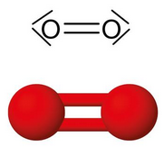
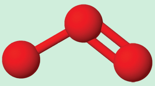
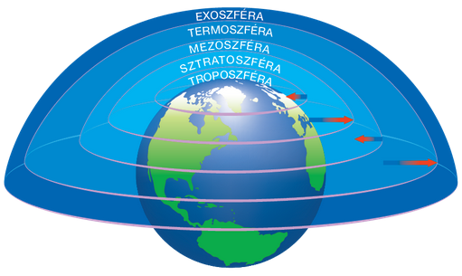

---

- [Vissza az előző oldalra](../kemia.md)
- [Vissza a főoldalra](../../../../README.md)

---

> # Az oxigén és az ózon
> :memo: A levegő egyik fő összetevője az oxigén, amely létezésünk egyik feltétele. A természetben a zöld növények fotoszintézise során keletkezik. Fontos résztvevője számos biológiai és kémiai folyamatnak. Szinte minden kémiai változását égésnek nevezzük. A legtöbb gyors és lassú égés során szükség van az oxigén jelenlétére.
> ## Az oxigén
> ### Az oxigénatom izotópjai és elektronszerkezete
> Az oxigén a 16. csoport (VI. A főcsoport), vagyis a kalkogének (jelentése: ércképzők) első eleme. A természetben háromféle izotóp formájában fordul elő: **$^{16}O$**, **$^{17}O$** és **$^{18}O$**. Ezek közül a leggyakoribb a **$^{16}O$**-izotóp.
>
> Az oxigénatom elektronfelhőjében előforduló 8 elektron közül 6 darab helyezkedik el a vegy­értékhéján.
>
> A vegyértékhéj elektronszerkezete:$2s^{2}2p^{4}$
>
> ### Az oxigénmolekula szerkezete
> Az oxigénatomban a 6 darab vegyértékelektron közül négy párosított formában, kettő pedig pár nélkül helyezkedik el. Két oxigénatom a 2-2 pár nélküli elektronját közössé téve kétszeres kovalens kötést hoz létre, miközben létrejön az oxigénmolekula. A párosítatlan elektronokból 4 darab nemkötő elektronpár lesz.
>
> 
>
> A kétatomos, apoláris molekula lineáris alakú. A szilárd halmazállapotban kialakuló molekularácsot gyenge diszperziós kölcsönhatás tartja össze.
> ### Fizikai tulajdonságok
> Színtelen, szagtalan, a levegőnél valamivel nagyobb sűrűségű gáz. Olvadás- és forráspontja igen alacsony, emiatt cseppfolyósítása meglehetősen nehéz.
>
> :memo: Folyékony és szilárd halmazállapotban halványkék színű.
> Az apoláris molekulájú oxigéngáz a vízben csak nagyon kis mértékben oldódik (25 °C-on és légköri nyomáson 1 liter víz kb. 0,04 g oxigént old). A halak és más, oxigénigényes állatok ezt a vízben oldott oxigént használják fel. A hőmérséklet emelésével az oldhatóság tovább csökken.
> ### Kémiai tulajdonságok
> Közönséges körülmények között az oxigén nem reakcióképes. Ez leginkább a molekulában található erős kétszeres kötés következménye. Magasabb hőmérséklet, például szikra hatására azonban az oxigén igen gyorsan reakcióba vihető. Ebben természetesen közrejátszik az is, hogy az oxigén elektronegativitása igen nagy. 
> ### Reakció nemfémekkel
> Durranógázt kapunk, ha a hidrogénnel 2 : 1 térfogatarányban keverjük össze. Ezt meggyújtva vízzé ég el:
>
> $$
> \begin{aligned}
> 2H_{2}+O_{2}->2H_{2}O
> \end{aligned}
> $$
>
> A hidrogén mellett reagál a szénnel, a foszforral és a kénnel is:
>
> $$
> \begin{aligned}
> C+O_{2}->CO_{2} / szén-dioxid \\
> 4P+O_{2}->2P_{2}O_{5} / difoszfor-pentaoxid \\
> S+O_{2}->SO_{2} / kén-sav \\
> \end{aligned}
> $$
>
> A nitrogén csak magasabb hőmérséklet (ívfény, villámlás, kb. 3000 °C) hatására lép reakcióba oxigénnel:
>
> $$
> \begin{aligned}
> N_{2}+O_{2}->2NO / nitrogén-monoxid
> \end{aligned}
> $$
> ### Reakció fémekkel
> A fémek különböző összetételű oxidokat, per­oxidokat, illetve szuperoxidokat képeznek az oxigénben történő égésük során.
>
> Az alkálifémek már levegőn, szobahőmérsékleten is viszonylag gyorsan oxidálódnak:
>
> $$
> \begin{aligned}
> 4Li+_{2}->2Li_{2}O / lítium-dioxid \\
> 2Na+O_{2}->Na_{2}O_{2} / nátrium-peroxid \\
> K+O_{2}->KO_{2} / kálium-szuperoxid \\
> \end{aligned}
> $$
>
> Az alkáliföldfémek is könnyen meggyújthatók:
>
> $$
> \begin{aligned}
> 2Ca+O_{2}->2CaO / kalcium-oxid \\
> 2Mg+O_{2}->2MgO / magnézium-oxid \\
> \end{aligned}
> $$
>
> Más fémek kizárólag por alakban égnek el:
>
> $$
> \begin{aligned}
> 4Al+3O_{2}->2Al_{2}O_{3} / aluminium-oxid \\
> 4Fe+3O_{2}->2Fe_{2}O_{3} / vas-oxid \\
> \end{aligned}
> $$
>
> Ugyanakkor a levegő oxigéntartalma hatására az alumínium és a vas is képes oxidréteget kialakítani felületén. Ha az oxidréteg tömör, mint az alumínium, króm és cink esetén, a keletkező oxid meggátolja a további oxidációt, passziválja a fémet. Ezzel szemben a vas felületén létrejövő oxidréteg szerkezete viszonylag laza, lyukacsos szerkezetű, így az oxidáció a fém teljes egészén végbemehet. Ez egy specifikus korrózió, a vas rozsdásodása.
> ### Reakciók vegyületekkel
>
> Az oxigén számos vegyület égésében vesz részt. Ezek közül kiemelt jelentőségű a szerves energiahordozókkal végbemenő reakció. A földgáz, kőolaj vagy a bioetanol égése jelentős hőfejlődéssel jár. A földgáz nagy részét kitevő metán oxigénnel való reakciója során $\Delta_{r}H=-803\frac{kJ}{mol}$ energiaváltozás következik be.
>
> $$
> \begin{aligned}
> CH_{4}(g)+2O_{2}(g)->CO_{2}(g)+2H_{2}O(g) \\
> \end{aligned}
> $$
> ### Előfordulás
> Az oxigén a Föld leggyakoribb eleme.
>
> Elemi állapotban a légkör második leggyakoribb alkotója, átlagosan 21 térfogat-százalékos mennyiségben.
>
> Vegyületei szintén gyakoriak. Ilyen a víz, az élő szervezetekben előforduló szerves vegyületek, illetve a szilikátok, karbonátok, szulfátok, nitrátok.
> ### Előállítás
> Az oxigén laboratóriumi előállítása többféle módon is megvalósítható. Az egyik gyakran alkalmazott eljárás a hidrogén-peroxid katalitikus bontása:
>
> $$
> \begin{aligned}
> 2H_{2}O_{2}->2H_{2}O+O_{2} \\
> \end{aligned}
> $$
>
> Szintén gyakran alkalmazzák a kálium-permanganát hevítésével történő előállítást, miközben kálium-manganát és mangán-dioxid is keletkezik:
>
> $$
> \begin{aligned}
> 2KMnO_{4}->K_{2}MnO_{4}+MnO_{2}+O_{2} \\
> \end{aligned}
> $$
>
> Az ipar gazdaságossági szempontok miatt a levegő cseppfolyósítását, majd annak frakcionált desztillációját használja az oxigén előállítására. Eközben a nitrogén és a nemesgázok is elkülöníthetők.
> ### Felhasználás és biológiai jelentőség
> Az ipar nagy mennyiségű oxigént használ különböző oxidációs folyamatok kivitelezéséhez, illetve az acélgyártáshoz a kohászatban. Az orvostudomány szintén jelentős mennyiségű oxigént használ a lélegeztetésekhez.
> ## Az ózon
> Bizonyos elemek a külső hőmérséklet és/vagy nyomás függvényében több különböző kristályszerkezetű formában jelennek meg. Ezeket az előfordulási formákat allotrop módosulatoknak, a jelenséget allotrópiának nevezzük. Az oxigén allotrop módosulatai az előzőekben megismert oxigén és az ózon.
>
> Az ózon háromatomos, V alakú molekulákat képez:
>
> 
>
> Az UV-sugárzás hatására az oxigénmolekulák atomjaikra bomlanak. Ezek az atomok újabb oxi­génmolekulákkal reagálva ózont képeznek. A létrejött ózon azonban további sugárzás hatására el is bomlik:
>
> $$
> \begin{aligned}
> O_{2}->2'O' \\
> O_{2}+'O'->O_{3} \\
> O_{3}->O_{2}+'O' \\
> \end{aligned}
> $$
>
> Az ózon a földfelszíntől körülbelül 30 km magasságban 10-25 km-es változó vastagságú réteget képez.
>
> 
>
> Az emberiség által intenzíven használt freonok, halonok, illetve egyéb anyagok a bomlás erőteljesebbé válásához vezettek. Az ózonképződés és a lebomlása között fennálló egyensúlyból történő kimozdítás vezetett a Földet a káros UV-sugárzástól védő ózonpajzs helyenkénti elvékonyodásához.

---

- [Vissza az előző oldalra](../kemia.md)
- [Vissza a főoldalra](../../../../README.md)

---